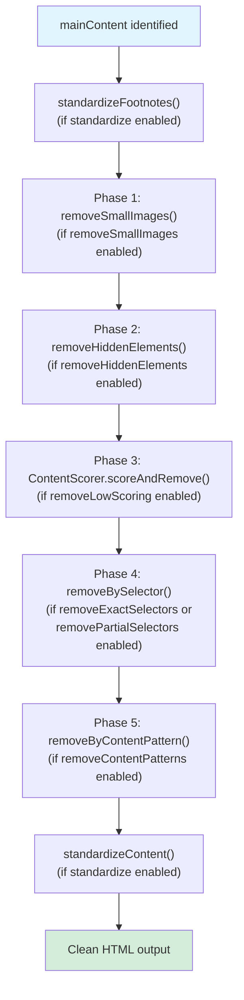
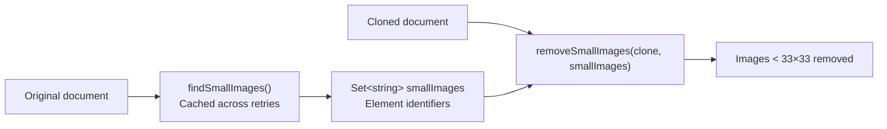
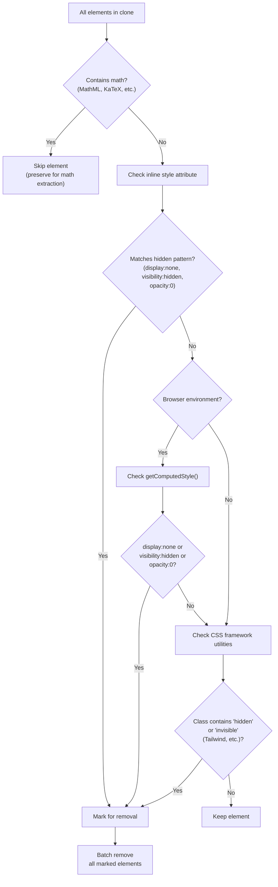
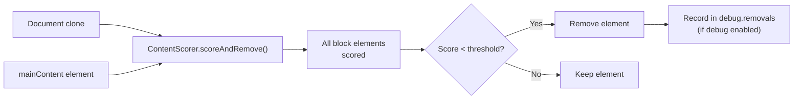
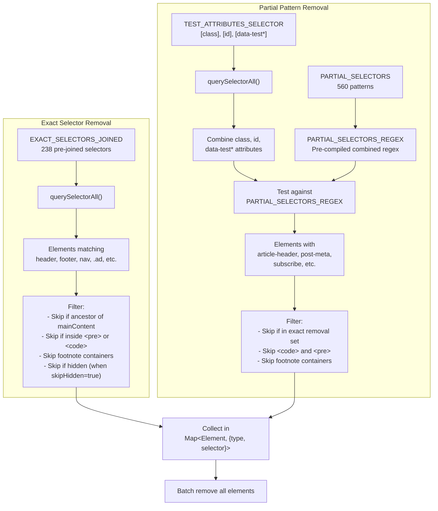
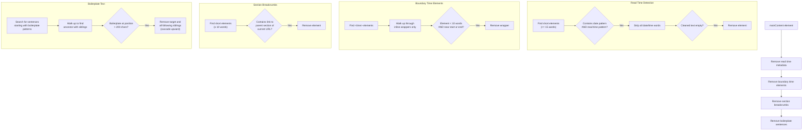
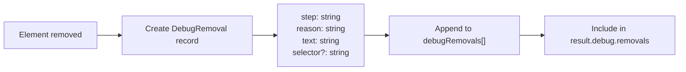
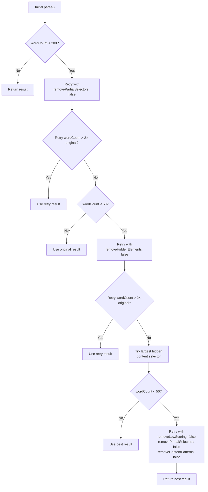

# Clutter Removal Pipeline

<details>
<summary>Relevant source files</summary>

The following files were used as context for generating this wiki page:

- [src/constants.ts](src/constants.ts)
- [src/defuddle.ts](src/defuddle.ts)

</details>


The clutter removal pipeline is a multi-phase process that systematically removes non-content elements from the extracted HTML. It operates after content identification (see [4.1](#4.1)) but before standardization (see [5](#5)), removing navigation menus, advertisements, social sharing buttons, metadata displays, and other interface elements that should not appear in the clean content output.

The pipeline consists of five configurable phases plus an additional content-pattern phase, each targeting different types of clutter using complementary detection strategies. Each phase can be individually enabled or disabled via `DefuddleOptions`, allowing the retry mechanism to adaptively disable aggressive phases when initial extraction yields insufficient content.

## Pipeline Execution Flow

The clutter removal pipeline executes in the following sequence within the `parseInternal` method:



**Sources:** [src/defuddle.ts:575-620]()

### Execution Order Rationale

The phases execute in a specific order designed to prevent removal of content containers:

1. **Small images first** — Removes decorative icons before hidden element detection, preventing false positives from icon-heavy navigation
2. **Hidden elements** — Removes display:none content that may contain clutter selectors  
3. **Scoring-based removal** — Removes low-value blocks using heuristics before selector matching
4. **Selector-based removal** — Removes known clutter patterns after structural cleanup
5. **Content patterns** — Final cleanup of metadata and boilerplate that can only be detected within the main content

**Sources:** [src/defuddle.ts:580-611]()

## Configuration Options

Each phase is controlled by a boolean option in `DefuddleOptions`:

| Option | Default | Controls Phase |
|--------|---------|----------------|
| `removeSmallImages` | `true` | Small image removal |
| `removeHiddenElements` | `true` | Hidden element detection |
| `removeLowScoring` | `true` | Content scoring removal |
| `removeExactSelectors` | `true` | Exact selector matching |
| `removePartialSelectors` | `true` | Partial selector matching |
| `removeContentPatterns` | `true` | Content pattern removal |

**Sources:** [src/defuddle.ts:484-493](), [src/types.ts]()

## Phase 1: Small Image Removal

Small image removal identifies and removes decorative images (icons, buttons, badges) that are smaller than 33×33 pixels, preventing them from cluttering the extracted content.



**Sources:** [src/defuddle.ts:532-536](), [src/defuddle.ts:979-1031]()

### Detection Strategy

The `findSmallImages` method examines all `` and `<svg>` elements in the original document, checking multiple dimension sources in priority order:

1. **HTML attributes** — `width` and `height` attributes
2. **Inline styles** — `style="width: X; height: Y"` patterns
3. **Computed styles** — `getComputedStyle()` (browser only)
4. **Bounding rectangles** — `getBoundingClientRect()` (browser only)

An element is marked as small if **any** detected dimension pair shows both width < 33px and height < 33px. The minimum of all detected dimensions is used to handle cases where CSS transforms scale elements differently.

**Sources:** [src/defuddle.ts:979-1031]()

### Element Identification

Small images are tracked by unique identifiers to match them in the cloned document:

```typescript
// For  elements
`src:${src}`           // Primary: src attribute
`srcset:${srcset}`     // Fallback: srcset attribute
`src:${dataSrc}`       // Lazy-loaded: data-src attribute

// For <svg> elements
`id:${id}`             // Primary: id attribute
`viewBox:${viewBox}`   // Fallback: viewBox attribute
`class:${className}`   // Fallback: class attribute
```

**Sources:** [src/defuddle.ts:1050-1075]()

### Removal Process

The `removeSmallImages` method removes marked elements from the cloned document by matching identifiers. This two-phase approach (find in original, remove in clone) ensures dimension calculations use the original DOM's computed styles and layout.

**Sources:** [src/defuddle.ts:1033-1048]()

## Phase 2: Hidden Element Removal

Hidden element removal detects and removes elements that are visually hidden using CSS, as these typically contain navigation overlays, mobile menus, and other non-content interface elements.



**Sources:** [src/defuddle.ts:777-852]()

### Detection Strategies

The `removeHiddenElements` method uses three complementary strategies:

#### 1. Inline Style Pattern Matching

Checks the `style` attribute for CSS hiding patterns using a regex:

```
/(?:^|;\s*)(?:display\s*:\s*none|visibility\s*:\s*hidden|opacity\s*:\s*0)(?:\s*;|\s*$)/i
```

This fast pattern match catches most explicitly hidden elements without requiring DOM API calls.

**Sources:** [src/defuddle.ts:782](), [src/defuddle.ts:800-807]()

#### 2. Computed Style Analysis (Browser Only)

In browser environments, uses `getComputedStyle()` to detect elements hidden by external stylesheets or CSS cascade. Skipped in Node.js environments (jsdom/linkedom) where computed styles are unreliable and slow.

**Sources:** [src/defuddle.ts:786-787](), [src/defuddle.ts:810-823]()

#### 3. CSS Framework Utility Detection

Detects utility classes from CSS frameworks like Tailwind:
- `hidden`
- `invisible`
- `sm:hidden`, `md:hidden` (responsive variants)
- `not-machine:hidden` (custom variants)

**Sources:** [src/defuddle.ts:826-838]()

### Math Element Preservation

Elements containing mathematical content are never removed, even if hidden, because sites like Wikipedia use `display:none` wrappers for accessibility:

```html
<!-- Wikipedia's dual-rendering approach -->
<span style="display:none">
  <math>...</math>  <!-- MathML for accessibility -->
</span>
  <!-- Visual fallback -->
```

The preservation check matches:
- `math` elements
- `[data-mathml]` attributes
- `.katex-mathml` classes

**Sources:** [src/defuddle.ts:794-797]()

### Batch Removal

Elements are collected in a `Map<Element, string>` with removal reasons, then removed in a single batch to avoid DOM thrashing. Debug mode records each removal with its reason and text preview.

**Sources:** [src/defuddle.ts:779](), [src/defuddle.ts:841-851]()

## Phase 3: Low-Scoring Block Removal

Low-scoring block removal uses content quality heuristics to identify and remove navigation menus, link lists, and other non-content blocks that weren't caught by selector-based removal. This phase is fully implemented in the `ContentScorer` class (see [4.1](#4.1) for detailed scoring algorithm).



**Sources:** [src/defuddle.ts:592-594]()

The scoring algorithm evaluates:
- Text-to-link ratio (high link density = navigation)
- Word count and paragraph structure
- List density (many short list items = menu)
- Element depth and nesting patterns

**Sources:** [src/scoring.ts]()

## Phase 4: Selector-Based Removal

Selector-based removal uses two complementary strategies: exact CSS selectors for known clutter patterns and partial pattern matching against element attributes.



**Sources:** [src/defuddle.ts:854-976](), [src/constants.ts:62-240](), [src/constants.ts:255-812]()

### Exact Selector Matching

Exact selectors target specific CSS selectors for elements that should always be removed:

| Category | Example Selectors | Count |
|----------|------------------|-------|
| Structure | `header`, `footer`, `nav`, `aside` | ~10 |
| Metadata | `.author`, `.date`, `.tags`, `#title` | ~40 |
| Navigation | `.menu`, `.navigation`, `[role="navigation"]` | ~15 |
| Advertising | `.ad`, `[class^="ad-"]`, `.promo` | ~12 |
| Social | Hidden in code, includes comment sections | ~8 |
| Forms | `form`, `input`, `button`, `select` | ~10 |
| Hidden | `[hidden]`, `[aria-hidden="true"]`, `.hidden` | ~4 |
| Other | Scripts, styles, iframes, etc. | ~140 |

The complete list of 238 exact selectors is defined in `EXACT_SELECTORS` and pre-joined as `EXACT_SELECTORS_JOINED` for performance.

**Sources:** [src/constants.ts:62-240](), [src/defuddle.ts:864-885]()

### Partial Pattern Matching

Partial selectors match substring patterns in element attributes, catching clutter even when sites use non-semantic class names or CSS-in-JS:

```typescript
// Matches any of these attributes
TEST_ATTRIBUTES = ['class', 'id', 'data-test', 'data-testid', 
                   'data-test-id', 'data-qa', 'data-cy']

// Against 560 patterns including:
'article-header'      // Matches class="article-header-wrapper"
'post-meta'          // Matches id="post-meta-section"  
'subscribe'          // Matches class="newsletter-subscribe-form"
'share'              // Matches data-test="share-buttons"
```

The patterns are compiled into a single regex `PARTIAL_SELECTORS_REGEX` for O(1) testing per element rather than O(n) for 560 individual patterns.

**Sources:** [src/constants.ts:255-812](), [src/constants.ts:814-815](), [src/defuddle.ts:887-934]()

### Protection Mechanisms

Several safeguards prevent removal of content:

#### 1. Main Content Ancestor Protection
Elements containing `mainContent` are never removed, preventing disconnection of the content tree:

```typescript
if (mainContent && el.contains(mainContent)) {
    return;
}
```

**Sources:** [src/defuddle.ts:942-944]()

#### 2. Footnote Container Protection
Footnote lists and their children are preserved using `FOOTNOTE_LIST_SELECTORS`:

```typescript
if (el.matches(FOOTNOTE_LIST_SELECTORS) || 
    el.querySelector(FOOTNOTE_LIST_SELECTORS)) {
    return;
}
```

**Sources:** [src/defuddle.ts:949-957](), [src/constants.ts:847-864]()

#### 3. Code Block Protection
Elements inside `<pre>` or `<code>` are skipped because syntax highlighters use classes like `language-javascript`, `token-comment` that match clutter patterns:

```typescript
if (el.closest('pre, code')) {
    return;
}
```

**Sources:** [src/defuddle.ts:878-880](), [src/defuddle.ts:906-908]()

#### 4. Heading Anchor Protection
Anchor links inside headings (common for linkable headings) are preserved:

```typescript
if (el.tagName === 'A' && el.closest('h1, h2, h3, h4, h5, h6')) {
    return;
}
```

**Sources:** [src/defuddle.ts:945-947]()

### Performance Optimizations

The implementation uses several optimizations for large documents:

1. **Pre-joined selectors** — `EXACT_SELECTORS_JOINED` avoids building the selector string on every parse
2. **Pre-compiled regex** — `PARTIAL_SELECTORS_REGEX` compiled once at module load
3. **Attribute pre-filtering** — `TEST_ATTRIBUTES_SELECTOR` queries only elements with relevant attributes
4. **Batch removal** — All elements collected in a `Map`, then removed in one pass

**Sources:** [src/constants.ts:240](), [src/constants.ts:814-818](), [src/defuddle.ts:894](), [src/defuddle.ts:941-967]()

## Phase 5: Content Pattern Removal

Content pattern removal is a final cleanup phase that removes metadata and boilerplate based on text content rather than CSS selectors. This catches elements on Tailwind/CSS-in-JS sites where class names provide no semantic information.



**Sources:** [src/defuddle.ts:1554-1744]()

### Read Time Metadata Removal

Removes publish date and read time displays like "Mar 4th 2026 | 3 min read" that appear above articles:

```typescript
// Detection patterns
CONTENT_DATE_PATTERN = /(?:Jan|Feb|Mar|Apr|May|Jun|Jul|Aug|Sep|Oct|Nov|Dec)[a-z]*\s+\d{1,2}/i
CONTENT_READ_TIME_PATTERN = /\d+\s*min(?:ute)?s?\s+read\b/i

// Stripping patterns to verify text is ONLY metadata
METADATA_STRIP_PATTERNS = [
    /\b(?:Jan(?:uary)?|Feb(?:ruary)?|...)\b/gi,  // Month names
    /\b\d+(?:st|nd|rd|th)?\b/g,                   // Day numbers
    /\bmin(?:ute)?s?\b/gi,                         // "min", "minutes"
    /\bread\b/gi,                                  // "read"
    /[|·•—–\-,.\s]/g                              // Punctuation
]
```

Elements are only removed if:
1. Text is ≤ 15 words
2. Contains both date and read time patterns
3. After stripping date/time words, no meaningful content remains
4. Element has no block children (`<p>`, `<div>`, etc.)

**Sources:** [src/defuddle.ts:36-49](), [src/defuddle.ts:1559-1588]()

### Boundary Time Element Removal

Removes standalone `<time>` elements near the start or end of content (publish dates), while preserving inline time references within prose:

```html
<!-- Removed: standalone time at start -->
<p><time>March 4, 2026</time></p>

<!-- Preserved: inline time in prose -->
<p>The event occurred on <time>March 4, 2026</time> during...</p>
```

The algorithm walks up through inline formatting wrappers (`<i>`, `<em>`, `<span>`, `<b>`, `<strong>`, `<small>`) to find the smallest removable unit, but stops at block elements to avoid removing containers with other content.

**Sources:** [src/defuddle.ts:1593-1633]()

### Section Breadcrumb Removal

Removes short elements containing a link back to a parent section:

```html
<!-- URL: example.com/blog/tech/article -->
<!-- Removed: link to parent section -->
<div>Filed under: <a href="/blog/tech">Technology</a></div>
```

Detection criteria:
- Element ≤ 10 words
- Contains a link whose path is a prefix of the current URL path
- Link is not to root (`/`) or current page
- Element has no block children

**Sources:** [src/defuddle.ts:1635-1665]()

### Boilerplate Sentence Removal

Removes end-of-article boilerplate and trailing non-content:

```typescript
BOILERPLATE_PATTERNS = [
    /^This (?:article|story|piece) (?:appeared|was published|originally appeared) in\b/i,
    /^A version of this (?:article|story) (?:appeared|was published) in\b/i,
    /^Originally (?:published|appeared) (?:in|on|at)\b/i,
]
```

When a boilerplate sentence is found:
1. Walk up ancestor tree to find element with next siblings
2. Verify boilerplate appears > 200 characters into content
3. Remove the element and all following siblings
4. Cascade upward: remove following siblings at each ancestor level

This aggressive truncation ensures everything after the boilerplate (related articles, author bios, etc.) is removed.

**Sources:** [src/defuddle.ts:38-42](), [src/defuddle.ts:1667-1714]()

## Debug Support

The clutter removal pipeline provides detailed debugging information when `options.debug` is enabled, tracking every removed element across all phases.



**Sources:** [src/defuddle.ts:632-637](), [src/types.ts]()

### DebugRemoval Structure

Each removal is recorded with:

```typescript
interface DebugRemoval {
    step: string;      // Phase name: 'removeHiddenElements', 'removeBySelector', etc.
    reason: string;    // Specific reason: 'display:none', 'exact selector match', etc.
    text: string;      // Text preview (first 100 chars)
    selector?: string; // For partial matches: the matched pattern
}
```

**Sources:** [src/types.ts]()

### Example Debug Output

```json
{
  "debug": {
    "removals": [
      {
        "step": "removeHiddenElements",
        "reason": "display:none",
        "text": "Subscribe to our newsletter..."
      },
      {
        "step": "removeBySelector",
        "selector": "article-header",
        "reason": "partial match: article-header",
        "text": "Technology | 5 min read"
      },
      {
        "step": "removeByContentPattern",
        "reason": "read time metadata",
        "text": "Mar 4th 2026 | 3 min read"
      }
    ]
  }
}
```

The `textPreview()` utility function truncates long text to the first 100 characters for readability.

**Sources:** [src/utils/index.ts]()

## Adaptive Retry Mechanism

The `parse()` method implements an adaptive retry mechanism that progressively disables clutter removal phases when initial extraction yields insufficient content. This prevents overly aggressive removal on short articles or unusual page structures.



**Sources:** [src/defuddle.ts:88-159]()

### Retry Strategy

The retry logic uses word count thresholds to detect problematic extraction:

| Threshold | Trigger | Override Options | Rationale |
|-----------|---------|------------------|-----------|
| < 200 words | Possible over-removal | `removePartialSelectors: false` | Partial selectors may match legitimate content class names on short articles |
| < 50 words | Minimal content | `removeHiddenElements: false` | Page may reveal content from hidden wrappers at runtime |
| < 50 words | Hidden content | `contentSelector: hiddenSelector` | Target largest hidden subtree directly |
| < 50 words | Possible index page | All scoring/patterns disabled | May be listing page where cards were removed |

**Sources:** [src/defuddle.ts:93-159]()

### Two-Times Threshold

Retries only replace the original result if they produce **2× more content**, preventing small increases from false positives:

```typescript
// Small increase likely means partial selectors correctly removed
// clutter (author blocks, related articles) from a short article.
// Large increase (2x+) suggests partial selectors were too aggressive.
if (retryResult.wordCount > result.wordCount * 2) {
    result = retryResult;
}
```

**Sources:** [src/defuddle.ts:99-106]()

### Hidden Content Discovery

When content remains insufficient after basic retries, `findLargestHiddenContentSelector()` identifies the largest hidden element with > 30 words and uses it as a targeted `contentSelector`:

```typescript
const candidates = body.querySelectorAll(HIDDEN_EXACT_SKIP_SELECTOR)
    .filter(el => !el.className.includes('math'));

// Find element with most words
const best = candidates.reduce((best, el) => 
    countWords(el.textContent) > bestWords ? el : best
);

if (best && countWords(best.textContent) > 30) {
    return getElementSelector(best);
}
```

This handles React apps and other SPAs that render main content in initially-hidden containers.

**Sources:** [src/defuddle.ts:324-347]()

### Schema.org Fallback

After all retry strategies, if Schema.org data contains more text than extracted content, the parser falls back to using Schema.org text content or finding the matching DOM element:

```typescript
const schemaText = this._getSchemaText(result.schemaOrgData);
if (schemaText && this.countHtmlWords(schemaText) > result.wordCount) {
    // Try to find DOM element matching schema text
    const contentHtml = this._findContentBySchemaText(schemaText);
    if (contentHtml) {
        result.content = contentHtml;
    } else {
        // Use schema text directly as fallback
        result.content = schemaText;
    }
}
```

This prevents returning empty results for feed pages where the content scorer selected the wrong element.

**Sources:** [src/defuddle.ts:165-182](), [src/defuddle.ts:190-203](), [src/defuddle.ts:247-322]()

---

**Document Sources:**
- [src/defuddle.ts:461-651]() - Main parseInternal method and pipeline orchestration
- [src/defuddle.ts:88-185]() - Retry mechanism in parse method  
- [src/defuddle.ts:777-852]() - removeHiddenElements implementation
- [src/defuddle.ts:854-976]() - removeBySelector implementation
- [src/defuddle.ts:979-1048]() - Small image detection and removal
- [src/defuddle.ts:1554-1744]() - removeByContentPattern implementation
- [src/constants.ts:62-240]() - EXACT_SELECTORS definitions
- [src/constants.ts:243-818]() - PARTIAL_SELECTORS and related constants
- [src/scoring.ts]() - ContentScorer class (referenced)
