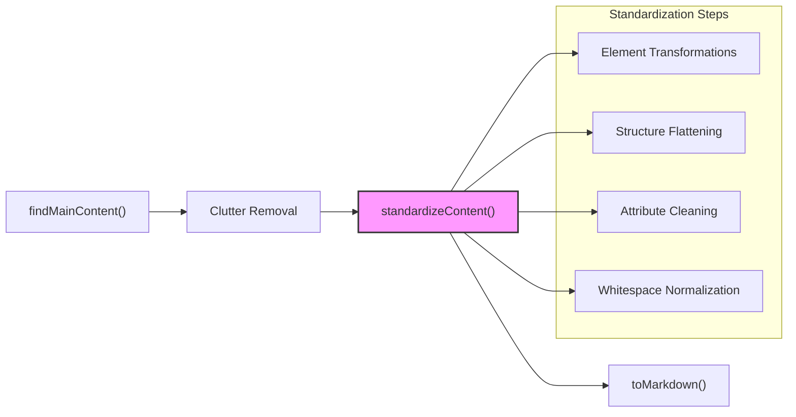
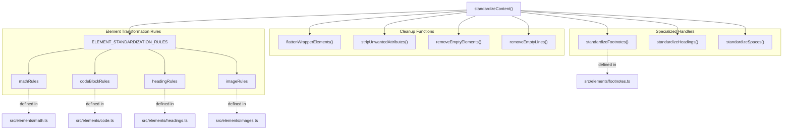
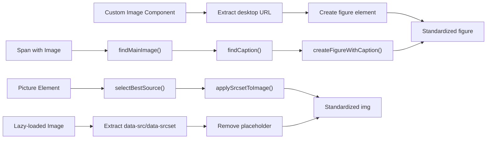
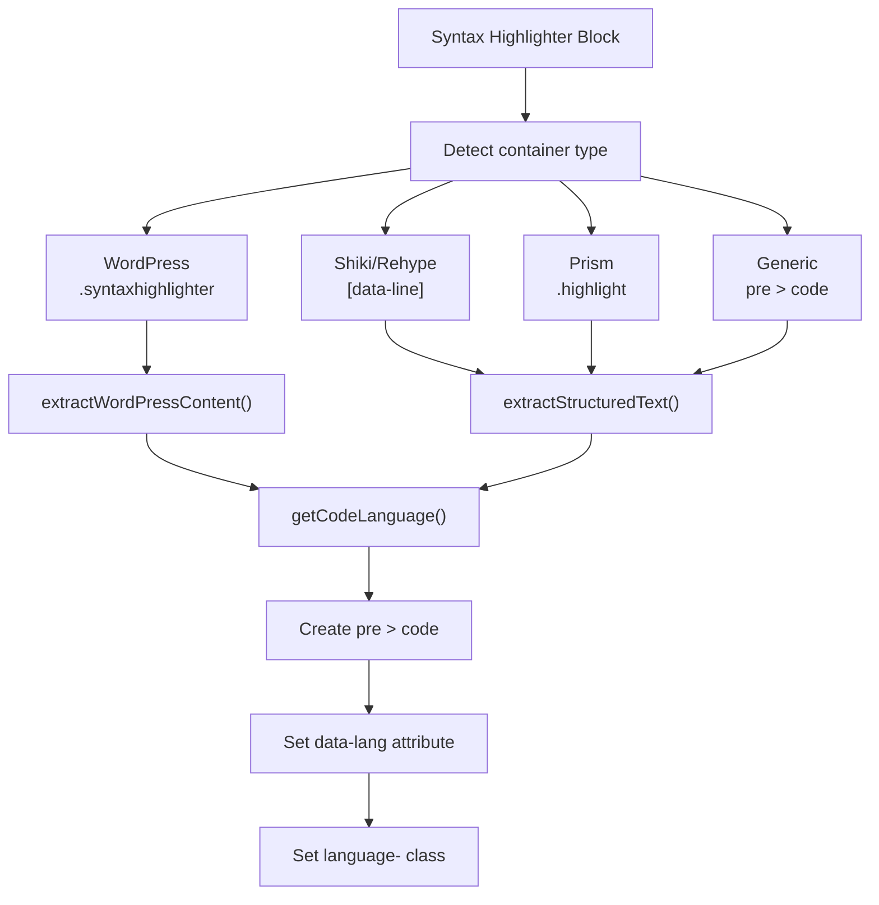
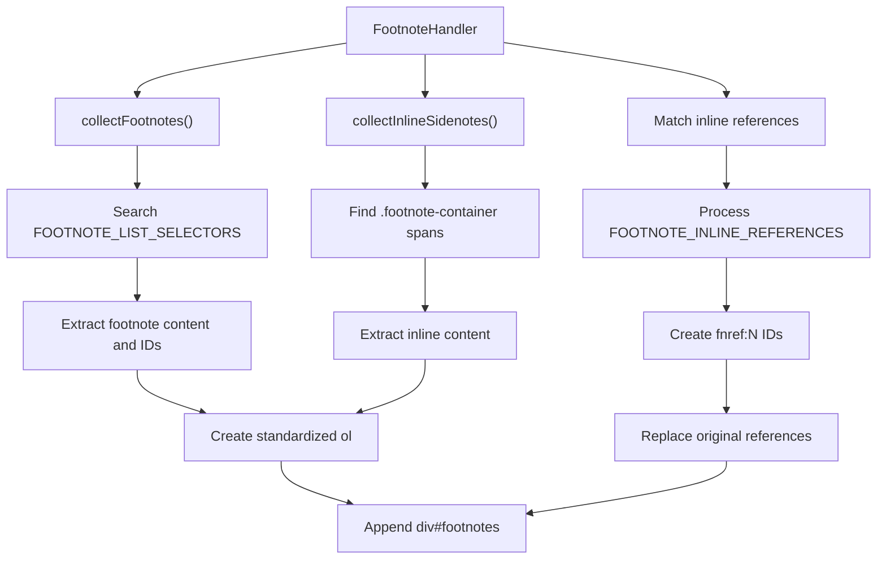
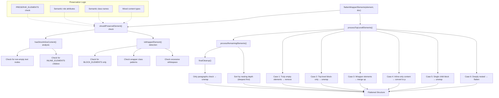
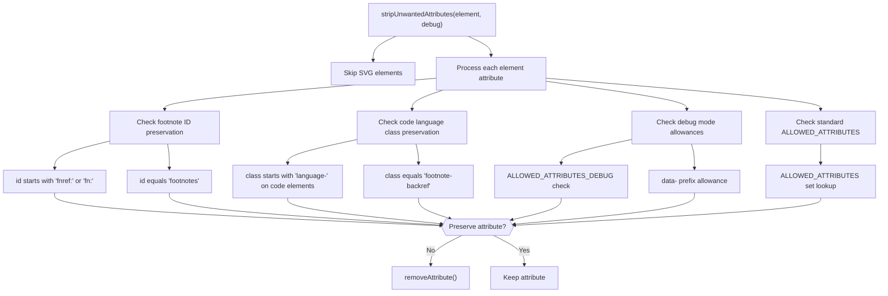
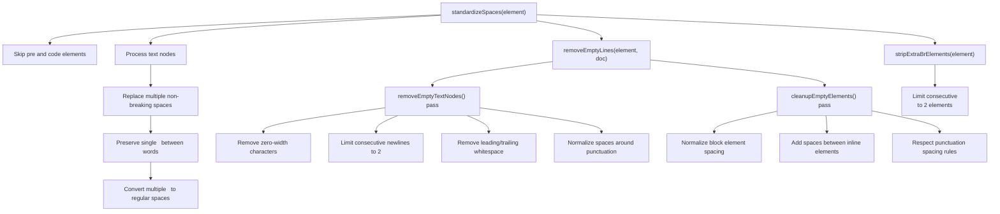
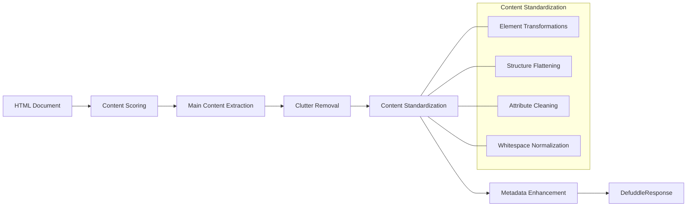

# Content Standardization

<details>
<summary>Relevant source files</summary>

The following files were used as context for generating this wiki page:

- [src/elements/code.ts](src/elements/code.ts)
- [src/elements/footnotes.ts](src/elements/footnotes.ts)
- [src/elements/images.ts](src/elements/images.ts)
- [src/extractors/chatgpt.ts](src/extractors/chatgpt.ts)
- [src/extractors/gemini.ts](src/extractors/gemini.ts)
- [src/extractors/twitter.ts](src/extractors/twitter.ts)
- [src/scoring.ts](src/scoring.ts)
- [src/standardize.ts](src/standardize.ts)

</details>


Content Standardization transforms diverse HTML structures into consistent, normalized formats suitable for markdown conversion and readability. After clutter removal extracts the main content, standardization ensures that images, code blocks, math expressions, and footnotes follow predictable patterns regardless of their original implementation.

This page provides an overview of the standardization architecture. For detailed information on specific subsystems, see:
- [Overall Standardization Process](#5.1) - The `standardizeContent` orchestration and cleanup pipeline
- [Image Standardization](#5.2) - Normalizing picture elements, lazy-loaded images, and captions
- [Code Block Standardization](#5.3) - Converting syntax highlighter outputs to clean code blocks
- [Math Content Standardization](#5.4) - Processing MathML, LaTeX, and equation formats
- [Footnote Standardization](#5.5) - Unifying footnote reference and list formats

## Why Standardization Is Required

Web pages use countless different structures to represent the same content types. A code block might be rendered using Prism, Shiki, highlight.js, or WordPress syntax highlighter—each with different DOM structures, class names, and line numbering schemes. Images might appear as `<picture>` elements with multiple sources, lazy-loaded `` with data attributes, or custom web components. Footnotes range from properly structured `<sup>` references to inline citations with various markup patterns.

Standardization solves this by:
1. **Normalizing structure** - Converting diverse implementations to canonical HTML patterns
2. **Extracting content** - Pulling actual content from wrapper elements and metadata attributes
3. **Cleaning markup** - Removing presentational attributes, wrapper divs, and redundant elements
4. **Preparing for conversion** - Ensuring consistent structure for markdown conversion rules

Sources: [src/standardize.ts:1-235]()

## Pipeline Position

Content standardization executes after content identification and clutter removal, but before markdown conversion:



Sources: [src/defuddle.ts:1-500](), [src/standardize.ts:166-235]()

## Architecture Overview

The standardization system is organized around transformation rules and cleanup functions coordinated by `standardizeContent()`:

**Standardization Architecture**



The system uses a **rule-based transformation pattern** where each content type has an array of `StandardizationRule` objects with selectors, target elements, and optional transform functions.

Sources: [src/standardize.ts:1-35](), [src/standardize.ts:166-235]()

## Standardization Subsystems

### Image Standardization

Images require complex processing to handle diverse source formats and extract the best quality version:

**Image Processing Chain**



The image rules handle:
- `<picture>` elements with multiple `<source>` children
- Lazy-loaded images with `data-src`, `data-srcset` attributes
- Custom components like `<uni-image-full-width>`
- Caption extraction from various structures (figcaption, alt text, sibling elements)

See [Image Standardization](#5.2) for detailed processing logic.

Sources: [src/elements/images.ts:1-900]()

### Code Block Standardization

Code blocks appear in many syntax highlighter formats, each with different line numbering, language detection, and structure:

**Code Block Normalization**



The code rules extract language from 9 different regex patterns, supporting 130+ language identifiers. Special handling includes:
- WordPress table-based line structure
- Verso/Lean documentation blocks with hover tooltips
- Line number removal from various formats

See [Code Block Standardization](#5.3) for language detection and extraction details.

Sources: [src/elements/code.ts:1-372]()

### Math Content Standardization

Math content appears as MathML, LaTeX strings, or rendered equation libraries (KaTeX, MathJax):

The math rules extract:
- Direct `<math>` MathML elements
- LaTeX from `data-latex` attributes or `<script type="math/tex">` tags
- KaTeX/MathJax rendered output converted back to source notation
- arXiv LaTeXML equation tables with alttext annotations

**Bundle Variants:**
- **Core bundle** (`math.core.ts`) - Basic extraction only
- **Full bundle** (`math.full.ts`) - Includes `mathml-to-latex` and `temml` for bidirectional conversion

See [Math Content Standardization](#5.4) for format detection and conversion logic.

Sources: [src/elements/math.ts:1-200](), [src/elements/math.core.ts:1-50](), [src/elements/math.full.ts:1-100]()

### Footnote Standardization

Footnotes vary widely in structure—from semantic `<sup>` references to inline citations to CSS sidenotes:

**Footnote Processing Flow**



The system handles:
- 12+ footnote list selectors (Wikipedia, arXiv, Substack, etc.)
- 6+ inline reference patterns (various `<sup>`, `<a>` structures)
- CSS sidenotes where content is inline
- Generic fallback using ID-based detection when standard selectors fail

See [Footnote Standardization](#5.5) for matching logic and reference ID generation.

Sources: [src/elements/footnotes.ts:1-683]()

## Core Mechanisms

### Element Transformation Rules

The transformation system uses a declarative rule interface:

```typescript
interface StandardizationRule {
  selector: string;          // CSS selector to match elements
  element: string;           // Target element type
  transform?: (el: Element, doc: Document) => Element;  // Optional transform function
}
```

Rules are combined from specialized modules and built-in conversions:

```javascript
const ELEMENT_STANDARDIZATION_RULES: StandardizationRule[] = [
  ...mathRules,          // From src/elements/math.ts
  ...codeBlockRules,     // From src/elements/code.ts
  ...headingRules,       // From src/elements/headings.ts
  ...imageRules,         // From src/elements/images.ts
  // Built-in rules for role-based elements, callouts, etc.
];
```

The `standardizeElements()` function iterates these rules, applying transformations in order. Rules with custom `transform` functions can perform complex restructuring beyond simple element replacement.

Sources: [src/standardize.ts:22-164]()

### Wrapper Flattening

Many sites wrap content in unnecessary `<div>` elements for layout purposes. The `flattenWrapperElements()` function removes these while preserving semantic structure:

**Wrapper Detection Logic**

| Preserved If | Detection Method |
|--------------|------------------|
| Semantic element | Tag in `PRESERVE_ELEMENTS` (article, section, nav, etc.) |
| Has semantic role | `role` attribute = article, main, navigation, banner, contentinfo |
| Has semantic class | Class name includes article, main, content, footnote, reference, bibliography |
| Direct inline content | Contains text nodes or inline elements as direct children |
| Mixed content types | Contains both inline and block elements requiring wrapper |

**Unwrapped If** the element:
- Contains only block-level children
- Has wrapper-like class names (wrapper, container, layout, row, col, grid, etc.)
- Is empty or contains only whitespace
- Has excessive nesting depth without direct content

The function runs in two passes: initial flattening before attribute stripping, then a final pass after cleanup to collapse any wrappers created by earlier operations.

Sources: [src/standardize.ts:1008-1299]()

### Attribute Filtering

`stripUnwantedAttributes()` implements selective preservation based on element type and attribute purpose:

**Preserved Attributes**

| Attribute | Condition | Purpose |
|-----------|-----------|---------|
| `id` | Starts with `fnref:`, `fn:`, or equals `footnotes` | Footnote references and containers |
| `class` | On `<code>` elements starting with `language-` | Code syntax highlighting |
| `class` | Equals `footnote-backref` | Footnote back-navigation links |
| Standard set | In `ALLOWED_ATTRIBUTES` constant | href, src, alt, title, lang, colspan, rowspan, etc. |
| Debug mode | In `ALLOWED_ATTRIBUTES_DEBUG` or `data-*` prefix | Debugging information |

All other attributes are removed to produce clean HTML suitable for markdown conversion.

Sources: [src/standardize.ts:422-477](), [src/constants.ts:1-100]()

## Structure Flattening and Cleanup

The `flattenWrapperElements` function eliminates unnecessary wrapper elements through a sophisticated multi-pass algorithm that preserves semantic structure while removing layout cruft.

**Wrapper Element Flattening Algorithm**



**Element Processing Cases**

| Case | Condition | Action |
|------|-----------|--------|
| Truly Empty | No text content, no children, not in `ALLOWED_EMPTY_ELEMENTS` | Remove element |
| Top-level Block-only | Parent is root element, contains only block elements | Unwrap and merge content |
| Wrapper Element | Detected by `isWrapperElement()` heuristics | Replace with DocumentFragment |
| Inline-only Content | Contains only text nodes and inline elements | Convert to `<p>` element |
| Single Child Block | One child that is a block element | Unwrap and promote child |
| Deeply Nested | High nesting depth without direct inline content | Flatten by unwrapping |

**Preservation Rules**

Elements are preserved if they meet any of these criteria:
- Tag name is in `PRESERVE_ELEMENTS` constant
- Has semantic `role` attribute (article, main, navigation, banner, contentinfo)
- Has semantic class names (article, main, content, footnote, reference, bibliography)
- Contains preserved child elements

Sources: [src/standardize.ts:681-977](), [src/standardize.ts:704-733](), [src/standardize.ts:735-778]()

## Attributes and Whitespace Management

The standardization process includes precise management of HTML attributes and whitespace through specialized functions.

### Attribute Filtering

The `stripUnwantedAttributes` function implements a selective attribute preservation strategy:

**Attribute Preservation Logic**



**Special Attribute Cases**

| Attribute Type | Condition | Preservation Rule |
|----------------|-----------|-------------------|
| Footnote IDs | `id` attribute | Preserved if starts with `fnref:`, `fn:`, or equals `footnotes` |
| Code Language | `class` attribute on `<code>` | Preserved if starts with `language-` |
| Footnote Backref | `class` attribute | Preserved if equals `footnote-backref` |
| Debug Attributes | Debug mode enabled | Additional attributes in `ALLOWED_ATTRIBUTES_DEBUG` |
| Data Attributes | Debug mode enabled | All `data-*` attributes preserved |

### Whitespace Normalization

The system performs multi-phase whitespace cleanup through several specialized functions:

**Space Standardization Process**



**Whitespace Rules**

| Operation | Rule | Implementation |
|-----------|------|----------------|
| Non-breaking Space | Single `&nbsp;` between words | Preserved |
| Multiple `&nbsp;` | Consecutive non-breaking spaces | Converted to regular spaces |
| Consecutive Newlines | More than 2 `\n` characters | Reduced to 2 newlines |
| Punctuation Spacing | Spaces before punctuation | Removed (`\s+([,.!?:;])` → `$1`) |
| Consecutive `<br>` | More than 2 `<br>` elements | Reduced to 2 elements |
| Zero-width Characters | Unicode format characters | Removed completely |

Sources: [src/standardize.ts:337-392](), [src/standardize.ts:189-227](), [src/standardize.ts:449-506](), [src/standardize.ts:508-641]()

## Integration with the Extraction Pipeline

The Content Standardization system is a critical component in Defuddle's overall content extraction process:



Content Standardization serves as the final cleanup step before the extracted content is combined with metadata to produce the final `DefuddleResponse`.

Sources: [src/standardize.ts:144-188]()

## Extensibility

The standardization system is designed to be extensible through additional rule sets. Each content type has its own rule array that can be modified or extended:
- `mathRules`
- `codeBlockRules`
- `headingRules`
- `imageRules`

For detailed information on specific content type standardization, see:
- [Image Standardization](#4.1)
- [Code Block Standardization](#4.2)
- [Math Content Standardization](#4.3)
- [Footnote Standardization](#4.4)
