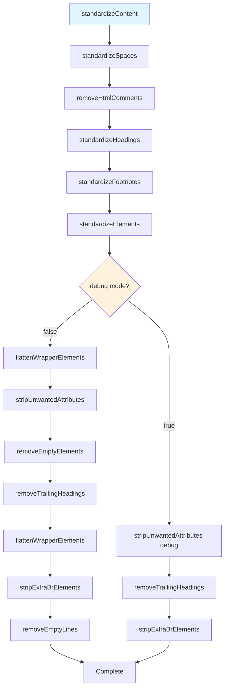
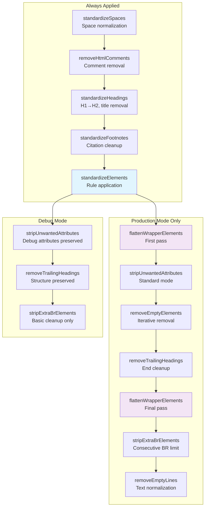

# Overall Standardization Process

<details>
<summary>Relevant source files</summary>

The following files were used as context for generating this wiki page:

- [src/scoring.ts](src/scoring.ts)
- [src/standardize.ts](src/standardize.ts)

</details>


This document covers the main standardization orchestrator that coordinates all content normalization operations in Defuddle. The standardization process transforms raw extracted HTML into clean, standardized markup by applying element-specific rules and performing multi-pass cleanup operations.

For information about specific element standardization rules, see [Image Standardization](#4.1), [Code Block Standardization](#4.2), [Math Content Standardization](#4.3), and [Footnote Standardization](#4.4). For the content extraction that precedes standardization, see [Content Extraction](#3).

## Standardization Architecture

The standardization system is built around a central orchestrator function that coordinates specialized processing modules and cleanup operations in a specific sequence.

```mermaid
graph TB
    subgraph "Element Rule Modules"
        MATH_RULES[mathRules]
        CODE_RULES[codeBlockRules] 
        HEADING_RULES[headingRules]
        IMAGE_RULES[imageRules]
    end
    
    subgraph "Core Standardization"
        STANDARDIZE_CONTENT[standardizeContent]
        ELEMENT_RULES[ELEMENT_STANDARDIZATION_RULES]
        STANDARDIZE_ELEMENTS[standardizeElements]
    end
    
    subgraph "Cleanup Operations"
        STANDARDIZE_SPACES[standardizeSpaces]
        REMOVE_COMMENTS[removeHtmlComments]
        STANDARDIZE_HEADINGS[standardizeHeadings]
        STANDARDIZE_FOOTNOTES[standardizeFootnotes]
        FLATTEN_WRAPPERS[flattenWrapperElements]
        STRIP_ATTRIBUTES[stripUnwantedAttributes]
        REMOVE_EMPTY[removeEmptyElements]
        REMOVE_TRAILING[removeTrailingHeadings]
        STRIP_BRS[stripExtraBrElements]
        REMOVE_LINES[removeEmptyLines]
    end
    
    MATH_RULES --> ELEMENT_RULES
    CODE_RULES --> ELEMENT_RULES
    HEADING_RULES --> ELEMENT_RULES  
    IMAGE_RULES --> ELEMENT_RULES
    
    ELEMENT_RULES --> STANDARDIZE_ELEMENTS
    
    STANDARDIZE_CONTENT --> STANDARDIZE_SPACES
    STANDARDIZE_CONTENT --> REMOVE_COMMENTS
    STANDARDIZE_CONTENT --> STANDARDIZE_HEADINGS
    STANDARDIZE_CONTENT --> STANDARDIZE_FOOTNOTES
    STANDARDIZE_CONTENT --> STANDARDIZE_ELEMENTS
    STANDARDIZE_CONTENT --> FLATTEN_WRAPPERS
    STANDARDIZE_CONTENT --> STRIP_ATTRIBUTES
    STANDARDIZE_CONTENT --> REMOVE_EMPTY
    STANDARDIZE_CONTENT --> REMOVE_TRAILING
    STANDARDIZE_CONTENT --> STRIP_BRS
    STANDARDIZE_CONTENT --> REMOVE_LINES
    
    style STANDARDIZE_CONTENT fill:#e1f5fe
    style ELEMENT_RULES fill:#f3e5f5
```



**Sources:** [src/standardize.ts:1-187]()

## Main Standardization Function

The `standardizeContent` function serves as the primary entry point for all standardization operations. It accepts an HTML element, metadata, document context, and debug flag, then applies transformations in a carefully orchestrated sequence.



**Sources:** [src/standardize.ts:143-187]()

## Element Standardization Rules System

The element standardization system uses a rule-based approach where each rule defines a CSS selector, target element type, and optional transformation function. Rules are imported from specialized modules and combined into a unified array.

| Rule Source | Purpose | Example Selectors |
|-------------|---------|-------------------|
| `mathRules` | Math expression conversion | LaTeX containers, MathML elements |
| `codeBlockRules` | Code syntax highlighting | `.highlight`, `.code-block` |
| `headingRules` | Navigation cleanup | `nav h1`, `.nav-header` |
| `imageRules` | Image/figure processing | `figure`, `.image-container` |

### StandardizationRule Interface

```typescript
interface StandardizationRule {
    selector: string;
    element: string;
    transform?: (el: Element, doc: Document) => Element;
}
```

The rules array includes both imported rules and inline rules for common patterns:

- **Paragraph conversion**: `div[data-testid^="paragraph"]`, `div[role="paragraph"]` → `p`
- **List conversion**: `div[role="list"]` → `ul`/`ol` with nested item processing
- **List item conversion**: `div[role="listitem"]` → `li`

**Sources:** [src/standardize.ts:18-141](), [src/standardize.ts:643-679]()

## Multi-Pass Cleanup Process

The standardization process employs multiple cleanup passes to handle interdependent transformations and edge cases. Different operations run in debug vs production modes.



**Sources:** [src/standardize.ts:159-186]()

## Space and Text Normalization

The `standardizeSpaces` function handles Unicode space normalization while preserving intentional non-breaking spaces between words. It processes text nodes recursively while skipping `pre` and `code` elements.

### Key Operations:
- Convert multiple `&nbsp;` sequences to regular spaces
- Preserve single `&nbsp;` between word characters
- Skip processing within code blocks

**Sources:** [src/standardize.ts:189-227]()

## Wrapper Element Flattening

The `flattenWrapperElements` function performs aggressive div flattening in multiple passes to remove unnecessary structural elements while preserving semantic content.

### Flattening Criteria:
- **Empty elements**: No text content or child elements
- **Wrapper elements**: Only contain block elements without direct inline content  
- **Single-child containers**: Contain one block-level child
- **Deep nesting**: Excessive nesting depth without semantic purpose

### Preservation Rules:
- Elements in `PRESERVE_ELEMENTS` set
- Elements with semantic roles (`article`, `main`, `navigation`)
- Elements with semantic classes (`article`, `content`, `footnote`)
- Elements containing mixed content types

**Sources:** [src/standardize.ts:681-977]()

## Attribute and Cleanup Operations

The cleanup phase removes unwanted attributes while preserving essential semantic information:

### Attribute Preservation:
- **Footnote IDs**: `id` attributes starting with `fnref:` or `fn:`
- **Code languages**: `class="language-*"` on `code` elements  
- **Footnote references**: `class="footnote-backref"`
- **Debug mode**: Additional `data-*` attributes preserved

### Element Cleanup:
- **Empty elements**: Iterative removal of contentless elements
- **Trailing headings**: Remove headings with no following content
- **Consecutive BR elements**: Limit to maximum of 2 consecutive `<br>` tags
- **Empty text nodes**: Remove whitespace-only text nodes and normalize spacing

**Sources:** [src/standardize.ts:337-447](), [src/standardize.ts:449-506](), [src/standardize.ts:508-641]()

## Debug Mode Differences

Debug mode preserves structural elements and additional attributes to aid in development and debugging:

| Operation | Production Mode | Debug Mode |
|-----------|----------------|------------|
| Div flattening | Full aggressive flattening | Skipped entirely |
| Attribute stripping | Standard whitelist only | Includes `data-*` attributes |
| Empty element removal | Full removal | Skipped |
| Text normalization | Complete cleanup | Basic cleanup only |

Debug mode enables developers to inspect the intermediate standardization state while maintaining readable structure.

**Sources:** [src/standardize.ts:159-186]()
