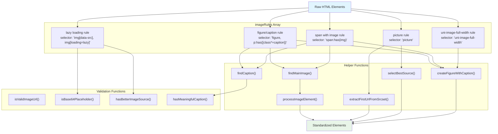
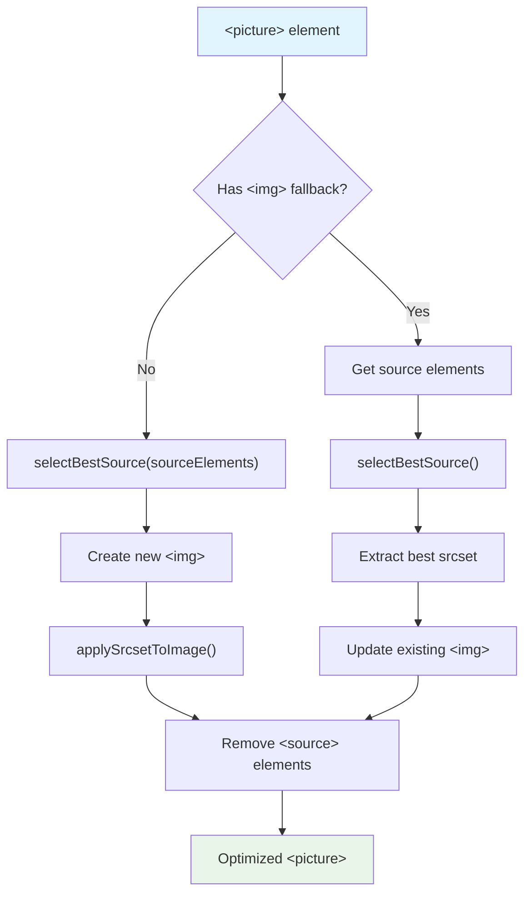
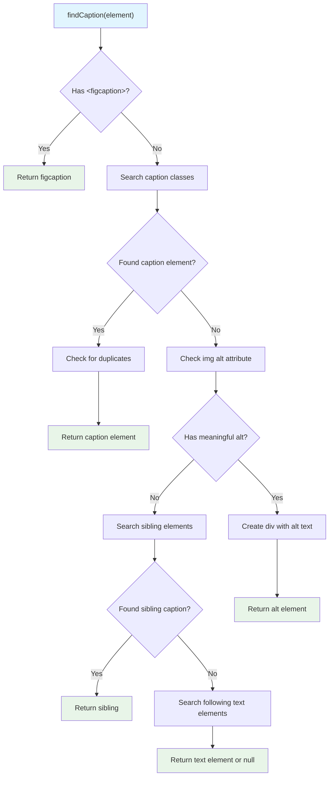
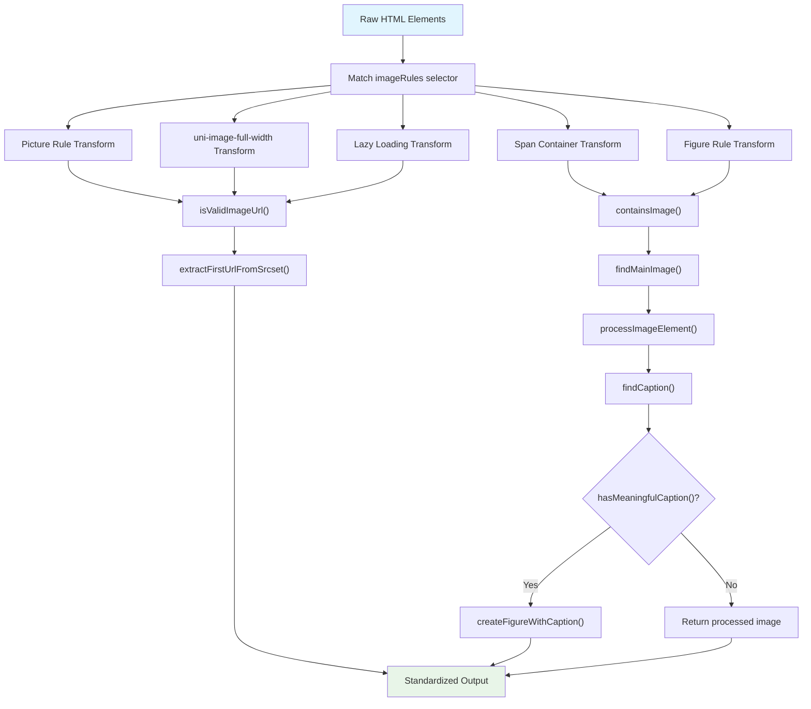

# Image Standardization

<details>
<summary>Relevant source files</summary>

The following files were used as context for generating this wiki page:

- [src/elements/footnotes.ts](src/elements/footnotes.ts)
- [src/elements/images.ts](src/elements/images.ts)
- [src/extractors/chatgpt.ts](src/extractors/chatgpt.ts)
- [src/extractors/gemini.ts](src/extractors/gemini.ts)
- [src/extractors/twitter.ts](src/extractors/twitter.ts)

</details>


## Purpose and Scope

The Image Standardization system processes and normalizes image-related HTML elements into consistent, clean structures. This system handles ``, `<picture>`, `<figure>`, and `<source>` elements, converting complex image markup from various sources into standardized formats with proper captions and optimal source selection.

For processing of other content types, see [Code Block Standardization](#4.2), [Math Content Standardization](#4.3), and [Footnote Standardization](#4.4). For the overall standardization orchestration, see [Overall Standardization Process](#4.5).

## Architecture Overview

The image standardization system consists of a rule-based transformation engine that processes different types of image elements through specialized handlers.

### Core Components



**Sources:** [src/elements/images.ts:18-291]()

## Image Rule System

The standardization operates through five primary rules in the `imageRules` array, each targeting specific image markup patterns:

| Rule | Selector | Purpose | Output |
|------|----------|---------|---------|
| Picture Rule | `picture` | Processes `<picture>` elements with multiple sources | Optimized `<picture>` with best source |
| Custom Image Rule | `uni-image-full-width` | Handles custom image components | Standard `<figure>` element |
| Lazy Loading Rule | `img[data-src], img[loading="lazy"]` | Resolves lazy-loaded images | Clean `` with proper src |
| Span Container Rule | `span:has(img)` | Processes spans containing images | `<figure>` with caption or standalone `` |
| Figure Rule | `figure, p:has([class*="caption"])` | Standardizes figure elements | Clean `<figure>` with proper caption |

### Picture Element Processing

The picture rule [src/elements/images.ts:20-72]() handles responsive image sources by:

1. **Source Selection**: Uses `selectBestSource()` to choose optimal source from available options
2. **Srcset Application**: Applies selected srcset to the img element via `applySrcsetToImage()`
3. **Source Cleanup**: Removes processed `<source>` elements after extraction
4. **Fallback Handling**: Creates new img element if no fallback exists



**Sources:** [src/elements/images.ts:20-72](), [src/elements/images.ts:923-976](), [src/elements/images.ts:313-322]()

### Lazy Loading Resolution

The lazy loading rule [src/elements/images.ts:145-196]() resolves deferred image loading by:

1. **Placeholder Detection**: Identifies base64 placeholders using `isBase64Placeholder()`
2. **Data Attribute Processing**: Transfers `data-src` and `data-srcset` to standard attributes
3. **Pattern Matching**: Scans all attributes for image URL patterns using regex
4. **Cleanup**: Removes lazy loading classes and data attributes

**Sources:** [src/elements/images.ts:145-196](), [src/elements/images.ts:338-358](), [src/elements/images.ts:390-416]()

## Caption Processing

Caption detection and processing uses a multi-stage approach to find meaningful image descriptions.

### Caption Detection Strategy

The `findCaption()` function [src/elements/images.ts:514-645]() searches for captions in this order:

1. **Existing figcaption elements**
2. **Elements with caption-related classes** (caption, description, title, credit, etc.)
3. **Image alt attributes**
4. **Sibling elements with caption classes**
5. **Text elements following images** (em, strong, span)



**Sources:** [src/elements/images.ts:514-645]()

### Caption Validation

The `hasMeaningfulCaption()` function [src/elements/images.ts:691-714]() filters out non-descriptive content:

- **Length check**: Minimum 10 characters
- **URL detection**: Rejects URLs and file paths
- **Pattern matching**: Excludes filenames, numbers, and dates

**Sources:** [src/elements/images.ts:691-714](), [src/elements/images.ts:15-16]()

## Source Selection Logic

The `selectBestSource()` function [src/elements/images.ts:923-976]() chooses optimal image sources from `<picture>` elements:

### Selection Criteria

1. **Default source preference**: Sources without media queries take priority
2. **Resolution analysis**: Calculates effective resolution from width and DPR values
3. **Srcset parsing**: Extracts width descriptors and device pixel ratios
4. **Fallback logic**: Returns first source if no optimal choice found

### Resolution Calculation

```javascript
// From selectBestSource implementation
const resolution = width * dpr; // Effective resolution = width × device pixel ratio
```

**Sources:** [src/elements/images.ts:923-976](), [src/elements/images.ts:12-13]()

## Processing Pipeline

The complete image standardization pipeline transforms raw HTML through multiple validation and processing stages.



**Sources:** [src/elements/images.ts:18-291](), [src/elements/images.ts:420-430](), [src/elements/images.ts:442-510](), [src/elements/images.ts:718-737](), [src/elements/images.ts:295-309]()

### Output Standardization

The standardization process produces consistent output formats:

- **Standalone images**: Clean `` elements with proper src and srcset
- **Captioned images**: `<figure>` elements containing `` and `<figcaption>`
- **Complex images**: Processed `<picture>` elements with optimized sources
- **Custom components**: Converted to standard HTML structures

**Sources:** [src/elements/images.ts:295-309](), [src/elements/images.ts:78-141]()
