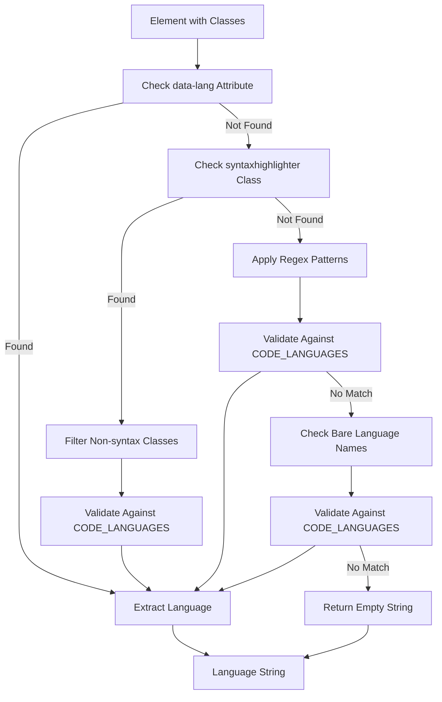
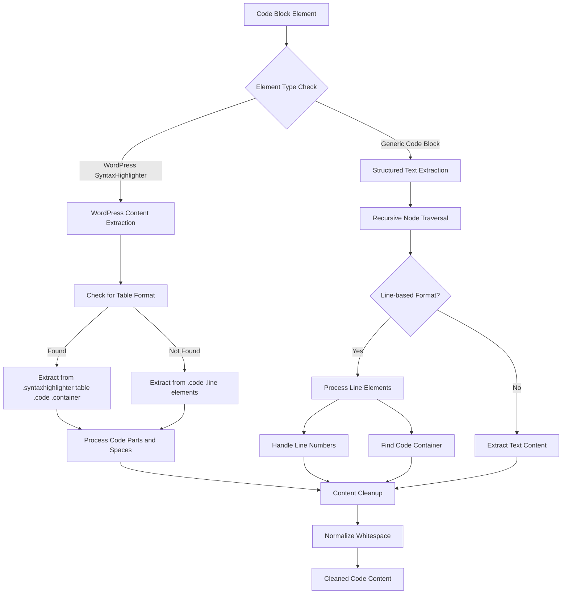
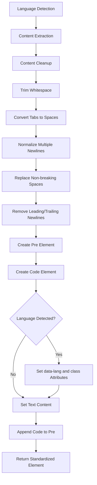

# Code Block Standardization

<details>
<summary>Relevant source files</summary>

The following files were used as context for generating this wiki page:

- [src/elements/code.ts](src/elements/code.ts)

</details>


This document covers the code block standardization system in Defuddle, which transforms code blocks from various syntax highlighters into a unified `<pre><code>` structure with standardized language attributes. The system handles popular syntax highlighters including Prism.js, WordPress SyntaxHighlighter, and generic code block formats.

For information about other content standardization processes, see [Image Standardization](#4.1), [Math Content Standardization](#4.3), and [Overall Standardization Process](#4.5).

## Language Detection System

The code block standardization system uses a comprehensive language detection approach that combines pattern matching with a curated list of supported programming languages.

### Language Patterns

The system employs multiple regex patterns to extract language information from CSS class names:

| Pattern Type | Regex | Example Match |
|--------------|-------|---------------|
| Standard | `^language-(\w+)$` | `language-javascript` |
| Short form | `^lang-(\w+)$` | `lang-python` |
| Suffix | `^(\w+)-code$` | `javascript-code` |
| Prefix | `^code-(\w+)$` | `code-ruby` |
| Syntax | `^syntax-(\w+)$` | `syntax-cpp` |
| Snippet | `^code-snippet__(\w+)$` | `code-snippet__java` |
| Highlight | `^highlight-(\w+)$` | `highlight-go` |
| Fallback | General pattern match | Various formats |



**Sources:** [src/elements/code.ts:4-16](), [src/elements/code.ts:148-184]()

### Supported Languages

The system maintains a comprehensive set of 120+ programming languages including popular languages like JavaScript, Python, Java, and specialized languages like GLSL, Solidity, and WebAssembly.

**Sources:** [src/elements/code.ts:19-120]()

## Content Extraction Pipeline

The code block standardization system handles three primary content extraction strategies based on the source format.



**Sources:** [src/elements/code.ts:203-237](), [src/elements/code.ts:240-282]()

### WordPress SyntaxHighlighter Handling

The system provides specialized extraction for WordPress SyntaxHighlighter plugins, which use complex table or div structures with line numbers and syntax highlighting spans.

For table format extraction:
- Locates `.syntaxhighlighter table .code .container`
- Processes each line's code parts
- Handles special spacing elements with `.spaces` class

For non-table format:
- Finds `.code .line` elements
- Extracts code content from nested code elements
- Preserves line structure

**Sources:** [src/elements/code.ts:203-237]()

### Line-based Format Processing

Many syntax highlighters use line-based approaches where each line of code is wrapped in a separate element. The system handles these by:

1. **Line Detection**: Matches elements with patterns like `div[class*="line"]`, `span[class*="line"]`, `.ec-line`
2. **Content Isolation**: Separates actual code content from line numbers and gutter elements  
3. **Structure Preservation**: Maintains newlines between code lines

**Sources:** [src/elements/code.ts:255-275]()

## Standardization Process

The complete standardization workflow transforms diverse code block formats into a unified structure.



**Sources:** [src/elements/code.ts:295-317]()

### Transformation Rule Configuration

The system uses a single comprehensive transformation rule that targets multiple selector patterns:

```typescript
// Selector targets from codeBlockRules
selector: [
    'pre',                                    // Basic pre elements
    'div[class*="prismjs"]',                 // Prism.js containers
    '.syntaxhighlighter',                    // WordPress SyntaxHighlighter
    '.highlight',                            // Generic highlight containers
    '.highlight-source',                     // GitHub-style highlights
    '.wp-block-syntaxhighlighter-code',      // WordPress block editor
    '.wp-block-code',                        // WordPress code blocks
    'div[class*="language-"]'                // Language-specific containers
].join(', ')
```

**Sources:** [src/elements/code.ts:126-138]()

## Output Format

The standardization process produces a consistent output structure regardless of the input format:

```html
<pre>
    <code data-lang="javascript" class="language-javascript">
        // Cleaned and normalized code content
        console.log('Hello, world!');
    </code>
</pre>
```

### Attributes Applied

| Attribute | Purpose | Example |
|-----------|---------|---------|
| `data-lang` | Stores detected language | `data-lang="python"` |
| `class` | Provides CSS hook for styling | `class="language-python"` |

The code content undergoes the following normalization:
- Tab characters converted to 4 spaces
- Multiple consecutive newlines reduced to maximum of 2
- Non-breaking spaces replaced with regular spaces
- Leading and trailing whitespace removed
- Consistent line ending handling

**Sources:** [src/elements/code.ts:295-317]()

## Integration with Content Standardization

The `codeBlockRules` export is consumed by the broader content standardization system as part of the element transformation pipeline. This ensures that all code blocks are processed consistently during the content extraction process.

**Sources:** [src/elements/code.ts:124-318]()
