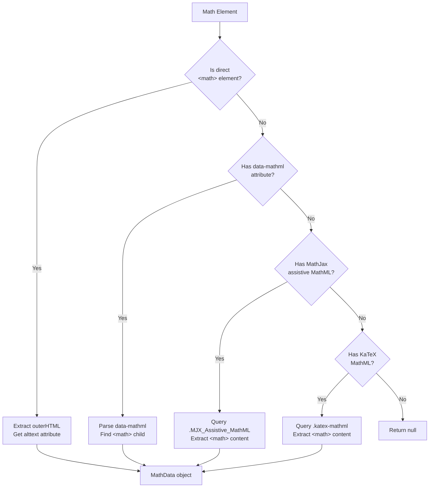
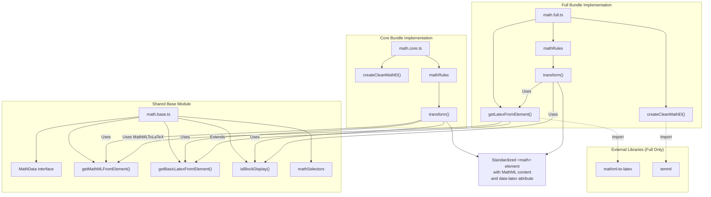
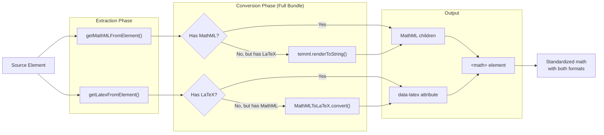

# Math Content Standardization

<details>
<summary>Relevant source files</summary>

The following files were used as context for generating this wiki page:

- [src/elements/math.base.ts](src/elements/math.base.ts)
- [src/elements/math.core.ts](src/elements/math.core.ts)
- [src/elements/math.full.ts](src/elements/math.full.ts)
- [tests/expected/issues--169-svg-classname-crash.md](tests/expected/issues--169-svg-classname-crash.md)
- [tests/expected/math--mathjax-tex-scripts.md](tests/expected/math--mathjax-tex-scripts.md)
- [tests/fixtures/issues--169-svg-classname-crash.html](tests/fixtures/issues--169-svg-classname-crash.html)
- [tests/fixtures/math--mathjax-tex-scripts.html](tests/fixtures/math--mathjax-tex-scripts.html)

</details>


This document explains how Defuddle normalizes mathematical content from diverse rendering libraries (MathJax, KaTeX, MediaWiki, WordPress LaTeX) into standardized `<math>` elements with MathML content and LaTeX annotations. The math standardization system consists of three modules: a shared base module for extraction logic, and two implementation modules for core and full bundles.

For the overall standardization orchestration, see [Overall Standardization Process](#5.1). For markdown conversion of standardized math elements, see [Markdown Conversion](#7).

---

## Math Element Detection

The system detects mathematical content using a comprehensive selector list defined in `mathSelectors` [src/elements/math.base.ts:190-226](). This selector covers 26 different patterns organized into five categories:

| Category | Selectors | Description |
|----------|-----------|-------------|
| **WordPress** | `img.latex[src*="latex.php"]` | LaTeX rendered as images |
| **MathJax** | `span.MathJax`, `mjx-container`, `script[type="math/tex"]`, etc. | MathJax v2 and v3 elements |
| **MediaWiki** | `.mwe-math-element`, `.mwe-math-fallback-image-*`, etc. | Wikipedia-style math |
| **KaTeX** | `.katex`, `.katex-display`, `[data-katex]`, etc. | KaTeX rendering library |
| **Generic** | `math`, `[data-math]`, `[data-latex]`, etc. | Standard and custom formats |

The selector matches both inline and display math, rendered content and script elements, and handles assistive MathML containers used for accessibility.

**Sources:** [src/elements/math.base.ts:190-226]()

---

## Content Extraction Strategy

### MathData Interface

The extraction process produces a `MathData` object [src/elements/math.base.ts:3-7]() containing:

```typescript
interface MathData {
    mathml: string;      // MathML content as HTML string
    latex: string | null; // LaTeX source (may be null)
    isBlock: boolean;     // Display mode (block vs inline)
}
```

### Multi-Source MathML Extraction

The `getMathMLFromElement` function [src/elements/math.base.ts:9-67]() extracts MathML content using a four-tier fallback strategy:



**Diagram: MathML Extraction Fallback Strategy**

Each extraction tier checks for display mode indicators and attempts to preserve LaTeX source from `alttext` attributes. The MathJax assistive MathML path [src/elements/math.base.ts:36-54]() checks both the `<math>` element and its container for the `display="block"` attribute.

**Sources:** [src/elements/math.base.ts:9-67]()

---

### LaTeX Extraction

#### Basic LaTeX Extraction (All Bundles)

The `getBasicLatexFromElement` function [src/elements/math.base.ts:69-131]() extracts LaTeX strings without requiring external libraries. It uses a seven-tier fallback strategy:

1. **Direct data-latex attribute** [src/elements/math.base.ts:71-74]()
2. **WordPress LaTeX images** [src/elements/math.base.ts:77-94]() - Extracts from `alt` text or URL parameters
3. **MathML annotation elements** [src/elements/math.base.ts:96-100]() - `<annotation encoding="application/x-tex">`
4. **KaTeX annotation** [src/elements/math.base.ts:102-108]() - `.katex-mathml annotation`
5. **MathJax script elements** [src/elements/math.base.ts:110-113]() - `script[type="math/tex"]`
6. **Sibling script elements** [src/elements/math.base.ts:115-121]()
7. **Direct `<math>` textContent** [src/elements/math.base.ts:123-127]() - Clean Unicode representation

The WordPress LaTeX extraction [src/elements/math.base.ts:84-92]() performs URL decoding and special character normalization:

```typescript
decodeURIComponent(match[1])
    .replace(/\+/g, ' ')      // Replace + with spaces
    .replace(/%5C/g, '\\');   // Fix escaped backslashes
```

**Sources:** [src/elements/math.base.ts:69-131]()

#### Enhanced LaTeX Extraction (Full Bundle Only)

The full bundle implementation [src/elements/math.full.ts:12-30]() extends basic extraction with MathML-to-LaTeX conversion using the `mathml-to-latex` library. If basic extraction fails, it attempts to convert any available MathML:

```typescript
const mathData = getMathMLFromElement(el);
if (mathData?.mathml) {
    try {
        return MathMLToLaTeX.convert(mathData.mathml);
    } catch (e) {
        console.warn('Failed to convert MathML to LaTeX:', e);
    }
}
```

This ensures LaTeX is available for markdown conversion even when only MathML exists in the source.

**Sources:** [src/elements/math.full.ts:12-30]()

---

### Display Mode Detection

The `isBlockDisplay` function [src/elements/math.base.ts:133-187]() determines whether math should be rendered in block (display) or inline mode using nine detection methods:

| Priority | Method | Code Reference |
|----------|--------|----------------|
| 1 | Explicit `display="block"` attribute | [src/elements/math.base.ts:135-138]() |
| 2 | Class names containing "display" or "block" | [src/elements/math.base.ts:141-144]() |
| 3 | Display container classes | [src/elements/math.base.ts:147-150]() |
| 4 | Preceded by `<p>` element | [src/elements/math.base.ts:153-156]() |
| 5 | MediaWiki display class | [src/elements/math.base.ts:159-161]() |
| 6 | KaTeX `.katex-display` container | [src/elements/math.base.ts:164-168]() |
| 7 | MathJax v3 `display="true"` | [src/elements/math.base.ts:171-173]() |
| 8 | MathJax script `mode=display` | [src/elements/math.base.ts:176-178]() |
| 9 | Parent container display attribute | [src/elements/math.base.ts:181-184]() |

The detection is conservative: inline is the default unless explicit display indicators are found.

**Sources:** [src/elements/math.base.ts:133-187]()

---

## Standardization Implementation

### Architecture: Core vs Full Bundle



**Diagram: Math Standardization Module Architecture**

The architecture uses Webpack module aliasing (see [Build and Distribution System](#3.2)) to compile either `math.core.ts` or `math.full.ts` into the same import path `./elements/math`, allowing the standardization orchestrator to use a single import statement while getting different implementations.

**Sources:** [src/elements/math.core.ts:1-63](), [src/elements/math.full.ts:1-99](), [src/elements/math.base.ts:1-226]()

---

### Core Bundle Implementation

The core bundle [src/elements/math.core.ts:1-63]() provides lightweight math extraction without external dependencies. It extracts existing MathML and LaTeX but does not perform conversions.

#### createCleanMathEl (Core)

The `createCleanMathEl` function [src/elements/math.core.ts:10-31]() creates standardized `<math>` elements:

```typescript
const cleanMathEl = doc.createElement('math');
cleanMathEl.setAttribute('xmlns', 'http://www.w3.org/1998/Math/MathML');
cleanMathEl.setAttribute('display', isBlock ? 'block' : 'inline');
cleanMathEl.setAttribute('data-latex', latex || '');
```

Content population follows this priority:
1. **MathML content** - If available, transfers children from existing `<math>` element [src/elements/math.core.ts:17-24]()
2. **LaTeX fallback** - If no MathML, stores LaTeX as `textContent` [src/elements/math.core.ts:25-28]()

This ensures the output is valid MathML even when only LaTeX is available, though without proper rendering structure.

**Sources:** [src/elements/math.core.ts:10-31]()

---

### Full Bundle Implementation

The full bundle [src/elements/math.full.ts:1-99]() includes `mathml-to-latex` and `temml` libraries for bidirectional conversion between MathML and LaTeX.

#### createCleanMathEl (Full)

The full bundle's `createCleanMathEl` [src/elements/math.full.ts:32-70]() implements LaTeX-to-MathML conversion using `temml`:

```typescript
const mathml = temml.renderToString(latex, {
    displayMode: isBlock,
    throwOnError: false
});
```

Content population strategy:
1. **Existing MathML** - Direct transfer [src/elements/math.full.ts:40-45]()
2. **LaTeX conversion** - Convert to MathML using temml [src/elements/math.full.ts:48-62]()
3. **Error fallback** - Store LaTeX as textContent if conversion fails [src/elements/math.full.ts:61, 65]()

This produces proper MathML structure from pure LaTeX sources, enabling correct rendering and downstream processing.

**Sources:** [src/elements/math.full.ts:32-70]()

#### Bidirectional Conversion Strategy



**Diagram: Bidirectional Math Format Conversion (Full Bundle)**

The full bundle attempts to populate both MathML content and LaTeX annotation regardless of source format, enabling flexible downstream processing.

**Sources:** [src/elements/math.full.ts:12-70]()

---

## Supported Math Formats

The system handles mathematical content from the following rendering libraries and formats:

### MathJax (v2 and v3)

| Component | Detection | Extraction Method |
|-----------|-----------|-------------------|
| Rendered containers | `span.MathJax`, `mjx-container` | MathML from `.MJX_Assistive_MathML` [src/elements/math.base.ts:37-54]() |
| Script elements | `script[type="math/tex"]` | Direct textContent [src/elements/math.base.ts:111-113]() |
| Display mode scripts | `script[type="math/tex; mode=display"]` | textContent + display flag [src/elements/math.base.ts:176-178]() |
| LaTeX source | `<annotation encoding="application/x-tex">` | annotation textContent [src/elements/math.base.ts:97-100]() |

**Test case:** [tests/fixtures/math--mathjax-tex-scripts.html]() demonstrates script element extraction producing markdown with inline `$...$` and display `$$...$$` delimiters [tests/expected/math--mathjax-tex-scripts.md:10-24]().

**Sources:** [src/elements/math.base.ts:36-54, 97-113](), [tests/fixtures/math--mathjax-tex-scripts.html]()

---

### KaTeX

| Component | Detection | Extraction Method |
|-----------|-----------|-------------------|
| Container | `.katex`, `.katex-display` | MathML from `.katex-mathml` child [src/elements/math.base.ts:57-64]() |
| LaTeX source | `.katex-mathml annotation` | annotation textContent [src/elements/math.base.ts:104-107]() |
| Display mode | `.katex-display` container | Container presence check [src/elements/math.base.ts:164-168]() |

KaTeX elements are inline by default; block mode requires explicit `.katex-display` wrapper.

**Test case:** [tests/fixtures/issues--169-svg-classname-crash.html:24]() demonstrates inline KaTeX rendering that must handle SVG className objects without crashing [src/elements/math.base.ts:33-35]().

**Sources:** [src/elements/math.base.ts:57-64, 102-108, 164-168](), [tests/fixtures/issues--169-svg-classname-crash.html]()

---

### MediaWiki Math

| Component | Detection | Extraction Method |
|-----------|-----------|-------------------|
| Inline math | `.mwe-math-mathml-inline` | Direct `<math>` child [src/elements/math.base.ts:11-18]() |
| Display math | `.mwe-math-mathml-display` | `<math>` + display flag [src/elements/math.base.ts:159-161]() |
| Fallback images | `.mwe-math-fallback-image-*` | Alt text as LaTeX [src/elements/math.base.ts:130]() |

MediaWiki provides clean MathML in modern rendering modes and fallback images for compatibility.

**Sources:** [src/elements/math.base.ts:11-18, 130, 159-161]()

---

### WordPress LaTeX

WordPress renders LaTeX as images served from `latex.php`. The extraction process [src/elements/math.base.ts:77-94]() handles:

1. **Alt text extraction** - Preferred source as it's cleaner [src/elements/math.base.ts:79-82]()
2. **URL parameter parsing** - Fallback extraction from `latex.php?latex=` parameter [src/elements/math.base.ts:86-92]()
3. **Decoding and normalization** - URL decoding with special character fixes

Detection uses: `img.latex[src*="latex.php"]` [src/elements/math.base.ts:192]()

**Sources:** [src/elements/math.base.ts:77-94, 192]()

---

## Transformation Rules

### mathRules Array

Both core and full bundles export a `mathRules` array [src/elements/math.core.ts:38-63](), [src/elements/math.full.ts:72-99]() containing a single transformation rule:

```typescript
{
    selector: mathSelectors,
    element: 'math',
    transform: (el: Element, doc: Document): Element => {
        // Extract math data
        const mathData = getMathMLFromElement(el);
        const latex = getLatexFromElement(el);
        const isBlock = isBlockDisplay(el);
        
        // Create clean element
        const cleanMathEl = createCleanMathEl(...);
        
        // Clean up associated scripts
        // ...
        
        return cleanMathEl;
    }
}
```

The rule is consumed by the standardization orchestrator [see Overall Standardization Process](#5.1) which applies it to all matched elements.

**Sources:** [src/elements/math.core.ts:38-63](), [src/elements/math.full.ts:72-99]()

---

### Script Element Cleanup

After extracting content, the transformation removes associated math rendering scripts [src/elements/math.core.ts:50-58](), [src/elements/math.full.ts:86-94]():

```typescript
if (el.parentElement && !el.matches('script[type^="math/"]')) {
    const mathElements = el.parentElement.querySelectorAll(
        'script[type^="math/"], .MathJax_Preview, ' +
        'script[type="text/javascript"][src*="mathjax"], ' +
        'script[type="text/javascript"][src*="katex"]'
    );
    mathElements.forEach(el => el.remove());
}
```

The conditional `!el.matches('script[type^="math/"]')` prevents premature removal when the element being transformed is itself a script—the caller will handle its replacement, and removing siblings would destroy unprocessed scripts.

**Sources:** [src/elements/math.core.ts:50-58](), [src/elements/math.full.ts:86-94]()

---

## Output Structure

All math transformations produce standardized `<math>` elements with consistent structure:

```html
<math xmlns="http://www.w3.org/1998/Math/MathML" 
      display="inline|block" 
      data-latex="E=mc^2">
    <!-- MathML children here -->
</math>
```

**Attributes:**
- `xmlns` - MathML namespace declaration (always present)
- `display` - `"inline"` or `"block"` based on display mode detection
- `data-latex` - LaTeX source when available (empty string if not)

**Content:**
- Core bundle: Transfers existing MathML or stores LaTeX as textContent
- Full bundle: Transfers existing MathML or converts LaTeX to proper MathML structure

This standardized format enables consistent markdown conversion (see [Markdown Conversion](#7)) where inline math becomes `$...$` and block math becomes `$$...$$` using the `data-latex` attribute.

**Sources:** [src/elements/math.core.ts:10-31](), [src/elements/math.full.ts:32-70]()
