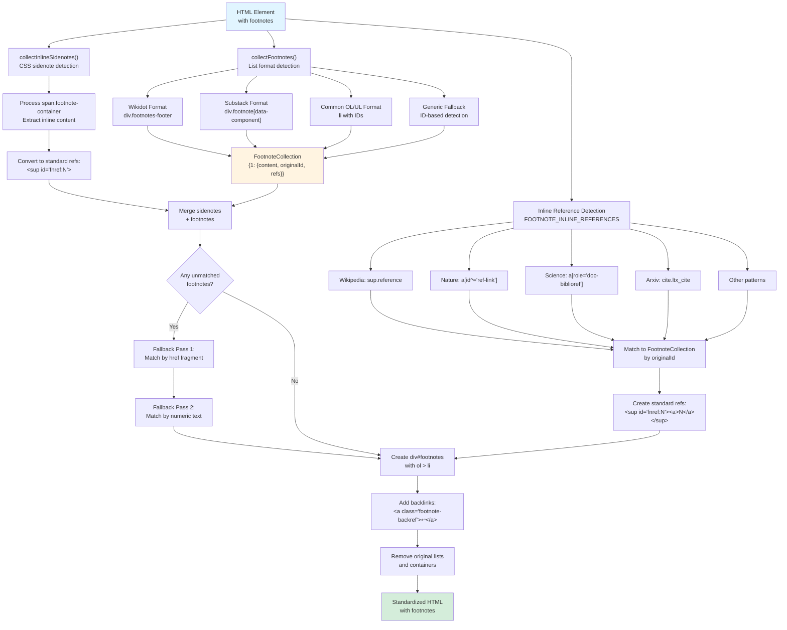
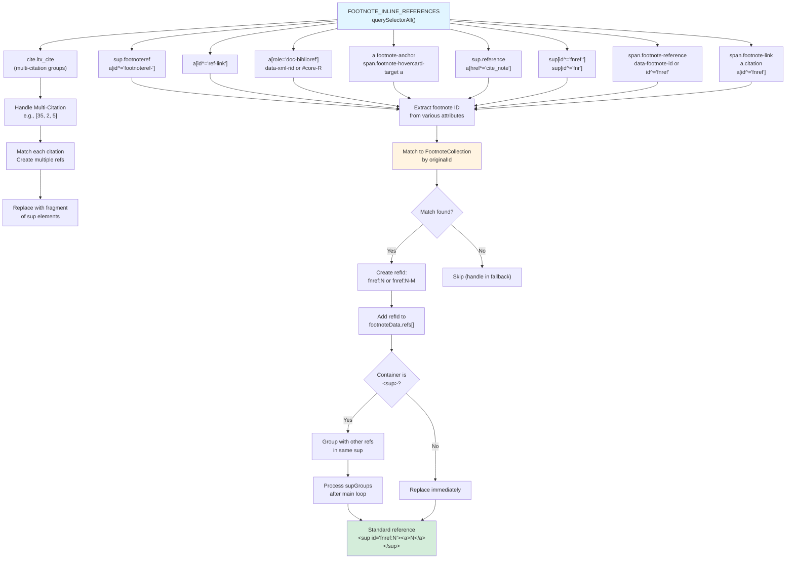

# Footnote Standardization

<details>
<summary>Relevant source files</summary>

The following files were used as context for generating this wiki page:

- [src/elements/footnotes.ts](src/elements/footnotes.ts)
- [src/elements/images.ts](src/elements/images.ts)
- [src/extractors/chatgpt.ts](src/extractors/chatgpt.ts)
- [src/extractors/gemini.ts](src/extractors/gemini.ts)
- [src/extractors/twitter.ts](src/extractors/twitter.ts)

</details>


This page documents the footnote standardization subsystem, which normalizes diverse footnote formats from various websites into a single, consistent structure. The `FootnoteHandler` class detects 12+ list formats and 6+ inline reference patterns, converting them to a standardized HTML structure ready for markdown conversion.

For overall content standardization orchestration, see [5.1 Overall Standardization Process](#5.1). For other element transformations, see [5.2 Image Standardization](#5.2), [5.3 Code Block Standardization](#5.3), and [5.4 Math Content Standardization](#5.4).

---

## Overview

Websites implement footnotes in wildly different ways: Wikipedia uses `<sup class="reference">`, Substack uses `<div class="footnote" data-component-name="FootnoteToDOM">`, academic sites use `<a role="doc-biblioref">`, and some sites embed footnote content directly inline using CSS (sidenotes). The footnote standardization system detects all these formats and converts them to a uniform structure.

**Standardized Output Format:**

All footnotes are converted to:
```html
<div id="footnotes">
  <ol>
    <li class="footnote" id="fn:1">
      <p>Footnote content... <a href="#fnref:1" class="footnote-backref">↩</a></p>
    </li>
  </ol>
</div>
```

With inline references standardized to:
```html
<sup id="fnref:1"><a href="#fn:1">1</a></sup>
```

Sources: [src/elements/footnotes.ts:1-683]()

---

## Architecture

### Core Components

| Component | Type | Purpose |
|-----------|------|---------|
| `FootnoteHandler` | Class | Main orchestrator for footnote standardization |
| `standardizeFootnotes()` | Function | Public API entry point |
| `FootnoteData` | Interface | Stores footnote content, original ID, and references |
| `FootnoteCollection` | Interface | Map of footnote number to `FootnoteData` |
| `FOOTNOTE_LIST_SELECTORS` | Constant | CSS selectors for detecting footnote lists |
| `FOOTNOTE_INLINE_REFERENCES` | Constant | CSS selectors for detecting inline references |

Sources: [src/elements/footnotes.ts:1-25](), [src/constants]()

---

## FootnoteHandler Class

### Data Structures

The `FootnoteHandler` uses two key interfaces to track footnote information:

```typescript
interface FootnoteData {
  content: any;        // HTML element or string containing footnote text
  originalId: string;  // Original ID from source (e.g., "r1", "fn:5", "cite_note-12")
  refs: string[];      // Array of reference IDs that link to this footnote
}

interface FootnoteCollection {
  [footnoteNumber: number]: FootnoteData;  // Numeric key = standardized footnote number
}
```

**State Management:**
- `doc`: The document being processed
- `genericContainer`: Stores container for generic ID-based footnotes (removed after processing)

Sources: [src/elements/footnotes.ts:5-21]()

### Key Methods

| Method | Purpose |
|--------|---------|
| `standardizeFootnotes(element)` | Main orchestration method that runs the full pipeline |
| `collectFootnotes(element)` | Detects and collects footnotes from 12+ list formats |
| `collectInlineSidenotes(element)` | Handles CSS-based inline sidenotes |
| `createFootnoteItem(num, content, refs)` | Creates standardized `<li>` element with backlinks |
| `createFootnoteReference(num, refId)` | Creates standardized `<sup><a>` reference |
| `removeBackrefs(el)` | Removes existing backref arrows (↩, ↑, etc.) |
| `findOuterFootnoteContainer(el)` | Finds outermost `<span>` or `<sup>` wrapper |

Sources: [src/elements/footnotes.ts:15-667]()

---

## Footnote Detection Pipeline

### Diagram: Footnote Detection and Standardization Flow



Sources: [src/elements/footnotes.ts:365-666]()

---

## List Format Detection

### Supported Formats

The `collectFootnotes()` method detects and processes 12+ distinct list formats:

#### 1. Wikidot Format
```html
<div class="footnotes-footer">
  <div class="footnote-footer" id="footnote-1">
    . <a href="#footnoteref-1">1</a> Footnote text...
  </div>
</div>
```
- **Detection**: `div.footnotes-footer` containing `div.footnote-footer`
- **ID Extraction**: `/^footnote-(\d+)$/`
- **Processing**: Removes backlink anchor, strips leading ". " from text

Sources: [src/elements/footnotes.ts:83-113]()

#### 2. Substack Format
```html
<div class="footnote" data-component-name="FootnoteToDOM">
  <a class="footnote-number" id="footnote-1"></a>
  <span class="footnote-content">Footnote text...</span>
</div>
```
- **Detection**: `div.footnote[data-component-name="FootnoteToDOM"]`
- **ID Extraction**: From `a.footnote-number` ID, strip `footnote-` prefix
- **Processing**: Extracts `.footnote-content` element

Sources: [src/elements/footnotes.ts:116-132]()

#### 3. Common OL/UL Format
```html
<ol class="footnotes">
  <li id="fn:1">Footnote text... <a href="#fnref:1">↩</a></li>
</ol>
```
- **Detection**: `li` or `div[role="listitem"]` within list selectors
- **ID Formats**: Multiple patterns supported:
  - `fn:N` → extract `N`
  - `fnN` → extract `N`
  - `bib.bibN` → extract `N`
  - `cite_note-XXX` → extract `XXX`

Sources: [src/elements/footnotes.ts:135-177]()

#### 4. Citations with `.citations` Class
```html
<li>
  <div class="citations" id="r1">
    <div class="citation-content">Citation text...</div>
  </div>
</li>
```
- **Detection**: `.citations` div with ID starting with `r`
- **Processing**: Extracts `.citation-content` if available

Sources: [src/elements/footnotes.ts:141-149]()

#### 5. Nature.com Format
```html
<li data-counter="1.">Reference text...</li>
```
- **Detection**: `li[data-counter]`
- **ID Extraction**: From `data-counter` attribute, strip trailing period

Sources: [src/elements/footnotes.ts:158-160]()

### Generic Fallback Detection

When no standard formats are found (`footnoteCount === 1`), the system employs a sophisticated ID-based detection strategy:

**Algorithm:**
1. **Find candidate references**: Scan for `<a href="#...">` with numeric text (1-4 digits) inside `<sup>` or `<span>`
2. **Identify container**: Find a container (`div`, `section`, `aside`, `footer`) where multiple children have IDs matching the reference fragments
3. **Extract footnotes**: Group consecutive elements without IDs as multi-paragraph footnotes
4. **Store container**: Save container reference for later removal

Sources: [src/elements/footnotes.ts:179-276]()

---

## Inline Reference Detection

### Diagram: Reference Pattern Matching



Sources: [src/elements/footnotes.ts:372-632]()

### Reference Patterns by Platform

| Platform | Pattern | ID Extraction |
|----------|---------|---------------|
| **Wikidot** | `sup.footnoteref > a[id^="footnoteref-"]` | Extract number from `footnoteref-N` |
| **Nature.com** | `a[id^="ref-link"]` | Use text content as ID |
| **Science.org** | `a[role="doc-biblioref"]` | Extract from `data-xml-rid` or `#core-R` href |
| **Substack** | `a.footnote-anchor`, `span.footnote-hovercard-target a` | Strip `footnote-anchor-` prefix from ID |
| **Arxiv** | `cite.ltx_cite` | Extract from multiple `a[href*="bib.bib"]` links |
| **Wikipedia** | `sup.reference > a` | Match `cite_note-XXX` or `cite_ref-XXX` in href |
| **Standard** | `sup[id^="fnref:"]`, `sup[id^="fnr"]` | Strip prefix from ID |
| **LessWrong** | `span.footnote-reference` | From `data-footnote-id` or `id^="fnref"` |
| **Generic** | `a.citation`, `span.footnote-link` | From href fragment |

Sources: [src/elements/footnotes.ts:384-521]()

### Multi-Citation Handling (Arxiv)

Arxiv uses grouped citations like `[35, 2, 5]` within a single `<cite>` element:

**Process:**
1. Detect `cite.ltx_cite` elements
2. Find all `a` links within the citation
3. Extract citation ID from each href (`bib.bibN`)
4. Create separate `<sup>` reference for each citation
5. Insert space between references
6. Replace entire `cite` element with fragment of references

Sources: [src/elements/footnotes.ts:416-449]()

---

## CSS Sidenote Detection

### Pattern Recognition

CSS sidenotes embed footnote content directly inline, using CSS to display it in the margin:

```html
<span class="footnote-container">
  <label class="footnote-number"></label>
  <input class="margin-toggle">
  <span class="footnote">Footnote content here...</span>
</span>
```

**Detection:**
- Query for `span.footnote-container` or `span.sidenote-container`
- Extract content from `span.footnote` or `span.sidenote`

**Conversion:**
1. Clone the content span
2. Add to `FootnoteCollection` with auto-incremented number
3. Create standard `<sup id="fnref:N"><a href="#fn:N">N</a></sup>` reference
4. Replace entire container with the reference

Sources: [src/elements/footnotes.ts:336-363]()

---

## Fallback Matching Strategies

When footnotes remain unmatched after initial reference detection, the system applies two fallback passes:

### Pass 1: Fragment Link Matching

Scans for links with fragment identifiers:

```html
<a href="#footnote-37">1</a>
```

**Algorithm:**
1. Query all `a[href*="#"]` links
2. Skip links already inside standardized refs (`[id^="fnref:"]`)
3. Skip links inside `#footnotes` section or generic container
4. Extract fragment from href
5. Match fragment against `footnoteIdMap`
6. Validate link text looks like a footnote marker (`/^[\[\(]?\d{1,4}[\]\)]?$/`)
7. Create reference and replace

Sources: [src/elements/footnotes.ts:537-574]()

### Pass 2: Numeric Text Matching

Scans for `<sup>` or `<span class="footnote-ref">` elements with numeric content:

```html
<sup>1</sup>
```

**Algorithm:**
1. Query `sup, span.footnote-ref` elements
2. Skip already standardized refs
3. Skip elements inside `#footnotes`
4. Extract number from text content
5. Match against `footnoteNumMap` or `footnoteIdMap`
6. Ensure footnote not already matched
7. Create reference and replace

Sources: [src/elements/footnotes.ts:576-610]()

---

## Reference ID Generation

### Single References

For the first reference to a footnote:
```
fnref:1
```

### Multiple References

When a footnote is referenced multiple times:
```
fnref:1      (first reference)
fnref:1-2    (second reference)
fnref:1-3    (third reference)
```

**Implementation:**
```typescript
const refId = footnoteData.refs.length > 0 
  ? `fnref:${footnoteNumber}-${footnoteData.refs.length + 1}` 
  : `fnref:${footnoteNumber}`;
```

Sources: [src/elements/footnotes.ts:499-501](), [src/elements/footnotes.ts:566-568]()

---

## Footnote Item Creation

### Structure

The `createFootnoteItem()` method builds the standardized footnote list item:

```html
<li class="footnote" id="fn:1">
  <p>Footnote content... <a href="#fnref:1" class="footnote-backref">↩</a></p>
</li>
```

**Process:**
1. Create `<li class="footnote" id="fn:N">`
2. Handle content:
   - If string: wrap in `<p>` element
   - If element: copy all `<p>` tags, or wrap content in `<p>` if none exist
3. Remove existing backref links from content
4. For each reference ID, append backlink to last paragraph:
   ```html
   <a href="#fnref:N" title="return to article" class="footnote-backref">↩</a>
   ```
5. Space multiple backlinks with space character

Sources: [src/elements/footnotes.ts:23-73]()

### Backref Removal

The `removeBackrefs()` method removes existing backref links before adding standardized ones:

**Detection:**
- Links with Unicode arrow characters: ↩ (U+21A9), ↥ (U+21A5), ↑ (U+2191), ↵ (U+21B5), ⤴ (U+2934), ⤵ (U+2935), ⏎ (U+23CE)
- Links with `class="footnote-backref"`
- Removes trailing whitespace/punctuation text nodes

Sources: [src/elements/footnotes.ts:281-298]()

---

## Output Generation

### Final Assembly

The `standardizeFootnotes()` method assembles the final output:

1. **Merge collections**: Combine sidenotes and regular footnotes
2. **Create container**:
   ```html
   <div id="footnotes">
     <ol>
       <!-- footnote items -->
     </ol>
   </div>
   ```
3. **Populate list**: For each footnote in numeric order, create and append `<li>` element
4. **Remove originals**: Delete all original footnote lists (via `FOOTNOTE_LIST_SELECTORS`)
5. **Remove generic container**: If generic fallback was used, remove its container
6. **Append to document**: Add new footnotes div to the element

Sources: [src/elements/footnotes.ts:634-666]()

### Output Conditions

The footnotes section is only added if `orderedList.children.length > 0`:

```typescript
if (orderedList.children.length > 0) {
  newList.appendChild(orderedList);
  element.appendChild(newList);
}
```

Sources: [src/elements/footnotes.ts:662-665]()

---

## Container Discovery

### Finding Outer Containers

The `findOuterFootnoteContainer()` method walks up the DOM tree to find the outermost `<span>` or `<sup>` wrapper:

**Algorithm:**
1. Start with current element
2. While parent exists and is `<span>` or `<sup>`:
   - Move current to parent
   - Move parent up one level
3. Return current element

**Purpose:** Ensures entire footnote reference structure is replaced, not just inner elements.

Example transformation:
```html
<!-- Before -->
<span class="ref-wrapper">
  <sup>
    <a href="#fn1">1</a>
  </sup>
</span>

<!-- After -->
<sup id="fnref:1">
  <a href="#fn:1">1</a>
</sup>
```

Sources: [src/elements/footnotes.ts:300-314]()

---

## AI Platform Integration

### ChatGPT Citations

The `ChatGPTExtractor` demonstrates footnote creation during content extraction:

**Pattern:** Inline citation spans with external links
```html
<span>
  <a target="_blank" rel="noopener" href="https://example.com#:~:text=fragment">
    citation
  </a>
</span>
```

**Processing:**
1. Detect citation pattern via regex
2. Extract URL and domain
3. Decode fragment text if present
4. Check if URL already in footnotes array
5. Create or reuse footnote number
6. Replace with `<sup id="fnref:N"><a href="#fn:N">N</a></sup>`

Sources: [src/extractors/chatgpt.ts:56-106]()

### Gemini Sources

The `GeminiExtractor` collects source footnotes from browse items:

**Pattern:** Browse items with links
```html
<browse-item>
  <a href="...">
    <span class="domain">example.com</span>
    <span class="title">Article Title</span>
  </a>
</browse-item>
```

**Processing:**
1. Query all `browse-item` elements
2. Extract href, domain, and title
3. Add to footnotes array with formatted text: `domain: title`

Sources: [src/extractors/gemini.ts:73-93]()

---

## Public API

### Entry Point

```typescript
export function standardizeFootnotes(element: any): void {
  const doc = element.ownerDocument;
  if (!doc) {
    console.warn('standardizeFootnotes: No document available');
    return;
  }
  
  const handler = new FootnoteHandler(doc);
  handler.standardizeFootnotes(element);
}
```

**Parameters:**
- `element`: The DOM element to process (typically the main content container)

**Side Effects:**
- Modifies `element` in place
- Removes original footnote lists
- Appends new `<div id="footnotes">` to element

Sources: [src/elements/footnotes.ts:673-683]()

---

## Integration with Content Pipeline

The footnote standardization is called as part of the overall content standardization process (see [5.1 Overall Standardization Process](#5.1)):

1. Image standardization runs first
2. Code block standardization
3. Math content standardization
4. **Footnote standardization** (this component)
5. Wrapper flattening and cleanup

This ordering ensures that images, code, and math content within footnotes are already normalized before footnote processing begins.

Sources: [src/elements/footnotes.ts:1-683]()
