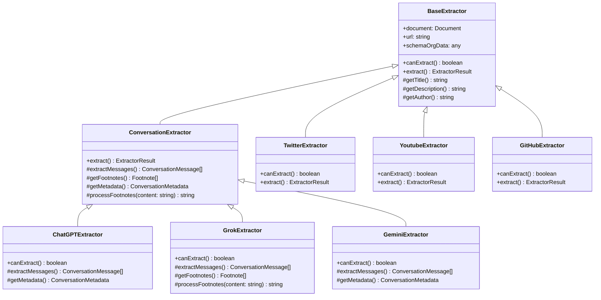
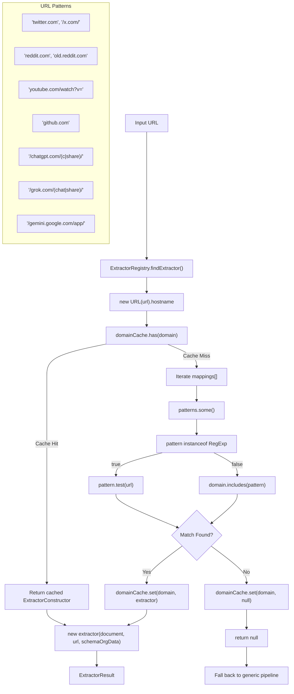

<!-- manual_reconstruction: DeepWiki TOC slug/title is "Platform-Specific Extractors", but the embedded Markdown H1 is "Site-Specific Extractors". Body copied from the Next.js markdown payload in raw/pages/6-platform-specific-extractors.html. -->

# Site-Specific Extractors

<details>
<summary>Relevant source files</summary>

The following files were used as context for generating this wiki page:

- [src/extractor-registry.ts](src/extractor-registry.ts)
- [src/extractors/_base.ts](src/extractors/_base.ts)
- [src/extractors/github.ts](src/extractors/github.ts)
- [src/extractors/grok.ts](src/extractors/grok.ts)
- [src/extractors/hackernews.ts](src/extractors/hackernews.ts)
- [src/extractors/reddit.ts](src/extractors/reddit.ts)
- [src/extractors/x-oembed.ts](src/extractors/x-oembed.ts)
- [src/extractors/youtube.ts](src/extractors/youtube.ts)
- [tests/youtube-transcript.test.ts](tests/youtube-transcript.test.ts)
- [website/src/convert.ts](website/src/convert.ts)

</details>


Site-specific extractors provide specialized content processing for popular websites and platforms that require custom logic beyond the generic content extraction pipeline. These extractors handle the unique DOM structures, content patterns, and metadata formats specific to different sites.

The extractor system allows Defuddle to extract structured content from social media platforms, AI chat interfaces, code repositories, and other specialized web applications that don't follow standard content markup patterns. For details on the registry mechanism that matches URLs to extractors, see [Extractor Registry](#5.1). For specific extractor implementations, see [Social Media Extractors](#5.2), [AI Chat Extractors](#5.3), and [Code Repository Extractors](#5.4).

## Extractor System Architecture

The site-specific extractor system operates through a registry pattern that matches incoming URLs to appropriate specialized extractors. When the main Defuddle parser encounters a URL, it first checks the `ExtractorRegistry` to determine if a site-specific extractor should handle the content instead of the generic pipeline.

### Extractor Class Hierarchy



*Sources: [src/extractor-registry.ts:1-145](), [src/extractors/grok.ts:1-163]()*

### URL Pattern Matching Flow



*Sources: [src/extractor-registry.ts:103-137]()*

## Extractor Registration System

The `ExtractorRegistry` class manages the mapping between URL patterns and extractor classes. Each extractor is registered with an array of patterns that can include both string domain names and regular expressions for more complex URL matching.

### Registration Patterns

| Extractor | Pattern Type | Patterns |
|-----------|--------------|----------|
| `TwitterExtractor` | String + RegExp | `'twitter.com'`, `/\/x\.com\/.*/` |
| `RedditExtractor` | String + RegExp | `'reddit.com'`, `'old.reddit.com'`, `/^https:\/\/[^\/]+\.reddit\.com/` |
| `YoutubeExtractor` | String + RegExp | `'youtube.com'`, `'youtu.be'`, `/youtube\.com\/watch\?v=.*/` |
| `GitHubExtractor` | String + RegExp | `'github.com'`, `/^https?:\/\/github\.com\/.*/` |
| `ChatGPTExtractor` | RegExp | `/^https?:\/\/chatgpt\.com\/(c\|share)\/.*/` |
| `GrokExtractor` | RegExp | `/^https?:\/\/grok\.com\/(chat\|share)(\/.*)?$/` |
| `GeminiExtractor` | RegExp | `/^https?:\/\/gemini\.google\.com\/app\/.*/` |

*Sources: [src/extractor-registry.ts:25-97]()*

### Caching Mechanism

The registry implements a domain-based cache (`domainCache: Map<string, ExtractorConstructor | null>`) to avoid repeated pattern matching for the same domain. The cache stores either the matched extractor constructor or `null` for domains with no matching extractor.

```typescript
// Cache lookup in findExtractor method
if (this.domainCache.has(domain)) {
    const cachedExtractor = this.domainCache.get(domain);
    return cachedExtractor ? new cachedExtractor(document, url, schemaOrgData) : null;
}
```

*Sources: [src/extractor-registry.ts:107-111]()*

## Base Extractor Classes

### BaseExtractor

The `BaseExtractor` abstract class provides the foundation for all site-specific extractors. It defines the core interface that all extractors must implement:

- `canExtract(): boolean` - Determines if the extractor can process the current document
- `extract(): ExtractorResult` - Performs the content extraction and returns structured data
- Protected helper methods for common metadata extraction tasks

### ConversationExtractor

The `ConversationExtractor` extends `BaseExtractor` to provide specialized functionality for chat-based platforms. It adds methods for extracting conversation messages, processing footnotes, and handling chat-specific metadata structures.

Key methods include:
- `extractMessages(): ConversationMessage[]` - Extracts individual messages from the conversation
- `getFootnotes(): Footnote[]` - Processes and returns footnote references
- `processFootnotes(content: string): string` - Converts links to footnote references

*Sources: [src/extractors/grok.ts:1-4](), [src/extractors/grok.ts:22-78]()*

## Content Processing Examples

### Footnote Processing in Conversation Extractors

The `GrokExtractor` demonstrates how conversation extractors process links and citations. The `processFootnotes` method converts inline links to numbered footnote references:

```typescript
private processFootnotes(content: string): string {
    const linkPattern = /<a\s+(?:[^>]*?\s+)?href="([^"]*)"[^>]*>(.*?)<\/a>/gi;
    
    return content.replace(linkPattern, (match, url, linkText) => {
        // Skip internal anchors and non-http URLs
        if (!url || url.startsWith('#') || !url.match(/^https?:\/\//i)) {
            return match;
        }
        
        // Create or reuse footnote reference
        let footnote = this.footnotes.find(fn => fn.url === url);
        // ... footnote processing logic
        
        return `${linkText}<sup id="fnref:${footnoteIndex}">
                <a href="#fn:${footnoteIndex}">${footnoteIndex}</a></sup>`;
    });
}
```

*Sources: [src/extractors/grok.ts:120-162]()*

The extractor system provides a clean separation between generic content processing and platform-specific extraction logic, allowing Defuddle to handle the diverse content structures found across modern web platforms while maintaining a consistent output format.
