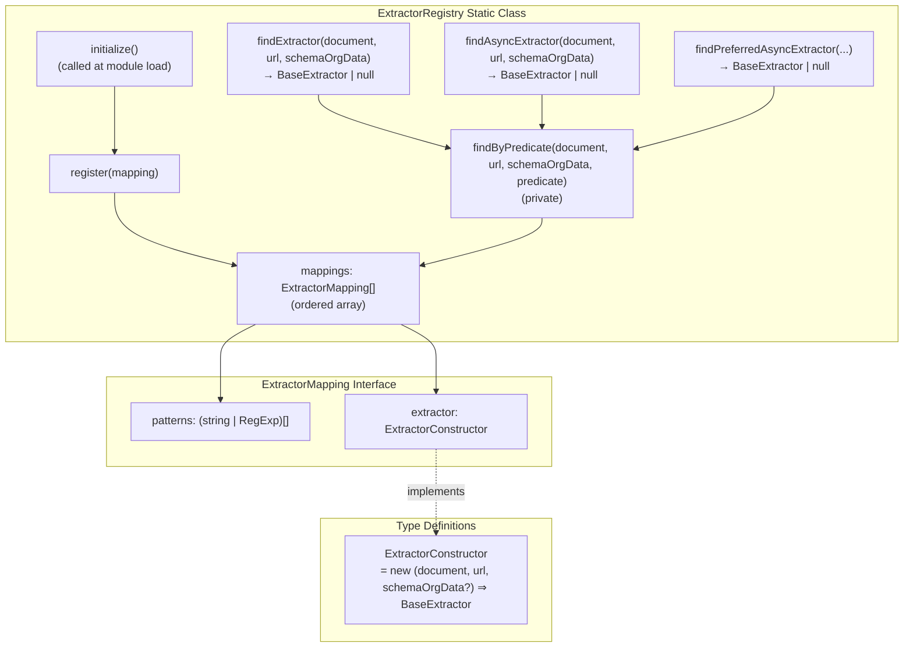
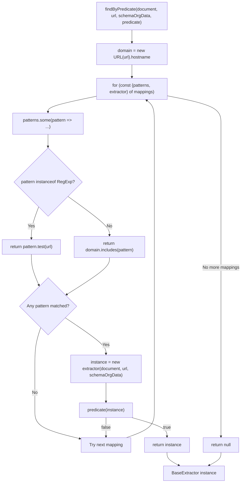
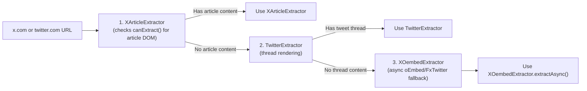

# Extractor Registry

<details>
<summary>Relevant source files</summary>

The following files were used as context for generating this wiki page:

- [src/extractor-registry.ts](src/extractor-registry.ts)
- [src/extractors/_base.ts](src/extractors/_base.ts)
- [src/extractors/grok.ts](src/extractors/grok.ts)
- [src/extractors/x-oembed.ts](src/extractors/x-oembed.ts)

</details>


The Extractor Registry is the central dispatch system that routes URLs to specialized content extractors based on URL patterns. It serves as the entry point for determining whether a given URL requires site-specific handling rather than generic content extraction processing.

For information about the individual extractor implementations, see [Social Media Extractors](#6.3), [AI Chat Extractors](#6.4), and [Code Repository Extractors](#6.5). For the overall platform-specific extraction process, see [Platform-Specific Extractors](#6).

## Registry Architecture

The `ExtractorRegistry` class operates as a static registry that maintains an ordered array of mappings between URL patterns and extractor constructor functions. The registry provides three finder methods that use predicate-based matching to select extractors based on their capabilities.

### ExtractorRegistry Class Structure



Sources: [src/extractor-registry.ts:16-21](), [src/extractor-registry.ts:23-24](), [src/extractor-registry.ts:26-117](), [src/extractor-registry.ts:123-164]()

### Finder Methods and Predicate Matching

The registry provides three finder methods that differ in the predicate they apply to instantiated extractors:

| Method | Predicate | Purpose |
|--------|-----------|---------|
| `findExtractor()` | `extractor.canExtract()` | Find extractor that can perform synchronous extraction |
| `findAsyncExtractor()` | `extractor.canExtractAsync()` | Find extractor that can perform asynchronous extraction |
| `findPreferredAsyncExtractor()` | `extractor.canExtractAsync() && extractor.prefersAsync()` | Find extractor that prefers async extraction over sync |

All three methods delegate to the private `findByPredicate()` method, which:
1. Extracts the domain from the URL
2. Iterates through the `mappings` array in order
3. Tests each pattern (string or RegExp) against the URL/domain
4. Instantiates the extractor constructor if patterns match
5. Tests the predicate on the instance
6. Returns the first extractor that satisfies the predicate

Sources: [src/extractor-registry.ts:123-133](), [src/extractor-registry.ts:135-164]()

## Pattern Matching System

The registry uses a two-tier matching system that combines domain-based string matching with regex pattern matching for more complex URL structures. The `findByPredicate()` method implements the matching logic.

### Pattern Matching Flow



**Pattern Matching Rules:**
- **String patterns**: Match if `domain.includes(pattern)` (e.g., `"twitter.com"` matches `"mobile.twitter.com"`)
- **RegExp patterns**: Match if `pattern.test(url)` (e.g., `/^https?:\/\/chatgpt\.com\/(c|share)\/.*/` tests the full URL)
- **First match wins**: The registry returns the first extractor whose patterns match AND whose predicate returns `true`

Sources: [src/extractor-registry.ts:135-164](), [src/extractor-registry.ts:142-148]()

## Extractor Registration Process

The registry initializes during module load via the `initialize()` method, which registers all supported extractors with their corresponding URL patterns. The **registration order is significant** because the first matching extractor is returned.

### Registration Order and Priority

A critical example of order-dependent behavior is the Twitter/X platform handling:



The comment in the code explicitly notes: "X Article extractor must be registered BEFORE Twitter to take priority" ([src/extractor-registry.ts:28-29]()). This allows DOM-based `canExtract()` to determine if the page has article content before falling through to the thread extractor.

Sources: [src/extractor-registry.ts:26-52](), [src/extractor-registry.ts:28-36]()

### Complete Extractor Registration Table

| Order | Extractor | Domain Patterns | Regex Patterns | Notes |
|-------|-----------|----------------|----------------|-------|
| 1 | `XArticleExtractor` | `x.com`, `twitter.com` | - | Must be first for X/Twitter URLs |
| 2 | `TwitterExtractor` | `twitter.com` | `/\/x\.com\/.*/` | Thread rendering |
| 3 | `XOembedExtractor` | `x.com`, `twitter.com` | - | Async fallback via oEmbed/FxTwitter |
| 4 | `RedditExtractor` | `reddit.com`, `old.reddit.com`, `new.reddit.com` | `/^https:\/\/[^\/]+\.reddit\.com/` | Handles subdomain variants |
| 5 | `YoutubeExtractor` | `youtube.com`, `youtu.be` | `/youtube\.com\/watch\?v=.*/`, `/youtu\.be\/.*/` | Transcript fetching |
| 6 | `HackerNewsExtractor` | - | `/news\.ycombinator\.com\/item\?id=.*/` | Story and comment threads |
| 7 | `ChatGPTExtractor` | - | `/^https?:\/\/chatgpt\.com\/(c\|share)\/.*/` | Conversation extraction |
| 8 | `ClaudeExtractor` | `claude.ai` | `/^https?:\/\/claude\.ai\/(chat\|share)\/.*/` | Conversation extraction |
| 9 | `GrokExtractor` | - | `/^https?:\/\/grok\.com\/(chat\|share)(\/.*)?$/` | Conversation with footnotes |
| 10 | `GeminiExtractor` | - | `/^https?:\/\/gemini\.google\.com\/app\/.*/` | Conversation with sources |
| 11 | `GitHubExtractor` | `github.com` | `/^https?:\/\/github\.com\/.*/` | Issues, PRs, discussions |

Sources: [src/extractor-registry.ts:30-116]()

## BaseExtractor Interface

All registered extractors implement the `BaseExtractor` abstract class, which defines the contract for extraction capabilities. The registry instantiates extractors with three parameters: `document`, `url`, and optional `schemaOrgData`.

### BaseExtractor Method Contract

```mermaid
graph TB
    subgraph "BaseExtractor Abstract Class"
        constructor["constructor(document: Document,<br/>url: string,<br/>schemaOrgData?: any)"]
        canExtract["canExtract(): boolean<br/>(abstract, must implement)"]
        extract["extract(): ExtractorResult<br/>(abstract, must implement)"]
        canExtractAsync["canExtractAsync(): boolean<br/>(default: false)"]
        extractAsync["extractAsync(): Promise&lt;ExtractorResult&gt;<br/>(default: calls extract())"]
        prefersAsync["prefersAsync(): boolean<br/>(default: false)"]
    end
    
    subgraph "Used by Registry"
        findExtractor["findExtractor()"] -.calls.-> canExtract
        findAsyncExtractor["findAsyncExtractor()"] -.calls.-> canExtractAsync
        findPreferredAsync["findPreferredAsyncExtractor()"] -.calls.-> canExtractAsync
        findPreferredAsync -.calls.-> prefersAsync
    end
    
    subgraph "Return Types"
        ExtractorResult["ExtractorResult {<br/>content: string,<br/>contentHtml: string,<br/>variables?: ExtractorVariables<br/>}"]
    end
    
    extract --> ExtractorResult
    extractAsync --> ExtractorResult
```

**Method Descriptions:**
- `canExtract()`: Returns `true` if the extractor can handle this document synchronously
- `extract()`: Performs synchronous extraction and returns the result
- `canExtractAsync()`: Returns `true` if the extractor can handle this document asynchronously
- `extractAsync()`: Performs asynchronous extraction (e.g., API calls, UI interaction)
- `prefersAsync()`: Returns `true` if async extraction provides strictly better results than sync extraction (e.g., YouTube transcripts)

Sources: [src/extractors/_base.ts:3-33](), [src/extractor-registry.ts:151-154]()

## Supported Platforms

The registry currently supports nine different platform categories through specialized extractors that extend the `BaseExtractor` class or its subclasses:

- **Social Media**: Twitter/X, Reddit, YouTube
- **Developer Platforms**: GitHub, Hacker News  
- **AI Chat Platforms**: ChatGPT, Claude, Grok, Gemini

Each extractor handles platform-specific DOM structures, content organization, and metadata extraction patterns. The registry pattern matching accommodates various URL formats including subdomain variations, path-specific patterns, and protocol variations.

Sources: [src/extractor-registry.ts:1-13](), [src/extractor-registry.ts:144-145]()
