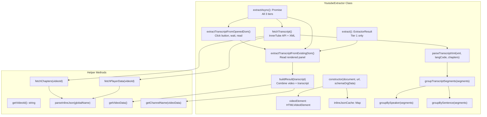
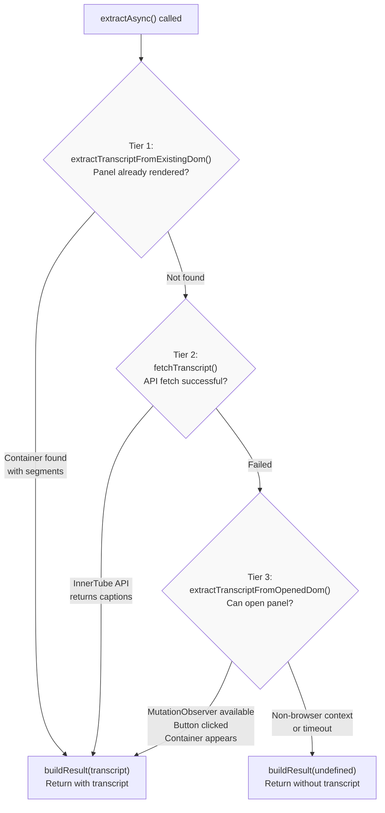
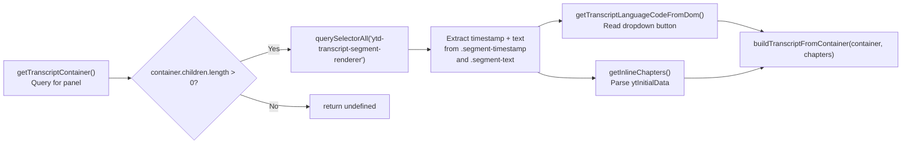
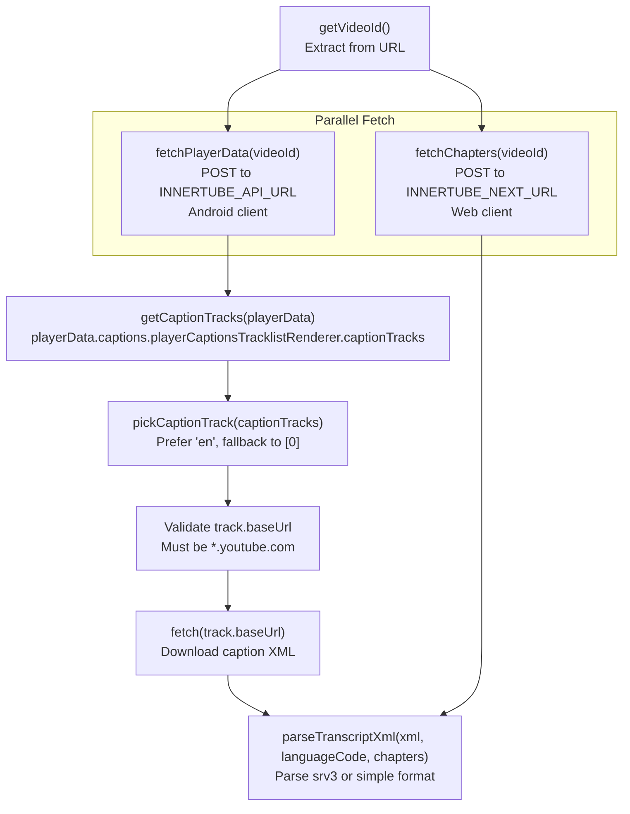
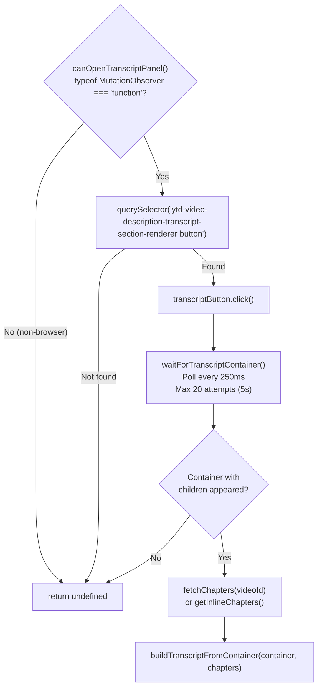
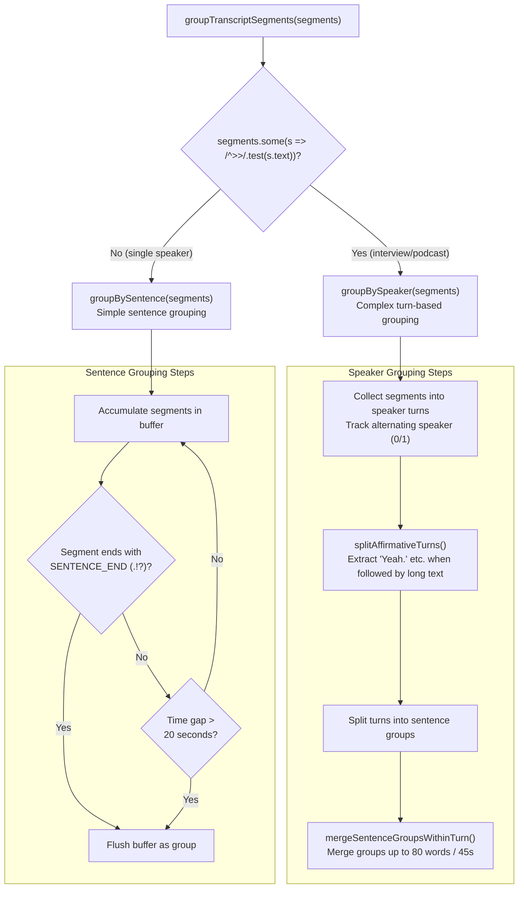
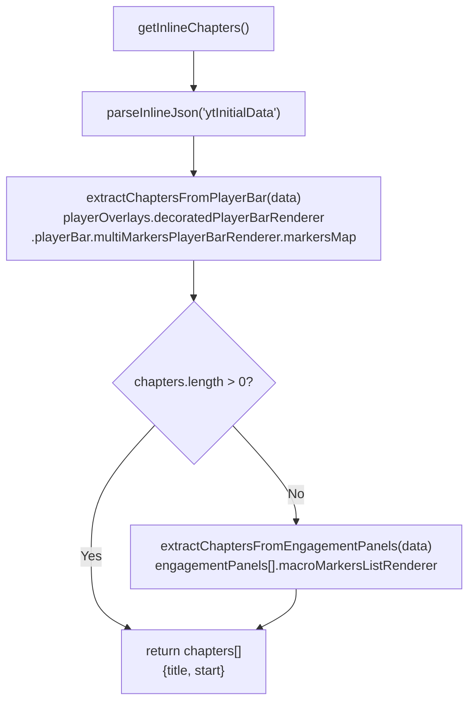
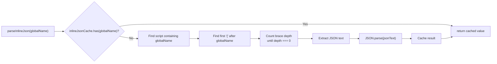

# YouTube Extractor

<details>
<summary>Relevant source files</summary>

The following files were used as context for generating this wiki page:

- [src/extractors/youtube.ts](src/extractors/youtube.ts)
- [tests/youtube-transcript.test.ts](tests/youtube-transcript.test.ts)
- [website/src/convert.ts](website/src/convert.ts)

</details>


## Purpose and Scope

The `YoutubeExtractor` class provides platform-specific extraction for YouTube videos, including video metadata, descriptions, chapters, and most notably, video transcripts. This extractor implements a sophisticated 3-tier fallback strategy to reliably fetch transcripts in various contexts (browser, server-side, API-blocked scenarios).

For general information about the extractor system, see [Extractor Registry](#6.1). For other platform extractors, see [Social Media Extractors](#6.3), [AI Chat Extractors](#6.4), and [Code Repository Extractors](#6.5).

**Sources:** [src/extractors/youtube.ts:1-850]()

---

## Architecture Overview

The `YoutubeExtractor` extends `BaseExtractor` and implements a multi-tier async extraction strategy optimized for transcript retrieval. The class maintains internal state including a video element reference, inline JSON cache for performance, and Schema.org data.



**Sources:** [src/extractors/youtube.ts:36-68]()

---

## Extraction Methods

### Synchronous vs Asynchronous Extraction

The extractor provides both synchronous and asynchronous extraction methods:

| Method | Returns | Tiers Used | Use Case |
|--------|---------|------------|----------|
| `extract()` | `ExtractorResult` | Tier 1 only | Browser with transcript already rendered |
| `extractAsync()` | `Promise<ExtractorResult>` | Tiers 1, 2, 3 | All contexts, maximum reliability |

The extractor indicates its preference via `prefersAsync()` returning `true`, signaling to the `Defuddle` orchestrator that it should use the async path when possible.

**Sources:** [src/extractors/youtube.ts:47-68]()

---

## 3-Tier Transcript Fetching Strategy

The async extraction implements a fallback cascade to handle various scenarios where transcripts may or may not be readily available.



**Sources:** [src/extractors/youtube.ts:63-68]()

### Tier 1: Existing DOM Extraction

Checks if the transcript panel is already rendered in the DOM (e.g., user opened it before extraction). Reads segments from `ytd-transcript-segment-renderer` elements.



**Sources:** [src/extractors/youtube.ts:123-176](), [src/extractors/youtube.ts:129-164]()

### Tier 2: InnerTube API Fetch

Fetches captions directly from YouTube's unofficial InnerTube API using Android client context. This is the most reliable method when the DOM doesn't already contain the transcript.



The `fetchPlayerData()` method tries the API first, then falls back to inline page data (`ytInitialPlayerResponse`) if the API call fails.

**Sources:** [src/extractors/youtube.ts:335-381](), [src/extractors/youtube.ts:428-457](), [src/extractors/youtube.ts:459-485]()

#### InnerTube API Constants

| Constant | Value | Purpose |
|----------|-------|---------|
| `INNERTUBE_API_URL` | `https://www.youtube.com/youtubei/v1/player` | Player API endpoint for caption track URLs |
| `INNERTUBE_CLIENT_VERSION` | `20.10.38` | Android client version |
| `INNERTUBE_USER_AGENT` | `com.google.android.youtube/20.10.38 (Linux; U; Android 14)` | User agent for API requests |
| `INNERTUBE_NEXT_URL` | `https://www.youtube.com/youtubei/v1/next` | Next API endpoint for chapters |
| `INNERTUBE_CONTEXT` | `{ client: { clientName: 'ANDROID', ... } }` | Android client context |
| `INNERTUBE_WEB_CONTEXT` | `{ client: { clientName: 'WEB', ... } }` | Web client context for chapters |

**Sources:** [src/extractors/youtube.ts:15-32]()

### Tier 3: UI Interaction Fallback

As a last resort in browser contexts, programmatically clicks the transcript button and waits for the panel to populate. This handles cases where the API is blocked or returns no captions but the UI transcript is available.



**Sources:** [src/extractors/youtube.ts:178-180](), [src/extractors/youtube.ts:383-426]()

---

## Transcript Processing

### XML Format Parsing

YouTube provides transcripts in two XML formats. The `parseTranscriptXml()` method handles both:

#### srv3 Format (Word-Level Timing)

```xml
<timedtext>
  <body>
    <p t="0" d="5000"><s>Hello </s><s>world.</s></p>
    <p t="5000" d="3000"><s>Second line.</s></p>
  </body>
</timedtext>
```

- `<p>` elements have `t` (start time in ms) and `d` (duration in ms)
- `<s>` elements contain individual words or phrases
- Words within a `<p>` are concatenated to form the segment text

#### Simple Format (Phrase-Level Timing)

```xml
<transcript>
  <text start="0" dur="5">Hello world.</text>
  <text start="5.5" dur="3">Second line.</text>
</transcript>
```

- `<text>` elements have `start` and `dur` attributes in seconds
- Content is the full phrase text

The parser also decodes HTML entities including numeric entities (e.g., `&#39;`, `&#x2019;`).

**Sources:** [src/extractors/youtube.ts:547-608]()

### Segment Grouping

Raw transcript segments are grouped into readable blocks using two strategies depending on whether speaker markers (`>>`) are present.



**Sources:** [src/extractors/youtube.ts:618-849]()

### Speaker Turn Detection

When speaker markers (`>>`) are detected, the extractor performs sophisticated turn management:

#### Speaker Change Detection

Only treats `>>` as a real speaker change if the previous segment ended at a sentence boundary (not mid-sentence). This avoids false positives from auto-caption artifacts.

```typescript
const prevEndsWithComma = /,\s*$/.test(prevSegText);
const prevEndedSentence = (SENTENCE_END.test(prevSegText) || !prevSegText) && !prevEndsWithComma;
const isRealSpeakerChange = isSpeakerChange && prevEndedSentence;
```

**Sources:** [src/extractors/youtube.ts:640-668]()

#### Affirmative Response Splitting

Detects short affirmative responses (e.g., "Yeah.", "Mhm.") at the start of a turn followed by substantial content (30+ words). Splits these into separate turns assuming the affirmative belongs to the previous speaker and the rest is a new speaker (common in auto-caption diarization errors).

**Sources:** [src/extractors/youtube.ts:693-743]()

#### Turn Merging Parameters

| Constant | Value | Purpose |
|----------|-------|---------|
| `SENTENCE_END` | `/[.!?]["'\u2019\u201D)]*\s*$/` | Pattern for sentence-ending punctuation |
| `QUESTION_END` | `/\?["'\u2019\u201D)]*\s*$/` | Pattern for question marks (prevents merging) |
| `TRANSCRIPT_GROUP_GAP_SECONDS` | `20` | Max gap before forcing a sentence break |
| `TURN_MERGE_MAX_WORDS` | `80` | Max words when merging groups in a turn |
| `TURN_MERGE_MAX_SPAN_SECONDS` | `45` | Max time span when merging groups |
| `SHORT_UTTERANCE_MAX_WORDS` | `3` | Threshold for standalone short utterances |
| `FIRST_GROUP_MERGE_MIN_WORDS` | `8` | Min words in first group before merging |

**Sources:** [src/extractors/youtube.ts:7-13](), [src/extractors/youtube.ts:745-805]()

### Transcript Output Format

The `buildTranscript()` utility function (from `src/utils/transcript.ts`) converts grouped segments into HTML and plain text. For YouTube:

**Plain Text Format:**
```
**0:00** · Hello world.
**0:05** · Second sentence.

**0:15** · Different speaker turn.
```

**HTML Format:**
```html
<div class="youtube transcript">
  <h2>Transcript</h2>
  <p class="transcript-segment">
    <span class="timestamp" data-seconds="0">0:00</span> · Hello world.
  </p>
  <!-- Blank line (separate <p>) for speaker changes -->
  <p class="transcript-segment">
    <span class="timestamp" data-seconds="15">0:15</span> · Different speaker turn.
  </p>
</div>
```

**Sources:** [src/extractors/youtube.ts:157-158](), [src/extractors/youtube.ts:593-595]()

---

## Chapter Extraction

YouTube videos may have chapters from two sources: explicit chapters in the player bar or auto-generated "Key moments" from description timestamps.



### Chapter Data Structures

**Player Bar Chapters (Explicit):**
- Located in `markersMap[].value.chapters[].chapterRenderer`
- Have `title.simpleText` and `timeRangeStartMillis`

**Engagement Panel Chapters (Auto-generated):**
- Located in `engagementPanels[].macroMarkersListRenderer.contents[].macroMarkersListItemRenderer`
- Have `title.simpleText` and `timeDescription.simpleText` (needs parsing with `parseTimestamp()`)

**Sources:** [src/extractors/youtube.ts:113-121](), [src/extractors/youtube.ts:487-537]()

---

## Metadata Extraction

### Video Data

Video metadata is extracted from Schema.org structured data passed to the constructor. The `getVideoData()` method searches for a `VideoObject` type in the schema data.

**Sources:** [src/extractors/youtube.ts:225-233]()

### Channel Name Extraction

Channel name extraction uses a multi-source fallback strategy:

```mermaid
graph TD
    GetChannelName["getChannelName(videoData)"]
    
    TryDom["getChannelNameFromDom()<br/>Query selectors"]
    CheckDomResult{"Found?"}
    
    TryPlayer["getChannelNameFromPlayerResponse()<br/>ytInitialPlayerResponse"]
    CheckPlayerResult{"Found?"}
    
    TrySchema["videoData?.author<br/>(Schema.org)"]
    
    DomSelectors["'ytd-video-owner-renderer #channel-name a[href^=\"/@\"]'<br/>'#owner-name a[href^=\"/@\"]'"]
    DomMicrodata["getChannelNameFromMicrodata()<br/>[itemprop='author'] meta/link[itemprop='name']"]
    
    PlayerVideoDetails["data.videoDetails.author<br/>data.videoDetails.ownerChannelName"]
    PlayerMicroformat["data.microformat.playerMicroformatRenderer.ownerChannelName"]
    
    GetChannelName --> TryDom
    TryDom --> DomSelectors
    DomSelectors --> CheckDomResult
    CheckDomResult -->|"No"| DomMicrodata
    DomMicrodata --> CheckDomResult
    CheckDomResult -->|"Yes"| Return["return name"]
    CheckDomResult -->|"No"| TryPlayer
    
    TryPlayer --> PlayerVideoDetails
    PlayerVideoDetails --> CheckPlayerResult
    CheckPlayerResult -->|"No"| PlayerMicroformat
    PlayerMicroformat --> CheckPlayerResult
    CheckPlayerResult -->|"Yes"| Return
    CheckPlayerResult -->|"No"| TrySchema
    TrySchema --> Return
```

**Sources:** [src/extractors/youtube.ts:235-295]()

### Description Formatting

The video description is extracted from Schema.org data and formatted with line breaks converted to `<br>` tags:

```typescript
private formatDescription(description: string): string {
  return `<p>${description.replace(/\n/g, '<br>')}</p>`;
}
```

**Sources:** [src/extractors/youtube.ts:221-223]()

---

## Inline JSON Parsing

YouTube embeds configuration data in `<script>` tags as global variables like `ytInitialPlayerResponse` and `ytInitialData`. The `parseInlineJson()` method extracts these with manual JSON parsing to handle edge cases.



**Sources:** [src/extractors/youtube.ts:297-333]()

---

## Result Format

The `buildResult()` method constructs the final `ExtractorResult` combining video metadata, description, and transcript.

### Content Structure

```html
<iframe width="560" height="315" 
        src="https://www.youtube.com/embed/{videoId}" 
        title="YouTube video player" 
        frameborder="0" 
        allow="accelerometer; autoplay; clipboard-write; encrypted-media; gyroscope; picture-in-picture; web-share" 
        referrerpolicy="strict-origin-when-cross-origin" 
        allowfullscreen>
</iframe>

<p>Video description with<br>line breaks preserved</p>

<div class="youtube transcript">
  <h2>Transcript</h2>
  <!-- Transcript segments -->
</div>
```

### Variables Object

| Variable | Source | Description |
|----------|--------|-------------|
| `title` | `videoData.name` | Video title |
| `author` | `getChannelName()` | Channel name |
| `site` | hardcoded | `"YouTube"` |
| `image` | `videoData.thumbnailUrl[0]` | Thumbnail URL |
| `published` | `videoData.uploadDate` | Upload date (ISO format) |
| `description` | `videoData.description` (first 200 chars) | Video description snippet |
| `transcript` | `transcript.text` | Plain text transcript (if available) |
| `language` | `transcript.languageCode` | Transcript language code (if available) |

### Extracted Content

The `extractedContent` object contains:
- `videoId`: Extracted from URL
- `author`: Channel name

**Sources:** [src/extractors/youtube.ts:182-219]()

---

## Usage in Defuddle Pipeline

The `YoutubeExtractor` is automatically selected by `ExtractorRegistry` when processing YouTube URLs. Because it returns `prefersAsync() === true`, the `Defuddle` orchestrator will call `extractAsync()` instead of `extract()` when using `parseAsync()`.

Example flow through the web service:

1. User requests: `GET https://defuddle.md/https://www.youtube.com/watch?v=abc123`
2. `convertToMarkdown()` fetches the page HTML
3. `defuddleHtmlAsync()` creates a `Defuddle` instance
4. `Defuddle.parseAsync()` detects YouTube URL and instantiates `YoutubeExtractor`
5. `YoutubeExtractor.extractAsync()` runs the 3-tier fallback
6. Transcript is parsed, grouped, and formatted
7. Result is returned with video metadata, description, and transcript

**Sources:** [website/src/convert.ts:136-193]()

---

## Testing

The extractor includes comprehensive tests covering:

- XML parsing for both srv3 and simple formats
- HTML entity decoding (including numeric entities)
- Segment grouping by speaker turns and sentences
- Speaker change detection with false positive handling
- Affirmative response splitting
- Turn merging with word count and time span limits
- Chapter extraction from player bar and engagement panels
- Language code preservation across extraction tiers
- Fallback behavior when API fails
- Non-browser context detection (skips UI interaction tier)

**Sources:** [tests/youtube-transcript.test.ts:1-458]()
