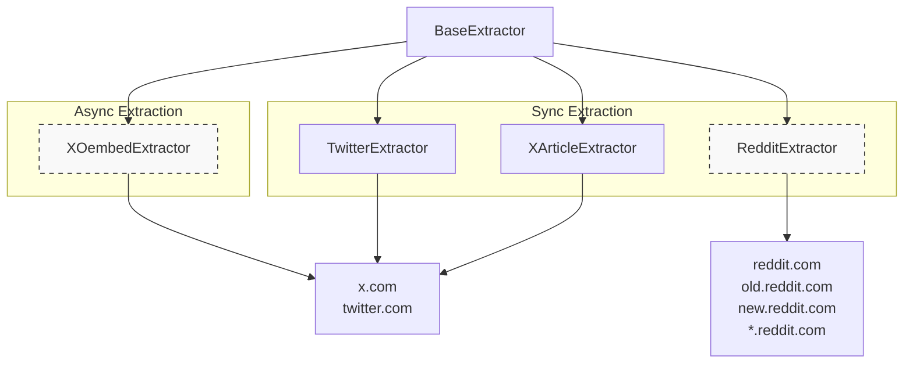
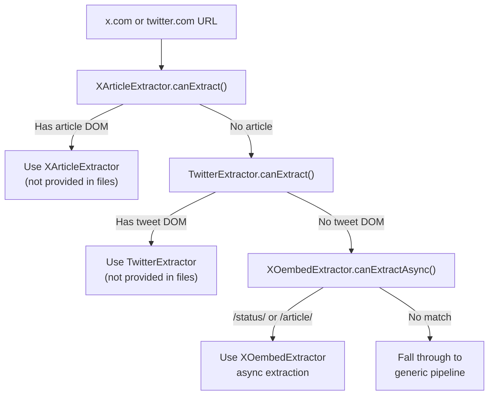
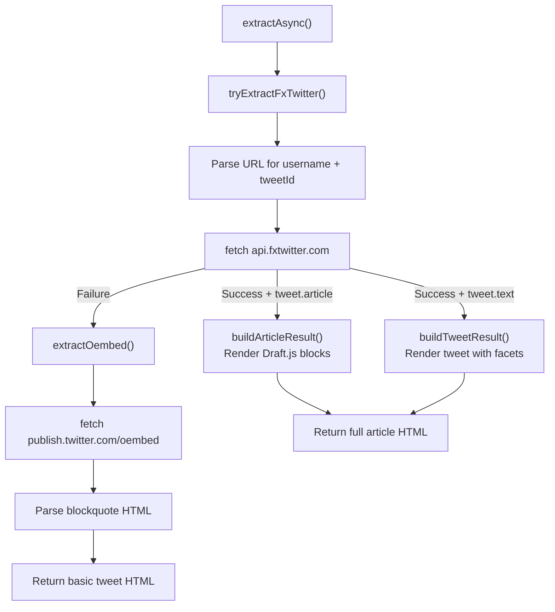
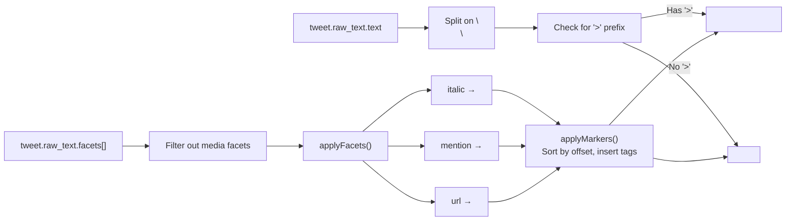
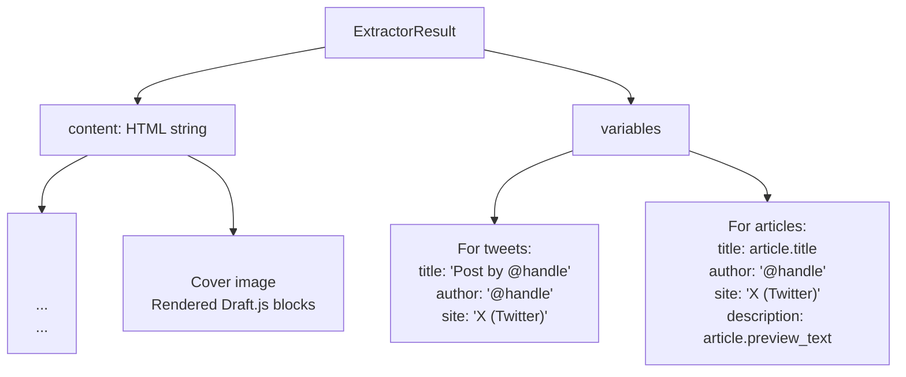
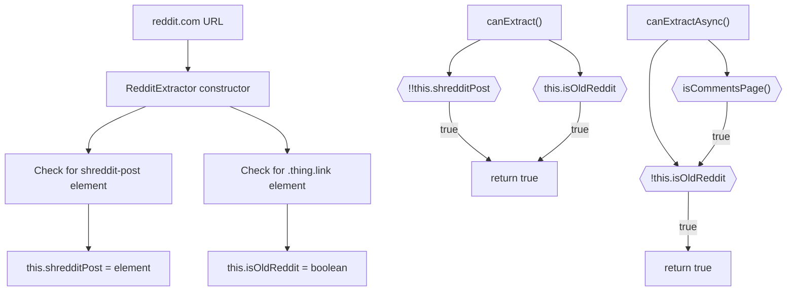
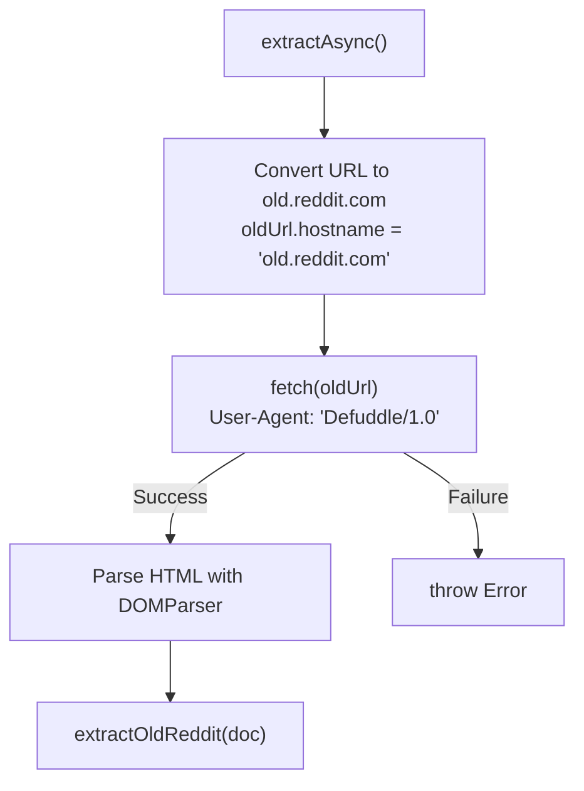
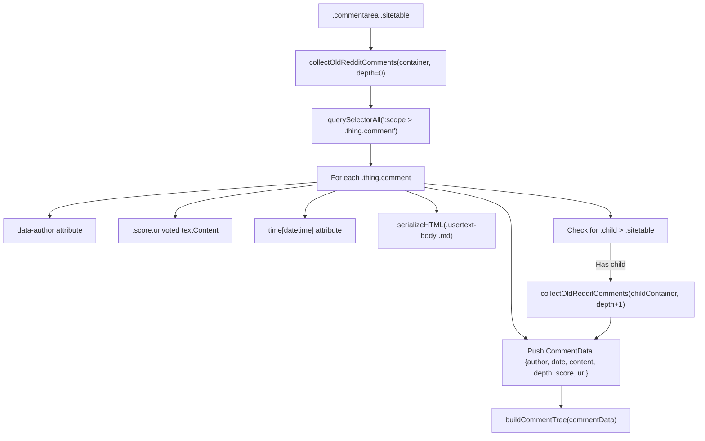
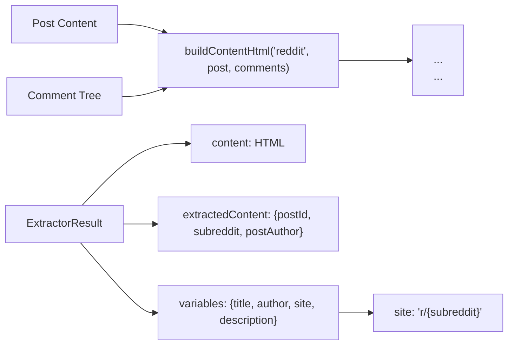

# Social Media Extractors

<details>
<summary>Relevant source files</summary>

The following files were used as context for generating this wiki page:

- [src/extractor-registry.ts](src/extractor-registry.ts)
- [src/extractors/_base.ts](src/extractors/_base.ts)
- [src/extractors/github.ts](src/extractors/github.ts)
- [src/extractors/grok.ts](src/extractors/grok.ts)
- [src/extractors/hackernews.ts](src/extractors/hackernews.ts)
- [src/extractors/reddit.ts](src/extractors/reddit.ts)
- [src/extractors/x-oembed.ts](src/extractors/x-oembed.ts)

</details>


This document covers the specialized extractors for social media platforms Twitter/X and Reddit. These extractors handle platform-specific content structures and provide standardized extraction of posts, threads, comments, and associated metadata.

For information about other specialized extractors, see [YouTube Extractor](6.2) for video transcripts, [AI Chat Extractors](6.4) for ChatGPT, Claude, Gemini, and Grok, and [Code Repository Extractors](6.5) for GitHub and Hacker News. For how these extractors are registered and matched to URLs, see [Extractor Registry](6.1).

## Architecture Overview

Social media extractors inherit from `BaseExtractor` and implement platform-specific logic for content extraction. The system provides three specialized extractors for Twitter/X (to handle different content types and availability scenarios) and one for Reddit (with dual-path old/new Reddit support).

### Extractor Priority and Registration

The `ExtractorRegistry` maintains an ordered list of extractors, checking each in sequence until one's `canExtract()` method returns true. For Twitter/X URLs, **priority matters**: `XArticleExtractor` is checked first to handle article-format posts, then `TwitterExtractor` for standard tweets, and finally `XOembedExtractor` as an async fallback when DOM-based extraction fails.

Sources: [src/extractor-registry.ts:23-52](), [src/extractor-registry.ts:123-164]()

### Class Hierarchy and URL Patterns



**Note**: `RedditExtractor` supports both sync (`extract()`) and async (`extractAsync()`) paths. `XOembedExtractor` is async-only—its `canExtract()` always returns false.

Sources: [src/extractor-registry.ts:6-14](), [src/extractor-registry.ts:30-62](), [src/extractors/_base.ts:1-33]()

## Twitter/X Extractors

Twitter/X content extraction uses a **three-tier priority system** with different extractors handling different content types and availability scenarios. The registry checks extractors in order: `XArticleExtractor` → `TwitterExtractor` → `XOembedExtractor`.

### Extractor Selection Flow



**Priority Explanation**: `XArticleExtractor` must be registered before `TwitterExtractor` because both match x.com/twitter.com domains. The article extractor's `canExtract()` method checks for article-specific DOM elements, allowing it to take priority when present.

Sources: [src/extractor-registry.ts:28-52](), [src/extractors/x-oembed.ts:96-109]()

### XOembedExtractor: Async Fallback Extraction

`XOembedExtractor` provides async extraction when DOM-based extractors cannot run (e.g., server-side rendered HTML without client-side hydration). It is **async-only**: `canExtract()` returns `false`, and `canExtractAsync()` returns `true` for URLs matching `/status/` or `/article/` patterns.

#### XOembedExtractor Extraction Strategy

The extractor uses a **two-tier fallback** system:



**FxTwitter Advantages**: The FxTwitter API provides full tweet text (no truncation), raw text with facets (mentions, URLs, italic), and complete article content in Draft.js format. The oEmbed API truncates long tweets but is always available.

Sources: [src/extractors/x-oembed.ts:107-120](), [src/extractors/x-oembed.ts:182-199](), [src/extractors/x-oembed.ts:122-180]()

#### Article Rendering from Draft.js Format

X articles use Draft.js content representation. `XOembedExtractor` converts this to HTML:

| Draft.js Block Type | HTML Output | Handler Method |
|---------------------|-------------|----------------|
| `unstyled` | `<p>` | `renderBlock()` |
| `header-two` | `<h2>` | `renderBlock()` |
| `header-three` | `<h3>` | `renderBlock()` |
| `unordered-list-item` | `<ul><li>` (grouped) | `renderArticle()` |
| `atomic` + `MEDIA` entity | `<figure><figcaption>` | `renderAtomicBlock()` |
| `atomic` + `MARKDOWN` entity | `<pre><code>` | `renderAtomicBlock()` |

**Inline Styling**: The extractor processes `inlineStyleRanges` (bold), `entityRanges` (links), and `data.mentions`/`data.urls` to apply HTML tags via a marker-based system (`applyMarkers()`).

Sources: [src/extractors/x-oembed.ts:357-392](), [src/extractors/x-oembed.ts:394-444](), [src/extractors/x-oembed.ts:446-485]()

#### Tweet Rendering with Facets

For standard tweets (not articles), `XOembedExtractor` uses `tweet.raw_text.facets` to apply formatting:



**Media Handling**: Photos from `tweet.media.photos[]` are appended as `` tags after the text content.

Sources: [src/extractors/x-oembed.ts:251-301](), [src/extractors/x-oembed.ts:330-355](), [src/extractors/x-oembed.ts:303-328]()

#### XOembedExtractor Output Structure



Sources: [src/extractors/x-oembed.ts:217-249](), [src/extractors/x-oembed.ts:235-249](), [src/extractors/x-oembed.ts:157-179]()

## RedditExtractor: Dual-Path Extraction

`RedditExtractor` handles both old.reddit.com and new Reddit (www.reddit.com). It implements **both sync and async extraction paths** to handle different content availability scenarios.

### Reddit Content Detection Strategy



**Why Two Paths?** New Reddit's server-side HTML includes `shreddit-post` elements but **not** `shreddit-comment` elements (those require client-side JavaScript). When sync extraction detects missing comments, it returns empty content, causing `parseAsync()` to fall through to `extractAsync()`.

Sources: [src/extractors/reddit.ts:10-18](), [src/extractors/reddit.ts:16-29](), [src/extractors/reddit.ts:56-68]()

### Async Extraction: Old Reddit Fallback

When new Reddit lacks comment data, `extractAsync()` fetches old.reddit.com:



Sources: [src/extractors/reddit.ts:31-54]()

### Old Reddit Comment Extraction

Old Reddit uses a nested `.sitetable > .thing.comment` structure with depth indicated by child containers:



Sources: [src/extractors/reddit.ts:169-199](), [src/extractors/reddit.ts:96-126]()

### New Reddit Comment Extraction

New Reddit uses `shreddit-comment` custom elements with `depth` attributes:

| Attribute/Element | Purpose | Example |
|-------------------|---------|---------|
| `depth` attribute | Nesting level | `"0"`, `"1"`, `"2"` |
| `author` attribute | Comment author | `"username"` |
| `score` attribute | Vote count | `"42"` |
| `created` attribute | ISO timestamp | `"2024-01-15T12:00:00Z"` |
| `[slot="comment"]` | Comment HTML | Rich content container |

**Processing Flow**: Query all `shreddit-comment` elements, extract metadata from attributes, serialize `[slot="comment"]` HTML, build comment tree using `buildCommentTree()` utility.

Sources: [src/extractors/reddit.ts:140-228]()

### Reddit Content Assembly

Both old and new Reddit paths produce the same output structure:



Sources: [src/extractors/reddit.ts:70-94](), [src/extractors/reddit.ts:111-125](), [src/extractors/reddit.ts:136-138]()

### RedditExtractor URL Parsing

The extractor extracts metadata directly from the URL structure:

```typescript
// Post ID from URL: /r/subreddit/comments/POST_ID/title
private getPostId(): string {
    const match = this.url.match(/comments\/([a-zA-Z0-9]+)/);
    return match?.[1] || '';
}

// Subreddit from URL: /r/SUBREDDIT/...
private getSubreddit(): string {
    const match = this.url.match(/\/r\/([^/]+)/);
    return match?.[1] || '';
}
```

Sources: [src/extractors/reddit.ts:145-157]()

## Integration with Extractor Registry

Social media extractors are automatically registered and matched based on URL patterns. The registry identifies URLs matching social media domains and instantiates the appropriate extractor class.

### URL Pattern Matching

| Platform | URL Patterns | Extractor Class |
|----------|--------------|-----------------|
| Twitter/X | `twitter.com/*`, `x.com/*` | `TwitterExtractor` |
| YouTube | `youtube.com/watch*`, `youtu.be/*` | `YoutubeExtractor` |

Sources: [src/extractors/twitter.ts:4](), [src/extractors/youtube.ts:4]()

## Common Features

Both social media extractors share common patterns inherited from `BaseExtractor`:

- **Schema.org Integration**: Leverage structured data when available
- **Metadata Standardization**: Consistent variable naming across platforms  
- **HTML Output**: Structured HTML with semantic class names
- **Error Handling**: Graceful degradation when content is not found
- **URL Validation**: `canExtract()` method validates extraction capability

The social media extractors provide platform-optimized content extraction while maintaining consistent output formats for downstream processing by the main Defuddle pipeline.

Sources: [src/extractors/_base.ts:1](), [src/extractors/twitter.ts:41-43](), [src/extractors/youtube.ts:14-16]()
