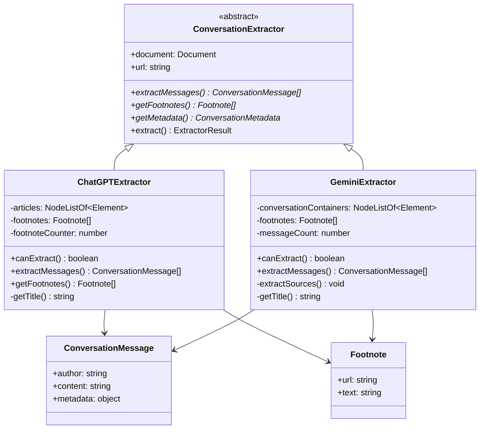
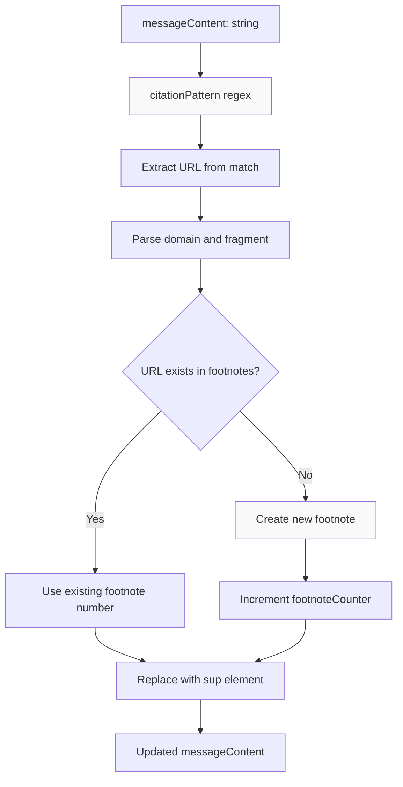
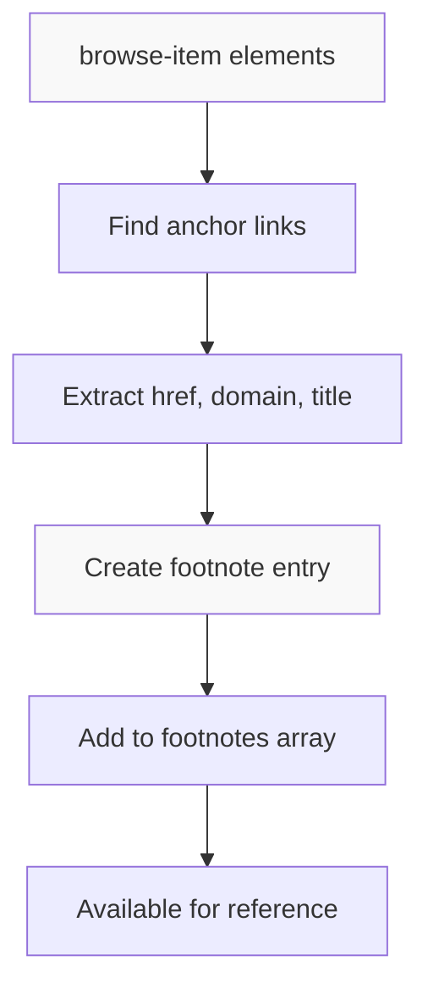

# AI Chat Extractors

<details>
<summary>Relevant source files</summary>

The following files were used as context for generating this wiki page:

- [src/elements/footnotes.ts](src/elements/footnotes.ts)
- [src/elements/images.ts](src/elements/images.ts)
- [src/extractor-registry.ts](src/extractor-registry.ts)
- [src/extractors/_base.ts](src/extractors/_base.ts)
- [src/extractors/chatgpt.ts](src/extractors/chatgpt.ts)
- [src/extractors/gemini.ts](src/extractors/gemini.ts)
- [src/extractors/grok.ts](src/extractors/grok.ts)
- [src/extractors/twitter.ts](src/extractors/twitter.ts)
- [src/extractors/x-oembed.ts](src/extractors/x-oembed.ts)

</details>


This page documents the specialized extractors for AI chat platforms that handle conversation-based content with structured message flows, citations, and platform-specific DOM patterns. These extractors parse conversations from AI chatbots like ChatGPT and Gemini into standardized conversation formats.

For information about the registry system that routes URLs to these extractors, see [Extractor Registry](#5.1). For other conversation-based platforms like social media, see [Social Media Extractors](#5.2).

## Overview

AI chat extractors handle platforms where content is structured as conversations between users and AI assistants. Unlike traditional article content, these platforms require specialized parsing of message threads, author identification, and citation processing.

The AI chat extractors extend the `ConversationExtractor` base class and implement platform-specific DOM parsing logic to extract structured conversation data.

## AI Chat Extractor Architecture



Sources: [src/extractors/chatgpt.ts:1-4](), [src/extractors/gemini.ts:1-4]()

## ChatGPT Extractor

The `ChatGPTExtractor` class handles ChatGPT conversation pages by parsing article elements that contain individual conversation turns.

### DOM Structure Processing

The extractor targets specific DOM patterns used by ChatGPT:

| Element | Purpose | Selector |
|---------|---------|----------|
| Article containers | Individual conversation turns | `article[data-testid^="conversation-turn-"]` |
| Author headings | Speaker identification | `h5.sr-only, h6.sr-only` |
| Author roles | Role metadata | `[data-message-author-role]` |
| Citation spans | Inline references | `span` containing `a[target=_blank][rel=noopener]` |

### Citation Processing



The ChatGPT extractor implements sophisticated citation processing using regex pattern matching to identify and replace inline citation elements with numbered footnote references:

Sources: [src/extractors/chatgpt.ts:54-102]()

### Message Extraction Process

The `extractMessages()` method processes each article element to extract conversation messages:

1. **Author Extraction**: Retrieves author text from screen reader elements and cleans formatting
2. **Role Identification**: Gets author role from `data-message-author-role` attribute
3. **Content Processing**: Removes zero-width spaces and unwanted elements
4. **Citation Replacement**: Converts inline citations to footnote references
5. **Content Cleanup**: Removes empty paragraph tags

Sources: [src/extractors/chatgpt.ts:20-119]()

## Gemini Extractor

The `GeminiExtractor` class handles Google Gemini conversation pages with a different DOM structure focused on conversation containers.

### DOM Structure Processing

| Element | Purpose | Selector |
|---------|---------|----------|
| Conversation containers | Conversation boundaries | `div.conversation-container` |
| User queries | User input | `user-query .query-text` |
| Model responses | AI responses | `model-response .markdown` |
| Extended responses | Long-form responses | `#extended-response-markdown-content` |
| Browse items | Source citations | `browse-item` |

### Source Extraction

The Gemini extractor processes source references differently from ChatGPT, extracting them from dedicated `browse-item` elements:



Sources: [src/extractors/gemini.ts:72-92]()

### Message Processing

The `extractMessages()` method handles the Gemini-specific conversation structure:

1. **User Queries**: Extracts content from `user-query` elements with `.query-text` selectors
2. **Model Responses**: Processes both regular and extended response content
3. **Table Content Handling**: Removes conflicting CSS classes that would trigger content removal
4. **Source Extraction**: Calls `extractSources()` to process citation references

Sources: [src/extractors/gemini.ts:19-70]()

## Conversation Message Format

Both extractors produce messages conforming to the `ConversationMessage` interface:

```typescript
interface ConversationMessage {
    author: string;      // "You", "ChatGPT", "Gemini", etc.
    content: string;     // HTML content of the message
    metadata: {
        role: string;    // "user", "assistant", "unknown"
    };
}
```

## Metadata and Title Extraction

Both extractors implement title extraction with fallback strategies:

| Priority | ChatGPT | Gemini |
|----------|---------|--------|
| 1 | Document title (if not "ChatGPT") | Document title (if not "Gemini") |
| 2 | First user message (truncated) | Research title from `.title-text` |
| 3 | "ChatGPT Conversation" | First user query (truncated) |
| 4 | - | "Gemini Conversation" |

The extractors also provide conversation metadata including message count and platform identification.

Sources: [src/extractors/chatgpt.ts:138-154](), [src/extractors/gemini.ts:110-128]()

## Extractor Registration

These extractors are registered in the extractor registry system to handle specific URL patterns:

- **ChatGPT**: `chatgpt.com/(c|share)/*` patterns
- **Gemini**: `gemini.google.com/app/*` patterns

The registry automatically routes matching URLs to the appropriate extractor based on domain and path patterns.

Sources: [src/extractors/chatgpt.ts:1-155](), [src/extractors/gemini.ts:1-130]()
