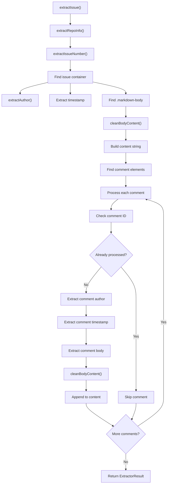
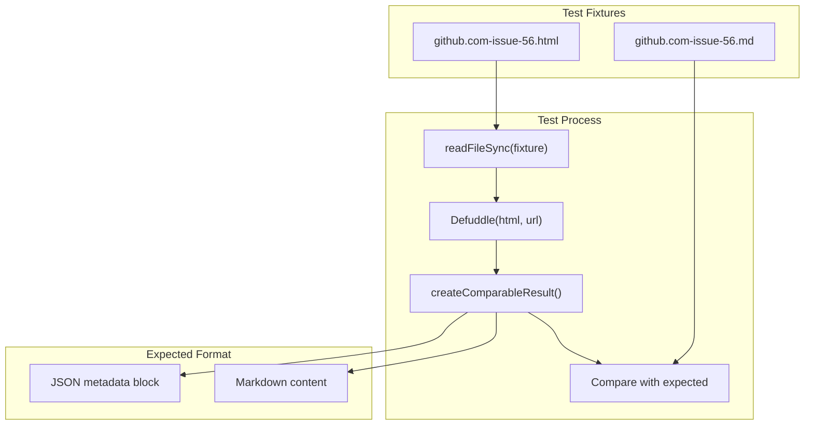

# Code Repository Extractors

<details>
<summary>Relevant source files</summary>

The following files were used as context for generating this wiki page:

- [src/extractors/github.ts](src/extractors/github.ts)
- [src/extractors/hackernews.ts](src/extractors/hackernews.ts)
- [src/extractors/reddit.ts](src/extractors/reddit.ts)

</details>


This document covers the specialized extractors for code repositories and development platforms, currently focused on GitHub. These extractors handle the unique content structures found on development platforms like issue discussions, pull request comments, and repository metadata.

For information about the general extractor registry system, see [Extractor Registry](#5.1). For other platform-specific extractors, see [Social Media Extractors](#5.2) and [AI Chat Extractors](#5.3).

## Overview

Code repository extractors are specialized content processors designed to handle the structured discussions and metadata found on development platforms. Currently, the system includes a comprehensive GitHub extractor that processes issue pages, extracting the main issue content, all comments, author information, and timestamps into a standardized format.

```mermaid
graph TB
    subgraph "ExtractorRegistry"
        REGISTRY["ExtractorRegistry.findExtractor()"]
    end
    
    subgraph "GitHub Detection"
        PATTERNS["github.com/*"]
        INDICATORS["GitHub Page Indicators"]
    end
    
    subgraph "GitHubExtractor"
        CAN_EXTRACT["canExtract()"]
        EXTRACT["extract()"]
        EXTRACT_ISSUE["extractIssue()"]
        EXTRACT_AUTHOR["extractAuthor()"]
        CLEAN_BODY["cleanBodyContent()"]
    end
    
    subgraph "GitHub Content"
        ISSUE_CONTAINER["[data-testid=\"issue-viewer-issue-container\"]"]
        COMMENT_ELEMENTS["[data-wrapper-timeline-id]"]
        MARKDOWN_BODY[".markdown-body"]
    end
    
    subgraph "Output"
        EXTRACTOR_RESULT["ExtractorResult"]
        CONTENT_HTML["contentHtml"]
        VARIABLES["variables (title, author, site)"]
    end
    
    REGISTRY --> PATTERNS
    PATTERNS --> CAN_EXTRACT
    CAN_EXTRACT --> INDICATORS
    INDICATORS --> EXTRACT
    EXTRACT --> EXTRACT_ISSUE
    
    EXTRACT_ISSUE --> ISSUE_CONTAINER
    EXTRACT_ISSUE --> COMMENT_ELEMENTS
    ISSUE_CONTAINER --> MARKDOWN_BODY
    COMMENT_ELEMENTS --> MARKDOWN_BODY
    
    EXTRACT_ISSUE --> EXTRACT_AUTHOR
    EXTRACT_ISSUE --> CLEAN_BODY
    CLEAN_BODY --> CONTENT_HTML
    
    EXTRACT_ISSUE --> EXTRACTOR_RESULT
    EXTRACTOR_RESULT --> VARIABLES
```

Sources: [src/extractors/github.ts:1-184](), [tests/fixtures/github.com-issue-56.html:1-290]()

## GitHub Extractor Implementation

The `GitHubExtractor` class handles extraction from GitHub pages, specifically focusing on issue and pull request discussions. It extends `BaseExtractor` and implements the standard extractor interface.

### Detection Logic

The extractor uses a two-phase detection system to identify GitHub pages and determine if they contain extractable content:

```mermaid
graph TB
    subgraph "Phase 1: GitHub Site Detection"
        META_HOSTNAME["meta[name=\"expected-hostname\"][content=\"github.com\"]"]
        META_OCTOLYTICS["meta[name=\"octolytics-url\"]"]
        META_SHORTCUTS["meta[name=\"github-keyboard-shortcuts\"]"]
        HEADER_WRAPPER[".js-header-wrapper"]
        REPO_CONTAINER["#js-repo-pjax-container"]
    end
    
    subgraph "Phase 2: Content Type Detection"
        ISSUE_METADATA["[data-testid=\"issue-metadata-sticky\"]"]
        ISSUE_TITLE["[data-testid=\"issue-title\"]"]
    end
    
    subgraph "canExtract() Logic"
        GITHUB_CHECK["githubIndicators.some()"]
        CONTENT_CHECK["githubPageIndicators.some()"]
        FINAL_RESULT["return boolean"]
    end
    
    META_HOSTNAME --> GITHUB_CHECK
    META_OCTOLYTICS --> GITHUB_CHECK
    META_SHORTCUTS --> GITHUB_CHECK
    HEADER_WRAPPER --> GITHUB_CHECK
    REPO_CONTAINER --> GITHUB_CHECK
    
    ISSUE_METADATA --> CONTENT_CHECK
    ISSUE_TITLE --> CONTENT_CHECK
    
    GITHUB_CHECK --> FINAL_RESULT
    CONTENT_CHECK --> FINAL_RESULT
```

Sources: [src/extractors/github.ts:5-23]()

### Content Extraction Process

The extraction process focuses on GitHub issues and follows a structured approach to capture all relevant content:

| Extraction Step | Target Selectors | Purpose |
|-----------------|------------------|----------|
| Repository Info | URL pattern `github.com/([^/]+)/([^/]+)` | Extract owner and repository name |
| Issue Number | URL pattern `/issues/(\d+)` | Identify specific issue |
| Main Issue Content | `[data-testid="issue-viewer-issue-container"]` | Extract primary issue content |
| Issue Author | `a[data-testid="issue-body-header-author"]` | Identify issue creator |
| Issue Timestamp | `relative-time` elements | Extract creation time |
| Comments | `[data-wrapper-timeline-id]` elements | Extract all comments |
| Comment Authors | `.ActivityHeader-module__AuthorLink--iofTU` | Identify comment authors |
| Markdown Content | `.markdown-body` elements | Extract formatted content |

The main extraction flow processes the issue content first, then iterates through comments:



Sources: [src/extractors/github.ts:29-121]()

### Author Extraction Strategy

The extractor uses a cascading selector approach to reliably identify authors across different GitHub UI variations:

```mermaid
graph TB
    subgraph "Author Extraction Selectors"
        TESTID_AUTHOR["a[data-testid=\"issue-body-header-author\"]"]
        MODULE_AUTHOR[".IssueBodyHeaderAuthor-module__authorLoginLink--_S7aT"]
        ACTIVITY_AUTHOR[".ActivityHeader-module__AuthorLink--iofTU"]
        HOVERCARD_AUTHOR["a[href*=\"/users/\"][data-hovercard-url*=\"/users/\"]"]
        PROFILE_AUTHOR["a[aria-label*=\"profile\"]"]
    end
    
    subgraph "URL Processing"
        RELATIVE_PATH["href.startsWith('/')"]
        ABSOLUTE_URL["href.includes('github.com/')"]
        REGEX_MATCH["github.com/([^/\\?#]+)"]
        USERNAME_EXTRACT["Extract username"]
    end
    
    TESTID_AUTHOR --> RELATIVE_PATH
    MODULE_AUTHOR --> RELATIVE_PATH
    ACTIVITY_AUTHOR --> RELATIVE_PATH
    HOVERCARD_AUTHOR --> ABSOLUTE_URL
    PROFILE_AUTHOR --> REGEX_MATCH
    
    RELATIVE_PATH --> USERNAME_EXTRACT
    ABSOLUTE_URL --> USERNAME_EXTRACT
    REGEX_MATCH --> USERNAME_EXTRACT
```

Sources: [src/extractors/github.ts:123-141]()

## Content Cleaning and Standardization

The extractor includes specialized content cleaning to remove GitHub-specific UI elements while preserving the actual discussion content:

```mermaid
graph LR
    subgraph "cleanBodyContent() Process"
        CLONE["cloneNode(true)"]
        REMOVE_BUTTONS["Remove button elements"]
        REMOVE_CLIPBOARD["Remove clipboard components"]
        RETURN_HTML["Return cleaned innerHTML"]
    end
    
    subgraph "Removed Elements"
        BUTTONS["button"]
        TESTID_BUTTONS["[data-testid*=\"button\"]"]
        TESTID_MENUS["[data-testid*=\"menu\"]"]
        CLIPBOARD[".js-clipboard-copy"]
        ZEROCLIP[".zeroclipboard-container"]
    end
    
    CLONE --> REMOVE_BUTTONS
    REMOVE_BUTTONS --> REMOVE_CLIPBOARD
    REMOVE_CLIPBOARD --> RETURN_HTML
    
    BUTTONS --> REMOVE_BUTTONS
    TESTID_BUTTONS --> REMOVE_BUTTONS
    TESTID_MENUS --> REMOVE_BUTTONS
    CLIPBOARD --> REMOVE_CLIPBOARD
    ZEROCLIP --> REMOVE_CLIPBOARD
```

Sources: [src/extractors/github.ts:143-148]()

## Output Structure

The `GitHubExtractor` returns an `ExtractorResult` with GitHub-specific metadata and structured content:

| Field | Type | Content |
|-------|------|---------|
| `content` | string | Combined HTML of issue and all comments |
| `contentHtml` | string | Same as content (HTML format) |
| `extractedContent.type` | string | Always "issue" |
| `extractedContent.issueNumber` | string | Extracted issue number |
| `extractedContent.repository` | string | Repository name |
| `extractedContent.owner` | string | Repository owner |
| `variables.title` | string | Page title |
| `variables.author` | string | Empty (multiple authors) |
| `variables.site` | string | "GitHub - owner/repo" |
| `variables.description` | string | Truncated content preview |

The content structure follows this format:
```html
<div class="issue-author"><strong>username</strong> opened this issue on MM/DD/YYYY</div>
<div class="issue-body"><!-- main issue content --></div>

<div class="comment">
  <div class="comment-header"><strong>username</strong> commented on MM/DD/YYYY</div>
  <div class="comment-body"><!-- comment content --></div>
</div>
```

Sources: [src/extractors/github.ts:105-121](), [tests/expected/github.com-issue-56.md:1-71]()

## Testing Infrastructure

The GitHub extractor is tested using the fixture-based testing system that processes real GitHub HTML and validates the extraction results:



The test validates that the extractor correctly processes a real GitHub issue page (Issue #56 from the defuddle repository) and produces the expected markdown output with proper metadata extraction.

Sources: [tests/fixtures.test.ts:82-112](), [tests/fixtures/github.com-issue-56.html:116](), [tests/expected/github.com-issue-56.md:1-8]()
