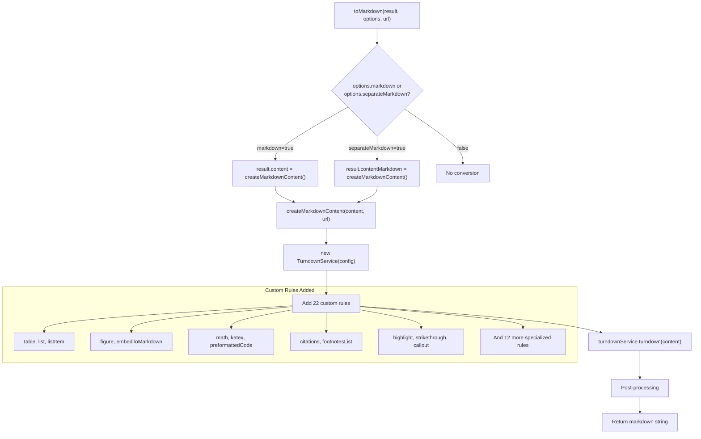
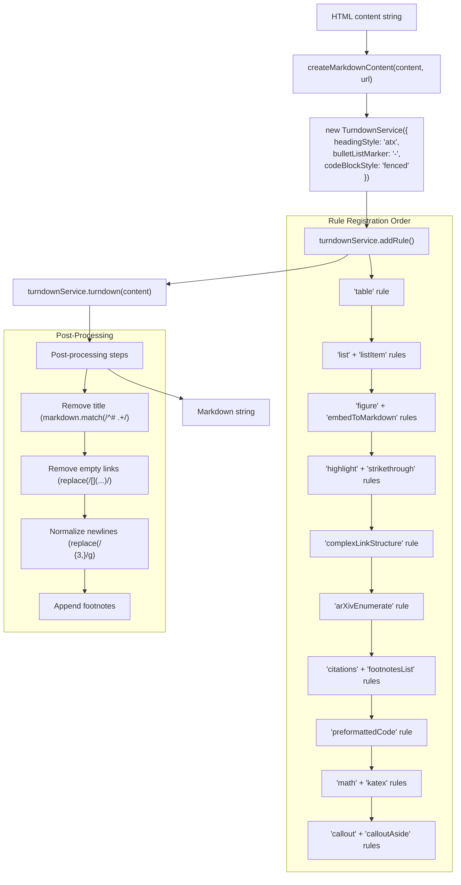
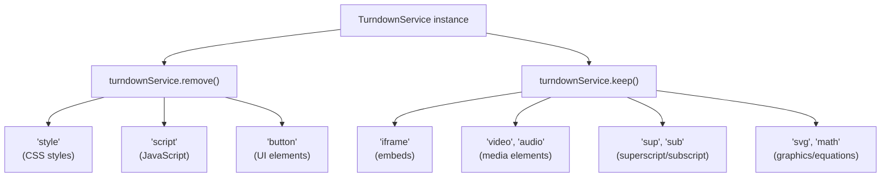
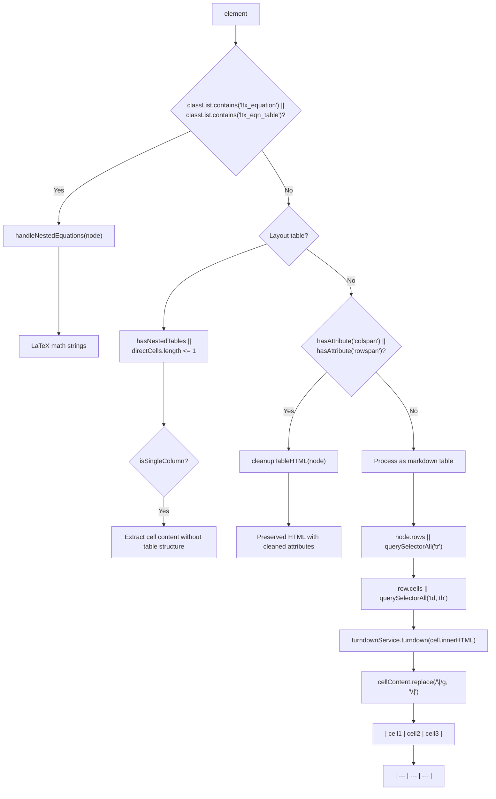
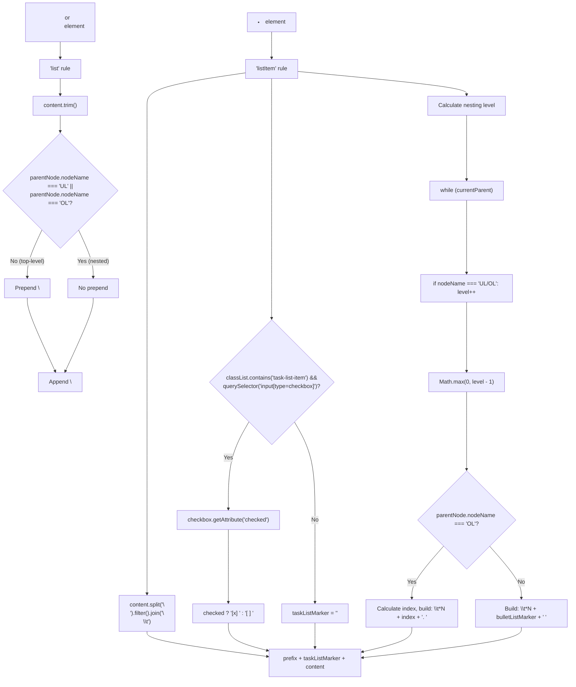
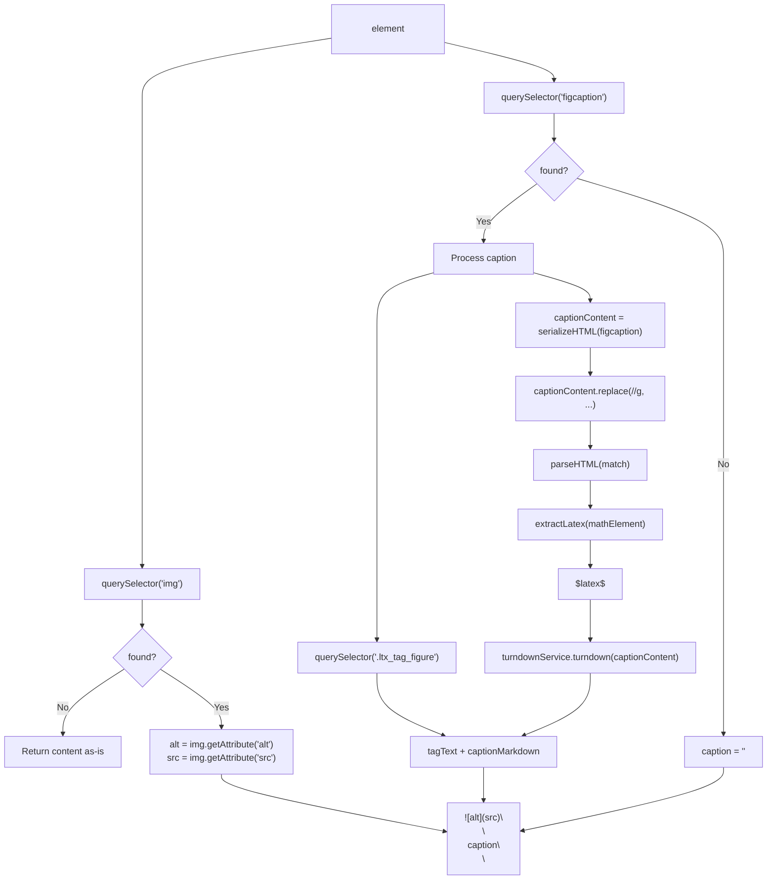
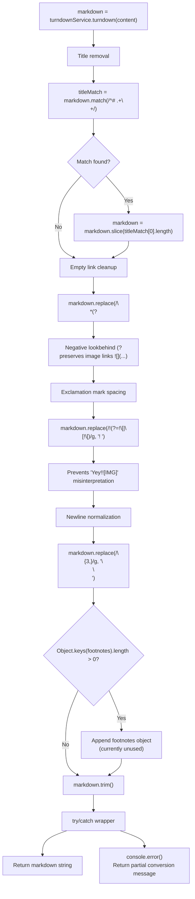

# Markdown Conversion

<details>
<summary>Relevant source files</summary>

The following files were used as context for generating this wiki page:

- [src/markdown.ts](src/markdown.ts)
- [src/utils/dom.ts](src/utils/dom.ts)

</details>


The Markdown conversion system transforms standardized HTML content into well-formatted Markdown output. The system uses TurndownService as its foundation and extends it with 22 custom rules to handle specialized content structures from academic papers, code repositories, social media, and technical documentation.

The conversion is invoked through the `toMarkdown` function, which optionally transforms the HTML content in a `DefuddleResponse` object based on configuration options. For information about the content standardization that prepares HTML for conversion, see [Content Standardization](#5).

## Entry Point and Architecture

The Markdown conversion system consists of two main functions: `toMarkdown` as the entry point and `createMarkdownContent` as the core conversion engine.

### System Architecture



The `toMarkdown` function [src/markdown.ts:732-742]() conditionally invokes `createMarkdownContent` based on the `markdown` or `separateMarkdown` options. When `markdown` is true, it replaces the HTML content with Markdown; when `separateMarkdown` is true, it creates a separate `contentMarkdown` field while preserving the original HTML.

**Sources:** [src/markdown.ts:732-742](), [src/markdown.ts:41-730]()

## Conversion Pipeline Overview

The `createMarkdownContent` function orchestrates the complete conversion process through TurndownService configuration, custom rule registration, and post-processing.

### Conversion Flow with Code Entities



**Sources:** [src/markdown.ts:41-730]()

## TurndownService Configuration

The `createMarkdownContent` function initializes TurndownService with specific configuration options and then configures element handling through `remove()` and `keep()` methods.

### Base Configuration Options

| Option | Value | Purpose |
|--------|-------|---------|
| `headingStyle` | `'atx'` | Use `#` prefix for headings (e.g., `# H1`, `## H2`) |
| `hr` | `'---'` | Horizontal rules as three hyphens |
| `bulletListMarker` | `'-'` | Unordered lists use hyphen marker |
| `codeBlockStyle` | `'fenced'` | Code blocks use triple backticks |
| `emDelimiter` | `'*'` | Emphasis uses asterisks (not underscores) |
| `preformattedCode` | `true` | Preserve code formatting |

### Element Handling Configuration



Elements marked for removal are stripped from the output, while elements marked with `keep()` are preserved as raw HTML in the Markdown output. This allows Markdown renderers to handle complex elements like video embeds and mathematical notation.

**Sources:** [src/markdown.ts:43-50](), [src/markdown.ts:138-143]()

## Custom Conversion Rules

The system implements 22 custom rules through `turndownService.addRule(name, {filter, replacement})` to handle complex HTML structures. Each rule consists of a filter function to match elements and a replacement function to generate Markdown.

### Complete Rule Set

| Rule Name | Filter | Output Format | Lines |
|-----------|--------|---------------|-------|
| `table` | `<table>` elements | Markdown tables or preserved HTML | [52-136]() |
| `list` | `<ul>`, `<ol>` | Newline-wrapped lists | [145-156]() |
| `listItem` | `<li>` | Tab-indented items with task list support | [159-219]() |
| `figure` | `<figure>` | `` with caption | [221-275]() |
| `embedToMarkdown` | YouTube/Twitter iframes | `` Obsidian embed syntax | [278-308]() |
| `highlight` | `<mark>` | `==text==` | [310-315]() |
| `strikethrough` | `<del>`, `<s>`, `<strike>` | `~~text~~` | [317-325]() |
| `complexLinkStructure` | `<a>` with nested headings | Heading + link separation | [328-364]() |
| `arXivEnumerate` | `<ol class="ltx_enumerate">` | Numbered list without span tags | [366-383]() |
| `citations` | `<sup id="fnref:*">` | `[^number]` | [385-403]() |
| `footnotesList` | `<ol>` in `#footnotes` | `[^id]: content` | [406-450]() |
| `removals` | Footnote backlinks | Empty string | [453-464]() |
| `handleTextNodesInTables` | Text nodes in `<td>` | Preserved text | [466-475]() |
| `preformattedCode` | `<pre>` | ` ```lang\ncode\n``` ` | [477-501]() |
| `math` | `<math>`, `.mwe-math-element` | `$latex$` or `$$\nlatex\n$$` | [503-548]() |
| `katex` | `.math`, `.katex` | `$latex$` or `$$\nlatex\n$$` | [550-584]() |
| `callout` | `.markdown-alert` | `> [!TYPE]` Obsidian callouts | [586-615]() |
| `calloutAside` | `<blockquote data-callout>` | `> [!type] Title` | [618-636]() |

### Rule Processing Architecture

```mermaid
graph TB
    Input["HTML element"] --> FilterChain["Filter chain evaluation<br/>(first match wins)"]
    
    FilterChain --> R1["table filter:<br/>node.nodeName === 'TABLE'"]
    FilterChain --> R2["math filter:<br/>node.nodeName === 'MATH' ||<br/>classList.contains('mwe-math-element')"]
    FilterChain --> R3["figure filter:<br/>node.nodeName === 'FIGURE'"]
    FilterChain --> R4["preformattedCode filter:<br/>node.nodeName === 'PRE'"]
    
    R1 --> Rep1["table replacement function"]
    R2 --> Rep2["math replacement function"]
    R3 --> Rep3["figure replacement function"]
    R4 --> Rep4["preformattedCode replacement function"]
    
    Rep1 --> Check1{"Table type?"}
    Check1 -->|"classList.contains('ltx_equation')"| ArXiv["handleNestedEquations()"]
    Check1 -->|"hasAttribute('colspan/rowspan')"| Complex["cleanupTableHTML()"]
    Check1 -->|"Simple"| Markdown["Pipe-delimited markdown table"]
    
    Rep2 --> Extract["extractLatex(node)"]
    Extract --> Display{"Display type?"}
    Display -->|"display='block'"| Block["$$\nlatex\n$$"]
    Display -->|"inline"| Inline["$latex$"]
```

**Sources:** [src/markdown.ts:52-636]()

## Mathematical Content Processing

The system handles mathematical notation from multiple sources including native `<math>` elements, KaTeX, MediaWiki, and arXiv through three specialized rules and a shared `extractLatex` helper function.

### Math Conversion Pipeline

```mermaid
flowchart TD
    Element["Math-related element"] --> Filter{"Filter match?"}
    
    Filter -->|"nodeName === 'MATH' ||<br/>classList.contains('mwe-math-element')"| MathRule["'math' rule"]
    Filter -->|"classList.contains('math') ||<br/>classList.contains('katex')"| KatexRule["'katex' rule"]
    Filter -->|"nodeName === 'TABLE' &&<br/>classList.contains('ltx_equation')"| TableRule["'table' rule calls<br/>handleNestedEquations()"]
    
    MathRule --> ExtractFunc["extractLatex(element)"]
    KatexRule --> AttrCheck{"getAttribute('data-latex')?"}
    
    AttrCheck -->|"Found"| UseAttr["Use data-latex value"]
    AttrCheck -->|"Not found"| QueryAnnot["querySelector('.katex-mathml annotation')"]
    QueryAnnot --> UseAnnot["Use annotation textContent"]
    
    ExtractFunc --> LaTeXStr["LaTeX string"]
    UseAttr --> LaTeXStr
    UseAnnot --> LaTeXStr
    
    LaTeXStr --> DisplayCheck{"Display type?"}
    DisplayCheck -->|"getAttribute('display') === 'block' ||<br/>classList.contains('mwe-math-fallback-image-display')"| BlockMath["Return: $$\nlatex\n$$"]
    DisplayCheck -->|"Inline"| InlineMath["Return: $latex$"]
    
    TableRule --> NestedFunc["handleNestedEquations(element)"]
    NestedFunc --> QueryMath["querySelectorAll('math[alttext]')"]
    QueryMath --> MapMath["Array.map(mathElement => ...)"]
    MapMath --> InlineCheck{"closest('.ltx_eqn_inline')?"}
    InlineCheck -->|"Yes"| I2["$alttext$"]
    InlineCheck -->|"No"| B2["$$\nalttext\n$$"]
```

### extractLatex Helper Function

The `extractLatex` function [src/markdown.ts:682-692]() extracts LaTeX from multiple attribute sources:

1. `data-latex` attribute (highest priority)
2. `alttext` attribute (arXiv format)
3. Returns empty string if neither found

### KaTeX-Specific Extraction

The `katex` rule [src/markdown.ts:550-584]() uses a three-tier fallback strategy:

1. Check `data-latex` attribute on the container
2. Query `.katex-mathml annotation[encoding="application/x-tex"]` for MathML annotation
3. Fallback to `textContent` of the element

Display detection checks both the `math-inline` class and the `display` attribute on nested `<math>` elements.

**Sources:** [src/markdown.ts:503-548](), [src/markdown.ts:550-584](), [src/markdown.ts:682-692](), [src/markdown.ts:638-651]()

## Code Block Processing

The `preformattedCode` rule [src/markdown.ts:477-501]() converts `<pre><code>` blocks to fenced code blocks with language detection.

### Code Block Conversion Flow

```mermaid
flowchart TD
    PreElem["<pre> element"] --> FindCode["querySelector('code')"]
    FindCode --> CheckCode{"<code> found?"}
    CheckCode -->|"No"| ReturnContent["Return content as-is"]
    CheckCode -->|"Yes"| DetectLang["Language detection"]
    
    DetectLang --> TryAttrs["Try attributes in order"]
    TryAttrs --> A1["codeElement.getAttribute('data-lang')"]
    A1 --> A2["codeElement.getAttribute('data-language')"]
    A2 --> A3["codeElement.className.match(/language-(\w+)/)"]
    A3 --> A4["node.getAttribute('data-language')"]
    A4 --> LangResult["language string or ''"]
    
    FindCode --> ExtractText["codeElement.textContent"]
    ExtractText --> CleanCode["code.trim().replace(/`/g, '\\`')"]
    
    LangResult --> Build["Construct output"]
    CleanCode --> Build
    Build --> Output["```language\ncleanCode\n```"]
```

The language detection tries four attributes in order of priority, falling back to an empty string if none are found. This supports code blocks from WordPress, Shiki, Prism, and other syntax highlighters that were normalized by the code block standardization process (see [Content Standardization](#5)).

**Sources:** [src/markdown.ts:477-501]()

## Footnote Processing System

The footnote system uses two coordinated rules to convert inline citations and footnote lists into Markdown reference format.

### Footnote Conversion Pipeline

```mermaid
flowchart TD
    subgraph "Inline Citations"
        Sup["<sup id='fnref:*'> element"] --> CitFilter["'citations' rule filter"]
        CitFilter --> ExtractID["id.replace('fnref:', '')"]
        ExtractID --> SplitID["id.split('-')[0]<br/>(handle multiple refs)"]
        SplitID --> InlineOut["[^number]"]
    end
    
    subgraph "Footnote List"
        FNDiv["<div id='footnotes'><ol>"] --> ListFilter["'footnotesList' rule filter"]
        ListFilter --> MapItems["Array.from(node.children).map(li => ...)"]
        
        MapItems --> GetID{"getAttribute('id')?"}
        GetID --> ProcessID["id.startsWith('fn:') ?<br/>id.replace('fn:', '') :<br/>liId.match(/cite_note-(.+)/)"]
        
        MapItems --> RemoveSup["Remove <sup> if textContent === id"]
        MapItems --> ConvertContent["turndownService.turndown(serializeHTML(li))"]
        ConvertContent --> CleanBacklink["content.replace(/\s*↩︎$/, '')"]
        
        ProcessID --> BuildRef["[^id]: content"]
        CleanBacklink --> BuildRef
        BuildRef --> ListOut["\\n\\n[^1]: footnote\\n\\n[^2]: footnote"]
    end
    
    subgraph "Backlink Removal"
        Backlink["<a href='#fnref*'> or<br/>class='footnote-backref'"] --> RemovalFilter["'removals' rule filter"]
        RemovalFilter --> EmptyStr["Return empty string"]
    end
```



### Footnote ID Processing

The `footnotesList` rule [src/markdown.ts:406-450]() handles two ID formats:

1. **Standard format**: `id="fn:123"` → extracts `123`
2. **Wikipedia format**: `id="cite_note-reference_name-123"` → extracts `reference_name` using regex

The rule also removes backlink arrows (`↩︎`) and any `<sup>` elements whose text content matches the footnote ID.

**Sources:** [src/markdown.ts:385-403](), [src/markdown.ts:406-450](), [src/markdown.ts:453-464]()

## Table Conversion System

The `table` rule [src/markdown.ts:52-136]() implements a sophisticated detection system that routes tables to different processors based on their structure and purpose.

### Table Type Detection and Routing



### Simple Table Processing Details

For simple tables without `colspan`/`rowspan`, the conversion process:

1. Extracts rows using `node.rows` (browser/JSDOM) or `querySelectorAll('tr')` (linkedom)
2. Filters to direct children using `isDirectTableChild(tr, node)` [src/utils/dom.ts:67-74]()
3. Extracts cells using `row.cells` or `querySelectorAll('td, th')`
4. Converts cell content through `turndownService.turndown(serializeHTML(cell))`
5. Removes newlines with `replace(/\n/g, ' ')` and escapes pipes with `replace(/\|/g, '\\|')`
6. Constructs markdown table with separator row after first row

### cleanupTableHTML Function

The `cleanupTableHTML` function [src/markdown.ts:653-680]() preserves complex tables as HTML by:

1. Cloning the table element to avoid modifying the original DOM
2. Removing all attributes except: `src`, `href`, `style`, `align`, `width`, `height`, `rowspan`, `colspan`, `bgcolor`, `scope`, `valign`, `headers`
3. Recursively cleaning child elements
4. Returning `outerHTML` with HTML entity decoding (`&amp;` → `&`, `&lt;` → `<`, `&gt;` → `>`)

The entity decoding is critical for LaTeX in tables, where `&` is used for column alignment.

**Sources:** [src/markdown.ts:52-136](), [src/markdown.ts:653-680](), [src/utils/dom.ts:67-74]()

## List Conversion System

The list conversion uses two coordinated rules to handle nested lists with task list support and tab indentation.

### List Processing Pipeline



### Task List Detection

The `listItem` rule [src/markdown.ts:159-219]() detects task lists by:

1. Checking for `task-list-item` class on the `<li>`
2. Finding `input[type="checkbox"]` child element
3. Reading `checked` attribute to determine `[x]` or `[ ]`
4. Removing the checkbox HTML from content

### Nesting Calculation

The nesting calculation walks up the DOM tree:
- Increments `level` for each `<ul>` or `<ol>` ancestor
- Stops at non-list elements (except `<li>`)
- Uses `Math.max(0, level - 1)` to ensure non-negative indentation
- Applies tab characters (`\t`) for each indentation level

**Sources:** [src/markdown.ts:145-156](), [src/markdown.ts:159-219]()

## Figure and Embed Conversion

The system converts `<figure>` elements and embedded media to appropriate Markdown formats.

### Figure Conversion with Math Support



The `figure` rule [src/markdown.ts:221-275]() includes special handling for math elements in captions by converting `<math>` elements to inline LaTeX before running the main Turndown conversion.

### Embed Conversion

The `embedToMarkdown` rule [src/markdown.ts:278-308]() converts YouTube and Twitter embeds to Obsidian-style image syntax ``:

| Platform | Source Pattern | Output Format |
|----------|----------------|---------------|
| YouTube | `youtube.com/embed/{id}` or `youtu.be/{id}` | `` |
| Twitter | `twitter.com/{user}/status/{id}` | `` |
| Twitter | `platform.twitter.com/embed/Tweet.html?id={id}` | `` |

**Sources:** [src/markdown.ts:221-275](), [src/markdown.ts:278-308]()

## Post-Processing and Output

The `createMarkdownContent` function applies four post-processing operations before returning the final Markdown string.

### Post-Processing Operations



### Error Handling

The entire conversion is wrapped in a try/catch block [src/markdown.ts:694-729](). On error, the system:

1. Logs the error to console
2. Logs the first 1000 characters of problematic content
3. Returns a fallback string: `"Partial conversion completed with errors. Original HTML:\n\n{content}"`

This ensures that even if conversion fails, users receive the original HTML content rather than losing data.

**Sources:** [src/markdown.ts:694-729]()

## Type System and Cross-Platform Compatibility

The conversion system uses a generic type system to ensure compatibility across browser and Node.js environments.

### GenericElement Type System

| Property | Type | Purpose |
|----------|------|---------|
| `classList` | `{contains: (className: string) => boolean}` | Class checking |
| `getAttribute` | `(name: string) => string \| null` | Attribute access |
| `querySelector` | `(selector: string) => Element \| null` | Element selection |
| `querySelectorAll` | `(selector: string) => NodeListOf<Element>` | Multiple selection |
| `rows` | `ArrayLike<{cells?: ArrayLike<{innerHTML?: string}>}>` | Table structure |
| `parentNode` | `GenericElement \| null` | Parent access |
| `nodeName` | `string` | Element type |
| `innerHTML` | `string` | Content access |

The `GenericElement` interface and related utility functions (`isGenericElement`, `asGenericElement`) provide cross-platform compatibility for DOM manipulation.

**Sources:** [src/markdown.ts:4-38]()
