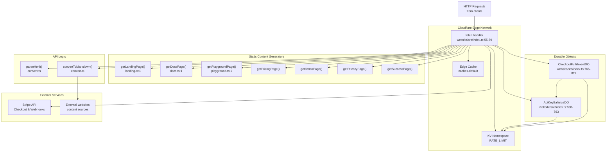
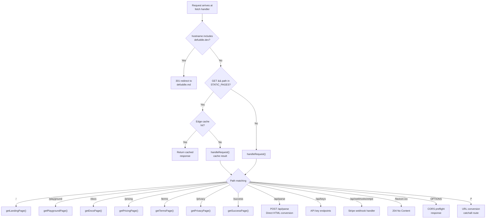
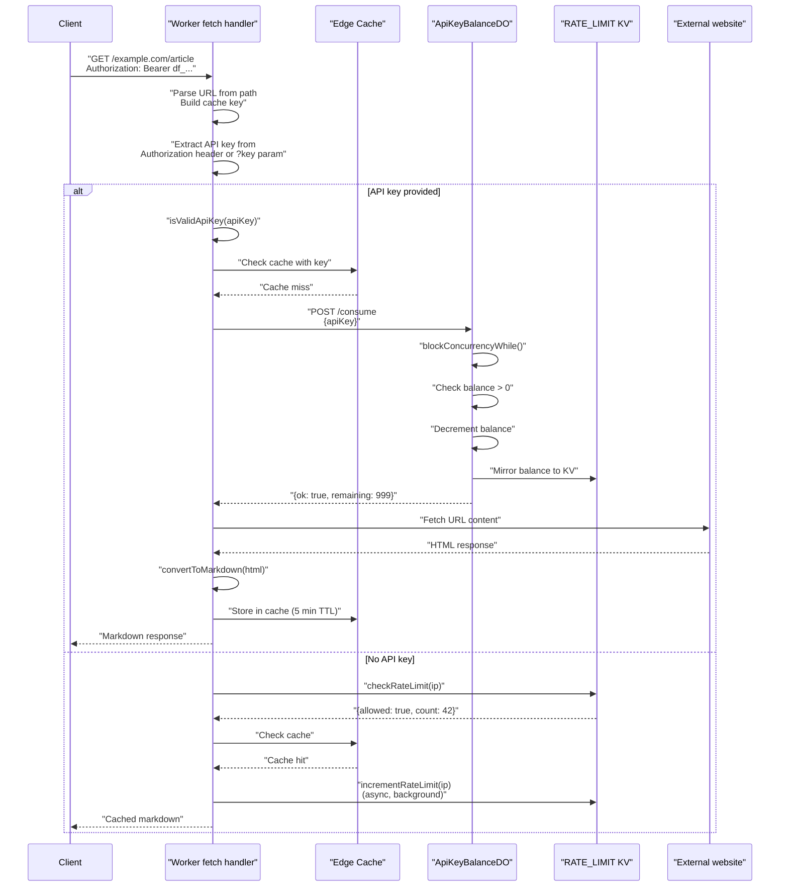
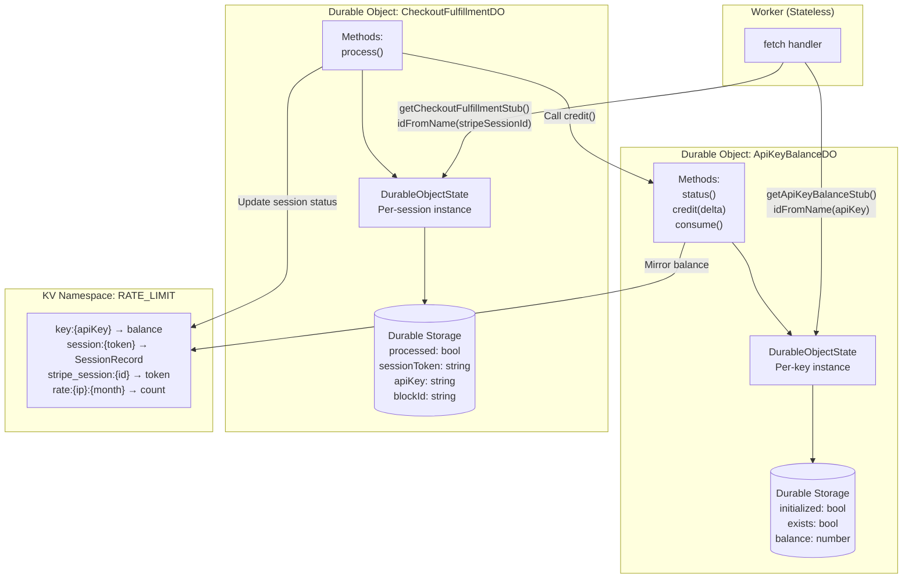
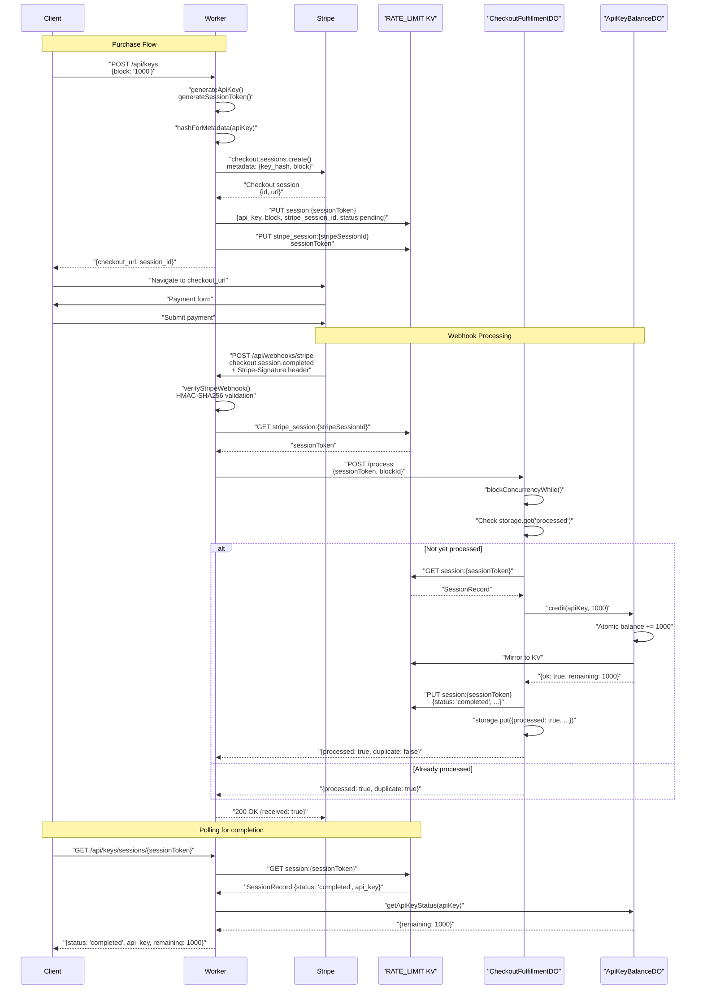

# Web Service

<details>
<summary>Relevant source files</summary>

The following files were used as context for generating this wiki page:

- [.gitignore](.gitignore)
- [tests/debug.test.ts](tests/debug.test.ts)
- [website/src/docs.ts](website/src/docs.ts)
- [website/src/index.ts](website/src/index.ts)
- [website/src/landing.ts](website/src/landing.ts)
- [website/src/playground.ts](website/src/playground.ts)
- [website/wrangler.toml](website/wrangler.toml)

</details>


The Web Service component is a serverless application deployed on Cloudflare Workers that provides both a public API for content extraction and a static website for documentation and interactive testing. It includes a complete API key management system with payment processing, rate limiting, and caching.

For information about the core extraction logic used by the API, see [Core Extraction Pipeline](#3.1). For details about the JavaScript library bundles, see [Build and Distribution System](#3.2).

## System Architecture

The web service runs as a single Cloudflare Worker that handles all HTTP requests, dispatching them to appropriate handlers based on URL path and HTTP method. The system integrates with several Cloudflare services and external APIs:



Sources: [website/src/index.ts:1-636](), [website/wrangler.toml:1-19]()

## Request Routing

The Worker's `fetch` handler implements a priority-based routing system that first checks for redirects and cached static pages, then delegates to `handleRequest` for route-specific logic:



**Sources:** [website/src/index.ts:54-89](), [website/src/index.ts:332-636]()

## Static Pages

The Worker serves seven static HTML pages, each generated by a dedicated function. All static pages are cached at the edge for 5 minutes (300 seconds).

| Route | Generator Function | Purpose |
|-------|-------------------|---------|
| `/` | `getLandingPage()` | Main landing page with URL/HTML input forms |
| `/playground` | `getPlaygroundPage(prefillHtml?)` | Interactive HTML testing interface with tabbed output |
| `/docs` | `getDocsPage()` | Complete documentation with syntax highlighting |
| `/pricing` | `getPricingPage()` | API pricing and purchase information |
| `/terms` | `getTermsPage()` | Terms of service |
| `/privacy` | `getPrivacyPage()` | Privacy policy |
| `/success` | `getSuccessPage(sessionToken)` | Post-checkout success page |

Static pages are identified by the `STATIC_PAGES` set and cached using Cloudflare's edge cache. The cache key is the full request URL, and responses are stored only if they return 2xx status codes (excluding 204 and 205).

**Sources:** [website/src/index.ts:15-16](), [website/src/index.ts:69-82](), [website/src/landing.ts:1-292](), [website/src/docs.ts:1-576](), [website/src/playground.ts:1-401]()

## API Endpoints

The Worker exposes multiple API endpoints for content conversion, API key management, and webhook handling:

### Content Conversion Endpoints

| Method | Path | Authentication | Purpose | Response |
|--------|------|----------------|---------|----------|
| POST | `/api/parse` | None | Convert HTML string to markdown | JSON with content and metadata |
| GET | `/{url}` | Optional API key or IP rate limit | Fetch and convert URL to markdown | Markdown text with YAML frontmatter |

**POST /api/parse**

Accepts JSON with `html` (required) and `url` (optional) fields. Parses the HTML using the Defuddle library and returns JSON with extracted content and metadata.

```typescript
// Request body
{ 
  html: string;
  url?: string;
}

// Response
{
  content: string;        // Markdown content
  contentHtml: string;    // Clean HTML
  title: string;
  author: string;
  description: string;
  // ... additional metadata
}
```

**GET /{url}**

The catch-all route that accepts any URL path. The URL is extracted from the path, fetched, and converted to markdown. Supports authentication via `Authorization: Bearer {api_key}` header or `?key={api_key}` query parameter. Unauthenticated requests are subject to IP-based rate limiting (5,000 requests/month).

**Sources:** [website/src/index.ts:366-379](), [website/src/index.ts:511-636]()

### API Key Management Endpoints

| Method | Path | Authentication | Purpose | Response |
|--------|------|----------------|---------|----------|
| GET | `/api/keys` | None | List available credit blocks | JSON with block options |
| POST | `/api/keys` | None | Create new API key and checkout session | JSON with `checkout_url` |
| POST | `/api/keys/topup` | Bearer token required | Top up existing key | JSON with `checkout_url` |
| GET | `/api/keys/usage` | Bearer token required | Check remaining credits | JSON with `remaining` count |
| GET | `/api/keys/sessions/{token}` | None | Poll checkout status | JSON with status and API key |
| POST | `/api/webhooks/stripe` | Stripe signature required | Process completed payments | JSON with `received: true` |

**API Key Format**

API keys follow the pattern `df_{48 hex characters}`, validated by the regex `/^df_[0-9a-f]{48}$/`. Keys are generated using 24 random bytes encoded as hex.

**Credit Blocks**

The system offers three credit blocks defined in the `BLOCKS` constant:

| Block ID | Requests | Price (USD) |
|----------|----------|-------------|
| `1000` | 1,000 | $5.00 |
| `10000` | 10,000 | $40.00 |
| `100000` | 100,000 | $300.00 |

**Sources:** [website/src/index.ts:19-23](), [website/src/index.ts:161-167](), [website/src/index.ts:388-468]()

## API Key Authentication Flow

The URL conversion endpoint (`GET /{url}`) implements a two-tier authentication system: API key-based (paid) and IP-based rate limiting (free). The authentication flow prevents unnecessary credit consumption by checking the cache before decrementing balances.



**Sources:** [website/src/index.ts:543-605](), [website/src/index.ts:196-220](), [website/src/index.ts:222-234]()

## Rate Limiting

The system implements two separate rate limiting mechanisms:

### IP-Based Rate Limiting (Unauthenticated Requests)

Unauthenticated requests to the URL conversion endpoint are limited to 5,000 requests per calendar month per IP address. The limit counter is stored in KV using keys in the format `rate:{ip}:{YYYY-MM}` with automatic expiration at the end of each month.

**Key Functions:**
- `getRateLimitKey(ip: string)`: Generates KV key with current month [website/src/index.ts:133-137]()
- `checkRateLimit(kv, ip)`: Returns `{allowed: boolean, count: number}` [website/src/index.ts:145-150]()
- `incrementRateLimit(kv, ip)`: Atomically increments counter [website/src/index.ts:152-157]()
- `secondsUntilMonthEnd()`: Calculates expiration TTL [website/src/index.ts:139-143]()

When rate limit is exceeded, the response includes a `429` status with `Retry-After` header set to seconds until the next month.

### API Key Credit System

API keys have a fixed credit balance that decrements with each request. Credits are managed by `ApiKeyBalanceDO` instances, which provide atomic operations to prevent race conditions.

**Sources:** [website/src/index.ts:131-157](), [website/src/index.ts:577-593]()

## Durable Objects Architecture

The system uses two Durable Object classes to manage stateful operations with strong consistency guarantees:



**Sources:** [website/src/index.ts:188-194](), [website/src/index.ts:638-763](), [website/src/index.ts:765-822](), [website/wrangler.toml:10-14]()

## ApiKeyBalanceDO Implementation

Each API key has a dedicated Durable Object instance identified by the API key itself. The instance maintains a balance counter with atomic operations and mirrors the balance to KV for fast reads.

### Initialization Strategy

The Durable Object uses lazy initialization with KV fallback to ensure existing keys (created before Durable Objects) can be migrated seamlessly:

1. On first access, check if Durable Storage contains `initialized` flag
2. If not initialized, check KV for existing balance using key `key:{apiKey}`
3. Store the balance (or 0 if not found) in Durable Storage
4. Set `initialized` and `exists` flags

This ensures backward compatibility with the previous KV-only system.

**Sources:** [website/src/index.ts:648-673]()

### Concurrency Control

All mutation operations use `blockConcurrencyWhile()` to ensure serialized access:

```typescript
// Consume one credit atomically
private async consume(apiKey: string): Promise<ApiKeyMutationResult> {
  return await this.ctx.blockConcurrencyWhile(async () => {
    await this.ensureInitialized(apiKey);
    const exists = (await this.ctx.storage.get<boolean>('exists')) ?? false;
    const current = (await this.ctx.storage.get<number>('balance')) ?? 0;
    
    if (!exists || current <= 0) {
      return { ok: false, exists, remaining: 0 };
    }
    
    const updated = current - 1;
    await this.ctx.storage.put('balance', updated);
    await this.mirrorToKv(apiKey, updated);
    return { ok: true, exists: true, remaining: updated };
  });
}
```

**Sources:** [website/src/index.ts:713-742]()

### KV Mirroring

After each balance mutation, the new balance is mirrored to KV at key `key:{apiKey}`. This provides a fast read path for checking balances without Durable Object overhead, though the source of truth remains in Durable Storage.

**Sources:** [website/src/index.ts:675-678]()

## Payment Flow with Stripe

The payment flow uses Stripe Checkout for collecting payments and webhooks for fulfillment. The system implements idempotent processing using `CheckoutFulfillmentDO` to prevent duplicate credit allocation.



**Sources:** [website/src/index.ts:280-328](), [website/src/index.ts:470-508](), [website/src/index.ts:774-821]()

## Stripe Webhook Verification

Webhook requests are verified using HMAC-SHA256 signature verification to prevent forged requests. The verification implements Stripe's signature scheme with timestamp tolerance:

1. Parse `Stripe-Signature` header for timestamp (`t`) and signature values (`v1`)
2. Verify timestamp is within 5-minute tolerance window (300 seconds)
3. Compute expected signature: `HMAC-SHA256(secret, "{timestamp}.{payload}")`
4. Compare expected signature with provided `v1` values using constant-time comparison

The `constantTimeEquals` function prevents timing attacks by ensuring comparison always takes the same amount of time regardless of where strings differ.

**Sources:** [website/src/index.ts:236-243](), [website/src/index.ts:247-278]()

## Caching Strategy

The Worker implements a two-tier caching system:

### Static Page Caching

Static pages (`/`, `/playground`, `/docs`, etc.) are cached at the edge for 5 minutes. The cache key is the full request URL, and responses include `Cache-Control: public, max-age=3600` headers for browser caching.

**Implementation:**
1. Check if path is in `STATIC_PAGES` set and method is GET
2. Generate cache key from full URL
3. Attempt `cache.match(cacheKey)`
4. On miss, call handler and store result with `cache.put()`

**Sources:** [website/src/index.ts:69-82](), [website/src/index.ts:102-109]()

### URL Conversion Caching

Converted markdown responses for `GET /{url}` are cached for 5 minutes (`s-maxage=300`) but only if:
- The content has `wordCount > 0` (meaningful content)
- The request used cache-eligible authentication (API key or free tier)

The cache check happens **before** consuming API key credits to prevent charging for cached content. For unauthenticated requests, the rate limit is still incremented (in the background) even for cache hits to prevent abuse.

**Cache Key Generation:**

```typescript
const cacheKey = useCache
  ? new Request(new URL(targetUrl, 'https://defuddle.md').toString())
  : null;
```

The cache key is based on the target URL, not the incoming request URL, ensuring cache sharing across different request paths.

**Sources:** [website/src/index.ts:544-546](), [website/src/index.ts:564-567](), [website/src/index.ts:596-604](), [website/src/index.ts:607-631]()

## Environment Configuration

The Worker requires the following bindings configured in `wrangler.toml`:

| Binding Type | Name | Purpose |
|--------------|------|---------|
| KV Namespace | `RATE_LIMIT` | Stores rate limits, API key balances, session data |
| Durable Object | `API_KEY_BALANCES` | Namespace for `ApiKeyBalanceDO` instances |
| Durable Object | `CHECKOUT_FULFILLMENTS` | Namespace for `CheckoutFulfillmentDO` instances |
| Environment Variable | `STRIPE_SECRET_KEY` | Stripe API secret key |
| Environment Variable | `STRIPE_WEBHOOK_SECRET` | Stripe webhook signing secret |

The `Env` type interface defines these bindings for TypeScript:

```typescript
type Env = {
  RATE_LIMIT?: KVNamespace;
  STRIPE_SECRET_KEY?: string;
  STRIPE_WEBHOOK_SECRET?: string;
  API_KEY_BALANCES: DurableObjectNamespace;
  CHECKOUT_FULFILLMENTS: DurableObjectNamespace;
};
```

**Sources:** [website/wrangler.toml:1-19](), [website/src/index.ts:25-31]()

## Error Handling

The Worker uses consistent JSON error responses with appropriate HTTP status codes:

| Status | Condition | Example |
|--------|-----------|---------|
| 400 | Invalid request parameters | Missing `html` field, invalid block ID, invalid URL |
| 401 | Authentication failure | Invalid API key format, invalid Stripe signature |
| 402 | Payment required | API key has no remaining credits |
| 404 | Resource not found | API key not found, session not found, unknown API route |
| 429 | Rate limit exceeded | Monthly IP limit exceeded |
| 500 | Internal server error | Unexpected errors during processing |
| 502 | Bad gateway | External URL fetch failed |
| 503 | Service unavailable | Required configuration missing (Stripe keys, KV) |

All error responses use the `errorResponse(message, status)` helper, which returns JSON with an `error` field and enables CORS with `Access-Control-Allow-Origin: *`.

**Sources:** [website/src/index.ts:121-129](), [website/src/index.ts:85-88]()

## CORS Configuration

The Worker enables Cross-Origin Resource Sharing (CORS) to allow browser-based clients to call the API:

- All JSON responses include `Access-Control-Allow-Origin: *`
- Preflight requests (`OPTIONS`) return appropriate CORS headers:
  - `Access-Control-Allow-Methods: GET, POST, OPTIONS`
  - `Access-Control-Allow-Headers: Content-Type, Authorization`

This allows the playground and other web applications to call the API from any domain.

**Sources:** [website/src/index.ts:111-119](), [website/src/index.ts:338-347]()
