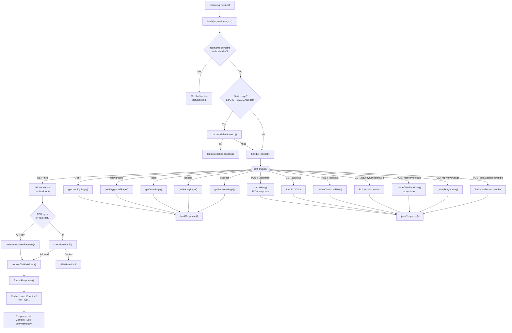
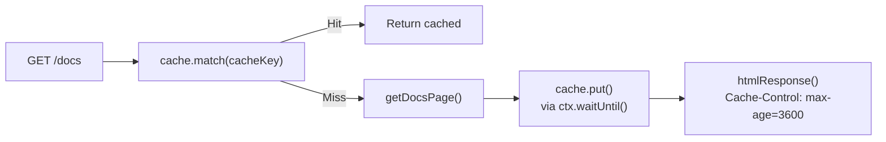
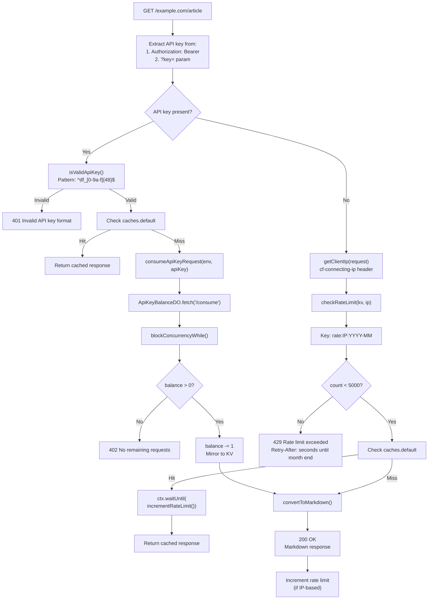
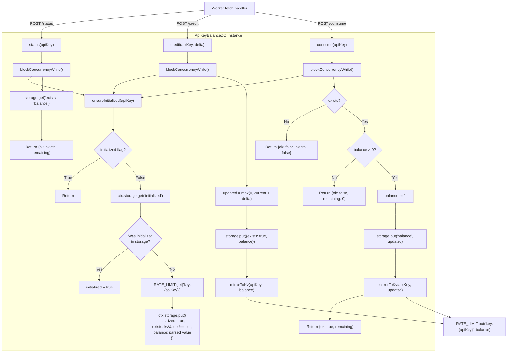
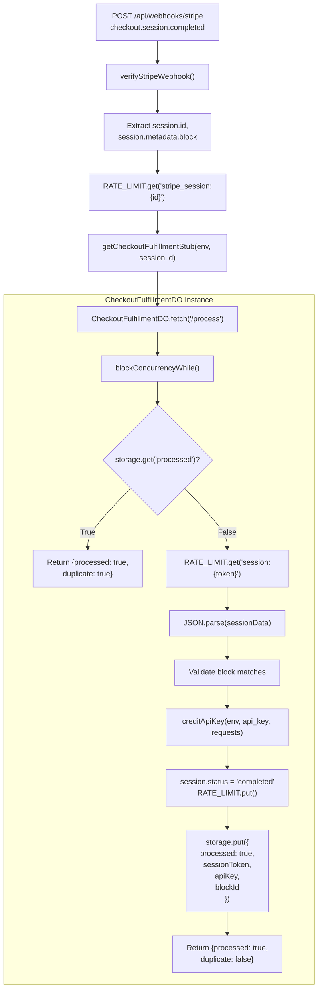
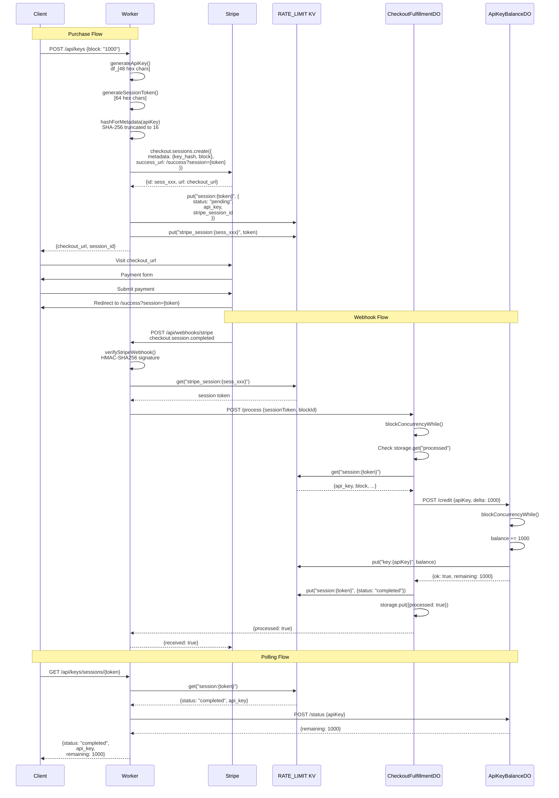

# Cloudflare Worker Architecture

<details>
<summary>Relevant source files</summary>

The following files were used as context for generating this wiki page:

- [.gitignore](.gitignore)
- [website/src/index.ts](website/src/index.ts)
- [website/wrangler.toml](website/wrangler.toml)

</details>


This document explains the architecture of the Defuddle web service deployed on Cloudflare Workers. It covers the Worker's request routing, caching strategy, authentication mechanisms, Durable Objects for API key management, and Stripe payment integration.

For information about the specific API endpoints and their request/response formats, see [API Endpoints](#8.2). For details on the static website pages and playground interface, see [Website and Playground](#8.3). For the complete API key purchase and credit management flow, see [API Key Management](#8.4).

## Worker Entry Point and Environment

The Cloudflare Worker is defined in [website/src/index.ts]() with a single `fetch` handler that processes all incoming requests. The worker environment (`Env` type) binds three critical Cloudflare resources:

| Binding | Type | Purpose |
|---------|------|---------|
| `RATE_LIMIT` | KV Namespace | Stores IP-based rate limits, session records, and API key balance mirrors |
| `API_KEY_BALANCES` | Durable Object Namespace | Manages atomic credit operations for each API key |
| `CHECKOUT_FULFILLMENTS` | Durable Object Namespace | Handles idempotent webhook processing for each checkout session |
| `STRIPE_SECRET_KEY` | Environment Variable | Stripe API authentication |
| `STRIPE_WEBHOOK_SECRET` | Environment Variable | Webhook signature verification |

The bindings are configured in [website/wrangler.toml:6-14]().

**Sources:** [website/src/index.ts:25-31](), [website/wrangler.toml:6-14]()

## Request Routing Architecture



**Sources:** [website/src/index.ts:54-89](), [website/src/index.ts:332-636]()

The Worker uses a three-tier routing strategy:

1. **Domain redirect** [website/src/index.ts:62-66](): Redirects `defuddle.dev` to `defuddle.md`
2. **Static page caching** [website/src/index.ts:69-82](): Checks edge cache for pages in `STATIC_PAGES` set before invoking handlers
3. **Dynamic routing** [website/src/index.ts:332-636](): Routes to static pages, API endpoints, or the URL conversion catch-all

The `STATIC_PAGES` constant [website/src/index.ts:15]() defines paths eligible for edge caching with a 5-minute TTL [website/src/index.ts:16]().

## Caching Strategy

The Worker implements a two-layer caching system optimized for both static content and dynamic conversions:

### Static Page Caching

Static pages are cached at Cloudflare's edge using `caches.default`:



**Sources:** [website/src/index.ts:69-82](), [website/src/index.ts:102-109]()

The caching logic [website/src/index.ts:69-82]() only applies when `useCache` is true (production, not localhost) and the request method is GET. The `ctx.waitUntil()` pattern ensures cache storage happens asynchronously without blocking the response.

### URL Conversion Caching

URL conversions use the same edge cache but with additional logic to prevent consuming API credits for cached responses:

| Request Type | Cache Check Timing | Credit Consumption |
|--------------|-------------------|-------------------|
| API key | Before `consumeApiKeyRequest()` [website/src/index.ts:564-567]() | Only on cache miss |
| IP rate limit | After `checkRateLimit()` [website/src/index.ts:596-604]() | After rate limit check |

Responses are only cached if `wordCount > 0` [website/src/index.ts:622](), preventing caching of extraction failures. The cache TTL is 300 seconds [website/src/index.ts:16](), set via `Cache-Control: s-maxage=300` [website/src/index.ts:616]().

**Sources:** [website/src/index.ts:544-624]()

## Authentication and Rate Limiting



**Sources:** [website/src/index.ts:548-629](), [website/src/index.ts:161-177](), [website/src/index.ts:145-157]()

### API Key Format

API keys follow the pattern `df_[0-9a-f]{48}` [website/src/index.ts:161](), generated from 24 random bytes [website/src/index.ts:163-167](). The `isValidApiKey()` function [website/src/index.ts:175-177]() validates this pattern before processing.

### Rate Limit Implementation

IP-based rate limiting uses monthly windows with keys formatted as `rate:{ip}:{YYYY-MM}` [website/src/index.ts:133-137](). The limit is 5000 requests per month [website/src/index.ts:17](). KV entries automatically expire at month end using `secondsUntilMonthEnd()` [website/src/index.ts:139-143]().

The `getBearerApiKey()` helper [website/src/index.ts:222-234]() extracts and validates API keys from the Authorization header, returning a discriminated union type (`ApiKeyAuthResult`) that forces callers to handle validation failures.

**Sources:** [website/src/index.ts:133-157](), [website/src/index.ts:222-234]()

## Durable Objects Architecture

The Worker uses two Durable Object classes to provide atomic state management and idempotent processing:

### ApiKeyBalanceDO: Credit Management



**Sources:** [website/src/index.ts:638-763]()

Each API key has its own `ApiKeyBalanceDO` instance, identified by the key itself [website/src/index.ts:188-190](). The instance provides three operations via its `fetch()` handler [website/src/index.ts:744-762]():

| Endpoint | Method | Purpose |
|----------|--------|---------|
| `/status` | POST | Read current balance without modification |
| `/credit` | POST | Add credits (accepts `delta` parameter) |
| `/consume` | POST | Atomically decrement balance by 1 |

**Lazy Initialization Pattern:** The DO uses a two-tier initialization [website/src/index.ts:648-673]():
1. Check in-memory `initialized` flag
2. Check durable storage `initialized` key
3. If neither, load existing balance from KV namespace
4. Store all values in durable storage

This pattern allows existing API keys (stored only in KV before DOs were introduced) to be seamlessly migrated.

**Concurrency Control:** All mutating operations use `blockConcurrencyWhile()` [website/src/index.ts:681-742]() to ensure atomic updates. This prevents race conditions when multiple requests attempt to consume credits simultaneously.

**KV Mirroring:** The `mirrorToKv()` function [website/src/index.ts:675-678]() writes balance updates back to KV, allowing fast balance lookups without hitting the DO.

### CheckoutFulfillmentDO: Idempotent Webhook Processing



**Sources:** [website/src/index.ts:765-822](), [website/src/index.ts:470-509]()

Each Stripe checkout session has its own `CheckoutFulfillmentDO` instance, identified by the Stripe session ID [website/src/index.ts:192-194](). The instance handles a single operation:

- **POST /process:** Processes a completed checkout session, crediting the API key exactly once

**Idempotency Guarantee:** The DO checks `storage.get('processed')` [website/src/index.ts:787-790]() at the start of processing. If already processed, it returns immediately, ensuring duplicate webhooks (which Stripe may send) don't double-credit accounts.

**Session Flow:**
1. Webhook arrives with Stripe session ID
2. Worker looks up session token from `stripe_session:{id}` KV key [website/src/index.ts:494]()
3. Worker calls DO's `/process` endpoint [website/src/index.ts:496-500]()
4. DO loads full session record from `session:{token}` KV key [website/src/index.ts:792]()
5. DO credits the API key via `creditApiKey()` [website/src/index.ts:806]()
6. DO marks session as completed [website/src/index.ts:808-811]()
7. DO stores `processed: true` flag [website/src/index.ts:812-817]()

## Stripe Integration Flow



**Sources:** [website/src/index.ts:280-328](), [website/src/index.ts:470-509](), [website/src/index.ts:404-412](), [website/src/index.ts:414-436]()

### Key Security Measures

1. **API Key Hashing:** API keys are never sent to Stripe. Instead, a truncated SHA-256 hash is stored in checkout session metadata [website/src/index.ts:179-182](), [website/src/index.ts:293]()

2. **Session Token Indirection:** The success URL uses a randomly generated session token [website/src/index.ts:169-173](), not the API key, preventing key exposure in browser URLs

3. **Webhook Signature Verification:** The `verifyStripeWebhook()` function [website/src/index.ts:247-278]() implements Stripe's HMAC-SHA256 signature validation with a 5-minute tolerance window [website/src/index.ts:263-264]()

4. **Constant-Time Comparison:** Signature validation uses `constantTimeEquals()` [website/src/index.ts:236-243]() to prevent timing attacks

### Purchase Blocks

Three predefined purchase blocks are defined in the `BLOCKS` constant [website/src/index.ts:19-23]():

| Block ID | Requests | Price (USD) | Stripe unit_amount |
|----------|----------|-------------|-------------------|
| `1000` | 1,000 | $5.00 | 500 cents |
| `10000` | 10,000 | $40.00 | 4000 cents |
| `100000` | 100,000 | $300.00 | 30000 cents |

The same `createCheckoutFlow()` function [website/src/index.ts:280-328]() handles both new key purchases and top-ups, differentiated by the `isTopup` parameter which sets a metadata flag [website/src/index.ts:307]().

## Environment Configuration

The Worker's deployment configuration in `wrangler.toml` defines:

```toml
name = "defuddle"
main = "src/index.ts"
compatibility_date = "2024-12-30"
compatibility_flags = ["nodejs_compat"]

[[kv_namespaces]]
binding = "RATE_LIMIT"
id = "335cf626a6db4759b12bc6855634f3ce"

[durable_objects]
bindings = [
	{ name = "API_KEY_BALANCES", class_name = "ApiKeyBalanceDO" },
	{ name = "CHECKOUT_FULFILLMENTS", class_name = "CheckoutFulfillmentDO" }
]
```

**Sources:** [website/wrangler.toml:1-14]()

The `nodejs_compat` flag [website/wrangler.toml:4]() enables Node.js APIs like `crypto.subtle` used for signature verification. The migration tag [website/wrangler.toml:16-18]() declares the Durable Objects as SQLite-backed (Cloudflare's internal term for DO storage).

Sensitive environment variables (`STRIPE_SECRET_KEY`, `STRIPE_WEBHOOK_SECRET`) are configured via Cloudflare's dashboard or `.dev.vars` file (gitignored) and accessed through the `Env` type [website/src/index.ts:27-28]().
