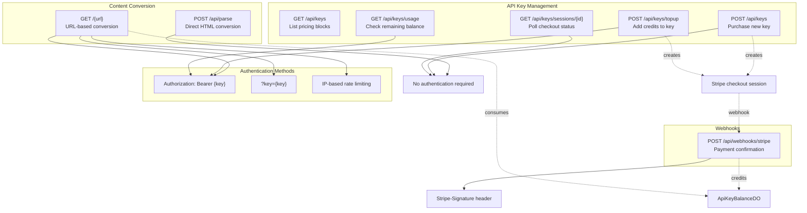
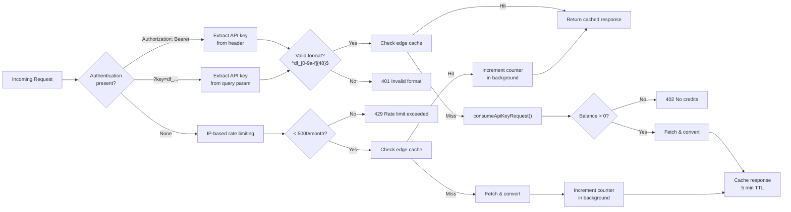
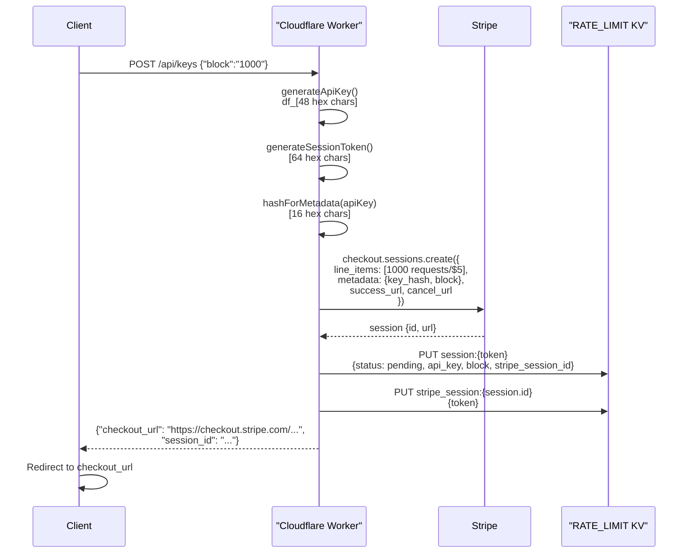
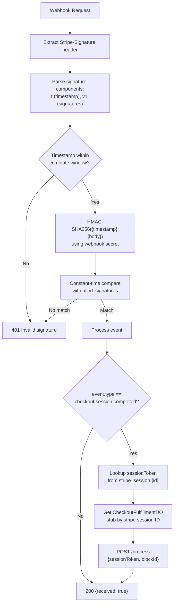
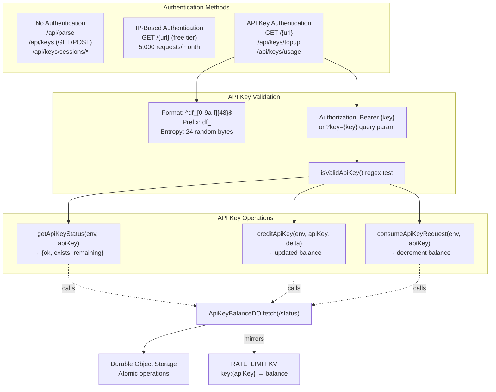
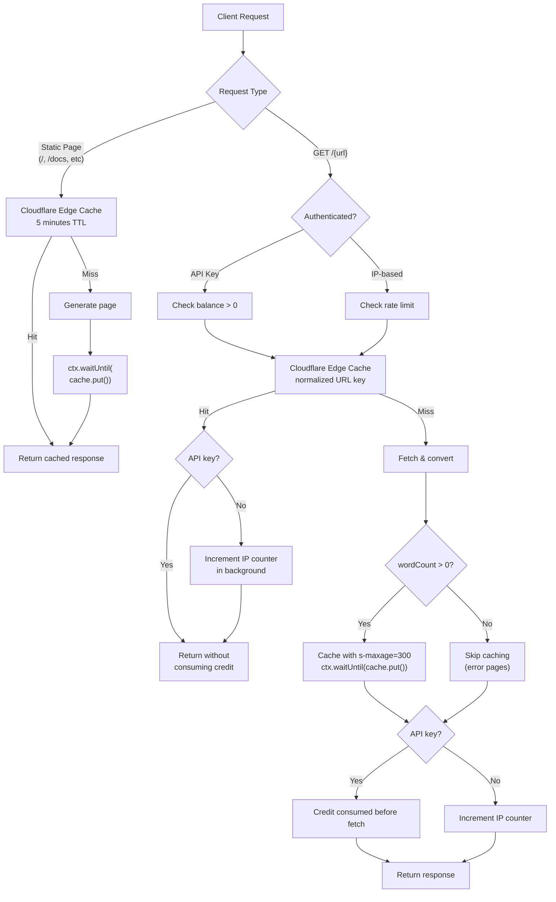
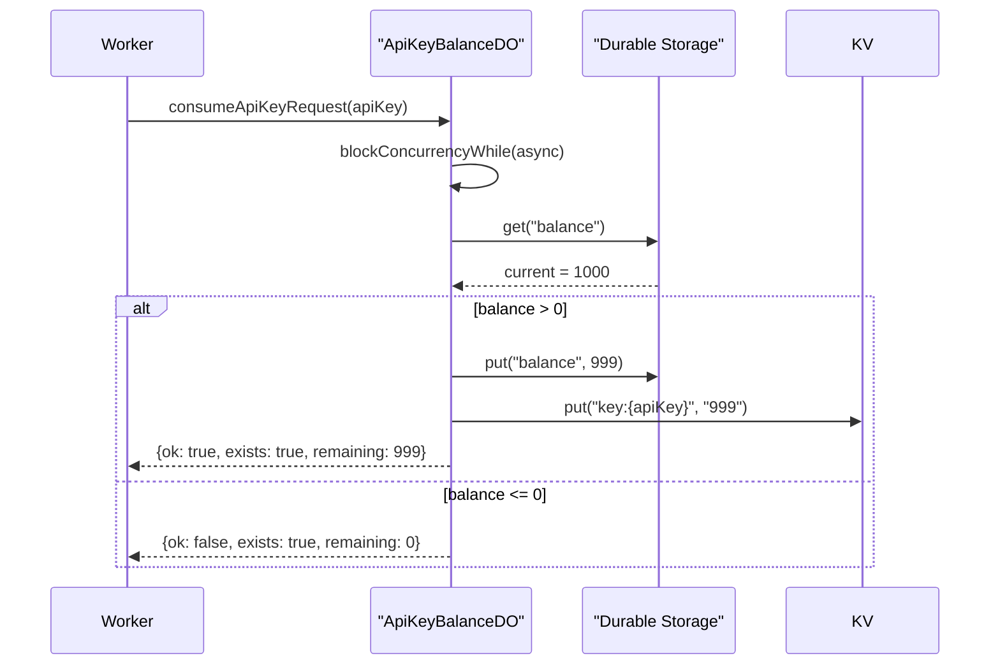

# API Endpoints

<details>
<summary>Relevant source files</summary>

The following files were used as context for generating this wiki page:

- [.gitignore](.gitignore)
- [website/src/index.ts](website/src/index.ts)
- [website/wrangler.toml](website/wrangler.toml)

</details>


This document provides comprehensive documentation for all API endpoints exposed by the Defuddle web service. These endpoints are implemented in the Cloudflare Worker and provide content conversion, API key management, and payment processing functionality.

For information about the overall web service architecture and deployment, see [Cloudflare Worker Architecture](#8.1). For details about the API key lifecycle and Durable Objects implementation, see [API Key Management](#8.4). For information about the static website and playground interface, see [Website and Playground](#8.3).

---

## Endpoint Overview

The Defuddle API provides three categories of endpoints: content conversion, API key management, and webhooks. All endpoints support CORS for cross-origin requests.



**Sources:** [website/src/index.ts:54-636]()

---

## Content Conversion Endpoints

### POST /api/parse

Converts HTML content directly to markdown without fetching from a URL. This endpoint does not require authentication and does not count against rate limits.

**Request Format:**

```json
{
  "html": "<html>...</html>",
  "url": "https://example.com" // optional, used for base URL resolution
}
```

**Response Format:**

```json
{
  "content": "# Extracted Content\n\n...",
  "title": "Page Title",
  "description": "Meta description",
  "author": "Author Name",
  "wordCount": 1234,
  "parseTime": 45.6,
  "metadata": { /* additional metadata */ }
}
```

**Implementation Details:**

The endpoint accepts JSON with an `html` field (required) and optional `url` field. It invokes `parseHtml()` from [website/src/convert.ts]() and returns a structured `DefuddleResponse` object.

| Property | Type | Description |
|----------|------|-------------|
| `html` | string | Required. HTML content to parse |
| `url` | string | Optional. Base URL for resolving relative links |

**Error Responses:**

- `400 Bad Request`: Missing `html` field
- `500 Internal Server Error`: Parsing failure

**Sources:** [website/src/index.ts:366-379]()

---

### GET /{url}

Fetches content from a URL and converts it to markdown. This is the primary content conversion endpoint supporting both free (IP-rate-limited) and authenticated (API key) access.

**URL Format:**

```
GET /https://example.com/article
GET /example.com/article  # https:// is prepended automatically
```

**Authentication Methods:**



**Rate Limiting:**

The system implements two distinct rate limiting strategies:

**IP-Based (Unauthenticated):**
- Limit: 5,000 requests per calendar month per IP address
- Storage: KV namespace with key format `rate:{ip}:{YYYY-MM}`
- Counter incremented after successful response
- Cache hits also count toward rate limit
- Reset: First day of next month

**API Key-Based (Authenticated):**
- Limit: Purchased credit balance
- Storage: Durable Object per API key (atomic operations)
- Credit consumed before request (fail-fast)
- Cache hits do not consume credits
- No automatic reset; requires top-up purchase

**Implementation Details:**

The endpoint follows this processing flow:

1. Parse and validate target URL from path [website/src/index.ts:519-536]()
2. Block self-referential requests to `defuddle.md`, `defuddle.dev`, `localhost` [website/src/index.ts:539-541]()
3. Extract authentication (Bearer header or `?key=` query param) [website/src/index.ts:549-556]()
4. For API keys: validate format, check cache, consume credit atomically [website/src/index.ts:558-576]()
5. For IP-based: check rate limit, check cache, increment counter [website/src/index.ts:578-604]()
6. Fetch and convert content using `convertToMarkdown()` [website/src/index.ts:608]()
7. Format as markdown with metadata header [website/src/index.ts:609]()
8. Cache response for 5 minutes if `wordCount > 0` [website/src/index.ts:615-624]()

**Response Format:**

```
---
title: Article Title
author: John Doe
url: https://example.com/article
---

# Article Title

Converted markdown content...
```

**Error Responses:**

| Code | Condition | Message |
|------|-----------|---------|
| `400` | Invalid URL format | Invalid URL. Please provide a valid web address. |
| `400` | Blocked host | Cannot convert this URL. |
| `401` | Invalid API key format | Invalid API key format. |
| `404` | API key not found | API key not found. |
| `402` | No remaining credits | API key has no remaining requests. Purchase more... |
| `429` | IP rate limit exceeded | Monthly rate limit exceeded (5,000 requests/month)... |
| `502` | Fetch or conversion failure | Error message from exception |

**Caching Behavior:**

Responses are cached at Cloudflare's edge with `s-maxage=300` (5 minutes). The cache key is the normalized target URL. Only responses with `wordCount > 0` are cached to avoid caching error pages.

**Sources:** [website/src/index.ts:511-636](), [website/src/index.ts:131-157](), [website/src/index.ts:222-234]()

---

## API Key Management Endpoints

### GET /api/keys

Lists available pricing blocks for API key purchase. This endpoint provides pricing information and usage instructions.

**Response Format:**

```json
{
  "blocks": [
    { "id": "1000", "requests": 1000, "price": "$5.00" },
    { "id": "10000", "requests": 10000, "price": "$40.00" },
    { "id": "100000", "requests": 100000, "price": "$300.00" }
  ],
  "usage": "POST /api/keys with {\"block\":\"1000\"} to purchase."
}
```

**Sources:** [website/src/index.ts:391-401](), [website/src/index.ts:19-23]()

---

### POST /api/keys

Creates a Stripe checkout session to purchase a new API key with the specified credit block.

**Request Format:**

```json
{
  "block": "1000"  // Optional, defaults to "1000"
}
```

**Processing Flow:**



**Response Format:**

```json
{
  "checkout_url": "https://checkout.stripe.com/c/pay/cs_...",
  "session_id": "a1b2c3d4..."
}
```

**Session Management:**

The endpoint creates two KV records with 24-hour expiration:

1. `session:{sessionToken}` → `SessionRecord` (status, api_key, block, stripe_session_id)
2. `stripe_session:{stripeSessionId}` → `sessionToken` (reverse lookup)

This dual mapping enables both client polling and webhook processing.

**Sources:** [website/src/index.ts:404-412](), [website/src/index.ts:280-328](), [website/src/index.ts:163-173]()

---

### GET /api/keys/sessions/{id}

Polls the status of a checkout session after the client completes or cancels payment. Used to retrieve the API key once payment is confirmed.

**Response Format (Pending):**

```json
{
  "status": "pending"
}
```

HTTP Status: `202 Accepted`

**Response Format (Completed):**

```json
{
  "status": "completed",
  "api_key": "df_a1b2c3d4...",
  "remaining": 1000
}
```

HTTP Status: `200 OK`

**Error Response:**

```json
{
  "error": "Session not found."
}
```

HTTP Status: `404 Not Found`

**Implementation Details:**

The endpoint reads the `SessionRecord` from KV using the session token. If status is `pending`, it returns 202. If status is `completed`, it queries the `ApiKeyBalanceDO` to get the current balance and returns the API key.

**Sources:** [website/src/index.ts:415-436](), [website/src/index.ts:33-38]()

---

### POST /api/keys/topup

Adds credits to an existing API key by creating a Stripe checkout session. Requires Bearer token authentication.

**Authentication:**

```
Authorization: Bearer df_a1b2c3d4...
```

**Request Format:**

```json
{
  "block": "10000"  // Optional, defaults to "1000"
}
```

**Response Format:**

Same as POST /api/keys (checkout session details).

**Error Responses:**

- `401 Unauthorized`: Missing or invalid Bearer token
- `404 Not Found`: API key does not exist

**Implementation Details:**

The endpoint validates the API key exists by calling `getApiKeyStatus()` before creating the checkout session. The checkout metadata includes `topup: 'true'` to distinguish from initial purchases.

**Sources:** [website/src/index.ts:439-454](), [website/src/index.ts:222-234]()

---

### GET /api/keys/usage

Returns the remaining request balance for an API key. Requires Bearer token authentication.

**Authentication:**

```
Authorization: Bearer df_a1b2c3d4...
```

**Response Format:**

```json
{
  "remaining": 8453
}
```

**Error Responses:**

- `401 Unauthorized`: Missing or invalid Bearer token
- `404 Not Found`: API key does not exist

**Implementation Details:**

The endpoint calls `getApiKeyStatus()` which fetches from the `ApiKeyBalanceDO` Durable Object. The DO maintains the authoritative balance in durable storage with KV mirroring for fast reads.

**Sources:** [website/src/index.ts:457-468](), [website/src/index.ts:210-212](), [website/src/index.ts:638-763]()

---

## Webhook Endpoints

### POST /api/webhooks/stripe

Receives Stripe webhook events to process completed checkout sessions. This endpoint verifies the webhook signature and triggers credit allocation.

**Webhook Verification:**



**Implementation Details:**

The webhook handler implements the following security and idempotency measures:

1. **Signature Verification** [website/src/index.ts:247-278]()
   - Parses `Stripe-Signature` header for timestamp and v1 signatures
   - Rejects requests outside 5-minute tolerance window
   - Computes HMAC-SHA256 using webhook secret
   - Uses constant-time comparison to prevent timing attacks

2. **Event Processing** [website/src/index.ts:489-506]()
   - Filters for `checkout.session.completed` events
   - Looks up session token from `stripe_session:{stripeSessionId}` KV record
   - Validates block ID from Stripe metadata

3. **Idempotent Fulfillment** [website/src/index.ts:765-822]()
   - Delegates to `CheckoutFulfillmentDO` per Stripe session
   - Durable Object ensures exactly-once credit allocation
   - Returns success even if already processed (idempotency)

**Response Format:**

```json
{
  "received": true
}
```

**Error Responses:**

- `400 Bad Request`: Missing Stripe signature
- `401 Unauthorized`: Invalid signature or timestamp
- `500 Internal Server Error`: Fulfillment processing failure

**Sources:** [website/src/index.ts:471-509](), [website/src/index.ts:247-278](), [website/src/index.ts:765-822]()

---

## Authentication Mechanisms

The API supports three authentication methods with different authorization levels:



**API Key Format:**

- Pattern: `^df_[0-9a-f]{48}$`
- Generation: `df_` + 24 random bytes encoded as 48 hex characters
- Example: `df_a1b2c3d4e5f6...` (48 hex digits after prefix)

**API Key Lifecycle:**

1. **Generation**: `generateApiKey()` creates cryptographically random key [website/src/index.ts:163-167]()
2. **Validation**: `isValidApiKey()` checks format [website/src/index.ts:175-177]()
3. **Storage**: Durable Object per key with KV mirroring
4. **Operations**: All balance mutations are atomic via Durable Object

**Sources:** [website/src/index.ts:161-177](), [website/src/index.ts:196-220](), [website/src/index.ts:638-763]()

---

## Response Formats and Error Codes

All API responses use JSON format with CORS headers for cross-origin access.

**Standard Response Headers:**

```
Content-Type: application/json; charset=utf-8
Access-Control-Allow-Origin: *
```

**Error Response Format:**

```json
{
  "error": "Descriptive error message"
}
```

**HTTP Status Code Reference:**

| Code | Meaning | Usage |
|------|---------|-------|
| `200` | Success | Successful operation |
| `202` | Accepted | Checkout session pending |
| `204` | No Content | Favicon request |
| `301` | Moved Permanently | Domain redirect (defuddle.dev → defuddle.md) |
| `400` | Bad Request | Invalid input, missing fields, blocked URL |
| `401` | Unauthorized | Invalid API key, missing auth, invalid webhook signature |
| `402` | Payment Required | API key has no remaining credits |
| `404` | Not Found | API key not found, session not found, unknown route |
| `429` | Too Many Requests | IP rate limit exceeded |
| `500` | Internal Server Error | Parsing error, unexpected exception |
| `502` | Bad Gateway | Failed to fetch target URL |
| `503` | Service Unavailable | Required service not configured |

**CORS Preflight Handling:**

```
OPTIONS * → 200 OK
Access-Control-Allow-Origin: *
Access-Control-Allow-Methods: GET, POST, OPTIONS
Access-Control-Allow-Headers: Content-Type, Authorization
```

**Sources:** [website/src/index.ts:102-129](), [website/src/index.ts:338-346]()

---

## Caching Strategy

The API implements a multi-layer caching strategy to minimize redundant processing and API costs:



**Cache Key Construction:**

- **Static Pages**: Original request URL (`https://defuddle.md/docs`)
- **URL Conversion**: Normalized target URL (`https://example.com/article`)

**Cache Invalidation:**

- TTL-based: 5 minutes for static pages, 5 minutes for converted content
- No manual invalidation (content is rarely updated within 5 minutes)

**Critical Cache Ordering:**

For authenticated requests, cache is checked **before** consuming API key credits to avoid charging for cached hits [website/src/index.ts:564-567](). For IP-based requests, cache hits still increment the rate limit counter [website/src/index.ts:596-603]().

**Background Operations:**

Cache updates and rate limit increments use `ctx.waitUntil()` to avoid blocking the response:

```typescript
ctx.waitUntil(cache.put(cacheKey, response.clone()));
ctx.waitUntil(incrementRateLimit(env.RATE_LIMIT, ip));
```

**Sources:** [website/src/index.ts:69-82](), [website/src/index.ts:564-567](), [website/src/index.ts:596-604](), [website/src/index.ts:615-624]()

---

## Rate Limiting Implementation

The system implements two distinct rate limiting mechanisms based on authentication method.

### IP-Based Rate Limiting

**Configuration:**

- Limit: 5,000 requests per calendar month
- Storage: KV namespace with key pattern `rate:{ip}:{YYYY-MM}`
- Scope: Per IP address extracted from `cf-connecting-ip` or `x-forwarded-for` headers

**Implementation Functions:**

| Function | Purpose | Returns |
|----------|---------|---------|
| `getRateLimitKey(ip)` | Constructs monthly key | `"rate:1.2.3.4:2024-01"` |
| `secondsUntilMonthEnd()` | Calculates TTL | Seconds until next month |
| `checkRateLimit(kv, ip)` | Checks current count | `{allowed: boolean, count: number}` |
| `incrementRateLimit(kv, ip)` | Increments counter | `void` |

**Monthly Reset:**

KV records have an expiration TTL set to the number of seconds until the end of the current calendar month (UTC). When the month ends, the key expires and the count resets to 0.

**Sources:** [website/src/index.ts:98-100](), [website/src/index.ts:133-157]()

### API Key Rate Limiting

**Configuration:**

- Limit: Purchased credit balance (1,000 / 10,000 / 100,000 requests)
- Storage: Durable Object per API key with atomic operations
- Mirroring: KV namespace `key:{apiKey}` for fast reads

**Atomic Operations:**

All balance mutations use `ctx.blockConcurrencyWhile()` to ensure atomicity:



**Durable Object Benefits:**

1. **Atomicity**: Single-threaded execution within DO ensures race-free decrements
2. **Consistency**: Storage operations are transactional
3. **Availability**: Per-key isolation prevents contention
4. **Durability**: Automatic replication and persistence

**Sources:** [website/src/index.ts:638-763](), [website/src/index.ts:713-742]()
