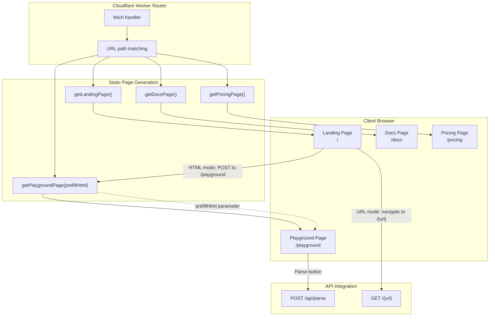
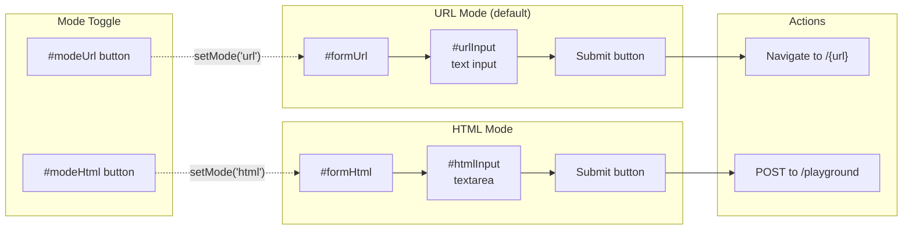
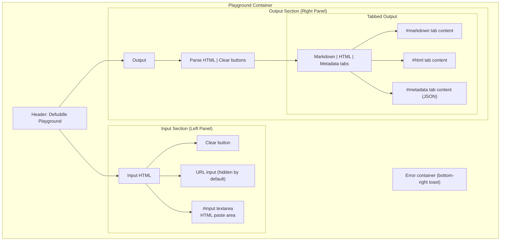
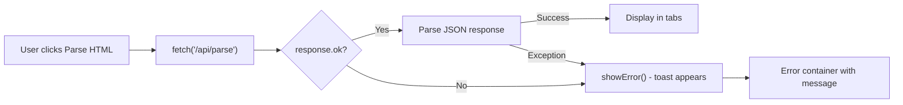
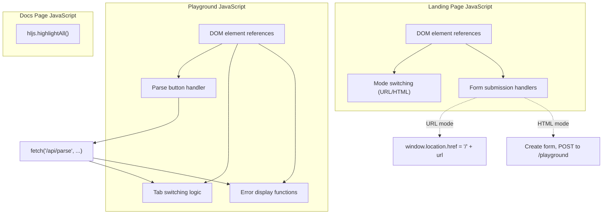

# Website and Playground

<details>
<summary>Relevant source files</summary>

The following files were used as context for generating this wiki page:

- [tests/debug.test.ts](tests/debug.test.ts)
- [website/src/docs.ts](website/src/docs.ts)
- [website/src/landing.ts](website/src/landing.ts)
- [website/src/playground.ts](website/src/playground.ts)

</details>


This page documents the static website pages served by the Cloudflare Worker, including the landing page, documentation, and interactive playground. These pages provide a web interface for accessing Defuddle's functionality and documentation. For information about the API endpoints that these pages interact with, see [API Endpoints](#8.2). For information about the overall worker architecture and routing, see [Cloudflare Worker Architecture](#8.1).

## Overview

The Defuddle web service includes four primary static pages, all generated as complete HTML strings from TypeScript functions:

| Page | Route | Function | Purpose |
|------|-------|----------|---------|
| Landing | `/` | `getLandingPage()` | Main entry point with URL/HTML conversion forms |
| Documentation | `/docs` | `getDocsPage()` | Complete API and usage documentation |
| Playground | `/playground` | `getPlaygroundPage()` | Interactive HTML-to-Markdown testing interface |
| Pricing | `/pricing` | `getPricingPage()` | API pricing and payment information |

Each page is a self-contained HTML document with embedded CSS and JavaScript, requiring no external dependencies except for highlight.js on the documentation page.

**Sources:** [website/src/landing.ts:1-291](), [website/src/docs.ts:1-575](), [website/src/playground.ts:1-400]()

## Page Architecture



**Diagram: Static page generation and routing flow**

Each page generation function returns a complete HTML string. The Cloudflare Worker's fetch handler matches the request URL path and calls the appropriate function, then returns the HTML with `Content-Type: text/html` headers.

**Sources:** [website/src/landing.ts:1-2](), [website/src/docs.ts:1-2](), [website/src/playground.ts:1-9]()

## Landing Page

The landing page at `/` serves as the primary entry point to Defuddle's web service. It implements a dual-mode interface for converting content to Markdown.

### Dual-Mode Interface

The landing page provides two conversion modes, toggled via buttons:



**Diagram: Landing page mode switching and form submission flow**

**URL Mode** (default): Users enter a URL, which is stripped of the protocol (`https://`) and appended to the root path. For example, entering `https://example.com/article` navigates to `/example.com/article`, which triggers the URL conversion API endpoint.

**HTML Mode**: Users paste HTML directly into a textarea. On submission, a hidden form is created and POSTed to `/playground` with the HTML as the `html` field value. The playground page then receives this HTML and displays the parsed results.

**Sources:** [website/src/landing.ts:188-209](), [website/src/landing.ts:244-287]()

### Content Sections

The landing page includes several informational sections below the conversion interface:

| Section | Content | Purpose |
|---------|---------|---------|
| API Usage | `curl defuddle.md/stephango.com` | Show simple curl API usage |
| Browser Extension | Link to Obsidian Web Clipper | Promote browser extension integration |
| Bookmarklets | Two draggable bookmarklet links | Provide quick conversion from any page |
| Footer | Links to GitHub, NPM, docs, etc. | Navigation and external resources |

The bookmarklets implement two behaviors:
1. **Defuddle**: Opens current page in Defuddle (`window.location.href = 'https://defuddle.md/'+location.href`)
2. **Copy as md**: Fetches Markdown and copies to clipboard, shows checkmark in title temporarily

**Sources:** [website/src/landing.ts:213-236]()

### Styling

The landing page uses a dark theme with Flexoki color palette:

- Background: `#100F0F`
- Text: `#B7B5AC`
- Headings: `#F2F0E5`
- Accents: `#878580`
- Borders: `#343331`
- Input backgrounds: `#1C1B1A`

The interface is responsive, hiding the "Markdown" text in the submit button on mobile (`@media (max-width: 480px)`).

**Sources:** [website/src/landing.ts:9-181]()

## Documentation Page

The documentation page at `/docs` provides comprehensive usage instructions and API reference. It is a static HTML page with embedded syntax highlighting for code examples.

### Documentation Structure

The page includes the following sections:

1. **Installation**: npm install commands for different environments
2. **Browser use**: `new Defuddle(document).parse()` examples
3. **Node.js use**: Examples with linkedom and jsdom
4. **CLI use**: Command-line options and examples
5. **Options**: Table of `DefuddleOptions` configuration
6. **Response**: Table of `DefuddleResponse` properties
7. **Bundles**: Comparison of core, full, and Node.js bundles
8. **HTML standardization**: Explanation of element normalization
9. **Debugging**: Debug mode and pipeline toggles

**Sources:** [website/src/docs.ts:272-561]()

### Syntax Highlighting

The documentation page uses [highlight.js](https://highlightjs.org/) for syntax highlighting of code examples. The library is loaded from a CDN and initialized on page load:

```javascript
<script src="https://cdnjs.cloudflare.com/ajax/libs/highlight.js/11.11.1/highlight.min.js"></script>
<script>hljs.highlightAll();</script>
```

Custom CSS for syntax highlighting uses the Flexoki color scheme, with specific colors for keywords, strings, comments, functions, and other language constructs.

**Sources:** [website/src/docs.ts:571-572](), [website/src/docs.ts:10-73]()

### Table of Contents

The documentation includes a two-column table of contents with internal anchor links:

- Installation
- Browser use
- Node.js use
- CLI use
- Options
- Response
- Bundles
- HTML standardization
- Debugging

The TOC is styled with a background box and collapses to a single column on mobile devices.

**Sources:** [website/src/docs.ts:228-262](), [website/src/docs.ts:274-286]()

## Playground Interface

The playground at `/playground` provides an interactive interface for testing Defuddle's HTML parsing and conversion capabilities. It features a split-panel layout with input on the left and output on the right.

### Interface Layout



**Diagram: Playground interface component hierarchy**

The interface uses CSS Grid for the two-column layout, which collapses to a single column on mobile devices (≤768px).

**Sources:** [website/src/playground.ts:76-82](), [website/src/playground.ts:241-255](), [website/src/playground.ts:264-300]()

### Output Tabs

The playground displays parsing results in three tabs:

| Tab | Content | Source |
|-----|---------|--------|
| Markdown | `result.content` | The main Markdown output from the API |
| HTML | `result.contentHtml` | Cleaned HTML before Markdown conversion |
| Metadata | All other fields as JSON | `result` object minus content fields |

Tabs are implemented using vanilla JavaScript with `.active` class toggling. Each tab has a corresponding `.tab-content` element that is shown/hidden.

**Sources:** [website/src/playground.ts:284-297](), [website/src/playground.ts:369-383]()

### API Integration

When the user clicks "Parse HTML", the playground makes a POST request to `/api/parse`:

```javascript
var response = await fetch('/api/parse', {
    method: 'POST',
    headers: { 'Content-Type': 'application/json' },
    body: JSON.stringify({
        html: input.value,
        url: urlInput.value || undefined
    })
});
```

The response is expected to be JSON containing:
- `content`: The Markdown output
- `contentHtml`: The cleaned HTML
- Additional metadata fields (title, author, description, etc.)

The playground separates `content` and `contentHtml` from the other metadata for display in different tabs.

**Sources:** [website/src/playground.ts:334-357]()

### Pre-filling from Landing Page

The playground can be pre-filled with HTML when accessed via POST from the landing page. The `getPlaygroundPage(prefillHtml)` function accepts an optional parameter:

1. The HTML is escaped for safe embedding in the textarea value attribute
2. Special characters are escaped: `&`, `<`, `>`, `"`, `` ` ``, `$`
3. The escaped HTML is inserted into the textarea's text content
4. If the textarea has content on load, the Parse button is automatically clicked

This creates a seamless flow: user pastes HTML on landing page → submits → playground opens with HTML → auto-parses → shows results.

**Sources:** [website/src/playground.ts:1-8](), [website/src/playground.ts:274](), [website/src/playground.ts:394-396]()

### Error Handling

The playground includes error handling with a toast notification in the bottom-right corner:



**Diagram: Playground error handling flow**

Errors are caught in a try-catch block and displayed in a fixed-position container that appears as a toast notification. The error container has a red background (`#AF3029`) and is positioned at `bottom: 1rem; right: 1rem`.

**Sources:** [website/src/playground.ts:329-367](), [website/src/playground.ts:385-392]()

### Responsive Design

The playground adapts to different screen sizes:

- **Desktop** (>768px): Two-column grid layout, fixed height with scrollable panels
- **Mobile** (≤768px): Single column layout, auto height, scrollable page, minimum 400px height per section

The layout uses flexbox within each section to ensure proper scrolling behavior, with `min-height: 0` to allow flex children to shrink below their content size.

**Sources:** [website/src/playground.ts:241-255]()

## Client-Side JavaScript Architecture

All three main pages use vanilla JavaScript (no framework dependencies) for interactivity. The code follows a consistent pattern:



**Diagram: Client-side JavaScript organization across pages**

### Variable Naming Convention

All JavaScript uses `var` declarations and stores DOM element references at the top of the script block:

**Landing page:**
- `modeUrl`, `modeHtml`: Mode toggle buttons
- `formUrl`, `formHtml`: Form elements
- `urlInput`, `htmlInput`: Input fields

**Playground:**
- `input`: HTML textarea
- `markdownOutput`, `htmlOutput`, `metadataOutput`: Output display elements
- `parseBtn`, `clearInputBtn`, `clearOutputBtn`: Action buttons
- `tabs`, `tabContents`: Tab UI elements

**Sources:** [website/src/landing.ts:239-242](), [website/src/playground.ts:306-316]()

### Event Listeners

Event listeners are attached using `addEventListener()`:

**Landing page:**
- Mode toggle buttons: Switch between URL/HTML forms
- URL form submit: Strip protocol, navigate to `/{url}`
- HTML form submit: Create hidden form, POST to `/playground`

**Playground:**
- Parse button: Fetch from API, update output tabs
- Clear buttons: Reset input/output areas
- Tab buttons: Switch between Markdown/HTML/Metadata views

All form submissions use `e.preventDefault()` to override default browser behavior and implement custom navigation/submission logic.

**Sources:** [website/src/landing.ts:260-287](), [website/src/playground.ts:318-383]()

---

**Sources:** [website/src/landing.ts:1-291](), [website/src/docs.ts:1-575](), [website/src/playground.ts:1-400]()
