# API Key Management

<details>
<summary>Relevant source files</summary>

The following files were used as context for generating this wiki page:

- [.gitignore](.gitignore)
- [website/src/index.ts](website/src/index.ts)
- [website/wrangler.toml](website/wrangler.toml)

</details>


The API Key Management system provides paid access to Defuddle's web service API with higher rate limits than the free IP-based tier. It implements a credit-based system where users purchase blocks of API requests (1,000 / 10,000 / 100,000) through Stripe checkout. The system uses Cloudflare Durable Objects for atomic credit management and idempotent payment processing.

For information about the API endpoints that consume credits, see [API Endpoints](#8.2). For the overall web service architecture, see [Cloudflare Worker Architecture](#8.1).

## System Overview

The API key system consists of four main components:

| Component | Purpose | Implementation |
|-----------|---------|----------------|
| **Key Generation** | Create cryptographically secure API keys | `generateApiKey()` function |
| **Purchase Flow** | Handle Stripe checkout for new keys and top-ups | `createCheckoutFlow()` + session tracking |
| **Credit Management** | Atomic balance operations per API key | `ApiKeyBalanceDO` Durable Object |
| **Webhook Processing** | Idempotent credit allocation from Stripe events | `CheckoutFulfillmentDO` Durable Object |

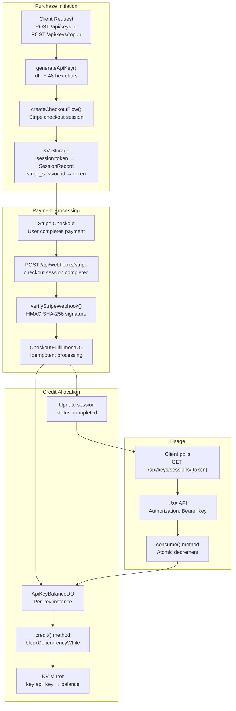

**Sources:** [website/src/index.ts:19-31](), [website/src/index.ts:163-220](), [website/src/index.ts:280-328]()

## API Key Format and Generation

API keys follow a specific format to enable validation and prevent typos. The `generateApiKey()` function produces cryptographically secure keys using the Web Crypto API.

### Key Format

```
df_[48 hexadecimal characters]
```

Example: `df_a1b2c3d4e5f6...` (total length: 51 characters)

The pattern is enforced by `API_KEY_PATTERN` regex: `/^df_[0-9a-f]{48}$/`

### Generation Process

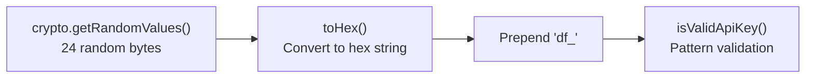

The `toHex()` helper converts byte arrays to hexadecimal strings. A 24-byte random value produces 48 hex characters when encoded.

**Sources:** [website/src/index.ts:161-177](), [website/src/index.ts:94-96]()

## Purchase Blocks and Pricing

The system offers three purchase blocks with different credit allocations:

| Block ID | Requests | Price (USD) | Use Case |
|----------|----------|-------------|----------|
| `1000` | 1,000 | $5.00 | Trial / small projects |
| `10000` | 10,000 | $40.00 | Regular usage |
| `100000` | 100,000 | $300.00 | High-volume applications |

Block definitions are stored in the `BLOCKS` constant as a `Record<string, { requests: number; price: number; name: string }>`.

**Sources:** [website/src/index.ts:19-23]()

## Purchase Flow

### Initial Purchase (New API Key)

When creating a new API key, the flow generates both the key and a session token, then initiates Stripe checkout:

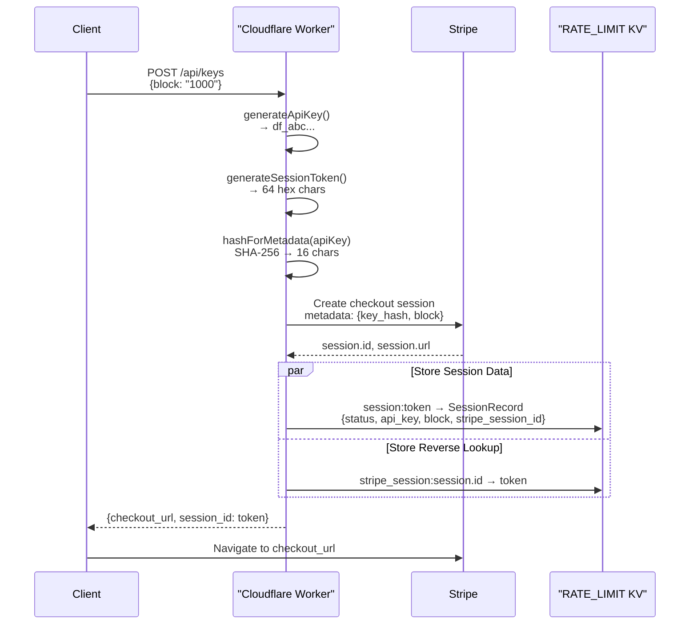

The `SessionRecord` type tracks the checkout state:

```typescript
type SessionRecord = {
    status: 'pending' | 'completed';
    api_key: string;
    block: string;
    stripe_session_id: string;
}
```

Session tokens use `generateSessionToken()` which creates 64 hex characters (32 random bytes). Both session records expire after 24 hours (86400 seconds).

**Sources:** [website/src/index.ts:404-412](), [website/src/index.ts:280-328](), [website/src/index.ts:169-173](), [website/src/index.ts:33-38]()

### Top-Up Flow (Existing API Key)

For adding credits to an existing key, the client provides the API key via Bearer authentication:

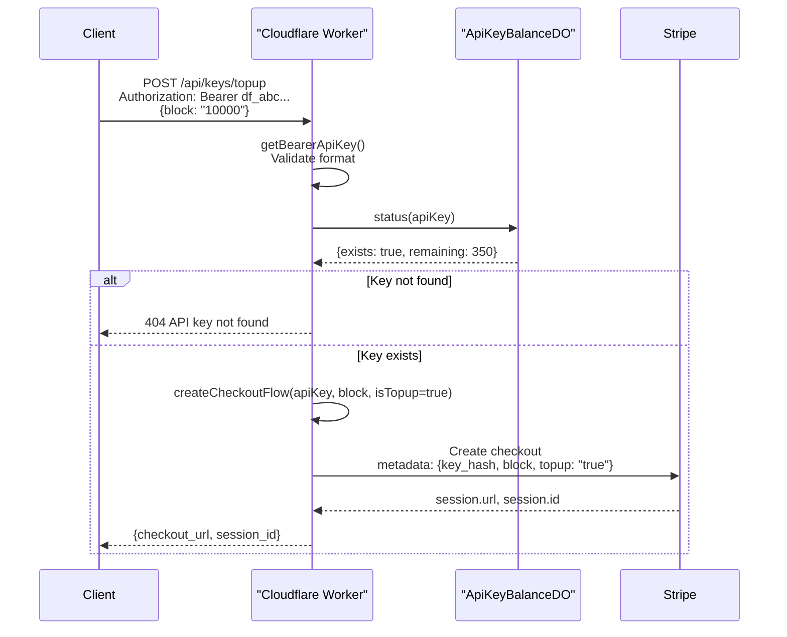

The top-up flow reuses `createCheckoutFlow()` but sets `isTopup: true` in the Stripe metadata and passes the existing `apiKey` instead of generating a new one.

**Sources:** [website/src/index.ts:439-454](), [website/src/index.ts:222-234](), [website/src/index.ts:280-328]()

## Durable Objects Architecture

The system uses two Durable Object classes to provide transactional guarantees and prevent race conditions:

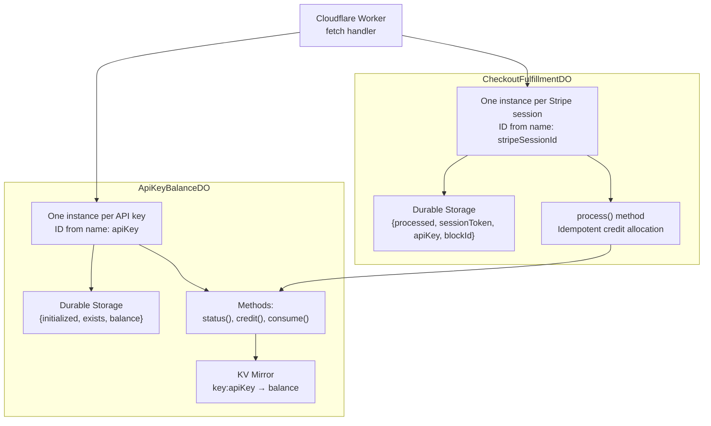

### ApiKeyBalanceDO

Each API key has its own Durable Object instance providing atomic balance operations. The instance ID is derived from the API key itself using `idFromName(apiKey)`.

#### Storage Schema

| Key | Type | Purpose |
|-----|------|---------|
| `initialized` | `boolean` | Tracks whether storage has been seeded from KV |
| `exists` | `boolean` | Whether this API key has ever been credited |
| `balance` | `number` | Current request count remaining |

#### Methods

**`status(apiKey: string)`** - Returns current balance without modification:

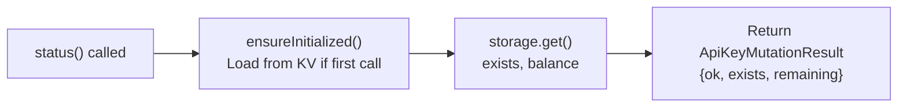

**`credit(apiKey: string, delta: number)`** - Atomically adds credits:

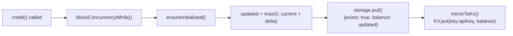

**`consume(apiKey: string)`** - Atomically decrements balance by 1:

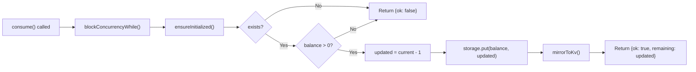

All methods use `blockConcurrencyWhile()` to ensure atomic execution. The `mirrorToKv()` function writes the current balance to the `RATE_LIMIT` KV namespace for fast read access without invoking the Durable Object.

**Sources:** [website/src/index.ts:638-763](), [website/src/index.ts:188-190](), [website/src/index.ts:210-220]()

### CheckoutFulfillmentDO

Each Stripe checkout session has its own Durable Object instance providing idempotent payment processing. The instance ID is derived from the Stripe session ID using `idFromName(stripeSessionId)`.

#### Idempotency Guarantee

The `process()` method ensures duplicate webhook deliveries don't credit accounts multiple times:

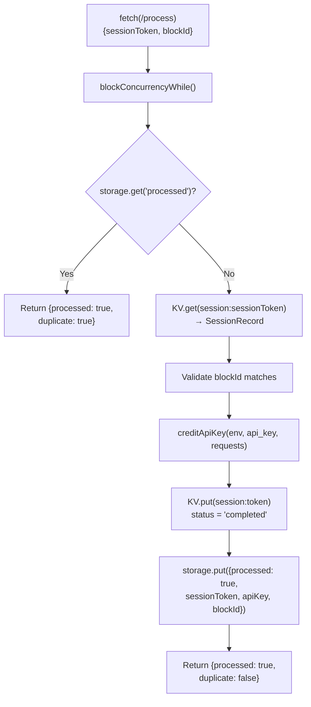

The stored `processed` flag prevents re-execution even if Stripe sends the webhook multiple times. Once set, subsequent calls immediately return `{processed: true, duplicate: true}`.

**Sources:** [website/src/index.ts:765-822](), [website/src/index.ts:192-194]()

## Webhook Processing

Stripe sends `checkout.session.completed` events to `POST /api/webhooks/stripe` when payments succeed. The system verifies webhook authenticity using HMAC-SHA256 signatures before processing.

### Signature Verification

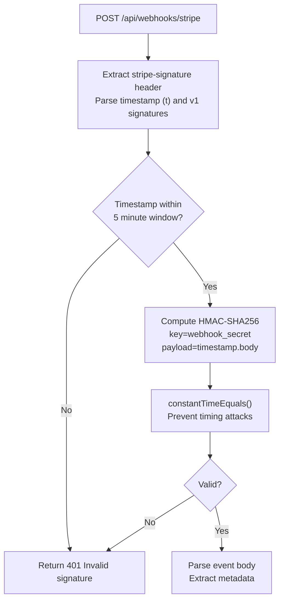

The `verifyStripeWebhook()` function implements Stripe's signature scheme:

1. Extract timestamp (`t`) and v1 signature values from the `stripe-signature` header
2. Reject if timestamp is more than 5 minutes old (prevents replay attacks)
3. Construct signed payload: `${timestamp}.${body}`
4. Compute HMAC-SHA256 using `STRIPE_WEBHOOK_SECRET`
5. Compare computed signature against all v1 values using constant-time comparison

The `constantTimeEquals()` function prevents timing-based attacks by ensuring comparison time is independent of where strings differ.

**Sources:** [website/src/index.ts:247-278](), [website/src/index.ts:236-243](), [website/src/index.ts:471-509]()

### Event Processing Flow

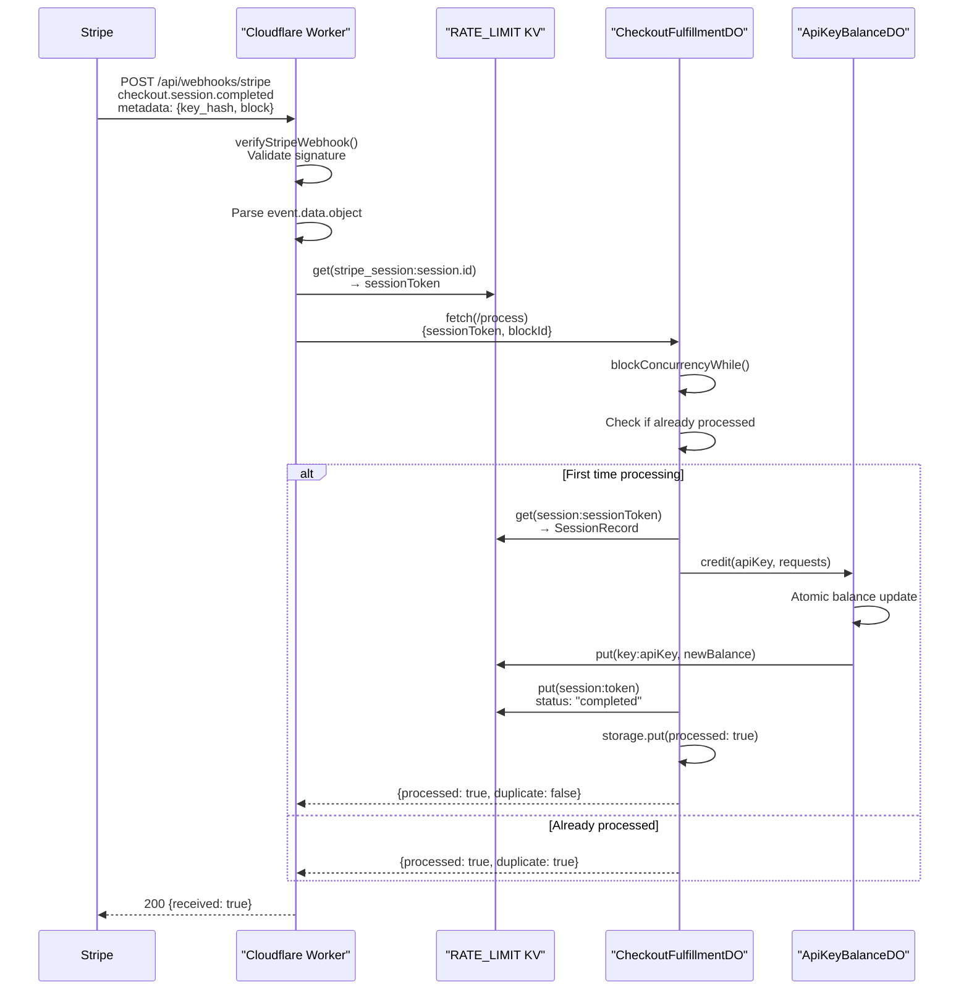

The two-level lookup (`stripe_session:id → token → SessionRecord`) allows the webhook to find the correct session data and API key to credit.

**Sources:** [website/src/index.ts:471-509](), [website/src/index.ts:765-822]()

## Authentication Methods

API keys can be provided in two ways when making requests to content conversion endpoints:

### Authorization Header (Recommended)

```
Authorization: Bearer df_a1b2c3d4e5f6...
```

The `getBearerApiKey()` helper extracts and validates the key:

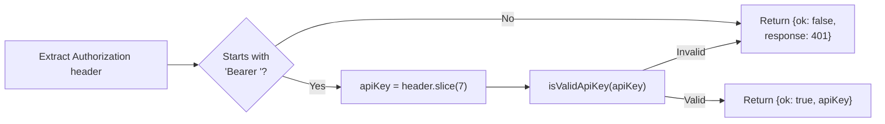

### Query Parameter

```
GET /example.com/article?key=df_a1b2c3d4e5f6...
```

The worker checks `url.searchParams.has('key')` and extracts the value. This method is less secure since URLs may be logged but is convenient for testing.

**Sources:** [website/src/index.ts:222-234](), [website/src/index.ts:549-557]()

## Credit Consumption

When a request includes an API key, the system atomically consumes one credit before performing work:

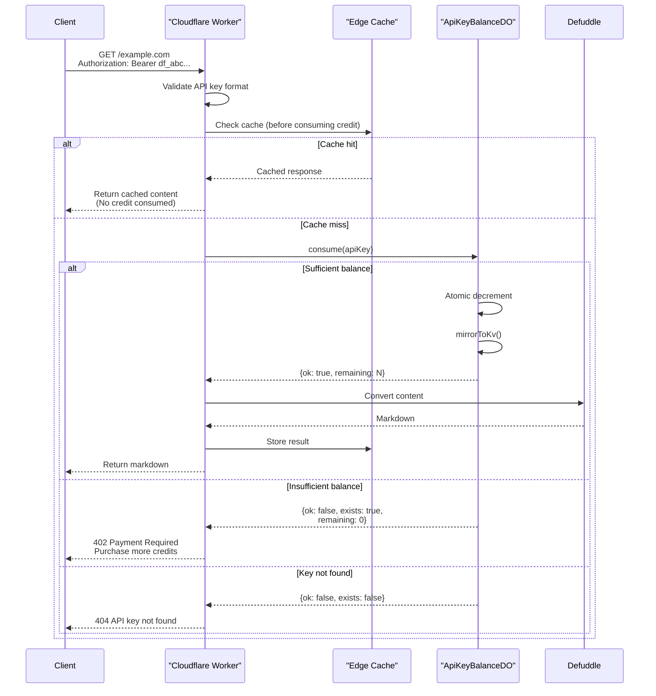

Critical ordering:
1. **Cache check before consumption** - Prevents wasting credits on cached content
2. **Atomic consumption before work** - Ensures credit is reserved before expensive operations
3. **Mirror to KV** - Enables fast balance checks without invoking Durable Object

**Sources:** [website/src/index.ts:564-606](), [website/src/index.ts:713-742]()

## Session Polling

After initiating checkout, clients poll for completion using the session token:

```
GET /api/keys/sessions/{sessionToken}
```

### Response States

| Status | HTTP Code | Response Body | Meaning |
|--------|-----------|---------------|---------|
| Pending | 202 | `{status: "pending"}` | Payment not yet completed |
| Completed | 200 | `{status: "completed", api_key: "df_...", remaining: N}` | Credits allocated, key ready |
| Not Found | 404 | `{error: "Session not found."}` | Invalid or expired token |

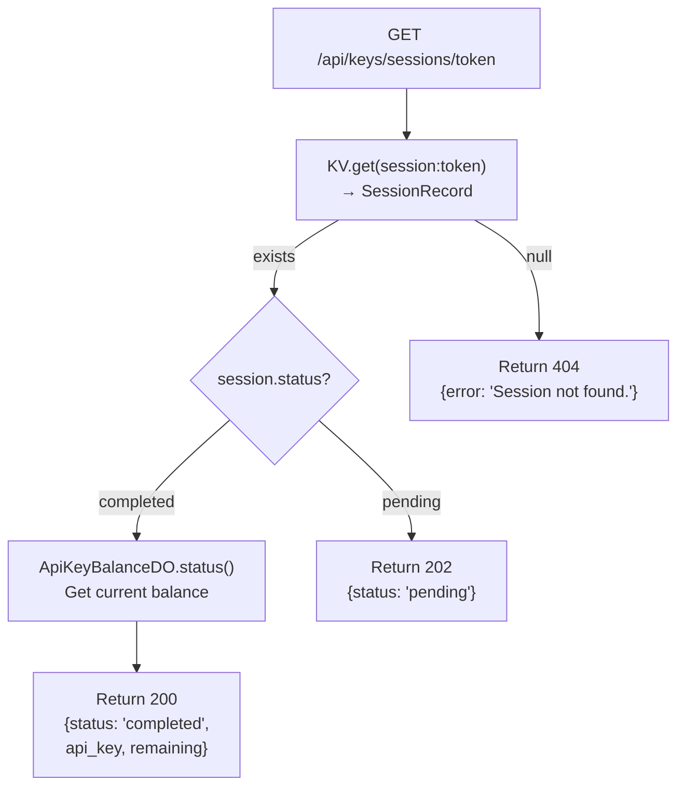

The webhook handler updates `session.status` from `'pending'` to `'completed'` after successfully crediting the account. Sessions expire after 24 hours.

**Sources:** [website/src/index.ts:414-436]()

## Usage Checking

Clients can check remaining balance at any time:

```
GET /api/keys/usage
Authorization: Bearer df_abc...
```

Response:
```json
{
  "remaining": 9847
}
```

This endpoint invokes `ApiKeyBalanceDO.status()` which reads from durable storage (not the KV mirror), ensuring accuracy even if KV is stale.

**Sources:** [website/src/index.ts:457-468](), [website/src/index.ts:680-692]()

## Configuration

### Environment Variables

The system requires the following bindings in `wrangler.toml`:

| Binding | Type | Purpose |
|---------|------|---------|
| `RATE_LIMIT` | KV Namespace | Session tracking, KV mirrors, IP rate limits |
| `STRIPE_SECRET_KEY` | Secret | Stripe API authentication |
| `STRIPE_WEBHOOK_SECRET` | Secret | Webhook signature verification |
| `API_KEY_BALANCES` | Durable Object | `ApiKeyBalanceDO` namespace |
| `CHECKOUT_FULFILLMENTS` | Durable Object | `CheckoutFulfillmentDO` namespace |

### Durable Object Migrations

The `wrangler.toml` includes a migration tag to initialize SQLite-backed Durable Objects:

```toml
[[migrations]]
tag = "v1"
new_sqlite_classes = ["ApiKeyBalanceDO", "CheckoutFulfillmentDO"]
```

This ensures each Durable Object instance has persistent SQLite storage.

**Sources:** [website/wrangler.toml:1-19](), [website/src/index.ts:25-31]()

## Error Handling

The system returns specific error codes for different failure modes:

| Status | Condition | Message |
|--------|-----------|---------|
| 400 | Invalid block ID | `Invalid block. Options: 1000, 10000, 100000` |
| 401 | Missing/invalid Authorization header | `Missing Authorization: Bearer API key.` or `Invalid API key format.` |
| 402 | Insufficient credits | `API key has no remaining requests. Purchase more at /api/keys or top up at /api/keys/topup` |
| 404 | API key doesn't exist | `API key not found.` |
| 409 | Block mismatch in webhook | `Block mismatch.` |
| 503 | Missing environment configuration | `Payments not configured.` |

All errors return JSON with `{error: "message"}` and appropriate CORS headers.

**Sources:** [website/src/index.ts:121-129](), [website/src/index.ts:571-576]()
