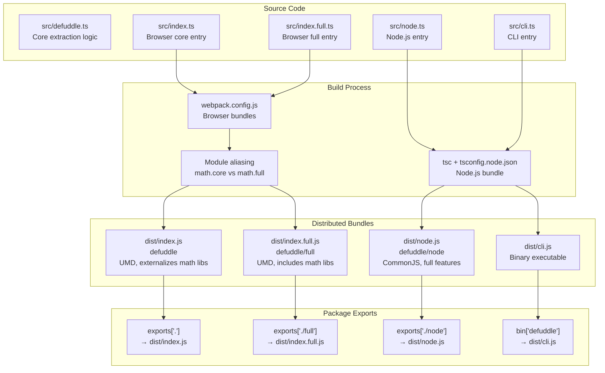
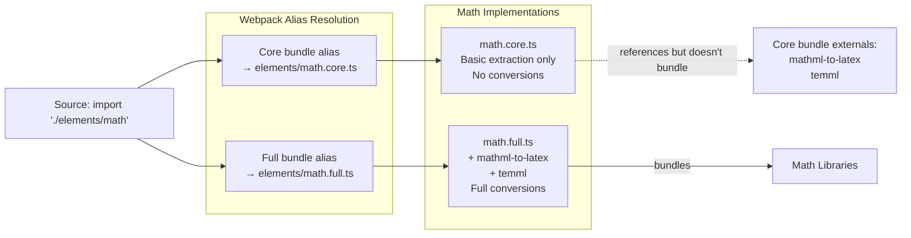
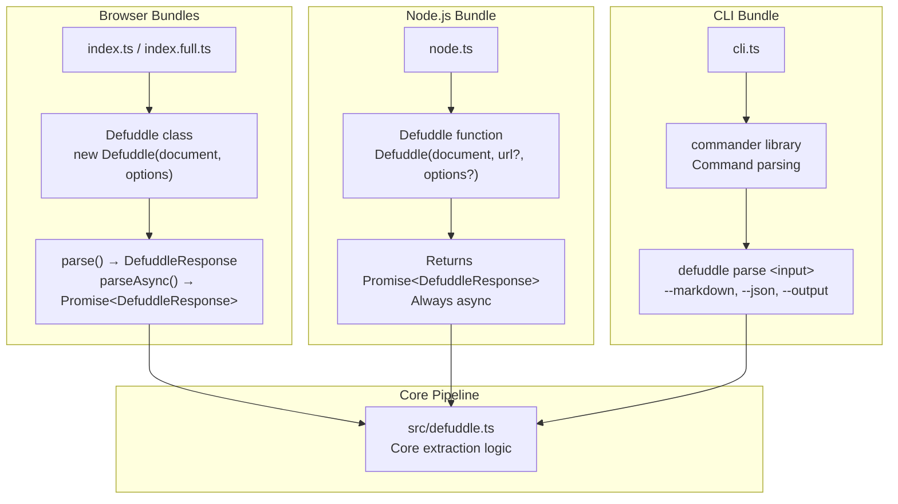

# Usage and Integration

<details>
<summary>Relevant source files</summary>

The following files were used as context for generating this wiki page:

- [README.md](README.md)
- [package-lock.json](package-lock.json)
- [package.json](package.json)
- [src/metadata.ts](src/metadata.ts)
- [src/types.ts](src/types.ts)
- [tsconfig.node.json](tsconfig.node.json)
- [webpack.config.js](webpack.config.js)

</details>


This document provides an overview of how to integrate and use Defuddle across different environments: browser, Node.js, and command line. It covers the three bundle variants and their corresponding integration methods, explaining which bundle to use in which context and how the library adapts to different runtime environments.

For detailed usage instructions specific to each environment, see [Browser Usage](#9.1), [Node.js Integration](#9.2), and [Command Line Interface](#9.3). For configuration options available across all environments, see [Configuration and Options](#10).

## Overview of Integration Methods

Defuddle supports three primary integration methods, each targeting a specific runtime environment:

| Integration Method | Bundle Used | Primary Interface | Target Environment |
|-------------------|-------------|-------------------|-------------------|
| Browser | `defuddle` or `defuddle/full` | `new Defuddle(document)` class | Web browsers |
| Node.js | `defuddle/node` | `Defuddle(document, url, options)` function | Node.js runtime |
| CLI | Binary via `defuddle` command | Command-line arguments | Terminal/shell |

Each method provides access to the core extraction pipeline but adapts its interface and dependencies to suit the runtime environment.

Sources: [README.md:19-134](), [package.json:1-103]()

## Bundle Distribution Architecture

Defuddle is distributed as three distinct bundles, each optimized for different environments and feature requirements:

**Bundle Distribution Diagram**



Sources: [package.json:24-39](), [webpack.config.js:1-102](), [tsconfig.node.json:1-19]()

### Bundle Comparison

| Feature | `defuddle` (Core) | `defuddle/full` | `defuddle/node` |
|---------|------------------|-----------------|-----------------|
| **Target** | Browser | Browser | Node.js |
| **Format** | UMD | UMD | CommonJS |
| **Size** | Lightweight (~40KB) | Larger (~120KB) | Medium |
| **Math Libraries** | External (user provides) | Bundled (mathml-to-latex, temml) | Bundled |
| **Markdown** | No (turndown not available) | No (turndown not available) | Yes (turndown included) |
| **DOM** | Native browser | Native browser | linkedom/jsdom required |
| **Entry Point** | [src/index.ts]() | [src/index.full.ts]() | [src/node.ts]() |
| **Math Module** | [src/elements/math.core.ts]() | [src/elements/math.full.ts]() | [src/elements/math.full.ts]() |

Sources: [webpack.config.js:48-99](), [package.json:75-83](), [README.md:159-167]()

### Module Aliasing Strategy

The build system uses Webpack's module aliasing to compile different bundles from the same source code. This allows the core bundle to externalize heavy dependencies while the full bundle includes them.



Sources: [webpack.config.js:67-73](), [webpack.config.js:92-98](), [webpack.config.js:52-55]()

## Entry Points and Interfaces

Each bundle exposes a different interface optimized for its target environment:

**Interface Architecture Diagram**



Sources: [src/index.ts](), [src/index.full.ts](), [src/node.ts](), [src/cli.ts](), [package.json:6-8]()

### Browser Interface

The browser bundles expose a class-based interface:

```typescript
// From src/index.ts or src/index.full.ts
new Defuddle(document: Document, options?: DefuddleOptions)
  .parse(): DefuddleResponse
  .parseAsync(): Promise<DefuddleResponse>
```

This interface assumes the DOM is already available and uses synchronous parsing by default. See [Browser Usage](#9.1) for detailed examples.

Sources: [README.md:22-34]()

### Node.js Interface

The Node.js bundle uses a functional interface that always returns a Promise:

```typescript
// From src/node.ts
Defuddle(
  document: Document,
  url?: string,
  options?: DefuddleOptions
): Promise<DefuddleResponse>
```

This interface requires a DOM implementation (linkedom or jsdom) and accepts the URL as a separate parameter since Node.js documents don't have a location property. See [Node.js Integration](#9.2) for detailed examples.

Sources: [README.md:36-64]()

### CLI Interface

The CLI provides command-line argument parsing:

```bash
# From bin entry point
defuddle parse <input> [options]
  --output, -o <file>      Write to file
  --markdown, -m, --md     Convert to markdown
  --json, -j               Output as JSON
  --property, -p <name>    Extract specific property
  --debug                  Enable debug mode
```

The CLI internally uses the Node.js bundle with linkedom. See [Command Line Interface](#9.3) for detailed examples.

Sources: [README.md:68-103](), [package.json:6-8]()

## DOM Implementation Requirements

The table below summarizes DOM requirements for each integration method:

| Integration | DOM Source | Configuration |
|-------------|-----------|---------------|
| **Browser** | Native browser DOM (`window.document`) | No configuration needed |
| **Node.js** | linkedom (recommended) or jsdom | Must install separately: `npm install linkedom` |
| **CLI** | linkedom (bundled dependency) | Automatically handled |

For Node.js integration, while any DOM implementation works, linkedom is recommended for its lightweight footprint and speed. The functional interface accepts any `Document` object conforming to the DOM specification.

Sources: [README.md:38-64](), [README.md:110-134](), [package.json:78-82]()

## Optional Dependencies

Defuddle uses optional dependencies to keep the core bundle lightweight:

| Dependency | Used By | Purpose |
|-----------|---------|---------|
| `mathml-to-latex` | Full bundle, Node.js bundle | Convert MathML to LaTeX format |
| `temml` | Full bundle, Node.js bundle | Convert LaTeX to MathML format |
| `turndown` | Node.js bundle only | Convert HTML to Markdown |
| `linkedom` | Node.js bundle, CLI | DOM implementation for Node.js |
| `commander` | CLI only | Command-line argument parsing |

The core browser bundle externalizes all these dependencies, expecting users to provide math libraries if needed. The full browser bundle includes math libraries but not turndown (since Markdown conversion is rarely needed in browsers). The Node.js bundle includes all features.

Sources: [package.json:75-83](), [webpack.config.js:52-55](), [README.md:159-167]()

## Response Format

All integration methods return a `DefuddleResponse` object with the same structure:

| Property | Type | Description |
|----------|------|-------------|
| `content` | string | Cleaned HTML or Markdown (if `markdown: true`) |
| `contentMarkdown` | string? | Separate Markdown content (if `separateMarkdown: true`) |
| `title` | string | Article title |
| `author` | string | Article author |
| `description` | string | Article description/summary |
| `domain` | string | Domain name |
| `favicon` | string | Favicon URL |
| `image` | string | Main image URL |
| `language` | string | Page language (BCP 47 format) |
| `published` | string | Publication date |
| `site` | string | Site name |
| `schemaOrgData` | object | Raw Schema.org JSON-LD data |
| `metaTags` | object | Meta tag collection |
| `wordCount` | number | Word count of extracted content |
| `parseTime` | number | Parse time in milliseconds |
| `debug` | object? | Debug information (if `debug: true`) |

Sources: [src/types.ts:34-41](), [README.md:136-157]()

## Installation

Installation varies by integration method:

**Browser (via npm)**
```bash
npm install defuddle
# Core bundle: import Defuddle from 'defuddle'
# Full bundle: import Defuddle from 'defuddle/full'
```

**Node.js**
```bash
npm install defuddle
npm install linkedom  # or jsdom
```

**CLI (global)**
```bash
npm install -g defuddle
```

**CLI (npx, no install)**
```bash
npx defuddle parse <input>
```

For detailed usage instructions after installation, see the respective environment-specific pages: [Browser Usage](#9.1), [Node.js Integration](#9.2), or [Command Line Interface](#9.3).

Sources: [README.md:104-134]()
