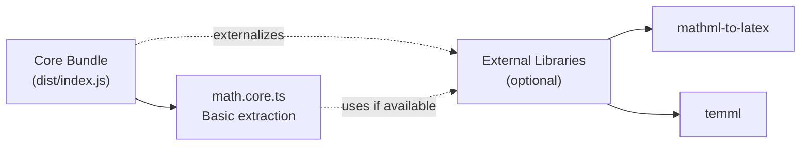
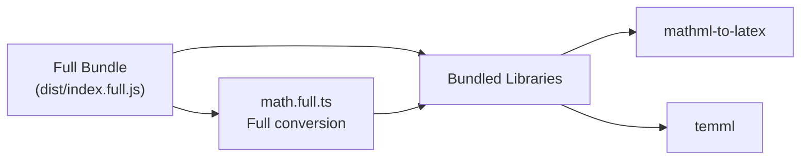
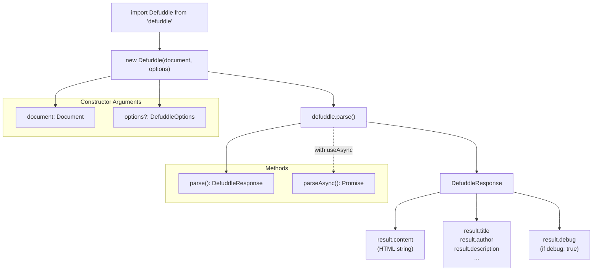
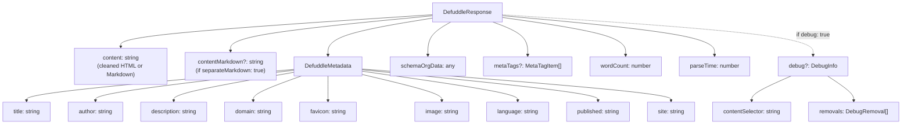
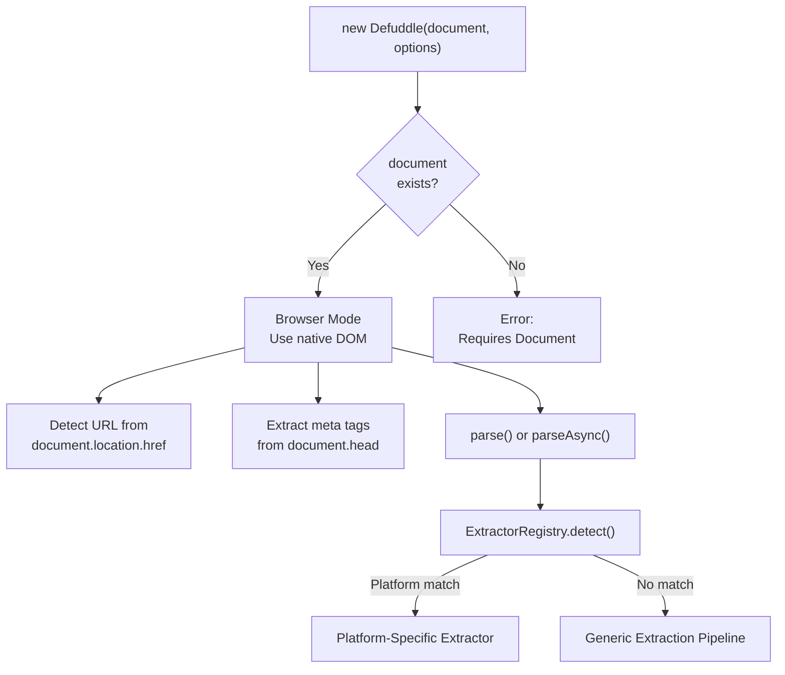

# Browser Usage

<details>
<summary>Relevant source files</summary>

The following files were used as context for generating this wiki page:

- [README.md](README.md)
- [package-lock.json](package-lock.json)
- [package.json](package.json)
- [src/metadata.ts](src/metadata.ts)
- [src/types.ts](src/types.ts)
- [tsconfig.node.json](tsconfig.node.json)
- [webpack.config.js](webpack.config.js)

</details>


This page explains how to use Defuddle in browser environments, including installation, bundle selection, basic usage patterns, and configuration options. For Node.js usage, see [Node.js Integration](#9.2). For command-line usage, see [Command Line Interface](#9.3).

## Installation

Install Defuddle via npm:

```bash
npm install defuddle
```

No additional dependencies are required for the core bundle. The full bundle includes all necessary libraries internally.

**Sources:** [package.json:1-103](), [README.md:104-108]()

## Bundle Selection

Defuddle provides two browser bundles optimized for different use cases:

| Bundle | Import Path | Size | Dependencies | Math Conversion | Use Case |
|--------|-------------|------|--------------|-----------------|----------|
| **Core** | `defuddle` | Lightweight | None (externals) | Basic extraction only | General content extraction, minimal bundle size |
| **Full** | `defuddle/full` | Larger | Bundled internally | Full LaTeX ↔ MathML | Math-heavy content, complete feature set |

### Core Bundle Architecture



The core bundle uses Webpack's `externals` configuration to exclude math libraries, keeping bundle size minimal. Math content is extracted in raw form (MathML/LaTeX strings) without conversion.

**Sources:** [webpack.config.js:48-74](), [package.json:78-82]()

### Full Bundle Architecture



The full bundle includes `mathml-to-latex` and `temml` via module aliasing, enabling bidirectional LaTeX ↔ MathML conversion. It supports complete math standardization as described in [Math Content Standardization](#5.4).

**Sources:** [webpack.config.js:77-99](), [package.json:78-82]()

## Basic Usage

### Importing the Library

```javascript
// Core bundle (default)
import Defuddle from 'defuddle';

// Full bundle
import Defuddle from 'defuddle/full';
```

Both bundles export as UMD modules compatible with CommonJS, AMD, and global script usage:

```html
<!-- Via script tag -->
<script src="node_modules/defuddle/dist/index.js"></script>
<script>
  const defuddle = new Defuddle(document);
  const result = defuddle.parse();
</script>
```

**Sources:** [README.md:22-34](), [webpack.config.js:56-64](), [webpack.config.js:82-89]()

### Synchronous Parsing

```javascript
import Defuddle from 'defuddle';

// Parse the current document
const defuddle = new Defuddle(document);
const result = defuddle.parse();

// Access extracted content and metadata
console.log(result.content);      // Cleaned HTML
console.log(result.title);        // Article title
console.log(result.author);       // Author name
console.log(result.description);  // Description/summary
console.log(result.wordCount);    // Word count
console.log(result.parseTime);    // Parse duration (ms)
```

The `parse()` method processes the document synchronously and returns a `DefuddleResponse` object immediately. This is the recommended approach for browser usage.

**Sources:** [README.md:23-34](), [src/types.ts:34-41]()

### Asynchronous Parsing

```javascript
import Defuddle from 'defuddle';

// Parse with async extractors enabled
const defuddle = new Defuddle(document, { useAsync: true });
const result = await defuddle.parseAsync();
```

The `parseAsync()` method enables platform-specific extractors that may fetch additional content from third-party APIs when local HTML is insufficient. This is primarily used for client-side rendered applications. See [Platform-Specific Extractors](#6) for details.

**Sources:** [README.md:254](), [src/types.ts:85-90]()

### Browser Usage Flow



**Sources:** [src/types.ts:34-41](), [src/types.ts:43-126]()

## Configuration Options

The `Defuddle` constructor accepts an optional second parameter with configuration options:

```javascript
const defuddle = new Defuddle(document, {
  debug: true,              // Enable debug mode
  markdown: true,           // Convert to Markdown
  removeImages: false,      // Keep images
  contentSelector: 'main'   // Use specific selector
});
```

### Browser-Specific Options

| Option | Type | Default | Description |
|--------|------|---------|-------------|
| `debug` | boolean | `false` | Enable debug logging and return debug info |
| `url` | string | - | URL of the page (usually auto-detected) |
| `markdown` | boolean | `false` | Convert content to Markdown (requires full bundle or external turndown) |
| `separateMarkdown` | boolean | `false` | Keep HTML in `content`, add Markdown in `contentMarkdown` |
| `removeImages` | boolean | `false` | Remove all images from content |
| `contentSelector` | string | - | CSS selector for main content, bypasses auto-detection |

**Sources:** [src/types.ts:43-126](), [README.md:169-184]()

### Pipeline Control Options

Control individual extraction pipeline phases:

| Option | Type | Default | Description |
|--------|------|---------|-------------|
| `removeExactSelectors` | boolean | `true` | Remove ads, social buttons via exact CSS selectors |
| `removePartialSelectors` | boolean | `true` | Remove elements via partial class/id matching |
| `removeHiddenElements` | boolean | `true` | Remove CSS-hidden elements (`display:none`, etc.) |
| `removeLowScoring` | boolean | `true` | Remove low-scoring blocks via content scoring |
| `removeSmallImages` | boolean | `true` | Remove small images (icons, pixels) |
| `standardize` | boolean | `true` | Standardize HTML (footnotes, code, math) |
| `useAsync` | boolean | `true` | Allow async API fallbacks |

These options enable fine-grained control over the [Clutter Removal Pipeline](#4.3) and [Content Standardization](#5) phases.

**Sources:** [src/types.ts:67-120](), [README.md:169-184]()

### Options Usage Example

```javascript
import Defuddle from 'defuddle/full';

// Parse with custom configuration
const defuddle = new Defuddle(document, {
  debug: true,                    // Get debug information
  markdown: true,                 // Output as Markdown
  removeHiddenElements: false,    // Keep CSS sidenotes
  removeLowScoring: false,        // Disable content scoring
  contentSelector: 'article.post' // Use specific element
});

const result = defuddle.parse();

// Access debug information
console.log(result.debug.contentSelector);  // Shows chosen element
console.log(result.debug.removals);         // Lists removed elements
```

**Sources:** [README.md:262-279](), [src/types.ts:29-32]()

## Response Format

The `parse()` and `parseAsync()` methods return a `DefuddleResponse` object:

### Response Object Structure



**Sources:** [src/types.ts:34-41](), [src/types.ts:1-14](), [README.md:136-156]()

### Metadata Extraction

Metadata is extracted using a multi-source priority strategy via the `MetadataExtractor` class:

1. **Schema.org** JSON-LD data (highest priority)
2. **Open Graph** meta tags
3. **Twitter Card** meta tags
4. **Standard meta tags**
5. **DOM elements** (fallback)

See [Metadata Extraction](#4.2) for detailed extraction logic.

**Sources:** [src/metadata.ts:3-57](), [README.md:136-156]()

### Response Properties Reference

| Property | Type | Description |
|----------|------|-------------|
| `content` | string | Cleaned HTML or Markdown content |
| `contentMarkdown` | string | Markdown content (if `separateMarkdown: true`) |
| `title` | string | Article title (cleaned from site name) |
| `author` | string | Author name(s) |
| `description` | string | Article description/summary |
| `domain` | string | Domain name without www prefix |
| `favicon` | string | URL to favicon |
| `image` | string | URL to main article image |
| `language` | string | BCP 47 language code (e.g., `en-US`) |
| `published` | string | Publication date (ISO 8601) |
| `site` | string | Website/publication name |
| `schemaOrgData` | object | Raw Schema.org JSON-LD data |
| `metaTags` | MetaTagItem[] | Extracted meta tags |
| `wordCount` | number | Total word count in content |
| `parseTime` | number | Parse duration in milliseconds |
| `debug` | DebugInfo | Debug information (if `debug: true`) |
| `extractorType` | string | Name of extractor used (if platform-specific) |

**Sources:** [src/types.ts:34-41](), [src/types.ts:1-14](), [README.md:136-156]()

## Advanced Usage

### Using External Math Libraries with Core Bundle

The core bundle externalizes math conversion libraries to reduce bundle size. You can provide these libraries externally if needed:

```html
<script src="https://cdn.jsdelivr.net/npm/mathml-to-latex@1.5.0/dist/mathml-to-latex.min.js"></script>
<script src="https://cdn.jsdelivr.net/npm/temml@0.13.1/dist/temml.min.js"></script>
<script src="node_modules/defuddle/dist/index.js"></script>

<script>
  // Core bundle will use globally available math libraries
  const defuddle = new Defuddle(document);
  const result = defuddle.parse();
</script>
```

Without external libraries, the core bundle extracts math content in raw form without conversion between LaTeX and MathML formats.

**Sources:** [webpack.config.js:52-55](), [README.md:160-167]()

### Debug Mode

Enable debug mode to inspect content extraction decisions:

```javascript
const defuddle = new Defuddle(document, { debug: true });
const result = defuddle.parse();

// Inspect chosen content element
console.log(result.debug.contentSelector);
// Example output: "article.post-content"

// Review removed elements
result.debug.removals.forEach(removal => {
  console.log(`Step: ${removal.step}`);
  console.log(`Reason: ${removal.reason}`);
  console.log(`Selector: ${removal.selector}`);
  console.log(`Text preview: ${removal.text.substring(0, 50)}...`);
});
```

Debug mode preserves HTML structure and attributes that are normally stripped, making it easier to diagnose extraction issues. See [Debugging Features](#11.1) for complete documentation.

**Sources:** [README.md:259-295](), [src/types.ts:22-32]()

### Content Selector Override

Bypass automatic content detection by specifying the main content element:

```javascript
// Use specific element for content
const defuddle = new Defuddle(document, {
  contentSelector: 'article.post-content'
});

const result = defuddle.parse();
```

If the selector doesn't match any element, Defuddle falls back to automatic detection using entry point selectors and content scoring. See [Content Identification and Scoring](#4.1) for auto-detection details.

**Sources:** [README.md:311-321](), [src/types.ts:123-125]()

### Markdown Conversion

Convert extracted content to Markdown (requires full bundle):

```javascript
import Defuddle from 'defuddle/full';

const defuddle = new Defuddle(document, {
  markdown: true
});

const result = defuddle.parse();
console.log(result.content);  // Markdown string
```

Alternatively, keep both HTML and Markdown:

```javascript
const defuddle = new Defuddle(document, {
  separateMarkdown: true
});

const result = defuddle.parse();
console.log(result.content);         // HTML string
console.log(result.contentMarkdown); // Markdown string
```

The core bundle does not include markdown conversion. For markdown support with the core bundle, use the Node.js bundle instead. See [Markdown Conversion](#7) for details on the conversion system.

**Sources:** [README.md:174-176](), [src/types.ts:56-65]()

### Pipeline Debugging

Disable individual pipeline steps to diagnose extraction issues:

```javascript
// Disable content scoring to see raw extraction
const result1 = new Defuddle(document, {
  removeLowScoring: false,
  debug: true
}).parse();

// Disable hidden element removal (useful for sidenote layouts)
const result2 = new Defuddle(document, {
  removeHiddenElements: false
}).parse();

// Disable small image removal
const result3 = new Defuddle(document, {
  removeSmallImages: false
}).parse();
```

Use `debug: true` to inspect what each pipeline step removes. See [Clutter Removal Pipeline](#4.3) for details on each phase.

**Sources:** [README.md:296-309](), [src/types.ts:67-120]()

## Browser Environment Detection

Defuddle automatically detects the browser environment using the global `document` object:



The browser environment provides direct access to the native DOM, CSS computed styles, and document metadata. This differs from Node.js usage where a DOM implementation (linkedom/jsdom) must be provided. See [Node.js Integration](#9.2) for server-side usage.

**Sources:** [src/metadata.ts:8-11](), [src/metadata.ts:23-29]()
