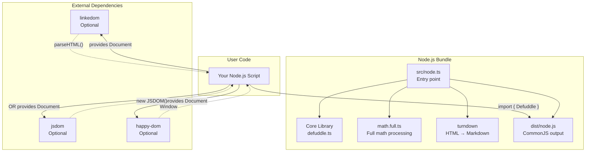
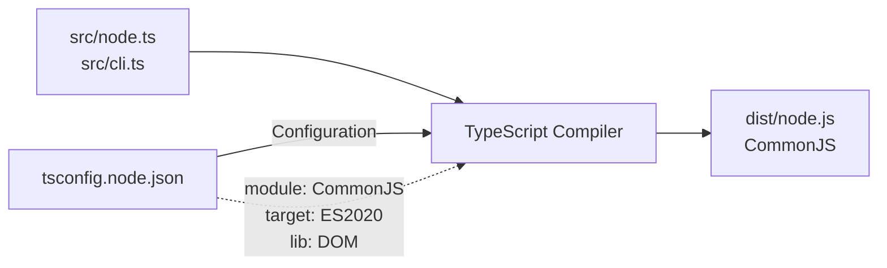
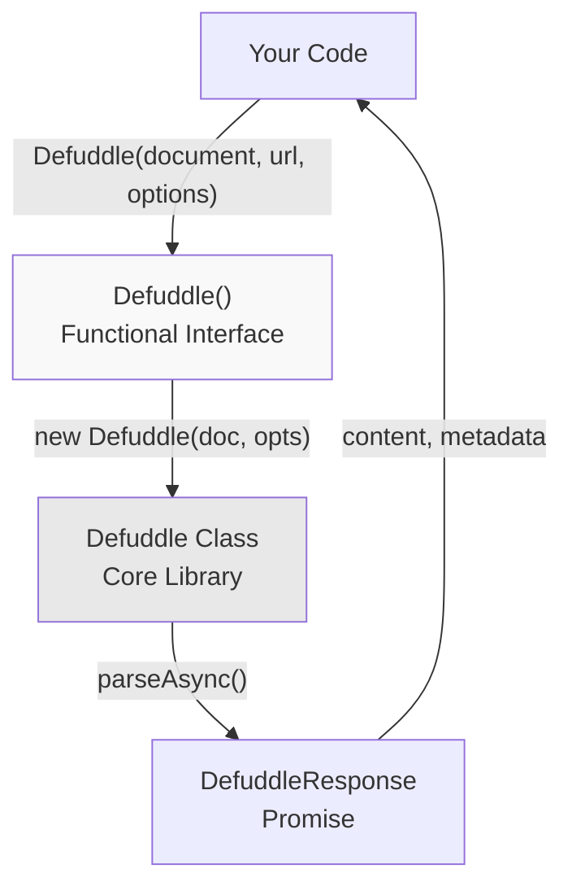
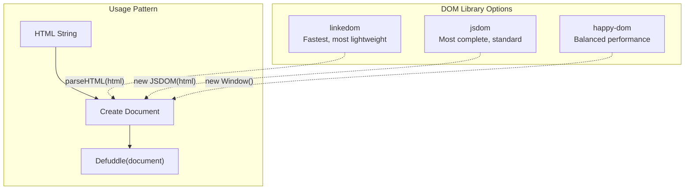
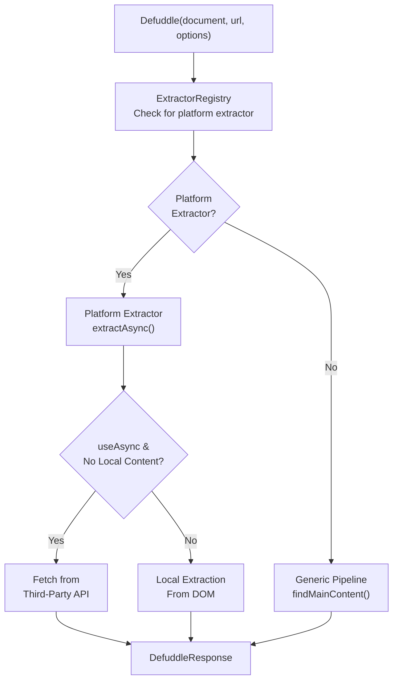
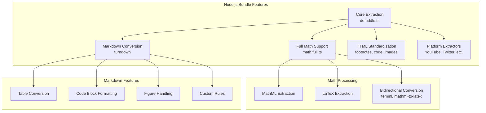
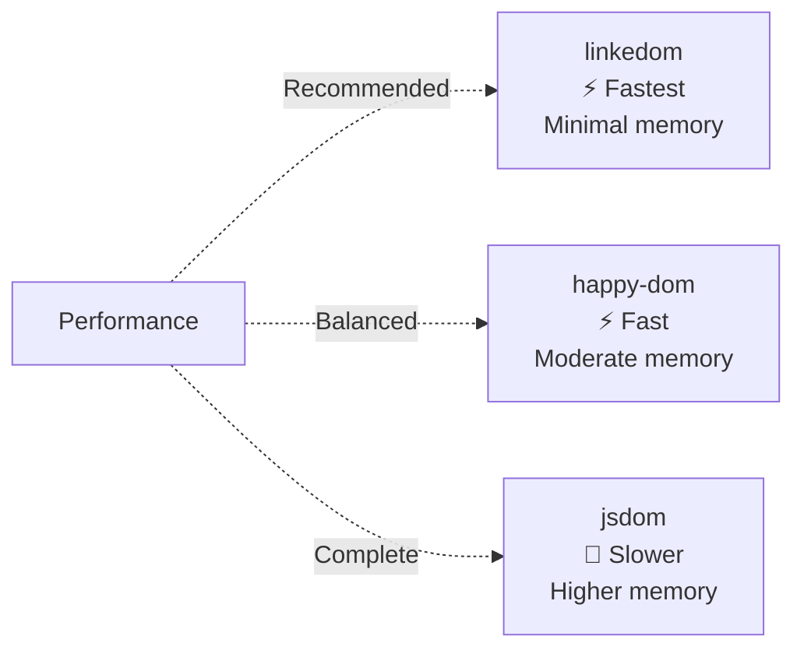

# Node.js Integration

<details>
<summary>Relevant source files</summary>

The following files were used as context for generating this wiki page:

- [README.md](README.md)
- [package-lock.json](package-lock.json)
- [package.json](package.json)
- [src/metadata.ts](src/metadata.ts)
- [src/types.ts](src/types.ts)
- [tsconfig.node.json](tsconfig.node.json)
- [webpack.config.js](webpack.config.js)

</details>


This page documents how to use Defuddle in Node.js environments. Unlike browser usage which operates on native DOM objects, Node.js requires a DOM implementation library. The Node.js bundle provides a functional interface optimized for server-side content extraction with full markdown conversion and math processing capabilities.

For browser-based usage, see [Browser Usage](#9.1). For command-line usage, see [Command Line Interface](#9.3).

---

## Bundle Architecture

The Node.js bundle (`defuddle/node`) is a specialized distribution targeting server-side JavaScript environments. It differs from browser bundles in module format, dependencies, and API design.

### Node.js Bundle Structure



**Sources:** [package.json:35-38](), [tsconfig.node.json:1-19](), [README.md:36-64]()

### Package Exports Configuration

The Node.js bundle is configured as a package export with specific TypeScript declarations:

| Export Path | Types Path | Module Path | Format |
|-------------|------------|-------------|---------|
| `defuddle/node` | `dist/node.d.ts` | `dist/node.js` | ES Module import |

**Sources:** [package.json:35-38]()

### Build Configuration



The Node.js bundle is compiled using a dedicated TypeScript configuration that targets CommonJS module format with ES2020 features and DOM types.

**Sources:** [tsconfig.node.json:1-19](), [package.json:44]()

---

## Installation

### Base Package

```bash
npm install defuddle
```

### DOM Implementation (Required)

The Node.js bundle requires a DOM implementation. Choose one:

```bash
# Option 1: linkedom (recommended, fastest)
npm install linkedom

# Option 2: jsdom (most compatible)
npm install jsdom

# Option 3: happy-dom (lightweight)
npm install happy-dom
```

**Sources:** [README.md:110-120](), [package.json:78-82]()

### Optional Dependencies

The Node.js bundle includes these features as part of its build, but they are listed as optional dependencies in `package.json`:

| Dependency | Purpose | Included in Bundle |
|------------|---------|-------------------|
| `turndown` | Markdown conversion | Yes |
| `mathml-to-latex` | Math equation conversion | Yes |
| `temml` | LaTeX to MathML | Yes |
| `linkedom` | DOM implementation | No (user choice) |

**Sources:** [package.json:78-82]()

---

## API Interface

The Node.js bundle exports a functional interface that differs from the browser's class-based API.

### Functional API



**Sources:** [README.md:40-52]()

### Function Signature

```typescript
Defuddle(
  document: Document,
  url?: string,
  options?: DefuddleOptions
): Promise<DefuddleResponse>
```

| Parameter | Type | Required | Description |
|-----------|------|----------|-------------|
| `document` | `Document` | Yes | DOM document from linkedom/jsdom/etc |
| `url` | `string` | No | URL of the page (used for metadata) |
| `options` | `DefuddleOptions` | No | Configuration options |

**Returns:** `Promise<DefuddleResponse>` containing content, metadata, and optional markdown.

**Sources:** [README.md:40-52]()

### Browser API Comparison

| Feature | Browser Bundle | Node.js Bundle |
|---------|---------------|----------------|
| Import | `import Defuddle from 'defuddle'` | `import { Defuddle } from 'defuddle/node'` |
| API Style | Class: `new Defuddle(document)` | Function: `Defuddle(document)` |
| Sync Method | `parse()` | Not available |
| Async Method | `parseAsync()` | Always async |
| Module Format | UMD | CommonJS/ES Module |
| DOM Source | Native browser | User-provided |

**Sources:** [README.md:23-64]()

---

## DOM Implementation Support

The Node.js bundle accepts a `Document` object from any DOM implementation that conforms to standard DOM APIs.

### Supported DOM Libraries



**Sources:** [README.md:38-62]()

### linkedom Example

linkedom is the recommended choice for most use cases due to its speed and small footprint.

```javascript
import { parseHTML } from 'linkedom';
import { Defuddle } from 'defuddle/node';

const { document } = parseHTML(html);
const result = await Defuddle(document, 'https://example.com/article', {
  markdown: true
});

console.log(result.content);
console.log(result.title);
console.log(result.author);
```

**Sources:** [README.md:40-52]()

### JSDOM Example

JSDOM provides the most complete DOM implementation, useful when pages use advanced DOM features.

```javascript
import { JSDOM } from 'jsdom';
import { Defuddle } from 'defuddle/node';

const dom = new JSDOM(html, { url: 'https://example.com/article' });
const result = await Defuddle(dom.window.document, 'https://example.com/article');
```

**Key Difference:** JSDOM's constructor accepts a `url` option, which sets `document.location.href`. If provided this way, the second parameter to `Defuddle()` can be omitted.

**Sources:** [README.md:54-62]()

### happy-dom Example

```javascript
import { Window } from 'happy-dom';
import { Defuddle } from 'defuddle/node';

const window = new Window();
const document = window.document;
document.write(html);

const result = await Defuddle(document, 'https://example.com/article');
```

**Sources:** External knowledge (pattern consistent with other examples)

---

## Async Processing

The Node.js bundle always performs asynchronous parsing, enabling platform-specific extractors to fetch additional data when needed.

### Async Extraction Flow



**Sources:** [README.md:254-257](), [src/types.ts:84-90]()

### useAsync Option

By default, platform extractors may fetch content from external APIs when local HTML provides no usable content (e.g., client-side rendered SPAs).

```javascript
// Enable API fallbacks (default)
const result = await Defuddle(document, url, {
  useAsync: true
});

// Disable API fallbacks (local content only)
const result = await Defuddle(document, url, {
  useAsync: false
});
```

**Example:** For X/Twitter content, if the HTML contains no article text, `XOembedExtractor` may fetch from FxTwitter API when `useAsync: true`.

**Sources:** [src/types.ts:84-90](), [README.md:254-257]()

---

## Bundle Features

The Node.js bundle includes full-featured content processing capabilities.

### Included Features



**Sources:** Diagram 5 from high-level architecture, [package.json:78-82]()

### Feature Comparison with Browser Bundles

| Feature | Core Bundle | Full Bundle | Node.js Bundle |
|---------|-------------|-------------|----------------|
| Math Extraction | ✓ | ✓ | ✓ |
| MathML ↔ LaTeX | External libs required | ✓ Bundled | ✓ Bundled |
| Markdown Conversion | External lib required | External lib required | ✓ Bundled |
| Module Format | UMD | UMD | CommonJS |
| Target Environment | Browser | Browser | Node.js |
| Async API | Optional | Optional | Required |

**Sources:** [README.md:159-167]()

---

## Configuration Options

All options from `DefuddleOptions` are supported in the Node.js bundle. See [Configuration and Options](#10) for comprehensive documentation.

### Common Node.js Configurations

```javascript
// Markdown output
const result = await Defuddle(document, url, {
  markdown: true
});

// Separate HTML and Markdown
const result = await Defuddle(document, url, {
  separateMarkdown: true
});
// result.content = HTML
// result.contentMarkdown = Markdown

// Debug mode
const result = await Defuddle(document, url, {
  debug: true
});
// result.debug.contentSelector
// result.debug.removals

// Bypass auto-detection
const result = await Defuddle(document, url, {
  contentSelector: 'article.main-content'
});

// Disable external API calls
const result = await Defuddle(document, url, {
  useAsync: false
});
```

**Sources:** [src/types.ts:43-126](), [README.md:169-185]()

### Node.js-Specific Considerations

| Option | Node.js Behavior | Notes |
|--------|------------------|-------|
| `markdown` | Always available | `turndown` bundled |
| `useAsync` | Controls API fallbacks | Default: `true` |
| `url` | Parameter or option | Can be second parameter or in options |
| `debug` | Preserves DOM structure | Useful for DOM implementation debugging |

**Sources:** [src/types.ts:43-126]()

---

## Module Format Requirements

The Node.js bundle requires ES Module syntax in your project configuration.

### Package.json Configuration

Your project's `package.json` must specify module type:

```json
{
  "type": "module"
}
```

Without this setting, Node.js will not correctly resolve the `defuddle/node` import.

**Sources:** [README.md:64]()

### Import Syntax

```javascript
// ES Module syntax (required)
import { Defuddle } from 'defuddle/node';

// CommonJS syntax (not supported)
// const { Defuddle } = require('defuddle/node'); // ✗ Won't work
```

**Sources:** [README.md:64](), [package.json:35-38]()

---

## Response Object

The Node.js bundle returns the same `DefuddleResponse` structure as browser bundles. See [Getting Started](#2) for the complete response schema.

### Response Properties

| Property | Type | Description |
|----------|------|-------------|
| `content` | `string` | Cleaned HTML or Markdown (based on options) |
| `contentMarkdown` | `string` | Markdown (when `separateMarkdown: true`) |
| `title` | `string` | Article title |
| `author` | `string` | Article author |
| `description` | `string` | Article description |
| `domain` | `string` | Domain name |
| `published` | `string` | Publication date |
| `language` | `string` | Page language (BCP 47) |
| `wordCount` | `number` | Word count of content |
| `parseTime` | `number` | Parse duration in milliseconds |
| `metaTags` | `MetaTagItem[]` | Extracted meta tags |
| `schemaOrgData` | `object` | Schema.org structured data |
| `debug` | `DebugInfo` | Debug information (when `debug: true`) |

**Sources:** [src/types.ts:34-41](), [README.md:136-157]()

---

## Error Handling

```javascript
import { Defuddle } from 'defuddle/node';
import { parseHTML } from 'linkedom';

try {
  const { document } = parseHTML(html);
  const result = await Defuddle(document, url);
  
  if (!result.content) {
    console.warn('No content extracted');
  }
  
  console.log(result);
} catch (error) {
  console.error('Extraction failed:', error);
}
```

**Common Error Scenarios:**

| Scenario | Cause | Solution |
|----------|-------|----------|
| Import fails | Missing `"type": "module"` | Add to package.json |
| Document undefined | DOM lib not installed | Install linkedom/jsdom |
| No content extracted | Invalid HTML or selector | Enable debug mode |
| Async timeout | API unreachable | Set `useAsync: false` |

**Sources:** [README.md:36-64]()

---

## Performance Considerations

### DOM Library Performance



### Optimization Tips

1. **Use linkedom for batch processing** - Fastest DOM parsing with lowest memory footprint
2. **Disable unused features** - Set `standardize: false` if you don't need HTML normalization
3. **Limit async operations** - Set `useAsync: false` when processing trusted content
4. **Reuse DOM instances** - Parse HTML once, extract multiple times if needed

**Sources:** [README.md:110-120]()
