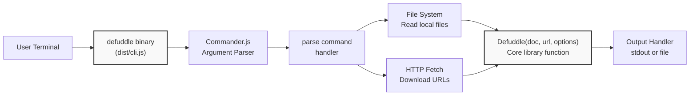
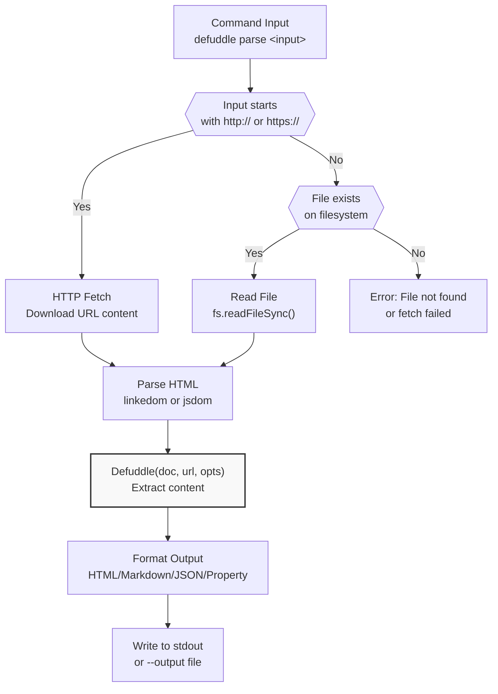
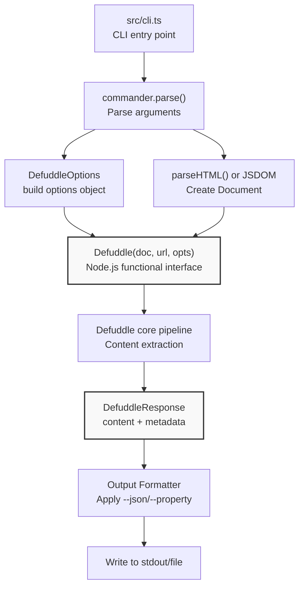

# Command Line Interface

<details>
<summary>Relevant source files</summary>

The following files were used as context for generating this wiki page:

- [README.md](README.md)
- [package-lock.json](package-lock.json)
- [package.json](package.json)
- [src/metadata.ts](src/metadata.ts)
- [src/types.ts](src/types.ts)
- [tsconfig.node.json](tsconfig.node.json)
- [webpack.config.js](webpack.config.js)

</details>


The Command Line Interface (CLI) provides a standalone executable for parsing web pages and HTML files from the terminal. It wraps the core Defuddle library with argument parsing and file I/O capabilities, enabling quick content extraction without writing code. The CLI is distributed as an executable binary (`defuddle`) and can be used locally or via `npx`.

For information about using Defuddle in browser environments, see [Browser Usage](#9.1). For Node.js integration, see [Node.js Integration](#9.2).

---

## Installation and Execution

The CLI can be run in two ways: globally installed or via `npx`.

### Global Installation

Install the package globally to use the `defuddle` command anywhere:

```bash
npm install -g defuddle
```

After installation, the `defuddle` command is available system-wide:

```bash
defuddle parse https://example.com/article
```

### NPX Execution

Run the CLI without installation using `npx`:

```bash
npx defuddle parse page.html
```

This approach downloads and executes the CLI temporarily, useful for one-off parsing or CI/CD environments.

**Sources:** [package.json:6-8](), [README.md:68-134]()

---

## Binary Configuration

The CLI is configured in `package.json` with a `bin` entry that maps the command name to the compiled output:

| Field | Value | Description |
|-------|-------|-------------|
| Command Name | `defuddle` | Name used when invoking the CLI |
| Entry Point | `dist/cli.js` | Compiled JavaScript file executed when command runs |
| Source File | `src/cli.ts` | TypeScript source file for CLI implementation |

The build process compiles `src/cli.ts` to `dist/cli.js` as a CommonJS module targeting Node.js environments.

**Sources:** [package.json:6-8](), [tsconfig.node.json:16]()

---

## Command Structure

### CLI Command Architecture



**Sources:** [package.json:6-8,76](), [tsconfig.node.json:16]()

### Parse Command

The CLI currently provides one command: `parse`. This command accepts a file path or URL as its argument and processes the content through Defuddle's extraction pipeline.

```bash
defuddle parse <input>
```

The `<input>` can be:
- **Local file path**: `page.html`, `./content/article.html`, `/tmp/page.html`
- **HTTP/HTTPS URL**: `https://example.com/article`

**Sources:** [README.md:68-91]()

---

## Options Reference

The CLI accepts multiple options to control extraction behavior and output format. Options can be specified with either long form (`--option`) or short form (`-o`) where available.

### Options Table

| Option | Alias | Type | Description |
|--------|-------|------|-------------|
| `--output <file>` | `-o` | string | Write output to specified file instead of stdout |
| `--markdown` | `-m` | boolean | Convert content to Markdown format |
| `--md` | | boolean | Alias for `--markdown` |
| `--json` | `-j` | boolean | Output complete response as JSON (includes metadata and content) |
| `--property <name>` | `-p` | string | Extract and output only a specific property (e.g., `title`, `author`) |
| `--debug` | | boolean | Enable debug mode (shows content selector and removal details) |

### Option Behavior

**Output Control:**
- Default: Content is written to stdout
- With `--output`: Content is written to the specified file path
- File paths can be relative or absolute

**Content Format:**
- Default: Cleaned HTML
- With `--markdown` or `--md`: HTML converted to Markdown
- With `--json`: Complete `DefuddleResponse` object serialized as JSON

**Property Extraction:**
- `--property` outputs only the specified field from the response
- Valid properties: `title`, `author`, `description`, `domain`, `favicon`, `image`, `language`, `published`, `site`, `wordCount`, `parseTime`
- Useful for scripting and piping to other commands

**Sources:** [README.md:93-102]()

---

## Usage Examples

### Basic Content Extraction

Parse a local HTML file and output cleaned HTML to stdout:

```bash
defuddle parse article.html
```

Parse a URL:

```bash
defuddle parse https://example.com/blog/post
```

### Markdown Conversion

Convert to Markdown and display:

```bash
defuddle parse page.html --markdown
```

Save Markdown to file:

```bash
defuddle parse https://example.com/article --markdown --output article.md
```

### JSON Output

Get complete response with metadata as JSON:

```bash
defuddle parse page.html --json
```

Pretty-print JSON with `jq`:

```bash
defuddle parse page.html --json | jq
```

### Property Extraction

Extract just the title:

```bash
defuddle parse page.html --property title
```

Extract author for use in a script:

```bash
AUTHOR=$(defuddle parse article.html --property author)
echo "Article by: $AUTHOR"
```

### Debug Mode

View extraction details:

```bash
defuddle parse page.html --debug
```

Debug output includes the `debug.contentSelector` and `debug.removals` fields showing which element was selected and what was removed during processing.

**Sources:** [README.md:68-91]()

---

## Input Processing Flow

### Input Type Detection and Processing



**Implementation Details:**

1. **URL Detection**: Input is checked for `http://` or `https://` prefix
2. **URL Fetching**: HTTP(S) requests download the page content
3. **File Reading**: Local files are read synchronously from the filesystem
4. **HTML Parsing**: Content is parsed into a DOM Document using linkedom or jsdom
5. **URL Context**: The URL is passed to Defuddle for metadata extraction and resource resolution
6. **Processing**: The Document is processed through the Defuddle pipeline
7. **Output Formatting**: Result is formatted according to specified options

**Sources:** [README.md:68-91](), [tsconfig.node.json:16]()

---

## Dependencies and Build Configuration

### CLI Dependencies

The CLI uses the following dependencies:

| Dependency | Purpose | Type |
|------------|---------|------|
| `commander` | Command-line argument parsing | Runtime (required) |
| `linkedom` | DOM implementation for Node.js | Optional (or jsdom) |
| `turndown` | Markdown conversion | Optional |
| `temml` | Math rendering (LaTeX to MathML) | Optional |
| `mathml-to-latex` | Math conversion (MathML to LaTeX) | Optional |

The `commander` library is the only required runtime dependency. The optional dependencies enable full feature support (markdown conversion, math processing).

**Sources:** [package.json:75-83]()

### TypeScript Compilation

The CLI is compiled separately from browser bundles with Node.js-specific settings:

```json
{
  "module": "CommonJS",
  "target": "ES2020",
  "outDir": "dist",
  "types": ["node"]
}
```

**Configuration Details:**
- **Module System**: CommonJS for Node.js compatibility
- **Target**: ES2020 JavaScript
- **Output**: `dist/cli.js`
- **Type Definitions**: Node.js types included

The CLI shares the core library types and interfaces but uses a Node.js-specific build configuration to ensure compatibility with the Node.js runtime environment.

**Sources:** [tsconfig.node.json:1-18]()

---

## Integration with Core Library

### CLI to Core Library Flow



**Integration Details:**

The CLI uses the Node.js bundle (`defuddle/node`) which provides a functional interface:

```typescript
Defuddle(document: Document, url?: string, options?: DefuddleOptions): Promise<DefuddleResponse>
```

**Option Mapping:**
- `--markdown` → `{ markdown: true }`
- `--debug` → `{ debug: true }`
- All flags map to corresponding fields in `DefuddleOptions`

**Response Processing:**
- Default: `response.content` is output
- With `--json`: Entire `DefuddleResponse` object is serialized
- With `--property`: Specific field is extracted from response

**Sources:** [src/types.ts:34-41,43-126](), [README.md:54-64]()

---

## Output Format Details

### HTML Output (Default)

When no format option is specified, the CLI outputs cleaned HTML:

```html
<article>
  <h2>Article Title</h2>
  <p>Article content...</p>
  <figure>
    
    <figcaption>Image caption</figcaption>
  </figure>
</article>
```

The HTML is standardized according to Defuddle's normalization rules (see [Content Standardization](#5)).

### Markdown Output

With `--markdown` or `--md`, content is converted to Markdown:

```markdown
## Article Title

Article content...


*Image caption*
```

The conversion uses Turndown with custom rules for tables, figures, code blocks, and math elements (see [Markdown Conversion](#7)).

### JSON Output

With `--json`, the complete response is serialized:

```json
{
  "content": "<article>...</article>",
  "title": "Article Title",
  "author": "John Doe",
  "description": "Article summary",
  "domain": "example.com",
  "language": "en",
  "published": "2024-01-15",
  "wordCount": 1250,
  "parseTime": 45
}
```

All fields from `DefuddleResponse` are included, enabling programmatic access to both content and metadata.

### Property Output

With `--property <name>`, only the specified field value is output:

```bash
$ defuddle parse page.html --property title
Article Title

$ defuddle parse page.html --property wordCount
1250
```

This enables easy integration with shell scripts and pipelines.

**Sources:** [src/types.ts:34-41](), [README.md:78-91]()

---

## Debug Mode

### Debug Output Structure

When `--debug` is enabled, the response includes additional diagnostic information:

```json
{
  "content": "...",
  "debug": {
    "contentSelector": "article.post-content",
    "removals": [
      {
        "step": "removeBySelector",
        "selector": ".social-share",
        "reason": "Exact selector match",
        "text": "Share on Twitter Share on Facebook..."
      },
      {
        "step": "removeLowScoring",
        "reason": "score: -15",
        "text": "Related Articles: Article 1 Article 2..."
      }
    ]
  }
}
```

### Debug Fields

| Field | Type | Description |
|-------|------|-------------|
| `debug.contentSelector` | string | CSS selector path of the main content element chosen by the extraction algorithm |
| `debug.removals` | array | List of elements removed during processing with reasons |

### Removal Entry Structure

Each entry in `debug.removals` contains:

| Field | Type | Description |
|-------|------|-------------|
| `step` | string | Pipeline step that removed the element (e.g., `removeBySelector`, `removeLowScoring`, `removeHiddenElements`) |
| `selector` | string | CSS selector or pattern that matched (for selector-based removal) |
| `reason` | string | Why the element was removed (e.g., `score: -20`, `display:none`) |
| `text` | string | First 200 characters of the removed element's text content |

Debug mode is useful for diagnosing extraction issues and understanding why certain content was included or excluded.

**Sources:** [src/types.ts:22-32](), [README.md:260-295]()

---

## Typical Workflows

### Content Archival

Download and convert articles to Markdown for archival:

```bash
# Single article
defuddle parse https://example.com/article --markdown --output archive/article.md

# Batch processing
cat urls.txt | while read url; do
  filename=$(echo "$url" | md5sum | cut -d' ' -f1).md
  defuddle parse "$url" --markdown --output "archive/$filename"
done
```

### Metadata Extraction

Extract metadata for cataloging:

```bash
# Create CSV of article metadata
echo "URL,Title,Author,Published" > articles.csv
cat urls.txt | while read url; do
  title=$(defuddle parse "$url" --property title)
  author=$(defuddle parse "$url" --property author)
  published=$(defuddle parse "$url" --property published)
  echo "$url,$title,$author,$published" >> articles.csv
done
```

### Content Analysis

Analyze content statistics:

```bash
# Get word count for research
defuddle parse paper.html --property wordCount

# Extract title and author for citation
TITLE=$(defuddle parse article.html --property title)
AUTHOR=$(defuddle parse article.html --property author)
echo "Citation: $AUTHOR. \"$TITLE.\""
```

### CI/CD Integration

Validate documentation extraction in automated tests:

```bash
# Extract documentation from HTML
defuddle parse docs/page.html --markdown --output docs/page.md

# Verify extraction succeeded
if [ $? -eq 0 ]; then
  git add docs/page.md
  git commit -m "Update documentation from HTML"
fi
```

**Sources:** [README.md:68-91]()
