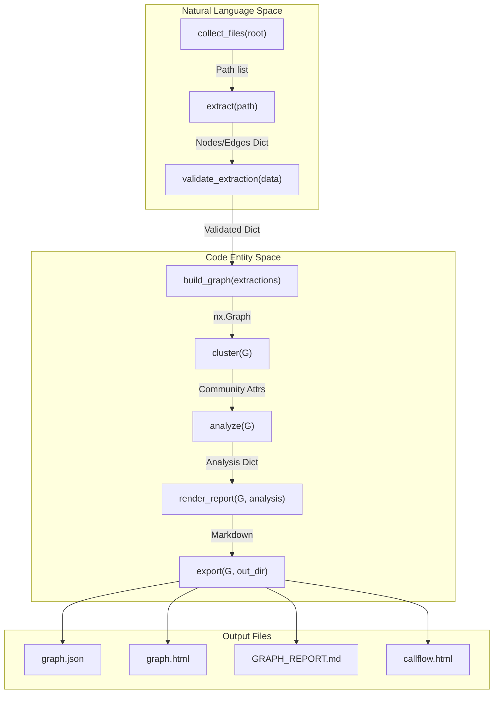
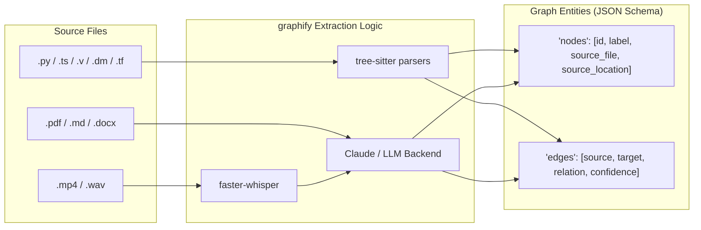

# Overview

Relevant source files

The following files were used as context for generating this wiki page:

- [ARCHITECTURE.md](ARCHITECTURE.md)
- [CHANGELOG.md](CHANGELOG.md)
- [README.md](README.md)
- [pyproject.toml](pyproject.toml)
- [worked/httpx/GRAPH_REPORT.md](worked/httpx/GRAPH_REPORT.md)
- [worked/httpx/review.md](worked/httpx/review.md)
- [worked/karpathy-repos/GRAPH_REPORT.md](worked/karpathy-repos/GRAPH_REPORT.md)
- [worked/karpathy-repos/graph.json](worked/karpathy-repos/graph.json)
- [worked/karpathy-repos/review.md](worked/karpathy-repos/review.md)
- [worked/mixed-corpus/review.md](worked/mixed-corpus/review.md)

`graphify` is an AI coding assistant skill and Python library designed to transform directories containing a heterogeneous mix of code, documentation, research papers, images, and video into a queryable, structured knowledge graph [README.md:23-27](). By leveraging AST-based extraction for code and LLM-based semantic extraction for unstructured data, it achieves significant token reduction (up to 71.5x) for complex queries compared to raw file reading [README.md:27-28](), [worked/karpathy-repos/review.md:21-27]().

The project exists to solve the "context window overflow" problem in large, multi-modal repositories, providing structural clarity and persistent graph-based navigation [README.md:23-28]().

### Key Capabilities

*   **Multi-Modal Extraction**: Supports over 25 programming languages via `tree-sitter` (including Dart, Verilog/SystemVerilog, PHP, BYOND DreamMaker, Terraform/HCL, and .NET project files) and unstructured data (PDFs, images, markdown, video/audio) via Claude and Whisper [README.md:25-26](), [pyproject.toml:17-43](), [CHANGELOG.md:14-15]().
*   **Structural Analysis**: Automatically identifies "God Nodes" (high-degree hubs) and "Surprising Connections" across different domains (e.g., a specific code implementation connecting to a research paper citation) [ARCHITECTURE.md:21](), [worked/httpx/GRAPH_REPORT.md:12-23]().
*   **Interactive Visualization**: Generates searchable HTML/vis.js graphs, Obsidian vaults, D3 collapsible trees, and Mermaid-based architecture call-flow diagrams [README.md:33-46](), [ARCHITECTURE.md:23-24]().
*   **Incremental Updates**: Uses a SHA256 semantic cache to ensure only changed files are re-processed, with a file watcher for real-time synchronization [ARCHITECTURE.md:26-30]().
*   **Agent Integration**: Provides an MCP (Model Context Protocol) server for direct graph interaction by AI agents and specialized skills for platforms like Claude Code, Cursor, Aider, Kiro, Gemini, Amp, and Trae [README.md:104-126](), [pyproject.toml:100-101]().

### High-Level Pipeline

The system operates as a linear pipeline where each stage is isolated into its own module, communicating via plain Python dictionaries and NetworkX graph objects [ARCHITECTURE.md:7-11]().

**The graphify Pipeline Flow**

Sources: [ARCHITECTURE.md:7-31](), [README.md:33-46]()

### Subsystem Relationships

`graphify` bridges the gap between raw source files and structured graph data through several specialized subsystems:

| Subsystem | Core Module | Responsibility |
| :--- | :--- | :--- |
| **Detection** | `detect.py` | Discovers files and classifies them by type (Code, Doc, Paper, Image, Video) [ARCHITECTURE.md:17](). |
| **Extraction** | `extract.py` | Uses `tree-sitter` for AST structural extraction and LLMs/Whisper for semantic relationships [ARCHITECTURE.md:18](), [README.md:134-142](). |
| **Graph Logic** | `build.py`, `cluster.py` | Assembles extractions into a `NetworkX` graph and applies Leiden community detection [ARCHITECTURE.md:19-20](). |
| **Analysis** | `analyze.py` | Calculates node centrality (God Nodes) and cross-community "surprises" [ARCHITECTURE.md:21](). |
| **Visualization** | `callflow_html.py`, `tree_html.py` | Generates Mermaid-based call-flows and D3 module hierarchy trees [ARCHITECTURE.md:24](). |
| **Interface** | `serve.py`, `watch.py` | Provides the MCP server and real-time file system monitoring [ARCHITECTURE.md:29-30](). |

**Entity Mapping: Source to Graph**

Sources: [ARCHITECTURE.md:33-46](), [README.md:25-27](), [pyproject.toml:17-43](), [CHANGELOG.md:14-15]()

### Getting Started & Installation
For detailed setup instructions, including registering the Claude Code skill (`graphify install`), using `uv tool install graphifyy` (recommended), and managing optional dependency groups like `mcp`, `neo4j`, `pdf`, or `video`, see **[Getting Started & Installation](#1.1)**.

### Changelog & Version History
To track the evolution of the pipeline, architectural shifts such as the introduction of the `graphify affected` command, and support for new platforms like Amp, Kiro, or Devin, see **[Changelog & Version History](#1.2)**.
