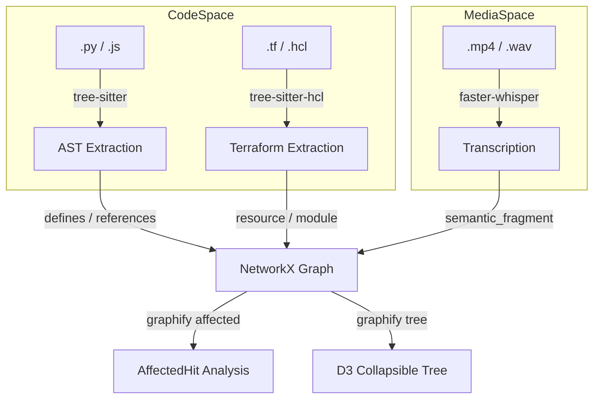
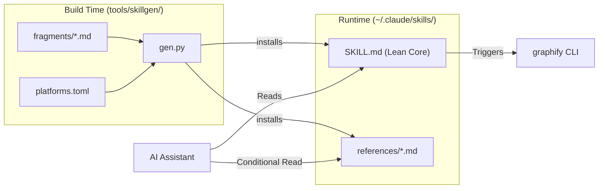

# Changelog & Version History

Relevant source files

The following files were used as context for generating this wiki page:

- [CHANGELOG.md](CHANGELOG.md)
- [README.md](README.md)
- [pyproject.toml](pyproject.toml)

This page provides a technical summary of the evolution of the `graphify` codebase. It highlights major architectural shifts, performance optimizations, and feature additions that have transitioned the project from a structural AST extractor to a comprehensive multi-modal knowledge management tool.

## Release History Overview

The following table summarizes the progression of major features and fixes across recent releases, highlighting the expansion into infrastructure-as-code support, progressive-disclosure skill delivery, and refined entity integrity.

| Version | Date | Key Focus | Notable Changes |
|:---|:---|:---|:---|
| **0.8.33** | 2026-06-06 | Signal | **Python annotation noise filter**; **Install banner**; **Ghost-duplicate auto-merge**; Submodule import resolution. |
| **0.8.32** | 2026-06-05 | Infra | **Terraform/HCL support**; Offline code-only extraction; **GRAPHIFY_API_TIMEOUT** fix. |
| **0.8.31** | 2026-06-03 | Observability | **Query logging** (~/.cache/graphify-queries.log); **Hook script hardening** with `sys.executable` embedding. |
| **0.8.30** | 2026-06-03 | Integration | **Read/Glob tool nudge**; `anthropic` optional extra; Antigravity project-scoped install fix. |
| **0.8.29** | 2026-06-02 | Performance | **Progressive-disclosure skill files** (47% context reduction); Security: **local providers opt-in**. |
| **0.8.25** | 2026-05-29 | Stability | **Phantom god-node fix** for JS/TS; Lua `require` resolution; **uv-aware** skill interpreters. |
| **0.8.22** | 2026-05-28 | Modality | **BYOND DreamMaker** support (.dm, .dmi, .dmm, .dmf); **`--mode deep`** flag for LLM. |
| **0.8.21** | 2026-05-27 | Integration | **MCP config extraction**; Amp platform support; **`graphify tree`** command. |

**Sources:**
- [CHANGELOG.md:5-11]()
- [CHANGELOG.md:12-18]()
- [CHANGELOG.md:20-25]()
- [CHANGELOG.md:27-32]()
- [CHANGELOG.md:33-38]()
- [CHANGELOG.md:43-47]()
- [pyproject.toml:5-13]()

---

## v0.8.x: Intelligence & Entity Integrity

The `0.8.x` branch represents a shift toward "Graph Intelligence," where the graph is used not just for visualization but for active developer workflow assistance and deep semantic understanding.

### Progressive-Disclosure & Context Management
Version `0.8.29` introduced a major architectural change in how the AI assistant interacts with `graphify`:
*   **Lean Core Skills:** The per-host `SKILL.md` was reduced from ~1156 lines to ~615 lines by moving non-critical paths (exports, transcription, hooks) into a `references/` sidecar [CHANGELOG.md:35-35]().
*   **On-Demand Loading:** Agents now only read reference files when a specific command (e.g., `graphify export`) is triggered, saving ~47% of the initial context window [CHANGELOG.md:35-35]().
*   **Skillgen Build System:** All platform-specific skills are now generated from shared fragments under `tools/skillgen/` to ensure parity across 18+ supported hosts [CHANGELOG.md:35-35]().

### Signal-to-Noise Optimization
Refinements in extraction and ranking prevent "artificial god nodes" from displacing real code abstractions:
*   **Python Annotation Filter:** Built-in types like `str`, `int`, `bool`, and `MagicMock` are now suppressed via the `_PYTHON_ANNOTATION_NOISE` filter. Previously, these nodes inflated degree counts by ~25% [CHANGELOG.md:9-9]().
*   **Ghost-Duplicate Merging:** `build_from_json` now automatically collapses semantic ghost nodes (nodes without source locations) into their corresponding AST nodes based on `(basename, label)` matches [CHANGELOG.md:10-10]().
*   **Infrastructure Graphing:** Support for Terraform/HCL allows `graphify` to map resources, modules, and providers into the same dependency graph as the application code [CHANGELOG.md:14-14]().

### Security & Observability
*   **Local Provider Opt-in:** To prevent SSRF or credential exfiltration, project-local `./.graphify/providers.json` files now require `GRAPHIFY_ALLOW_LOCAL_PROVIDERS=1` [CHANGELOG.md:37-37]().
*   **Query Logging:** Every graph query is now logged to `~/.cache/graphify-queries.log` in JSONL format, providing an audit trail for AI interactions [CHANGELOG.md:25-25]().
*   **Hook Hardening:** Git hooks now embed `sys.executable` directly into the script, solving "command not found" issues in GUI git clients where `PATH` is not inherited [CHANGELOG.md:22-22]().

**Sources:**
- [CHANGELOG.md:9-10]()
- [CHANGELOG.md:14-14]()
- [CHANGELOG.md:22-22]()
- [CHANGELOG.md:25-25]()
- [CHANGELOG.md:35-35]()
- [CHANGELOG.md:37-37]()

---

## Mapping Code Space to Natural Language Space

The following diagrams illustrate how `graphify` bridges raw code entities, infrastructure definitions, and progressive-disclosure skills.

### Infrastructure & Media Ingestion
This diagram shows how traditional AST extraction, Terraform infrastructure, and media transcription feed into the unified graph.

Title: Multi-modal & Infrastructure Ingestion

### Progressive Skill Architecture
This diagram details how the `skillgen` system assembles platform-specific skills and how they interact with the filesystem at runtime.

Title: Progressive Skill Delivery

**Sources:**
- [CHANGELOG.md:14-14]()
- [CHANGELOG.md:35-35]()
- [pyproject.toml:72-72]()
- [pyproject.toml:113-113]()

---

## Performance & Signal Optimization

### Incremental Integrity
The `graphify update` path reconciles the existing graph against the current disk state using `evict_sources`. This ensures that any node whose `source_file` no longer exists is purged, preventing "ghost nodes" from appearing in search results [CHANGELOG.md:35-35]().

### Deterministic Outputs
To ensure consistency for agents and CI, graph output is now byte-for-byte deterministic. Edges are sorted by `(source, target, relation)` in `build_from_json`, and `PYTHONHASHSEED=0` is enforced in hooks to stabilize the community ordering [CHANGELOG.md:38-38]().

### Scope-Aware Extraction
*   **Python Annotation Noise:** The `_PYTHON_ANNOTATION_NOISE` filter suppresses str/int/bool/float/bytes/MagicMock from becoming graph nodes [CHANGELOG.md:9-9]().
*   **Submodule Resolution:** `from pkg import submod` now correctly resolves to an `imports_from` edge to the submodule file, preventing test files from becoming disconnected islands [CHANGELOG.md:8-8]().
*   **JS/TS Scope Guard:** Restricts node emission for local variables inside arrow functions to prevent "phantom god-nodes" [CHANGELOG.md:7-7]().

**Sources:**
- [CHANGELOG.md:7-9]()
- [CHANGELOG.md:35-35]()
- [CHANGELOG.md:38-38]()
