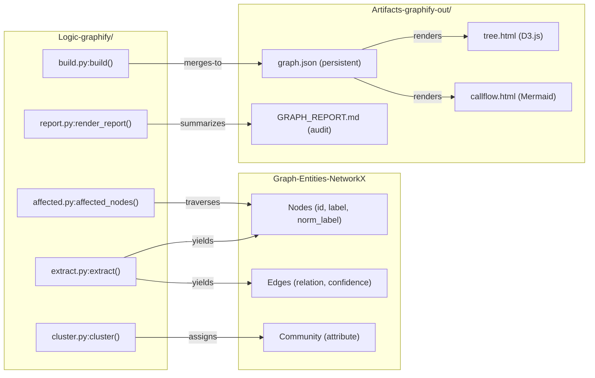

# Core Architecture

<details>
<summary>Relevant source files</summary>

The following files were used as context for generating this wiki page:

- [ARCHITECTURE.md](ARCHITECTURE.md)
- [CHANGELOG.md](CHANGELOG.md)
- [graphify/__main__.py](graphify/__main__.py)
- [pyproject.toml](pyproject.toml)
- [worked/httpx/GRAPH_REPORT.md](worked/httpx/GRAPH_REPORT.md)
- [worked/httpx/review.md](worked/httpx/review.md)
- [worked/karpathy-repos/GRAPH_REPORT.md](worked/karpathy-repos/GRAPH_REPORT.md)
- [worked/karpathy-repos/graph.json](worked/karpathy-repos/graph.json)
- [worked/karpathy-repos/review.md](worked/karpathy-repos/review.md)
- [worked/mixed-corpus/review.md](worked/mixed-corpus/review.md)

</details>


The `graphify` architecture is designed as a linear, modular pipeline that transforms unstructured or semi-structured data (code, documents, papers, images, audio, and video) into a structured, navigable knowledge graph. Each stage of the pipeline is encapsulated in a dedicated module, communicating via standard Python dictionaries and `NetworkX` graph objects [ARCHITECTURE.md:7-11]().

## Pipeline Overview

The system follows a strict sequential flow: **detect → extract → build → cluster → analyze → report → export** [ARCHITECTURE.md:8-9](). This modularity allows for incremental updates, such as re-running clustering or analysis without re-extracting from source files [graphify/skill.md:19-23](). The pipeline supports advanced multi-modal inputs, including video transcription via `faster-whisper`, URL ingestion for external resources, and specialized extractors for MCP configurations, SCIP JSON, and infrastructure-as-code like Terraform/HCL [graphify/skill.md:22,34](), [CHANGELOG.md:14, 50-51]().

### High-Level Data Flow
The following diagram illustrates how the system transitions from the **Natural Language/File Space** into the **Code Entity/Graph Space**, mapping specific Python functions to the transformation steps.

**Diagram: Pipeline Stage Transitions**
```mermaid
graph TD
    subgraph "Natural-Language-and-File-Space"
        [".py, .tf, .v, .mcp.json, .mp4"] --> DET["detect.py:collect_files()"]
        DET -- "File-Manifest" --> TRANS["transcribe.py:transcribe()"]
        TRANS -- "Transcripts" --> EXT["extract.py:extract()"]
        URL["ingest.py:ingest()"] -- "Saves-to-./raw" --> DET
        MCP["mcp_ingest.py:extract_mcp_config()"] --> EXT
        SCIP["scip_ingest.py:extract_scip()"] --> EXT
        GWS["google_workspace.py:export_shortcuts()"] --> DET
    end

    subgraph "Code-Entity-and-Graph-Space"
        EXT -- "Extraction-Dicts" --> BLD["build.py:build()"]
        BLD -- "nx.Graph-or-nx.DiGraph" --> DEDUP["dedup.py:deduplicate_entities()"]
        DEDUP -- "Merged-Graph" --> CLUS["cluster.py:cluster()"]
        CLUS -- "Community-labeled-Graph" --> ANA["analyze.py:analyze()"]
        ANA -- "Analysis-Dict" --> REP["report.py:render_report()"]
        REP -- "Markdown-String" --> EX["export.py:export()"]
    end

    EX --> OUT["graphify-out/ (HTML, JSON, SVG, Wiki, Obsidian)"]
```
**Sources:** [ARCHITECTURE.md:7-31](), [graphify/skill.md:58-132](), [CHANGELOG.md:14, 50-51](), [graphify/build.py:343-345](), [graphify/dedup.py:532-535]()

## Module Responsibilities

Each module performs a discrete transformation. Separation of concerns ensures that AST-based extraction (fast, deterministic) is decoupled from graph assembly and community detection [ARCHITECTURE.md:13-31]().

| Module | Primary Function | Input → Output |
| :--- | :--- | :--- |
| `detect.py` | `collect_files()` | Directory → List of filtered `Path` objects [ARCHITECTURE.md:17]() |
| `extract.py` | `extract()` | File Path → Extraction dictionary `{nodes, edges}` [ARCHITECTURE.md:18]() |
| `build.py` | `build()` | Extraction dicts → `nx.Graph` with merged entities [ARCHITECTURE.md:19]() |
| `dedup.py` | `deduplicate_entities()` | Graph → Deduplicated graph using MinHash/LSH [CHANGELOG.md:44-45]() |
| `cluster.py` | `cluster()` | Graph → Graph with `community` attributes [ARCHITECTURE.md:20]() |
| `analyze.py` | `analyze()` | Graph → Analysis dict (god nodes, surprises, questions) [ARCHITECTURE.md:21]() |
| `report.py` | `render_report()` | Graph + Analysis → `GRAPH_REPORT.md` string [ARCHITECTURE.md:22]() |
| `export.py` | `export()` | Graph → Obsidian vault, JSON, HTML, SVG [ARCHITECTURE.md:23]() |
| `affected.py` | `affected_nodes()` | Node ID → Set of affected downstream nodes [CHANGELOG.md:104-105]() |

**Sources:** [ARCHITECTURE.md:15-31](), [graphify/build.py:343-345](), [graphify/dedup.py:532-535](), [graphify/affected.py:46-50]()

## Extraction Output Schema

The bridge between raw files and graph assembly is a standardized JSON schema. Every extractor—from Tree-sitter AST for 20+ languages to Whisper transcripts—must output data matching this schema to be validated by `validate.py` [ARCHITECTURE.md:33-48]().

### Node & Edge Requirements
*   **Nodes**: Must include `id`, `label`, `source_file`, and `source_location`. They often include `norm_label` for punctuation-insensitive search [ARCHITECTURE.md:39-40](), [CHANGELOG.md:40-41]().
*   **Edges**: Must include `source`, `target`, `relation`, and `confidence` [ARCHITECTURE.md:42-43]().

### Confidence Labels
To maintain an "honest audit trail," every edge is tagged with a confidence level [ARCHITECTURE.md:50-56]():
*   **`EXTRACTED`**: Explicitly stated in source (e.g., import statement, direct call) [ARCHITECTURE.md:54]().
*   **`INFERRED`**: Reasonable deduction (e.g., call-graph second pass, co-occurrence) [ARCHITECTURE.md:55]().
*   **`AMBIGUOUS`**: Uncertain relationship flagged for human review [ARCHITECTURE.md:56]().

### Filters and Sanitization
The extraction process includes noise reduction, such as the `_PYTHON_ANNOTATION_NOISE` filter which prevents common types like `str`, `int`, or `MagicMock` from cluttering the graph [CHANGELOG.md:9]().

**Sources:** [ARCHITECTURE.md:33-56](), [graphify/validate.py:1-28](), [CHANGELOG.md:9, 40-41]()

## Pipeline Stages (Child Pages)

For detailed technical implementation of each stage, refer to the following sub-pages:

### [File Detection & Classification](#2.1)
Covers how `detect.py` discovers files, applies sensitive file skipping, and classifies files into types like `code`, `document`, or `video`. Also covers Google Workspace shortcut export and incremental manifest management [graphify/skill.md:124-132](), [CHANGELOG.md:35]().

### [Extraction Engine](#2.2)
Deep dive into AST-based structural extraction via tree-sitter (including Terraform/HCL, Dart, and .NET), `faster-whisper` transcription, and `symbol_resolution.py` for deterministic cross-file linking [ARCHITECTURE.md:18,25](), [CHANGELOG.md:8, 14, 50-51]().

### [Graph Assembly, Deduplication & Clustering](#2.3)
Explains `build.py` (merging dicts), `dedup.py` (MinHash/LSH + Jaro-Winkler entity deduplication), and `cluster.py` (Leiden community detection with stable ID remapping) [ARCHITECTURE.md:19-20](), [CHANGELOG.md:44-45, 52-53]().

### [Graph Analysis](#2.4)
Deep dive into `analyze.py`: identification of god nodes, surprising connections, and `affected.py` for BFS-based impact analysis [ARCHITECTURE.md:21](), [CHANGELOG.md:104-105]().

### [Report Generation](#2.5)
How `report.py` assembles `GRAPH_REPORT.md` from community summaries, ambiguous edges, and token cost metrics [ARCHITECTURE.md:22]().

---

## System Interaction Diagram

This diagram maps internal Python logic to the resulting graph entities and output artifacts.

**Diagram: Logic to Entity Mapping**

**Sources:** [ARCHITECTURE.md:7-31](), [graphify/tree_html.py:20-25](), [graphify/callflow_html.py:1-10](), [graphify/affected.py:46-50](), [CHANGELOG.md:40-41]()
