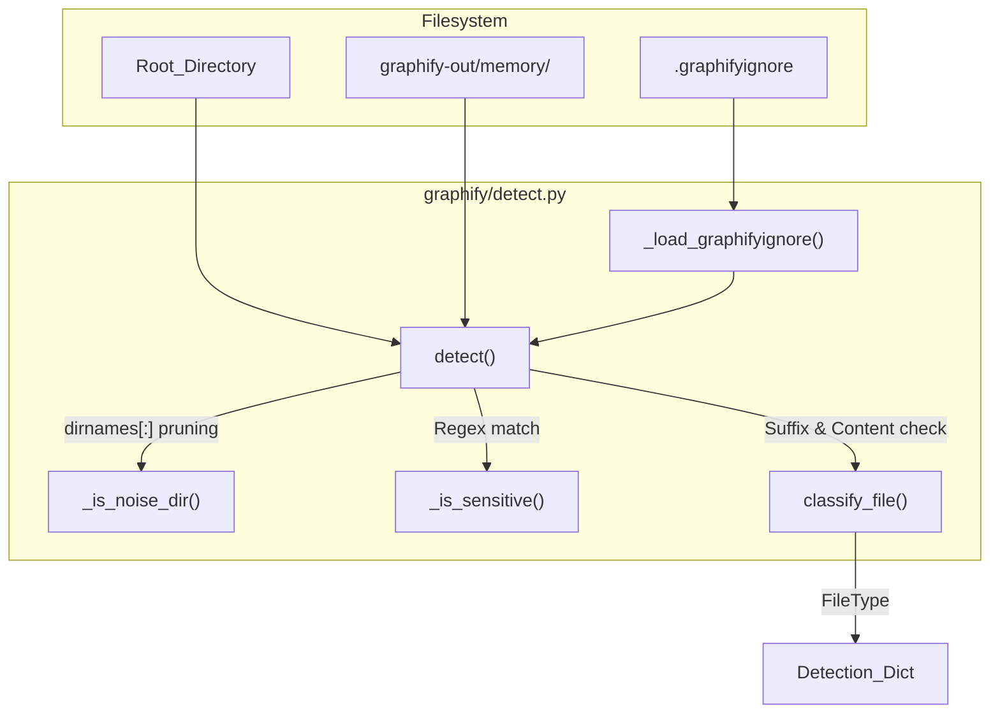
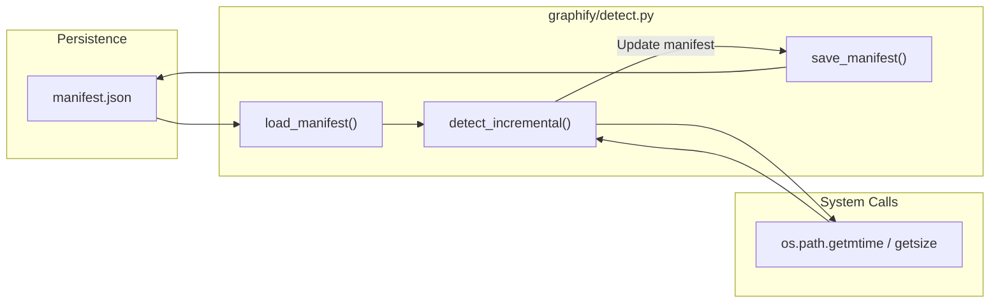

# File Detection & Classification

Relevant source files

The following files were used as context for generating this wiki page:

- [docs/how-it-works.md](docs/how-it-works.md)
- [graphify/cache.py](graphify/cache.py)
- [graphify/detect.py](graphify/detect.py)
- [graphify/extract.py](graphify/extract.py)
- [graphify/google_workspace.py](graphify/google_workspace.py)
- [graphify/watch.py](graphify/watch.py)
- [tests/test_detect.py](tests/test_detect.py)
- [tests/test_google_workspace.py](tests/test_google_workspace.py)
- [tests/test_watch.py](tests/test_watch.py)

The `graphify/detect.py` module is responsible for the initial discovery, filtering, and categorization of files within a target directory. It serves as the entry point for the pipeline, determining which files are worth indexing, which should be ignored for security or noise reasons, and whether the corpus is of a size that justifies graph-based analysis.

## File Discovery & Filtering

File discovery is handled by the `detect()` function [graphify/detect.py:155-231](). It performs a recursive scan of the root directory using `os.walk`, with specific logic to ignore noise, sensitive data, and files matching user-defined ignore patterns.

### Noise Reduction & Ignore Logic
To prevent the graph from being cluttered with build artifacts or dependencies, `detect()` prunes the directory tree in-place [graphify/detect.py:183-188]().
- **Excluded Directories**: Common folders like `node_modules`, `__pycache__`, `.git`, `venv`, and `dist` are skipped [graphify/detect.py:134-141]().
- **Framework Caches**: Specific noise directories like `.next`, `.nuxt`, `.turbo`, and `.angular` are explicitly filtered out [graphify/detect.py:143-152]().
- **Hidden Files**: Files starting with `.` (dotfiles) are skipped unless they reside in the `graphify-out/memory/` directory [graphify/detect.py:201-206](). This bypass allows the `graphify remember` command to persist synthetic knowledge nodes across runs.
- **.graphifyignore**: The `_is_ignored()` helper [graphify/detect.py:124-131]() checks files against patterns loaded from `.graphifyignore` files via `_load_graphifyignore()` [graphify/detect.py:113-121](). This search traverses upwards from the scan directory until it hits a `.git` boundary or the filesystem root [graphify/detect.py:117-120]().

### Security & Sensitive Files
The `_is_sensitive()` helper [graphify/detect.py:137-146]() identifies and skips files that likely contain secrets. It operates in two stages:
1. **Parent Directory Check**: Any file inside a directory named `.ssh`, `.aws`, `secrets`, or `credentials` is skipped [graphify/detect.py:97-99, 142-143]().
2. **Filename Pattern Match**: Uses `_SENSITIVE_PATTERNS` (a list of regexes) to catch `.env`, `.pem`, `id_rsa`, and keywords like `secret`, `token`, or `passwd` [graphify/detect.py:108-116, 145-146]().

**Detection Data Flow**
The following diagram illustrates how `detect()` interacts with the filesystem and internal filters.

Title: File Discovery Flow in detect.py

Sources: [graphify/detect.py:97-116](), [graphify/detect.py:137-146](), [graphify/detect.py:113-121](), [graphify/detect.py:124-131](), [graphify/detect.py:134-152](), [graphify/detect.py:155-231]()

---

## Classification & Heuristics

Once a file is discovered, `classify_file()` assigns it a `FileType` enum value [graphify/detect.py:18-24, 116-143]().

| FileType | Extensions | Notes |
| :--- | :--- | :--- |
| `CODE` | `.py`, `.ts`, `.js`, `.go`, `.rs`, `.dart`, `.v`, `.sv`, `.dm`, `.csproj`, etc. | Supported by tree-sitter extractors. Also detects via shebang. [graphify/detect.py:19, 28]() |
| `DOCUMENT` | `.md`, `.mdx`, `.txt`, `.rst`, `.html`, `.yaml` | General documentation. [graphify/detect.py:20, 29]() |
| `PAPER` | `.pdf` or signal-heavy `.md`/`.txt` | Academic papers (ArXiv, journals). [graphify/detect.py:21, 30, 149-152]() |
| `IMAGE` | `.png`, `.jpg`, `.jpeg`, `.gif`, `.webp`, `.svg` | Multi-modal assets. [graphify/detect.py:22, 31]() |
| `VIDEO` | `.mp4`, `.mov`, `.webm`, `.mp3`, `.wav`, etc. | Media files for transcription. [graphify/detect.py:23, 33]() |

### Shebang Detection
For extensionless files, `_shebang_file_type()` peeks at the first 128 bytes [graphify/detect.py:95-113](). It identifies code if the interpreter (e.g., `python`, `node`, `bash`, `lua`) is in the `_SHEBANG_CODE_INTERPRETERS` allowlist [graphify/detect.py:108-113]().

### Academic Paper Heuristics
A unique feature of `graphify` is its ability to distinguish between standard documentation and academic papers. If a `.md` or `.txt` file is encountered, `_looks_like_paper()` scans the first 3,000 characters for academic signals [graphify/detect.py:149-152]().

It requires at least 3 hits from `_PAPER_SIGNALS` [graphify/detect.py:134](), which include [graphify/detect.py:119-133]():
- ArXiv IDs (e.g., `1706.03762`)
- LaTeX citation patterns (`\cite{...}`)
- Numbered citations (`[1]`, `[23]`)
- Academic phrasing ("we propose", "literature", "abstract")
- DOI strings or journal/proceedings mentions.

### Office & Google Workspace Conversion
`graphify` supports converting binary or pointer formats into Markdown:
- **Office Security**: Before parsing, `.docx` and `.xlsx` files are screened by `_zip_within_caps()` [graphify/detect.py:57-92]() to prevent zip-bomb attacks, enforcing raw byte caps [graphify/detect.py:44]() and compression ratio limits [graphify/detect.py:46]().
- **DOCX/XLSX**: `docx_to_markdown()` and `xlsx_to_markdown()` extract text content into Markdown sidecars [graphify/detect.py:161-196, 199-226]().
- **Google Workspace**: If enabled via `google_workspace_enabled()` [graphify/google_workspace.py:25-28](), the `convert_google_workspace_file()` function [graphify/google_workspace.py:150-180]() uses the `gws` CLI to export `.gdoc`, `.gsheet`, and `.gslides` shortcuts to Markdown.

Sources: [graphify/detect.py:18-33](), [graphify/detect.py:44-46](), [graphify/detect.py:57-92](), [graphify/detect.py:119-134](), [graphify/detect.py:149-152](), [graphify/detect.py:161-226](), [graphify/google_workspace.py:25-28](), [graphify/google_workspace.py:150-180]()

---

## Corpus Health Thresholds

`graphify` calculates the "health" of the corpus based on word counts and file counts to provide user guidance via the `warning` field in the detection result [graphify/detect.py:219-230]().

- **Lower Bound (`CORPUS_WARN_THRESHOLD` = 50k words)**: If the corpus is smaller than this, `graphify` warns that the content might fit in a single LLM context window [graphify/detect.py:35]().
- **Upper Bound (`CORPUS_UPPER_THRESHOLD` = 500k words)**: Warns about high token costs for extraction and analysis [graphify/detect.py:36]().
- **File Count (`FILE_COUNT_UPPER` = 500 files)**: Warns if the number of files might lead to excessive processing time [graphify/detect.py:37]().

Word counts for PDFs are estimated by extracting text via `pypdf` [graphify/detect.py:146-159](), while text files are counted via simple whitespace splitting in `count_words()` [graphify/detect.py:234-240]().

Sources: [graphify/detect.py:35-37](), [graphify/detect.py:146-159](), [graphify/detect.py:219-230](), [graphify/detect.py:234-240]()

---

## Incremental Detection & Manifest Management

To avoid re-processing unchanged files, `graphify` implements a manifest-based incremental system. A re-export shim exists in `graphify/manifest.py` for backward compatibility [graphify/manifest.py:1-4]().

### The Manifest Schema
The manifest is stored at `graphify-out/manifest.json` [graphify/detect.py:26](). It maps file paths to their last known `mtime` and `size`.

### `detect_incremental()`
The `detect_incremental()` function compares the current state of the filesystem against a saved manifest [graphify/detect.py:268-295]().
1. It calls `detect()` to get the current list of files.
2. It compares the `st_mtime` and `st_size` of each file against the `load_manifest()` data.
3. It returns a dictionary of `added`, `modified`, and `deleted` paths.

**Incremental Update Logic**
This diagram shows how `detect_incremental` bridges the physical files to the logical manifest.

Title: Incremental Detection Logic

Sources: [graphify/detect.py:26](), [graphify/detect.py:243-265](), [graphify/detect.py:268-295](), [graphify/manifest.py:1-4]()

### Utility Functions
- `save_manifest(files_list)`: Records the current `mtime` and `size` for all provided paths into the JSON manifest [graphify/detect.py:243-256]().
- `load_manifest()`: Retrieves the stored manifest from disk [graphify/detect.py:259-265]().

Sources: [graphify/detect.py:243-265](), [graphify/detect.py:268-295]()
