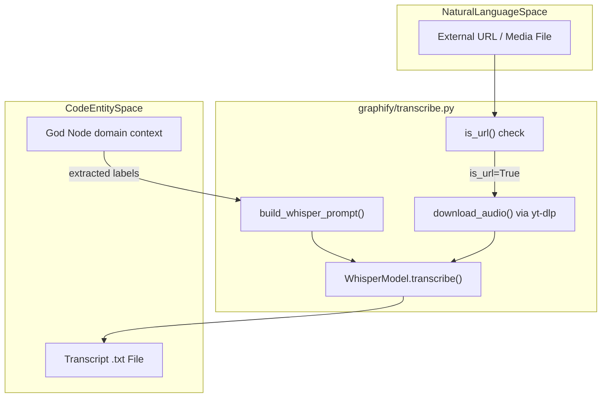

# Extraction Engine

<details>
<summary>Relevant source files</summary>

The following files were used as context for generating this wiki page:

- [graphify/detect.py](graphify/detect.py)
- [graphify/extract.py](graphify/extract.py)
- [graphify/llm.py](graphify/llm.py)
- [graphify/mcp_ingest.py](graphify/mcp_ingest.py)
- [graphify/transcribe.py](graphify/transcribe.py)
- [graphify/validate.py](graphify/validate.py)
- [tests/fixtures/dynamic_import.ts](tests/fixtures/dynamic_import.ts)
- [tests/fixtures/sample.mcp.json](tests/fixtures/sample.mcp.json)
- [tests/test_claude_cli_backend.py](tests/test_claude_cli_backend.py)
- [tests/test_extract.py](tests/test_extract.py)
- [tests/test_languages.py](tests/test_languages.py)
- [tests/test_llm_backends.py](tests/test_llm_backends.py)
- [tests/test_mcp_ingest.py](tests/test_mcp_ingest.py)
- [tests/test_provider_registry.py](tests/test_provider_registry.py)
- [tests/test_terraform.py](tests/test_terraform.py)

</details>


The **Extraction Engine** is the primary ingestion and parsing layer of `graphify`. It converts raw source code, academic papers, web content, and audio/video media into a unified graph schema. It employs a hybrid approach: deterministic Abstract Syntax Tree (AST) parsing via `tree-sitter` for 20+ languages, specialized web ingestion, AI-powered transcription, and a direct LLM backend for semantic extraction.

## AST-Based Structural Extraction

The engine uses `tree-sitter` to perform deterministic extraction of code entities and their relationships [graphify/extract.py:1-1](). Unlike LLM-based extraction, this process is purely structural, ensuring accuracy for class hierarchies, method definitions, and import graphs.

### Supported Languages and Extractor Functions
The engine supports over 20 languages, including specialized support for Dart, Verilog/SystemVerilog, PHP, BYOND DreamMaker, and .NET project files.

| Language | Extractor Function | Primary Entities Captured |
| :--- | :--- | :--- |
| **Python** | `extract_python` | Classes, Methods, Functions, Imports, Inheritance, Calls [tests/test_extract.py:23-50]() |
| **JS / TS** | `extract_js` | Classes, Methods, Functions, Exports, Calls, `.mjs/.ejs` support [tests/test_languages.py:5-9]() |
| **Go** | `extract_go` | Structs, Methods, Constructors, Calls [tests/test_languages.py:5-9]() |
| **Rust** | `extract_rust` | Structs, Impl Blocks, Methods, Functions, Calls [tests/test_languages.py:5-9]() |
| **Java** | `extract_java` | Classes, Interfaces, Methods, Imports [tests/test_languages.py:72-107]() |
| **C / C++** | `extract_c`, `extract_cpp` | Functions, Classes, Includes, Calls [tests/test_languages.py:110-205]() |
| **PHP** | `extract_php` | Classes, Traits, Static Properties, Container Binds [tests/test_languages.py:7-9]() |
| **.NET** | `extract_sln`, `extract_csproj` | Project dependencies, references, solutions, `.razor` support [tests/test_languages.py:9-12]() |
| **Dart** | `extract_dart` | Classes, Mixins, Extensions, Methods [tests/test_languages.py:5-9]() |
| **DreamMaker** | `extract_dm`, `extract_dmi` | BYOND DM/DMI/DMM/DMF structures [tests/test_languages.py:10-12]() |
| **Terraform** | `extract_terraform` | Resources, Providers, Variables, Data Sources [tests/test_terraform.py:7-12]() |
| **Pascal** | `extract_pascal` | Units, Procedures, Functions, Classes (Lazarus support) [tests/test_languages.py:5-9]() |

### Deterministic ID Generation
The engine uses `_make_id` to generate stable node IDs from symbol names. It preserves Unicode characters (NFKC normalization) to ensure non-ASCII identifiers don't collapse into collisions [graphify/extract.py:65-78](). To prevent collisions between files with the same name in different directories, `_file_stem` qualifies the stem with the parent directory name [graphify/extract.py:81-87]().

### Symbol Resolution & Filtering
Cross-file symbol resolution is handled deterministically. For JavaScript/TypeScript, `_resolve_js_import_path` handles ESM conventions where imports might use `.js` extensions while the source is `.ts`, and resolves directory index files [graphify/extract.py:146-177]().

To prevent graph pollution, `_LANGUAGE_BUILTIN_GLOBALS` filters common built-ins (e.g., `String`, `Promise`, `int`, `list`) from becoming graph nodes [graphify/extract.py:24-43](). Additionally, `_PYTHON_ANNOTATION_NOISE` suppresses common type hints from creating spurious edges.

**AST Extraction Flow**
```mermaid
graph LR
    subgraph "SourceCode"
        ["Raw Source Files (.py, .ts, .dart, .cs, .tf)"]
    end

    subgraph "graphify/extract.py"
        TS["tree-sitter Parser"]
        LC["LanguageConfig mapping"]
        W["_safe_extract() wrapper"]
        CG["_make_id() normalization"]
        FIL["_LANGUAGE_BUILTIN_GLOBALS filter"]
        SR["_resolve_js_import_path()"]
    end

    subgraph "InternalSchema"
        DICT["{nodes: [], edges: [], hyperedges: []}"]
    end

    SourceCode --> TS
    TS --> LC
    LC --> W
    W --> CG
    CG --> FIL
    FIL --> SR
    SR --> DICT
```
**Sources:** [graphify/extract.py:24-43](), [graphify/extract.py:65-87](), [graphify/extract.py:146-177](), [tests/test_extract.py:7-22]()

---

## Multi-Modal Ingestion

### URL Ingestion (`ingest.py`)
The `ingest` module converts external URLs into graph-ready Markdown files.
*   **arXiv**: Targets the abstract, title, and authors of papers.
*   **Tweets**: Uses oEmbed to extract tweet text and metadata.
*   **Webpages**: Converts HTML to clean Markdown using `markdownify`.

### Audio/Video Transcription (`transcribe.py`)
The engine uses `faster-whisper` for transcription [graphify/transcribe.py:1-9]().
*   **Domain-Aware Prompts**: `build_whisper_prompt` uses "God Nodes" (top corpus abstractions) to provide a technical context hint to Whisper, improving the accuracy of specialized terminology [graphify/transcribe.py:93-114]().
*   **URL Support**: `download_audio` uses `yt-dlp` to fetch audio streams [graphify/transcribe.py:48-90]().

### Specialized Ingestion
*   **MCP Config**: `extract_mcp_config` parses `.mcp.json` and `claude_desktop_config.json` to map tool names and servers [graphify/mcp_ingest.py:1-10]().
*   **SCIP Ingestion**: `graphify/scip_ingest.py` supports SCIP JSON ingestion for LLM-generated symbol graphs.

**Data Ingestion to Entity Space**

**Sources:** [graphify/transcribe.py:48-114](), [graphify/mcp_ingest.py:1-15]()

---

## LLM Backend (`llm.py`)

For semantic extraction where AST parsing is insufficient, `graphify` provides a direct LLM backend supporting Claude, Gemini, OpenAI, Ollama, Bedrock, and Kimi K2.6 [graphify/llm.py:48-119]().

*   **Direct API Path**: `extract_files_direct` allows calling LLMs without the full Claude Code skill environment [graphify/llm.py:1-5]().
*   **Chunked Processing**: Large file lists are split into chunks based on token budgets to avoid context window overflows [graphify/llm.py:17-25]().
*   **Adaptive Retry**: `_extract_with_adaptive_retry` implements bisection on context window overflows, splitting chunks into halves until they fit the model's limits [graphify/llm.py:134-191]().
*   **Custom Providers**: Users can define custom LLM backends via `~/.graphify/providers.json` [graphify/llm.py:122-162]().

---

## Validation, Caching, and Security

### Semantic and AST Cache (`cache.py`)
To ensure performance during incremental updates, `graphify` implements a SHA256-based cache system.
*   **Stat-based Fastpath**: Uses `size` and `mtime_ns` to skip full file reads when possible.
*   **Storage**: Cached extractions are stored in `graphify-out/cache/ast/` or `graphify-out/cache/semantic/`.

### Security and Validation (`validate.py`)
*   **Schema Enforcement**: `validate_extraction` checks for required fields and enforces confidence levels (`EXTRACTED`, `INFERRED`, `AMBIGUOUS`) [graphify/validate.py:10-38]().
*   **File Type Safety**: Enforces valid types including `code`, `document`, `paper`, `image`, `video`, `rationale`, and `concept` [graphify/validate.py:4-5]().
*   **Semantic Cleanup**: `graphify/semantic_cleanup.py` validates semantic fragments and sanitizes rationale nodes to prevent graph bloat.

---

## Extraction Schema

### Node Schema
| Key | Type | Description |
| :--- | :--- | :--- |
| `id` | `str` | Stable ID generated via `_make_id` [graphify/extract.py:65-78](). |
| `label` | `str` | Human-readable name (e.g., `process()`). |
| `file_type` | `str` | `code`, `document`, `paper`, `image`, `video`, `rationale`, or `concept` [graphify/validate.py:4-5](). |
| `source_file`| `str` | Path to the originating file. |

### Edge Schema
| Key | Type | Description |
| :--- | :--- | :--- |
| `source` | `str` | The `id` of the source node. |
| `target` | `str` | The `id` of the target node. |
| `relation` | `str` | `inherits`, `implements`, `calls`, `imports`, `references`, `depends_on`, etc [graphify/extract.py:107-110](). |
| `confidence` | `str` | `EXTRACTED`, `INFERRED`, or `AMBIGUOUS` [graphify/validate.py:5-5](). |
| `context` | `str` | Specific reference context (e.g., `field`, `parameter_type`, `return_type`) [graphify/extract.py:112-114](). |

**Sources:** [graphify/extract.py:1-177](), [graphify/llm.py:48-191](), [graphify/transcribe.py:48-114](), [graphify/validate.py:4-64](), [tests/test_terraform.py:7-12]()
