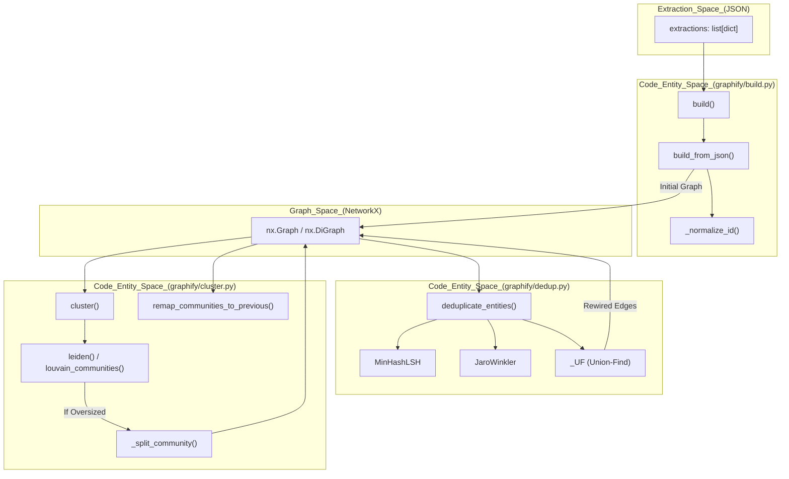
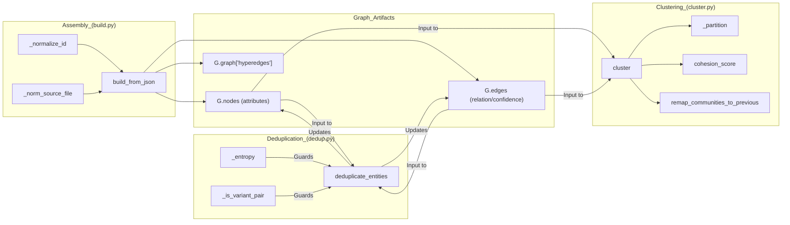

# Graph Assembly, Deduplication & Clustering

Relevant source files

The following files were used as context for generating this wiki page:

- [graphify/build.py](graphify/build.py)
- [graphify/cluster.py](graphify/cluster.py)
- [graphify/dedup.py](graphify/dedup.py)
- [tests/test_build.py](tests/test_build.py)
- [tests/test_claude_md.py](tests/test_claude_md.py)
- [tests/test_cli_export.py](tests/test_cli_export.py)
- [tests/test_cluster.py](tests/test_cluster.py)
- [tests/test_dedup.py](tests/test_dedup.py)
- [tests/test_rationale.py](tests/test_rationale.py)

This stage of the pipeline transforms raw extraction dictionaries into a structured **NetworkX** graph, resolves entity ambiguity through a multi-stage deduplication pipeline, and applies community detection algorithms to organize the data into meaningful clusters.

## Graph Assembly

The assembly process is handled by `graphify/build.py`. It merges multiple extraction outputs (from `graphify/extract.py` or `graphify/ingest.py`) into a single unified graph structure while ensuring schema integrity, preserving relationship directions, and injecting semantic metadata.

### Implementation Details

The core logic resides in three primary functions:
*   `build(extractions, *, directed=False)`: A wrapper that combines a list of extraction dictionaries, summing token counts and concatenating node, edge, and hyperedge lists [graphify/build.py:171-196]().
*   `build_from_json(extraction, *, directed=False, root=None)`: The primary constructor that initializes a `networkx.DiGraph` (if directed) or `networkx.Graph` object. It handles legacy schema canonicalization (e.g., remapping `links` to `edges` or `source` to `source_file`) and coercing invalid `file_type` values via `_FILE_TYPE_SYNONYMS` [graphify/build.py:107-168]().
*   `build_merge(extractions, existing_graph_path, ...)`: Handles incremental updates by merging new extractions with an existing `graph.json` while preserving edge directions and community labels [graphify/build.py:199-252]().

### Node Deduplication & Priority
The system handles duplicate entities through a three-layer resolution strategy:
1.  **Within a File (AST)**: Extractors use a `seen_ids` set to emit a node ID at most once per file, collapsing duplicate class/function definitions to the first occurrence [graphify/build.py:5-7]().
2.  **Between Files (Build)**: `G.add_node()` is idempotent. Nodes are added in extraction order (AST first, then semantic). Since the last attribute set wins, **semantic nodes overwrite AST nodes**, ensuring richer labels and cross-file context take precedence [graphify/build.py:9-16]().
3.  **Semantic Merge**: The calling skill merges cached and new semantic results using an explicit `seen` set keyed on `node["id"]` before graph construction [graphify/build.py:18-21]().

### Path & ID Normalization
To handle discrepancies between LLM-generated IDs and AST-extracted IDs, `graphify` uses normalization:
*   **_normalize_id**: Reconciles IDs using NFKC normalization, Unicode-aware alphanumeric substitution, and underscore collapse [graphify/build.py:54-65](). This allows edges to survive when punctuation or casing varies (e.g., `Session_Validate` vs `session_validate`) [graphify/build.py:159-163]().
*   **_norm_source_file**: Normalizes path separators to forward slashes and relativizes absolute paths to the project root so all nodes share a consistent path key [graphify/build.py:68-83]().

### Multigraph & Hyperedge Support
*   **Multigraph Compatibility**: `graphify/multigraph_compat.py` provides a capability probe for future `--multigraph` mode support [graphify/multigraph_compat.py:1-24]().
*   **Hyperedges**: `build_from_json` extracts `hyperedges` from the JSON payload and stores them in the graph-level metadata `G.graph["hyperedges"]` [graphify/build.py:166-167]().

**Sources:** [graphify/build.py:1-252](), [graphify/multigraph_compat.py:1-24]()

---

## Entity Deduplication Pipeline

`graphify/dedup.py` provides a sophisticated pipeline for merging near-identical entities that may have been extracted with different labels (e.g., "GraphExtractor" vs "Graph Extractor").

### The Deduplication Stages
The `deduplicate_entities` function executes a multi-pass strategy [graphify/dedup.py:129-158]():

1.  **Exact Normalization**: Merges nodes with identical lowercase alphanumeric labels within the same file [graphify/dedup.py:172-195]().
2.  **Entropy Gate**: Skips fuzzy matching for low-entropy labels (e.g., "AI", "ML") to prevent false positives [graphify/dedup.py:24-33, 119]().
3.  **MinHash/LSH Blocking**: Efficiently identifies candidate pairs using k-gram character shingles and Locality Sensitive Hashing [graphify/dedup.py:36-48, 206-217]().
4.  **Jaro-Winkler Verification**: Calculates a similarity score (threshold 92.0) for candidate pairs [graphify/dedup.py:121, 221]().
5.  **Community Boost**: Adds a +5.0 score bonus if two nodes already belong to the same community, favoring merges within related subsystems [graphify/dedup.py:122, 225-228]().
6.  **Union-Find Merge**: Uses a Union-Find data structure to group all identified duplicates and select a "winner" node [graphify/dedup.py:92-114, 238-248]().

### Variant Protection
To prevent false merges of similar but distinct entities (e.g., "ASR1603" vs "ASR1605"), the pipeline includes specific guards:
*   **_is_variant_pair**: Detects sibling model/SKU variants sharing a stem but differing in numeric/revision suffixes [graphify/dedup.py:58-70]().
*   **_short_label_blocked**: Blocks fuzzy merges for labels under 12 characters unless they are same-length single-char substitutions (typos) [graphify/dedup.py:73-87]().

**Sources:** [graphify/dedup.py:1-248]()

---

## Community Detection (Clustering)

Once the graph is assembled, `graphify/cluster.py` partitions nodes into communities using the **Leiden algorithm**.

### The Clustering Logic
The `cluster()` function organizes the graph into stable, navigable units [graphify/cluster.py:86-106]():

| Feature | Implementation Logic |
| :--- | :--- |
| **Algorithm Selection** | Tries Leiden (`graspologic`) for quality; falls back to Louvain (`networkx`) [graphify/cluster.py:22-77](). |
| **Hub Exclusion** | Nodes exceeding a degree percentile can be excluded from partitioning and reattached via majority-vote to prevent "utility super-hubs" from merging unrelated subsystems [graphify/cluster.py:114-160](). |
| **Oversized Splitting** | Communities larger than 25% of the graph are recursively split [graphify/cluster.py:80-81, 161-168](). |
| **Cohesion Splitting** | Re-splits communities with cohesion scores below 0.05 to isolate "doc-hub" nodes like `CLAUDE.md` [graphify/cluster.py:82-83, 170-181](). |
| **Stability** | `remap_communities_to_previous` reuses IDs from previous runs to maintain stable community identities across incremental updates [graphify/cluster.py:210-234](). |

### Cohesion Scoring
For every detected community, `graphify` calculates a **Cohesion Score** (density of intra-community edges) [graphify/cluster.py:191-207](). A score of 1.0 represents a clique or a single-node community [graphify/cluster.py:195-196]().

**Sources:** [graphify/cluster.py:1-234]()

---

## Data Flow: Extraction to Graph

The following diagram illustrates how raw data flows from the `Extraction Engine` through assembly, deduplication, and clustering.

### Pipeline: Extraction to Cluster

**Sources:** [graphify/build.py:107-196](), [graphify/dedup.py:129-164](), [graphify/cluster.py:86-234]()

---

## Component Mapping

The following diagram maps code entities to their architectural roles.

**Sources:** [graphify/build.py:54-168](), [graphify/dedup.py:1-125](), [graphify/cluster.py:22-234]()
