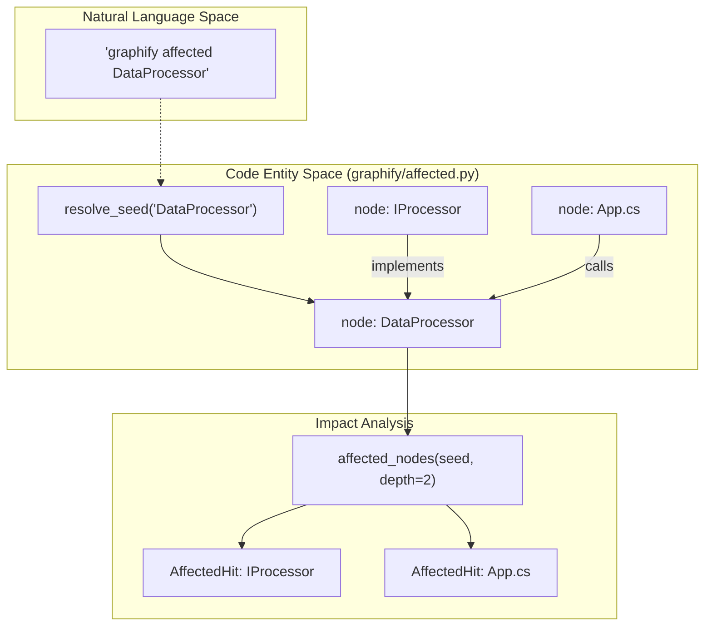
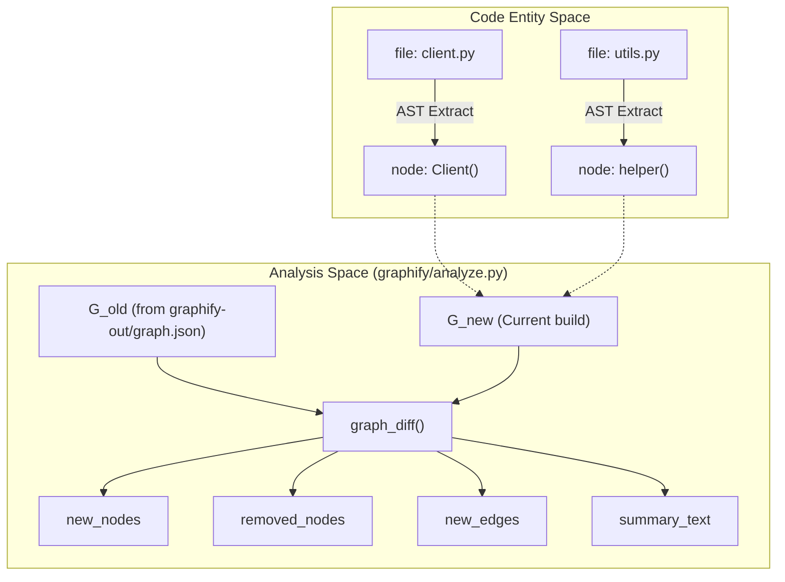
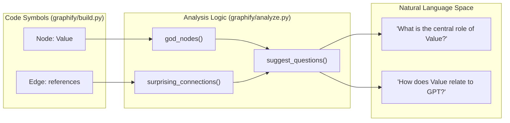

# Graph Analysis

Relevant source files

The following files were used as context for generating this wiki page:

- [graphify/affected.py](graphify/affected.py)
- [graphify/analyze.py](graphify/analyze.py)
- [graphify/report.py](graphify/report.py)
- [tests/test_affected_cli.py](tests/test_affected_cli.py)
- [tests/test_analyze.py](tests/test_analyze.py)

The graph analysis stage in `graphify` transforms a raw NetworkX graph into actionable architectural insights. By applying structural heuristics and community-aware algorithms, it identifies the most significant entities, discovers non-obvious relationships across disparate source types (code, papers, images), and identifies potential impact zones for code changes.

## Core Analysis Logic

The analysis engine resides in `graphify/analyze.py` and operates on the `nx.Graph` produced by the assembly and clustering stages. It focuses on identifying "God Nodes" (central hubs), "Surprising Connections" (cross-boundary edges), and providing incremental diffs for iterative updates.

### God Nodes Identification
The `god_nodes` function identifies the core abstractions of a codebase by ranking nodes by their degree centrality (total number of connections) [graphify/analyze.py:95-102]().

To ensure these results represent meaningful architectural entities rather than structural artifacts, the algorithm applies a strict filtering process via `_is_file_node`, `_is_concept_node`, and `_is_json_key_node` [graphify/analyze.py:105-106](). Additionally, it filters out common built-in types and mock objects defined in `_BUILTIN_NOISE_LABELS` [graphify/analyze.py:11-16](), [graphify/analyze.py:107-108]().

| Filtered Entity Type | Identification Signal | Reason for Exclusion |
| :--- | :--- | :--- |
| **File-level Hubs** | Label matches `source_file` name [graphify/analyze.py:62-67]() | These accumulate mechanical `import` and `contains` edges without being a logical abstraction. |
| **Method Stubs** | Label starts with `.` and ends with `()` [graphify/analyze.py:68-70]() | AST-extracted methods are children of classes; the class itself should be the God Node. |
| **Isolated Functions** | Label ends with `()` and degree $\le 1$ [graphify/analyze.py:73-75]() | Structurally isolated functions do not represent central hubs. |
| **JSON Noise** | Label in `_JSON_NOISE_LABELS` (e.g., 'id', 'type') [graphify/analyze.py:78-92]() | Common keys in JSON files create artificial hubs that lack architectural meaning. |
| **Concept Nodes** | Empty `source_file` or no file extension [graphify/analyze.py:151-167]() | Manually injected or inferred semantic labels are intentional, not discovered structural hubs. |

**Sources:** [graphify/analyze.py:11-16](), [graphify/analyze.py:50-75](), [graphify/analyze.py:78-93](), [graphify/analyze.py:95-116](), [graphify/analyze.py:151-167]()

---

## Surprising Connections & Scoring

The `surprising_connections` function detects edges that bridge distant parts of the system. The strategy shifts based on whether the corpus is multi-source or single-source [graphify/analyze.py:119-149]().

### Cross-File vs. Cross-Community Strategies

1.  **Multi-File Corpora:** Uses `_cross_file_surprises` to find edges connecting different files, ranked by a composite **Surprise Score** [graphify/analyze.py:145-146]().
2.  **Single-File Corpora:** Uses `_cross_community_surprises` to identify edges that bridge Leiden-detected communities [graphify/analyze.py:147-148]().

### Surprise Scoring Algorithm
For multi-file graphs, every cross-file edge is evaluated by `_surprise_score`, which aggregates points based on structural signals [graphify/analyze.py:189-252]():

| Signal | Score Bonus | Rationale |
| :--- | :--- | :--- |
| **Confidence** | +3 (AMBIGUOUS), +2 (INFERRED) | Connections not explicitly stated in source code (e.g., via LLM inference) are more noteworthy [graphify/analyze.py:203-206](). |
| **Cross-Type** | +2 | An edge between different categories (e.g., `code` entity and a `paper` PDF) is highly non-obvious [graphify/analyze.py:216-221](). |
| **Cross-Repo** | +2 | Connections between different top-level directories (detected via `_top_level_dir`) [graphify/analyze.py:223-226](). |
| **Cross-Community** | +1 | Bridges between nodes that the Leiden algorithm placed in different clusters [graphify/analyze.py:229-233](). |
| **Semantic Similarity**| x1.5 Multiplier | Non-obvious conceptual links (relation: `semantically_similar_to`) score higher [graphify/analyze.py:236-238](). |
| **Peripheral-to-Hub** | +1 | A node with $\le 2$ edges connecting directly to a hub with $\ge 5$ edges [graphify/analyze.py:241-247](). |

**Sources:** [graphify/analyze.py:119-149](), [graphify/analyze.py:189-252](), [tests/test_analyze.py:40-107](), [tests/test_analyze.py:130-147]()

---

## Impact Analysis (Affected Nodes)

The `graphify/affected.py` module provides logic for the `graphify affected` command, allowing developers to see what code might be impacted by a change to a specific node [graphify/affected.py:1-152]().

### Affected Traversal Logic
The `affected_nodes` function performs a Breadth-First Search (BFS) starting from a "seed" node, traversing edges in **reverse** (in-edges) to find callers or dependants [graphify/affected.py:74-110]().

1.  **Seed Resolution:** `resolve_seed` attempts to match a user query string to a `node_id`, `label`, or `source_file` [graphify/affected.py:46-71]().
2.  **Relation Filtering:** Only edges with relations in `DEFAULT_AFFECTED_RELATIONS` (e.g., `calls`, `inherits`, `imports`) are traversed [graphify/affected.py:11-23]().
3.  **Depth Control:** Traversal is limited by a `depth` parameter (default 2) to prevent excessive noise [graphify/affected.py:79]().

### Affected Traversal Data Flow

**Sources:** [graphify/affected.py:11-23](), [graphify/affected.py:46-110](), [tests/test_affected_cli.py:11-44]()

---

## Incremental Analysis: Graph Diffs

To support the `--update` mode and file watching, `graph_diff` compares a previous graph state with a new one to summarize changes [graphify/analyze.py:362-404]().

### Data Flow: From Code to Diff Insights

**Sources:** [graphify/analyze.py:362-404]()

---

## Question Suggestion Heuristics

The `suggest_questions` function generates natural language prompts to guide users toward under-explored or complex areas of the graph [graphify/analyze.py:320-359](). It uses three primary heuristics:

1.  **Hub Exploration:** Targets `god_nodes` (e.g., "How does the `Client` class coordinate between its 15 connected entities?") [graphify/analyze.py:332-334]().
2.  **Surprise Investigation:** Targets high-scoring `surprising_connections` (e.g., "Why does `auth.py` have an inferred connection to the `README.md`?") [graphify/analyze.py:341-343]().
3.  **Community Context:** Asks about the role of a specific Leiden community within the broader architecture [graphify/analyze.py:352-354]().

### Mapping Analysis to Natural Language

**Sources:** [graphify/analyze.py:320-359](), [graphify/analyze.py:95-116](), [graphify/analyze.py:119-149]()

---

## Summary of Key Functions

| Function | File:Lines | Description |
| :--- | :--- | :--- |
| `god_nodes` | [graphify/analyze.py:95-116]() | Identifies top $N$ entities by degree, filtering out file-level hubs, noise, and method stubs. |
| `surprising_connections` | [graphify/analyze.py:119-149]() | Dispatches to cross-file or cross-community surprise detection based on corpus size. |
| `_surprise_score` | [graphify/analyze.py:189-252]() | Calculates a numeric "surprise" value for an edge based on confidence and structural distance. |
| `affected_nodes` | [graphify/affected.py:74-110]() | BFS reverse traversal of the graph to find nodes impacted by a change to a seed node. |
| `suggest_questions` | [graphify/analyze.py:320-359]() | Generates 3-5 high-value questions based on hubs and bridge edges. |
| `graph_diff` | [graphify/analyze.py:362-404]() | Compares two graphs to return lists of new/removed nodes and edges with a human-readable summary. |

**Sources:** [graphify/analyze.py:1-404](), [graphify/affected.py:1-152]()
