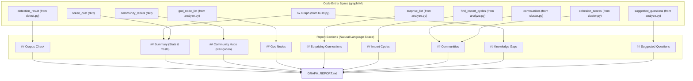
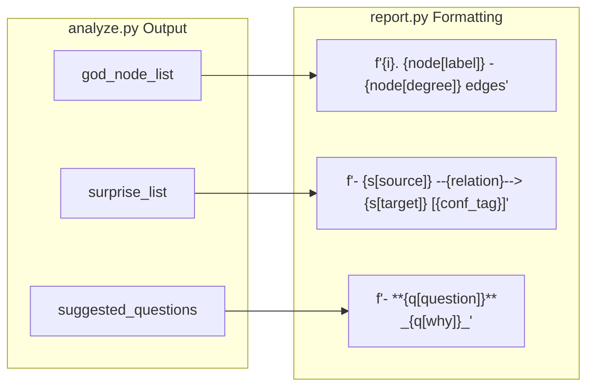

# Report Generation

Relevant source files

The following files were used as context for generating this wiki page:

- [graphify/analyze.py](graphify/analyze.py)
- [graphify/report.py](graphify/report.py)
- [tests/test_analyze.py](tests/test_analyze.py)
- [tests/test_report.py](tests/test_report.py)

The `graphify/report.py` module is responsible for synthesizing the various outputs of the analysis pipeline into a single, human-readable Markdown file: `GRAPH_REPORT.md`. This report serves as an audit trail and an executive summary of the knowledge graph's structure, highlighting core abstractions, unexpected relationships, and potential gaps in documentation or code structure.

## Overview of `generate()`

The primary entry point is the `generate()` function [graphify/report.py:15-28](). It consumes data from almost every preceding stage of the pipeline (detection, clustering, and analysis) to assemble the final document. It also accepts an optional `built_at_commit` string to track graph freshness relative to the git history [graphify/report.py:27](), [graphify/report.py:77-84]().

### Data Flow for Report Assembly

The following diagram illustrates how different code entities contribute data to the final report string.

**Report Data Aggregation**

Sources: [graphify/report.py:15-28](), [graphify/report.py:45-184](), [graphify/report.py:123-124]()

## Report Sections

### 1. Corpus Check & Summary
The report begins with a verdict on whether the corpus is large enough to benefit from graph analysis [graphify/report.py:48-56](). It provides high-level statistics:
*   **Node/Edge counts**: Total size of the graph [graphify/report.py:70]().
*   **Community count**: Number of clusters detected by the Leiden algorithm [graphify/report.py:70]().
*   **Confidence Breakdown**: A percentage-based distribution of edges labeled as `EXTRACTED` (structural), `INFERRED` (LLM-detected), or `AMBIGUOUS` (low-confidence) [graphify/report.py:35-39]().
*   **Token Cost**: The total input and output tokens consumed during the extraction and analysis phases [graphify/report.py:74]().

### 2. Community Hubs (Navigation)
To prevent the report from being a "dead-end," it generates Wikilinks to `_COMMUNITY_*.md` files [graphify/report.py:88-93](). This ensures that users navigating via Obsidian or a wiki can jump directly from the audit report into specific community deep-dives. The `_safe_community_name` helper ensures filenames are sanitized consistently with the export logic [graphify/report.py:8-12]().

### 3. God Nodes & Surprising Connections
*   **God Nodes**: Lists the top connected nodes identified by `analyze.god_nodes`, representing the core abstractions of the system [graphify/report.py:97-100]().
*   **Surprising Connections**: Displays relationships that cross file or community boundaries. It includes the relationship type, source files, and confidence tags (e.g., `INFERRED 0.85`) [graphify/report.py:102-120]().

### 4. Import Cycles
Surfaces circular dependencies detected in the graph [graphify/report.py:123-135](). It uses `find_import_cycles` from `analyze.py` to identify paths that lead back to the starting file, providing a "length-file cycle" summary [graphify/report.py:133]().

### 5. Community Summaries
For each community, the report lists:
*   **Label**: The descriptive name generated for the cluster.
*   **Cohesion Score**: The density of the cluster (0.0 to 1.0) [graphify/report.py:150](), [graphify/report.py:162]().
*   **Representative Nodes**: Up to 8 nodes are listed to give a sense of the community's content [graphify/report.py:157](). The report explicitly filters out "file nodes" (synthetic AST hubs) using `_ifn` (which maps to `analyze._is_file_node`) to reduce structural noise [graphify/report.py:58](), [graphify/report.py:152]().

### 6. Knowledge Gaps & Ambiguity
This section identifies weaknesses in the graph's connectivity:
*   **Isolated Nodes**: Nodes with degree $\le 1$ that are not files or general concepts [graphify/report.py:176-182]().
*   **Thin Communities**: Clusters with fewer than 3 non-file nodes, which might indicate noise or under-documented areas [graphify/report.py:61-64](), [graphify/report.py:155-156]().
*   **Ambiguous Edges**: A dedicated section for edges marked as `AMBIGUOUS`, allowing developers to review low-confidence inferences [graphify/report.py:166-174]().

## Implementation Details

### Edge Confidence Calculation
The report calculates percentages based on edge metadata [graphify/report.py:35-43]().

| Confidence Level | Logic in `report.py` |
| :--- | :--- |
| **EXTRACTED** | Structural edges found via AST parsing (e.g., function calls, imports) [graphify/report.py:37](). |
| **INFERRED** | Semantic edges found by LLM analysis. Includes an average confidence score [graphify/report.py:38](), [graphify/report.py:43](). |
| **AMBIGUOUS** | Low-confidence edges flagged for manual review [graphify/report.py:39](), [graphify/report.py:166-174](). |

Sources: [graphify/report.py:35-43](), [graphify/report.py:166-174]()

### Mapping Analysis to Report Sections
The `generate` function acts as a formatter for the complex objects returned by `graphify/analyze.py`.

**Analysis to Markdown Mapping**

Sources: [graphify/report.py:99-100](), [graphify/report.py:116-118](), [graphify/report.py:189-190]()

## Key Functions

| Function | File | Description |
| :--- | :--- | :--- |
| `generate` | [graphify/report.py:15]() | Main orchestrator that joins all analysis strings into the final Markdown document. |
| `_is_file_node` | [graphify/analyze.py:50]() | (Imported as `_ifn`) Used to filter out file-level nodes (hubs/stubs) when listing community members [graphify/report.py:58](). |
| `_is_concept_node` | [graphify/analyze.py:151]() | (Imported) Used to identify nodes that are general concepts vs. concrete entities [graphify/report.py:177](). |
| `_safe_community_name`| [graphify/report.py:8]() | Sanitizes community labels to ensure Wikilinks match generated filenames. |

Sources: [graphify/report.py:8-195](), [graphify/analyze.py:50](), [graphify/analyze.py:151]()
