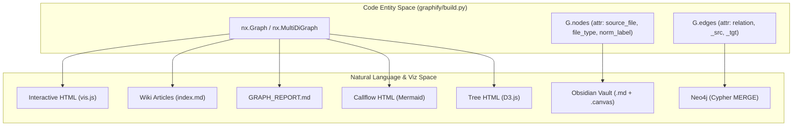

# Export & Visualization

<details>
<summary>Relevant source files</summary>

The following files were used as context for generating this wiki page:

- [graphify/__main__.py](graphify/__main__.py)
- [graphify/export.py](graphify/export.py)
- [graphify/hooks.py](graphify/hooks.py)
- [tests/test_export.py](tests/test_export.py)
- [tests/test_hooks.py](tests/test_hooks.py)

</details>


The `graphify` pipeline concludes with the export stage, transforming the internal NetworkX graph and community structure into various human-readable and machine-interoperable formats. These exports are designed to support interactive exploration, hierarchical navigation, deep knowledge management, and database integration.

### Data Flow Overview

The export functions primarily consume a NetworkX graph object. This graph preserves structural data and metadata, such as `source_file`, `file_type`, and `norm_label` for nodes, and `relation` for edges [graphify/export.py:10-17](). The export system also handles "hyperedges" and community assignments produced during the clustering phase [graphify/export.py:16-17]().

The following diagram bridges the internal code entities to the final natural language and visualization outputs:


**Sources:** [graphify/export.py:1-17](), [graphify/callflow_html.py:15-18](), [graphify/tree_html.py:22-23]()

---

### Interactive & Architecture Visualizations

Graphify provides several ways to visualize graph structure interactively or for architectural review.

*   **HTML Visualization:** Uses `vis.js` to create an interactive browser-based graph. It features a physics engine, community-based color coding using the `COMMUNITY_COLORS` palette [graphify/export.py:149-152](), and a searchable sidebar. For performance, it is capped at `MAX_NODES_FOR_VIZ` (5,000 nodes) [graphify/export.py:154](). The limit can be overridden via the `GRAPHIFY_VIZ_NODE_LIMIT` environment variable [graphify/export.py:164-171]().
*   **Callflow HTML:** A specialized export for architectural analysis via `graphify export callflow-html`. It produces a dark-themed HTML file containing Mermaid-based flowcharts and call detail tables [graphify/callflow_html.py:1-12]().
*   **Tree HTML:** Generated via `graphify tree`, this provides a D3 v7 collapsible-tree view of the module hierarchy [graphify/tree_html.py:1-12](). It uses a `total_count` field to show descendant leaf counts even for collapsed nodes [graphify/tree_html.py:14-20]().
*   **SVG Export:** Produces a static vector graphic using `matplotlib` via `to_svg`.

For details, see [HTML & SVG Visualization](#3.1), [Callflow HTML Export](#3.5), and [Tree HTML Export](#3.6).

**Sources:** [graphify/export.py:149-171](), [graphify/callflow_html.py:1-12](), [graphify/tree_html.py:1-33]()

---

### Knowledge Management

These formats are designed for long-term storage and navigation of the extracted knowledge.

*   **Obsidian Vault:** Generates Markdown files where each node becomes a file. It utilizes `to_obsidian` for wikilinks and `to_canvas` for a grid-based 2D layout [graphify/export.py:6](). Node file paths in the canvas are vault-root-relative for portability [graphify/export.py:168-181]().
*   **Wiki Export:** The `to_wiki` function generates a Wikipedia-style set of articles, including community summaries and "god node" articles [graphify/wiki.py:1-5]().

For details, see [Obsidian Vault & Canvas Export](#3.2) and [Wiki Export](#3.3).

**Sources:** [graphify/export.py:6](), [graphify/export.py:168-181](), [graphify/wiki.py:1-5]()

---

### Machine Interoperability & Backups

Standard exchange formats for graph databases and external analysis tools.

| Format | Function | Purpose |
| :--- | :--- | :--- |
| **JSON** | `to_json` | Standard `node_link_data` export [graphify/export.py:6](). |
| **GraphML** | `to_graphml` | XML format for Gephi and yEd [graphify/export.py:6](). |
| **Cypher** | `to_cypher` / `push_to_neo4j` | MERGE statements for Neo4j [graphify/export.py:6](). |

Graphify also includes a `backup_if_protected` mechanism that snapshots artifacts like `graph.json`, `GRAPH_REPORT.md`, and `.graphify_labels.json` to dated subfolders before an overwrite if the graph contains human curation or expensive semantic data [graphify/export.py:21-43]().

For details, see [Neo4j, GraphML & JSON Export](#3.4).

**Sources:** [graphify/export.py:6-43]()

---

### Export Sanitization

To ensure exports are safe and compatible, graphify employs several sanitization routines:

*   `sanitize_label`: Strips control characters and handles HTML escaping [graphify/export.py:15]().
*   `_yaml_str`: Escapes values for safe embedding in YAML double-quoted scalars, handling backslashes, quotes, and C0 control characters [graphify/export.py:111-146]().
*   `_obsidian_tag`: Sanitizes community names for Obsidian tag compatibility [graphify/export.py:96-102]().

```mermaid
graph LR
    Raw["Raw Entity (e.g. 'class User: Auth')"] -- "sanitize_label()" --> SafeLabel["'class User Auth'"]
    SafeLabel -- "export._yaml_str()" --> YAML["'\"class User: Auth\"'"]
    SafeLabel -- "export._obsidian_tag()" --> Tag["#class_User_Auth"]
```
**Sources:** [graphify/export.py:15-146]()
