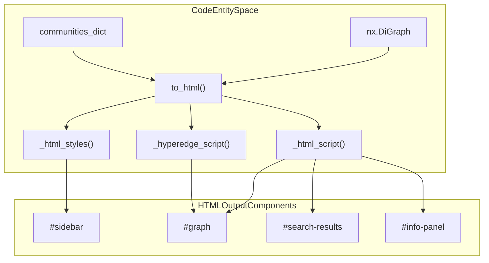
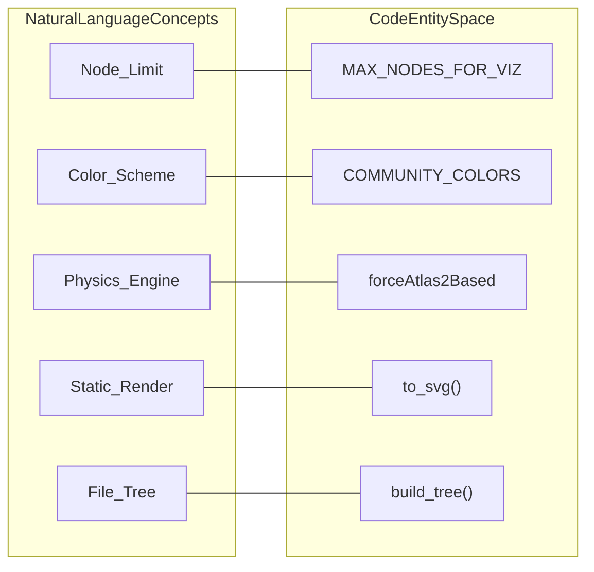

# HTML & SVG Visualization

Relevant source files

The following files were used as context for generating this wiki page:

- [graphify/export.py](graphify/export.py)
- [graphify/hooks.py](graphify/hooks.py)
- [tests/test_export.py](tests/test_export.py)
- [tests/test_hooks.py](tests/test_hooks.py)

Graphify provides three primary visual export formats: an interactive HTML dashboard powered by `vis.js`, a static SVG render via `matplotlib`, and a collapsible tree view via `D3.js`. These visualizations allow users to explore the structural relationships, community clusters, and filesystem hierarchies extracted during the pipeline.

### Interactive HTML Export (`to_html`)

The `to_html` function generates a standalone HTML file containing a searchable, filterable, and interactive graph [graphify/export.py:284-442](). It uses the `vis.js` library for rendering and includes a custom sidebar for metadata inspection.

#### Visualization Constraints and Scaling
To ensure browser performance, the visualization enforces a hard limit of **5,000 nodes** via the `MAX_NODES_FOR_VIZ` constant [graphify/export.py:154-154](). This limit can be overridden by the `GRAPHIFY_VIZ_NODE_LIMIT` environment variable [graphify/export.py:157-171](). Since v0.4.23, if a graph exceeds this limit, `to_html` raises a `ValueError` to prevent generating unusable files [graphify/export.py:287-289]().

Nodes are sized dynamically based on their degree, calculated as `15 + (math.sqrt(G.degree(node_id)) * 5)`, and clamped to a maximum of 45 [graphify/export.py:293-293]().

#### Styling and Scripting Architecture
The HTML generation is split into distinct components to manage complexity:
*   **`_html_styles()`**: Returns a CSS block defining the dark-mode aesthetic (`#0f0f1a` background), sidebar layout, and search result styling [graphify/export.py:173-211]().
*   **`_html_script()`**: Injects the core JavaScript logic, including the `vis.DataSet` initialization, search functionality, and node focus handlers [graphify/export.py:236-281]().
*   **`_hyperedge_script()`**: Injects specialized logic for rendering hyperedges as shaded convex hulls using the HTML5 Canvas API [graphify/export.py:214-233]().

#### Physics and Interaction
The interactive graph uses the `forceAtlas2Based` solver for its physics engine [graphify/export.py:221-229](). To optimize resource usage, physics are automatically disabled once the graph stabilizes [graphify/export.py:243-245](). Interaction features include:
*   **Search**: A real-time search bar that filters nodes by label [graphify/export.py:179-184]().
*   **Community Legend**: A clickable legend that allows users to dim or highlight specific communities using the `COMMUNITY_COLORS` palette [graphify/export.py:149-152](), [graphify/export.py:194-201]().
*   **Info Panel**: A sidebar that populates with `source_file`, `file_type`, and degree statistics when a node is selected [graphify/export.py:185-193]().

**HTML Visualization Data Flow**
"This diagram illustrates how internal Graph Data is transformed into the Interactive HTML components."

Sources: [graphify/export.py:149-152](), [graphify/export.py:173-211](), [graphify/export.py:214-233](), [graphify/export.py:236-281](), [graphify/export.py:284-442]()

---

### Static SVG Export (`to_svg`)

The `to_svg` function provides a static alternative for documentation or quick previews [graphify/export.py:445-480](). It leverages `matplotlib` and NetworkX's layout engines to produce a vector image.

#### Implementation Details
*   **Layout**: It utilizes `nx.spring_layout` to position nodes [graphify/export.py:459-459]().
*   **Coloring**: Nodes are assigned colors from the `COMMUNITY_COLORS` palette based on their community ID [graphify/export.py:149-152](), [graphify/export.py:462-462]().
*   **Label Filtering**: To maintain readability in dense graphs, labels are only rendered for nodes with a degree higher than a specific threshold or for identified "God Nodes" [graphify/export.py:466-469]().

**Visualization Logic Bridge**
"This diagram maps the high-level visualization concepts to the specific implementation constants and functions."

Sources: [graphify/export.py:149-152](), [graphify/export.py:154-154](), [graphify/export.py:445-480](), [graphify/tree_html.py:68-80]()

---

### Tree HTML Export (`tree_html.py`)

The `tree_html` module emits a D3 v7 collapsible-tree HTML view [graphify/tree_html.py:1-13](). It is designed to complement the force-directed graph by showing a filesystem-centric hierarchy of modules and symbols.

*   **`build_tree()`**: Transforms the NetworkX graph into a nested JSON structure (`{name, total_count, children}`) [graphify/tree_html.py:68-169]().
*   **Truncation**: To maintain usability in wide directories, it uses a `max_children` cap (default 200), replacing overflow with a synthetic `(+N more)` leaf [graphify/tree_html.py:43-43](), [graphify/tree_html.py:64-65]().
*   **Visual Elements**: Features include expand/collapse all buttons, multi-line label wrapping, and depth-based color palettes [graphify/tree_html.py:7-12]().

Sources: [graphify/tree_html.py:1-43](), [graphify/tree_html.py:68-169]()

---

### Export Function Comparison

| Function | Output Format | Primary Library | Key Features |
| :--- | :--- | :--- | :--- |
| `to_html` | `.html` | `vis.js` | Interactive, Search, Community Filtering, Physics Engine [graphify/export.py:284-442]() |
| `to_svg` | `.svg` | `matplotlib` | Static, Vector-based, Degree-based scaling [graphify/export.py:445-480]() |
| `build_tree` | `.html` | `D3.js` | Collapsible Hierarchy, Filesystem-centric, Symbol counts [graphify/tree_html.py:68-169]() |

### Security and Sanitization
Before any node label or metadata is written to output, it is passed through `sanitize_label` [graphify/export.py:15-15](). This strips control characters and enforces a 256-character cap. Within the `to_html` JavaScript payload, an additional `esc()` helper is used to prevent XSS when injecting data into the DOM's `innerHTML` [graphify/export.py:195-197](). YAML exports use `_yaml_str` to escape control characters and line breaks [graphify/export.py:111-146]().

Sources: [graphify/export.py:15-15](), [graphify/export.py:111-146](), [graphify/export.py:284-480]()
