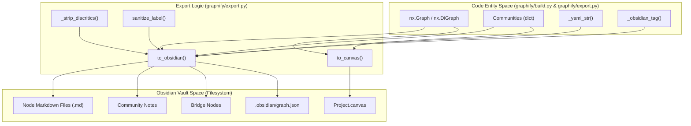
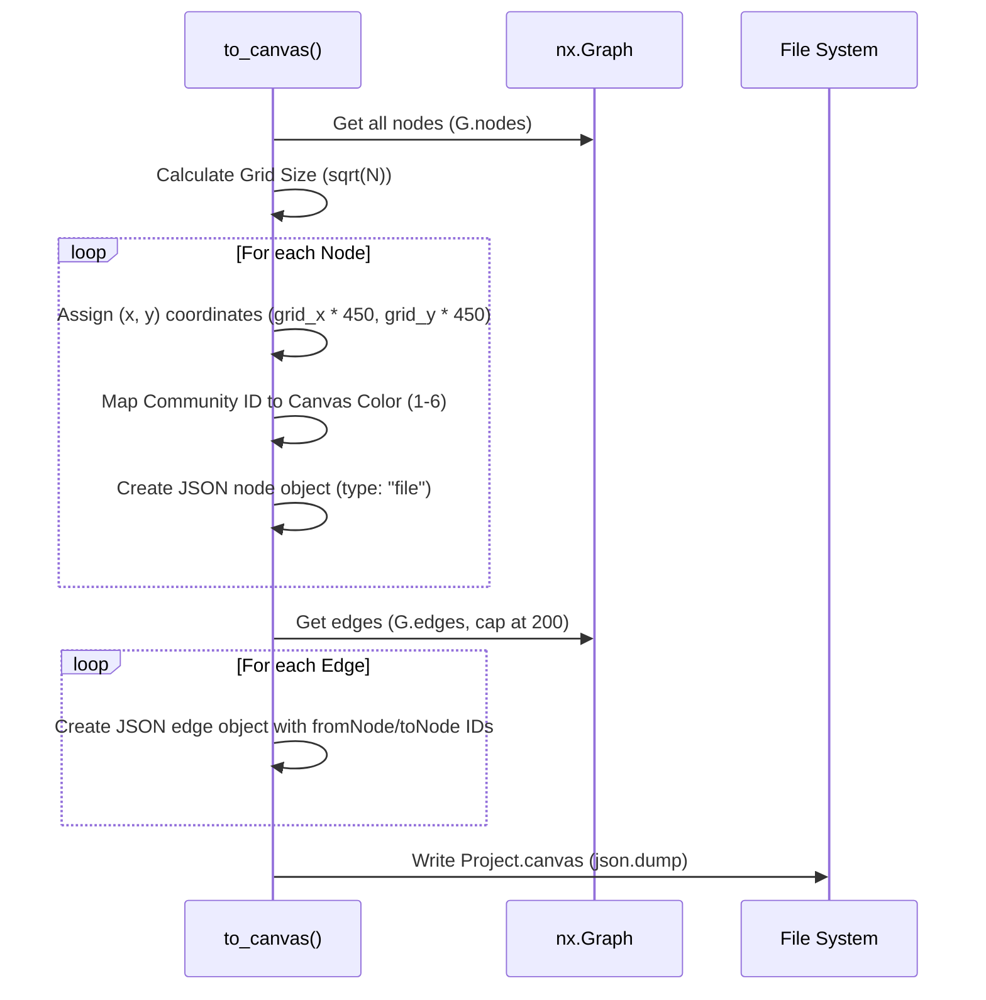

# Obsidian Vault & Canvas Export

Relevant source files

The following files were used as context for generating this wiki page:

- [graphify/export.py](graphify/export.py)
- [graphify/hooks.py](graphify/hooks.py)
- [tests/test_export.py](tests/test_export.py)
- [tests/test_hooks.py](tests/test_hooks.py)
- [tests/test_obsidian_filename_cap.py](tests/test_obsidian_filename_cap.py)

The Obsidian export subsystem transforms the analyzed graph into a fully functional Obsidian vault. This allows users to navigate the extracted knowledge base using a local-first, markdown-based interface. It includes per-node markdown files with YAML frontmatter, community-level overviews, automated Dataview queries, and a visual representation via the Obsidian Canvas format.

## Overview of Export Mechanisms

The export process is handled primarily by two functions in `graphify/export.py`:
1.  `to_obsidian`: Generates a directory structure where every node in the graph becomes a `.md` file with YAML frontmatter [graphify/export.py:330-459]().
2.  `to_canvas`: Generates a `.canvas` JSON file that uses a grid-based layout algorithm to visualize nodes and their relationships within Obsidian [graphify/export.py:461-518]().

### Data Flow: Graph to Vault

The following diagram illustrates the transformation from the internal NetworkX graph structure to the physical file structure of an Obsidian vault, highlighting the sanitization and mapping utilities used.

**Sources:** [graphify/export.py:96-102](), [graphify/export.py:105-108](), [graphify/export.py:111-146](), [graphify/export.py:330-331](), [graphify/export.py:461-462](), [graphify/build.py:42-74]()

---

## The `to_obsidian` Export

The `to_obsidian` function creates a structured vault designed for both human reading and automated tool (agent) crawling.

### 1. Node Sanitization and Filename Caps
To ensure compatibility with file systems and Obsidian's internal linking, node names are processed through a sanitization regex via `sanitize_label` [graphify/export.py:335-338](). The system also utilizes `_strip_diacritics` to normalize characters for filename safety [graphify/export.py:105-108](). 

Crucially, to prevent `OSError ENAMETOOLONG` on long node labels (issue #1094), filenames are capped to stay under the **255-byte** filesystem limit [tests/test_obsidian_filename_cap.py:1-3](). This cap applies to both ASCII and CJK characters, ensuring that even multi-byte UTF-8 sequences do not overflow the buffer [tests/test_obsidian_filename_cap.py:32-36](). Wikilinks are updated to point to the truncated filenames to maintain graph integrity [tests/test_obsidian_filename_cap.py:49-63]().

### 2. File Structure and Frontmatter
Each node is exported as a markdown file containing:
*   **YAML Frontmatter**: Includes metadata such as `type`, `source_file`, `community`, and `degree` [graphify/export.py:387-393](). String values are escaped using `_yaml_str` to prevent injection attacks or YAML syntax errors from special characters in source code [graphify/export.py:111-146]().
*   **Relationships**: Lists of incoming and outgoing edges, categorized by their relationship type (e.g., "calls", "inherits", "defines") [graphify/export.py:397-410]().
*   **Dataview Integration**: Automated queries are injected to list neighbors dynamically if the user has the Dataview plugin installed [graphify/export.py:415-420]().

### 3. Community and Bridge Notes
*   **Community Notes**: For each community identified by the Leiden algorithm, a note is created (e.g., `_COMMUNITY_Name.md`). It lists all member nodes and provides a high-level summary [graphify/export.py:435-445]().
*   **Bridge Nodes**: Nodes that connect multiple communities are flagged as "Bridge Nodes" to highlight architectural coupling [graphify/export.py:448-450]().
*   **Tags**: Community names are converted to Obsidian-compatible tags using `_obsidian_tag`, which replaces spaces with underscores and strips non-alphanumeric characters [graphify/export.py:96-102]().

### 4. Graph View Configuration
The export automatically generates `.obsidian/graph.json`. This file configures the Obsidian native graph view to color-code nodes based on their community ID, using the `COMMUNITY_COLORS` palette [graphify/export.py:149-152](), [graphify/export.py:452-458]().

**Sources:** [graphify/export.py:96-102](), [graphify/export.py:111-146](), [graphify/export.py:149-152](), [graphify/export.py:330-459](), [graphify/export.py:105-108](), [tests/test_obsidian_filename_cap.py:1-74]()

---

## The `to_canvas` Export

The `to_canvas` function creates an Obsidian Canvas (`.canvas`) file, providing a spatial layout of the graph.

### Implementation Logic

The Canvas export utilizes a grid-based positioning system to prevent node overlap.

| Feature | Implementation Detail |
| :--- | :--- |
| **Layout Algorithm** | Nodes are placed in a grid. The grid width is calculated as the square root of the total node count: `int(math.sqrt(len(G))) + 1` [graphify/export.py:476-480](). |
| **Node Representation** | Each node is a `file` type card in the Canvas JSON, pointing to its respective `.md` file [graphify/export.py:482-490](). |
| **Edge Cap** | To maintain performance in the Obsidian UI, a hard limit of **200 edges** is enforced. Only the first 200 edges are exported to the canvas [graphify/export.py:465-467](). |
| **Color Mapping** | Canvas nodes are assigned colors (1-6) based on their community ID to match the vault's visual theme [graphify/export.py:472-474](). |
| **Path Safety** | File paths in the canvas are relative to the vault root (just `filename.md`) rather than absolute paths [graphify/export.py:488-490](), [tests/test_export.py:168-180](). |

### Canvas Generation Diagram

**Sources:** [graphify/export.py:461-518](), [graphify/export.py:465-467](), [tests/test_export.py:168-180]()

---

## Technical Reference: Key Functions

### `_strip_diacritics(text: str) -> str`
Defined in `graphify/export.py`. It normalizes Unicode text to NFKD form and removes combining characters to ensure filenames are compatible across different operating systems [graphify/export.py:105-108]().

### `_yaml_str(s: str) -> str`
Escapes values for safe embedding in YAML double-quoted scalars. It handles backslashes, double-quotes, line breaks (including Unicode U+2028/U+2029), and control characters to prevent injection into the frontmatter [graphify/export.py:111-146]().

### `to_obsidian(G, communities, path, ...)`
The primary entry point for vault generation in `graphify/export.py`.
1.  Iterates through `G.nodes(data=True)` [graphify/export.py:383]().
2.  Groups neighbors by edge `relation` or `type` using `edge_data` helper [graphify/export.py:397-400](), [graphify/build.py:12-25]().
3.  Writes markdown content using `Path(path).mkdir(parents=True, exist_ok=True)` [graphify/export.py:341-343]().

### `to_canvas(G, communities, path)`
The entry point for Canvas generation in `graphify/export.py`.
1.  Filters nodes to ensure they exist in the graph [graphify/export.py:471]().
2.  Maps community integers to Obsidian's 1-6 color range using modulo [graphify/export.py:472-474]().
3.  Serializes the result to a JSON file with the `.canvas` extension [graphify/export.py:516-518]().

**Sources:** [graphify/export.py:105-108](), [graphify/export.py:111-146](), [graphify/export.py:330-518](), [graphify/build.py:12-25](), [tests/test_obsidian_filename_cap.py:6-19]()
