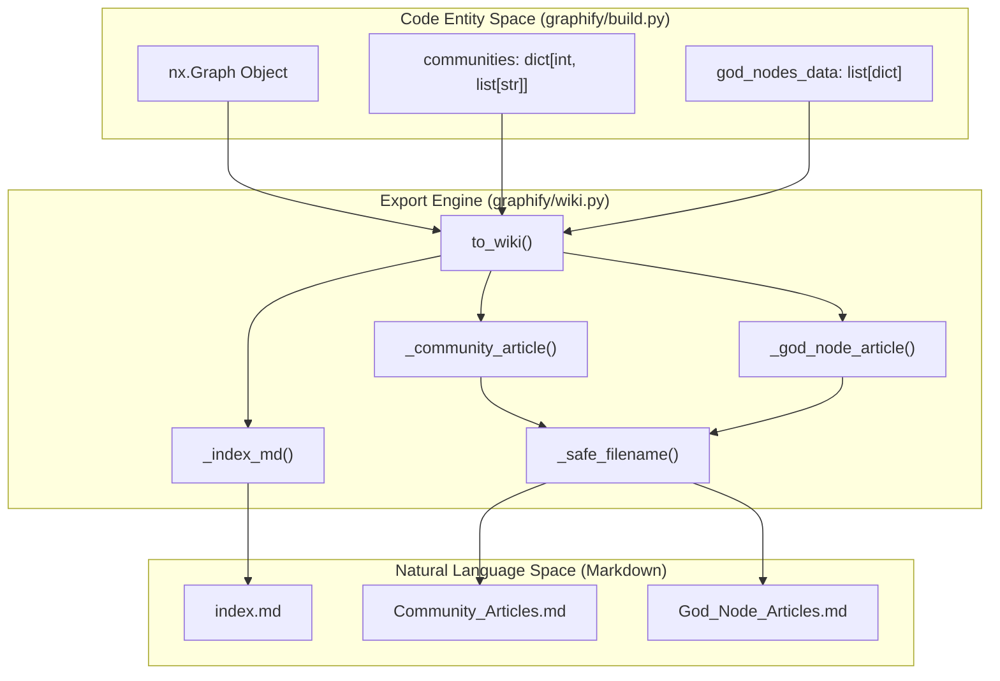
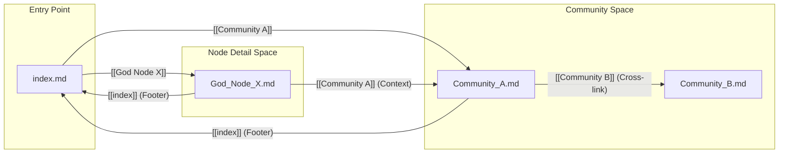

# Wiki Export

Relevant source files

The following files were used as context for generating this wiki page:

- [graphify/wiki.py](graphify/wiki.py)
- [tests/test_wiki.py](tests/test_wiki.py)

The Wiki Export module provides a mechanism to transform a structured knowledge graph into a human-readable and agent-crawlable Wikipedia-style documentation set. It generates a collection of Markdown articles that summarize communities, detailed "god node" profiles, and a central index for navigation.

## Overview

The primary entry point for this subsystem is the `to_wiki` function [graphify/wiki.py:181-188](). It consumes a NetworkX graph object and community metadata to produce a directory of `.md` files. This export format is specifically designed to allow LLM agents to "crawl" the codebase's architecture by following internal wikilinks (`[[Article Name]]`).

### Data Flow and File Structure

The export process generates three distinct types of Markdown files:

| File Type | Purpose | Naming Convention |
| :--- | :--- | :--- |
| **Index** | Entry point; lists all communities and god nodes. | `index.md` |
| **Community Article** | High-level summary of a Leiden community. | `<CommunityLabel>.md` |
| **God Node Article** | Deep dive into a high-degree central node. | `<NodeLabel>.md` |

**System Flow: Graph to Wiki**

**Sources:** [graphify/wiki.py:181-212](), [tests/test_wiki.py:26-50]()

---

## Community Articles

A community article provides a thematic overview of a cluster of related nodes. It includes metadata, key concepts, and structural metrics.

### Article Components
1.  **Metadata Header**: Displays the node count and the **Cohesion Score** (calculated during the clustering phase) [graphify/wiki.py:62-65]().
2.  **Key Concepts**: Lists the top 25 nodes in the community, sorted by degree (number of connections) [graphify/wiki.py:46-74](). If a community exceeds 25 nodes, a truncation notice is appended [graphify/wiki.py:75-77](), [tests/test_wiki.py:128-140]().
3.  **Cross-Community Links**: Identifies relationships with other communities using the `_cross_community_links` helper [graphify/wiki.py:26-35](). This allows agents to understand how different modules or subsystems interact [graphify/wiki.py:81-85](). This logic works even if nodes lack a `community` attribute by utilizing the `node_community` mapping [graphify/wiki.py:47](), [tests/test_wiki.py:143-154]().
4.  **Audit Trail**: A statistical breakdown of edge confidence levels (`EXTRACTED`, `INFERRED`, `AMBIGUOUS`) within the community [graphify/wiki.py:94-98]().

**Sources:** [graphify/wiki.py:38-102](), [tests/test_wiki.py:68-89](), [tests/test_wiki.py:128-140](), [tests/test_wiki.py:143-154]()

---

## God Node Articles

"God nodes" are the load-bearing abstractions of the codebase (nodes with the highest degree). Their articles provide a granular view of their role in the system.

### Neighbor Grouping
Unlike community articles which list nodes, god node articles group their neighbors by the **Relation Type** (e.g., `calls`, `references`, `contains`) [graphify/wiki.py:119-128]().

*   **Logic**: Neighbors are sorted by their own degree, ensuring the most important related concepts appear first [graphify/wiki.py:121]().
*   **Confidence Labels**: Each connection is annotated with its extraction confidence (e.g., `[[OtherNode]] (EXTRACTED)`) [graphify/wiki.py:127-128]().
*   **Community Context**: The article explicitly links to the community the god node belongs to [graphify/wiki.py:116-117](), [tests/test_wiki.py:98-103]().

**Sources:** [graphify/wiki.py:105-138](), [tests/test_wiki.py:91-104]()

---

## Implementation Details

### Filename Sanitization
To ensure compatibility across different operating systems and to prevent path traversal issues, the `_safe_filename` function sanitizes node and community labels [graphify/wiki.py:11-23]().

*   Spaces are converted to underscores (`_`) [graphify/wiki.py:20]().
*   Slashes (`/`) and colons (`:`) are converted to dashes (`-`) [graphify/wiki.py:20]().
*   Reserved characters (`< > " \ | ? *`) are replaced with underscores [graphify/wiki.py:21]().
*   Trailing dots and spaces are stripped, and length is capped at 200 characters [graphify/wiki.py:22-23]().

### Navigation and Crawlability
Every generated article includes a footer link back to the `index.md` [graphify/wiki.py:101, 137](). The index itself sorts communities by size (largest first) and god nodes by their edge count [graphify/wiki.py:162-171](). This hierarchy guides LLM agents from general architectural overviews to specific implementation details.

**Internal Link Mapping**

**Sources:** [graphify/wiki.py:141-178](), [tests/test_wiki.py:121-126]()

### Performance and Limits
*   **Truncation**: To prevent massive token consumption, community articles truncate the node list after 25 items [graphify/wiki.py:46](), and relationship lists are capped at 12 [graphify/wiki.py:82](). God node connections are capped at 20 per relation type [graphify/wiki.py:133]().
*   **Safety**: If a god node ID provided in the metadata does not exist in the graph, it is silently skipped to prevent export crashes [graphify/wiki.py:203-207](), [tests/test_wiki.py:105-111]().
*   **Stale Nodes**: Stale node IDs in the communities dictionary (e.g., from an outdated cache) are silently dropped during export [tests/test_wiki.py:172-174]().
*   **Fallbacks**: If no community labels are provided, the system defaults to naming articles `Community_N.md` [graphify/wiki.py:205](), [tests/test_wiki.py:114-119]().

**Sources:** [graphify/wiki.py:46](), [graphify/wiki.py:82](), [graphify/wiki.py:133](), [graphify/wiki.py:203-207](), [tests/test_wiki.py:172-174]()
