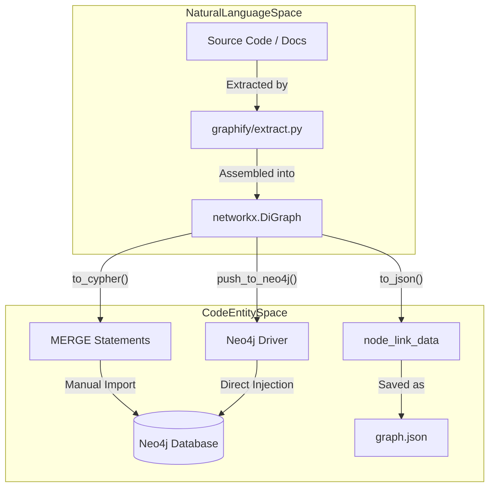
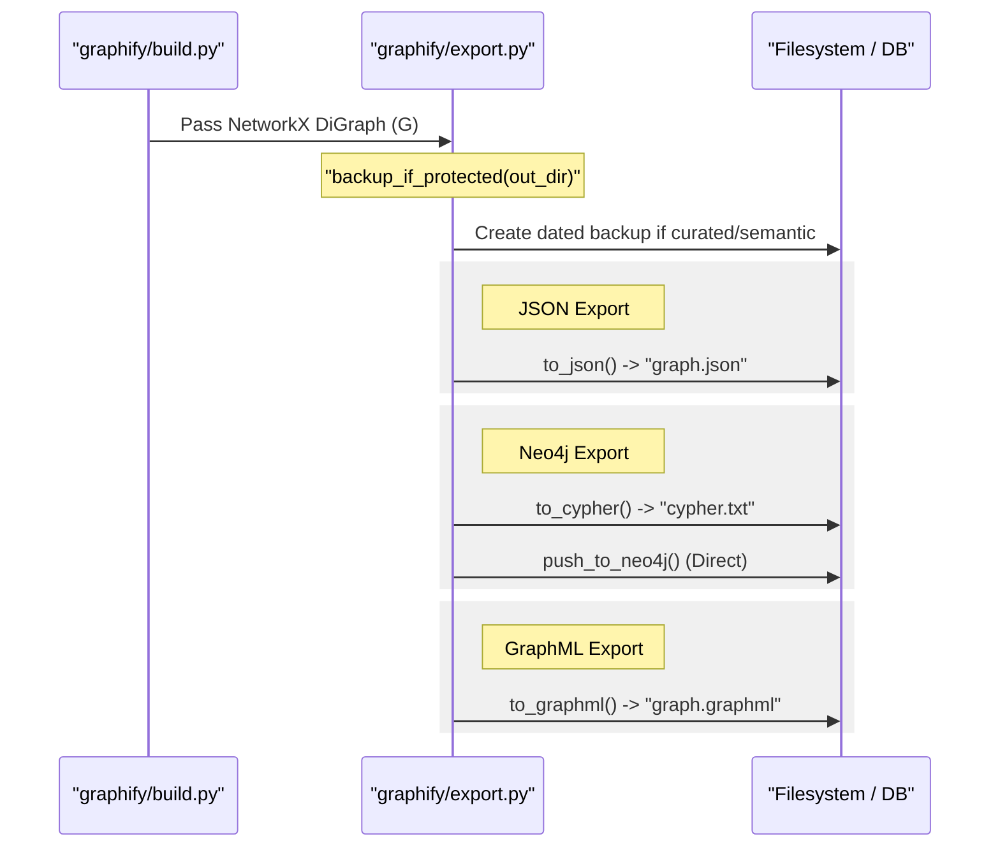

# Neo4j, GraphML & JSON Export

Relevant source files

The following files were used as context for generating this wiki page:

- [graphify/export.py](graphify/export.py)
- [graphify/hooks.py](graphify/hooks.py)
- [tests/test_export.py](tests/test_export.py)
- [tests/test_hooks.py](tests/test_hooks.py)

This page details the structured data export capabilities of `graphify`. Beyond human-readable reports and interactive HTML visualizations, `graphify` supports industry-standard formats for programmatic analysis, graph database integration, and external visualization tools like Gephi or yEd.

## Overview of Structured Exports

The export engine in `graphify/export.py` transforms the internal NetworkX graph into several specialized formats. These exports preserve the structural integrity of the graph, including node attributes (file types, confidence scores) and community assignments generated during the clustering phase [graphify/export.py:1-13]().

### Implementation Flow

The data flow for structured exports follows a consistent pattern:
1.  **Graph Retrieval**: The processed `networkx.DiGraph` (or `Graph`) is passed to the export functions [graphify/export.py:13-14]().
2.  **Attribute Mapping**: Internal metadata (e.g., `community_id`) is mapped to format-specific attributes using helpers like `_node_community_map` [graphify/export.py:16-16]().
3.  **Sanitization**: Labels and property values are cleaned via `sanitize_label` to prevent injection attacks or syntax errors in the target format [graphify/export.py:15-15]().
4.  **Serialization**: The graph is serialized to the filesystem or pushed to a remote instance.

**Sources:** [graphify/export.py:1-17]()

## JSON Export (`to_json`)

The `to_json` function utilizes the `node_link_data` format from NetworkX [graphify/export.py:14-14](). This is the primary format used for interoperability between `graphify` components, such as the web visualizer and the persistent cache.

-   **Schema**: Produces a JSON object with `nodes` and `links` arrays (remapped from `edges` for compatibility).
-   **Metadata**: Each node includes its `community`, `file_type`, `source_file`, and `norm_label` for search optimization [tests/test_export.py:31-40]().
-   **Idempotency & Backup**: Before overwriting `graph.json`, the system checks for existing semantic markers or curated labels. If found, it snapshots the current artifacts to a dated subfolder via `backup_if_protected` [graphify/export.py:32-43]().

**Sources:** [graphify/export.py:14-14](), [graphify/export.py:32-95](), [tests/test_export.py:13-40]()

## Neo4j Integration

`graphify` provides two methods for Neo4j integration: generating offline Cypher scripts and direct driver-based injection.

### Cypher Script Generation (`to_cypher`)

The `to_cypher` function generates a `.txt` or `.cypher` file containing `MERGE` statements [tests/test_export.py:41-46](). This allows for idempotent imports into a Neo4j instance without requiring a live connection during the `graphify` run.

-   **Node Labels**: Nodes are assigned labels based on their `file_type` (e.g., `:Code`, `:Paper`, `:Document`, `:Image`).
-   **Idempotency**: Uses `MERGE` on a unique `id` property to ensure that running the script multiple times does not create duplicate entities [tests/test_export.py:48-55]().
-   **Relationship Mapping**: Edges are created with types derived from the extraction phase (e.g., `CONTAINS`, `REFERENCES`, `CALLS`).

### Direct Injection (`push_to_neo4j`)

For automated workflows, `push_to_neo4j` uses the official Neo4j Python driver to inject the graph directly into a running instance. It handles connection pooling and transaction management to ensure large graphs are uploaded efficiently.

#### Neo4j Mapping Logic

| Graphify Attribute | Neo4j Equivalent |
| :--- | :--- |
| Node ID | `id` property (Unique Constraint) |
| `file_type` | Node Label (e.g., `(:Code {id: "..."})`) |
| `community` | `community` property |
| Edge Type | Relationship Type (UPPERCASE) |

### Implementation Mapping Diagram

The following diagram bridges the high-level export logic to the specific code entities involved.

**Export Logic Mapping**

**Sources:** [graphify/export.py:1-17](), [tests/test_export.py:41-55]()

## GraphML Export (`to_graphml`)

The `to_graphml` function exports the graph to the XML-based GraphML format [tests/test_export.py:56-62](). This is the standard for heavy-duty graph analysis tools.

-   **Tool Compatibility**: Specifically tested for compatibility with **Gephi** and **yEd**.
-   **Attribute Encoding**: All node attributes (community, weight, type) are encoded as `<data>` keys in the XML [tests/test_export.py:74-82]().
-   **Prune Dangling Edges**: During the build process, `graphify` ensures that edges pointing to non-existent nodes are handled to maintain graph integrity.

**Sources:** [graphify/export.py:1-14](), [tests/test_export.py:56-82]()

## Data Flow: Internal to External

The following diagram illustrates how internal Python objects are translated into the various export formats, including the backup mechanism.

**Internal Pipeline to Export Formats**

**Sources:** [graphify/export.py:1-95](), [tests/test_export.py:13-90]()

## Artifact Preservation

`graphify` identifies specific artifacts that are worth preserving across rebuilds because they are either non-regenerable without LLM tokens or contain manual curation [graphify/export.py:20-29]().

| Artifact | Reason for Preservation |
| :--- | :--- |
| `graph.json` | Primary structural data |
| `GRAPH_REPORT.md` | Human-readable analysis |
| `.graphify_labels.json` | Human-curated community names |
| `.graphify_semantic_marker` | Indicates LLM token expenditure |
| `manifest.json` | File discovery state |

The `backup_if_protected` function triggers a snapshot if `.graphify_semantic_marker` is present or if `.graphify_labels.json` contains non-default labels [graphify/export.py:32-61](). It ensures that a daily snapshot is maintained in a dated subfolder (e.g., `graphify-out/2023-10-27/`) to prevent accidental loss of curated data during `graphify` updates [graphify/export.py:64-70]().

**Sources:** [graphify/export.py:20-90](), [tests/test_export.py:184-194]()
