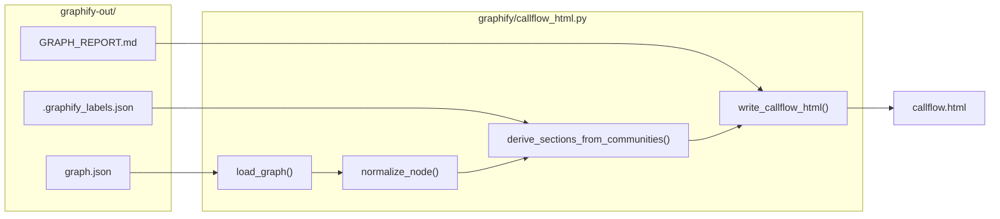
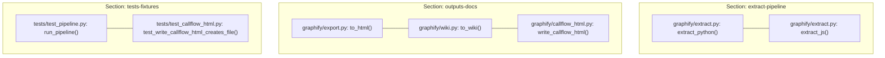

# Callflow HTML Export

<details>
<summary>Relevant source files</summary>

The following files were used as context for generating this wiki page:

- [graphify/callflow_html.py](graphify/callflow_html.py)
- [graphify/diagnostics.py](graphify/diagnostics.py)
- [graphify/multigraph_compat.py](graphify/multigraph_compat.py)
- [graphify/prs.py](graphify/prs.py)
- [tests/test_callflow_html.py](tests/test_callflow_html.py)
- [tests/test_prs.py](tests/test_prs.py)

</details>


The **Callflow HTML Export** subsystem, implemented in `graphify/callflow_html.py`, provides a high-level architectural visualization of a codebase. Unlike the interactive force-directed graph produced by `to_html`, the callflow export generates a structured, dark-themed, self-contained HTML report optimized for human readability and architectural auditing [graphify/callflow_html.py:3-13]().

It aggregates low-level AST relationships into high-level "Sections" based on community detection results, rendering Mermaid-based flowcharts that describe both inter-section dependencies and intra-section call flows [graphify/callflow_html.py:24-32]().

## Pipeline and Data Flow

The `callflow-html` command acts as a post-processor for the standard `graphify` output. It reads the unified `graph.json` and enriches the visualization using metadata from `GRAPH_REPORT.md` and community labels from `.graphify_labels.json` [graphify/callflow_html.py:5-6]().

### Data Flow Diagram

The following diagram illustrates how the exporter transforms raw graph data into the structured HTML report.

**Callflow Data Transformation**

Sources: [graphify/callflow_html.py:92-102](), [graphify/callflow_html.py:136-155](), [graphify/callflow_html.py:284-300](), [graphify/callflow_html.py:461-480]()

## Section Inference Logic

A core feature of the callflow export is the automatic grouping of code entities into logical "Sections." If a manual sections configuration is not provided, the exporter uses `derive_sections_from_communities` to infer them [graphify/callflow_html.py:284-285]().

The algorithm maps Leiden communities to section IDs by analyzing the labels and file paths of nodes within that community. It looks for specific architectural keywords:
- **`extract-pipeline`**: Triggered by keywords like "extract", "parse", or "ast" [graphify/callflow_html.py:315-320]().
- **`outputs-docs`**: Triggered by "export", "report", "html", or "markdown" [graphify/callflow_html.py:321-325]().
- **`tests-fixtures`**: Triggered by "test", "fixture", or "mock" [graphify/callflow_html.py:331-335]().

### Code Entity to Section Mapping

This diagram shows how specific code entities in `graphify` are grouped into sections during the export process based on their source file paths and labels.

**Entity Grouping Example**

Sources: [graphify/callflow_html.py:315-340](), [tests/test_callflow_html.py:157-171](), [graphify/callflow_html.py:461-480]()

## Implementation Details

### Key Functions and Security

| Function | Responsibility |
| :--- | :--- |
| `normalize_node` | Standardizes various `graph.json` schema versions into a consistent internal dict [graphify/callflow_html.py:136-155](). |
| `derive_sections_from_communities` | Groups nodes by their `community` attribute and assigns logical names based on content [graphify/callflow_html.py:284-345](). |
| `write_callflow_html` | The main orchestrator that reads files, generates Mermaid strings, and writes the final HTML [graphify/callflow_html.py:461-480](). |
| `endpoint_id` | Sanitizes node identifiers to ensure they are valid Mermaid node IDs [graphify/callflow_html.py:129-134](). |
| `load_graph` | Loads `graph.json` with security checks, enforcing size limits before parsing to prevent resource exhaustion [graphify/callflow_html.py:173-187](). |

### Mermaid Diagram Generation
The exporter generates two types of Mermaid diagrams:
1.  **Architecture Overview**: A high-level `graph LR` showing how the inferred sections depend on one another.
2.  **Section Callflows**: Detailed `graph LR` diagrams for each section, showing representative internal calls between functions and classes [graphify/callflow_html.py:9-10]().

The exporter includes a custom JavaScript-based "Mermaid Viewport" that adds zoom, pan, and drag-to-scroll capabilities to the rendered SVGs via the `.mermaid-viewport` and `.mermaid-toolbar` CSS/JS components [graphify/callflow_html.py:53-61]().

## CLI Usage

The callflow export is triggered via the `export callflow-html` command. It supports several flags to customize the output:

```bash
# Basic usage (defaults to graphify-out/graph.json)
graphify export callflow-html

# Specify custom paths
graphify export callflow-html --graph custom/graph.json --output docs/arch.html

# Limit the number of sections for clarity
graphify export callflow-html --max-sections 5
```
Sources: [graphify/callflow_html.py:14-18](), [tests/test_callflow_html.py:71-95]()

## HTML Template Features

The generated file is a standalone dark-themed HTML document with the following features:
- **Navigation Bar**: Sticky links to each architectural section for fast jumping [graphify/callflow_html.py:81-83]().
- **Graph Report Highlights**: Pulls "God Nodes" and "Summary" data directly from `GRAPH_REPORT.md` to provide context [graphify/callflow_html.py:530-545]().
- **Call Detail Tables**: Lists representative nodes with semantic tags like `.tag-func`, `.tag-class`, `.tag-async`, or `.tag-endpoint` for quick identification [graphify/callflow_html.py:62-72]().
- **Sanitization**: All node labels and descriptions are HTML-escaped using `html.escape` to prevent XSS from source code comments or strings [graphify/callflow_html.py:31](), [tests/test_callflow_html.py:67-68]().

Sources: [graphify/callflow_html.py:38-85](), [graphify/callflow_html.py:461-600]()
