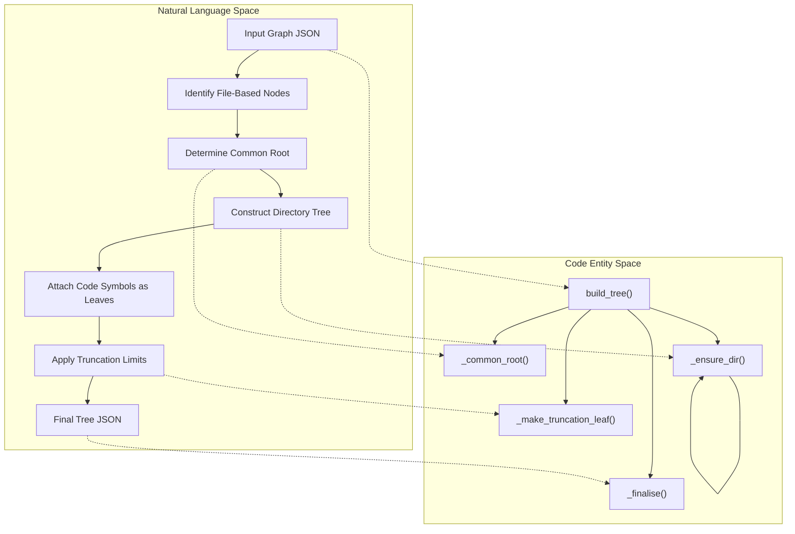
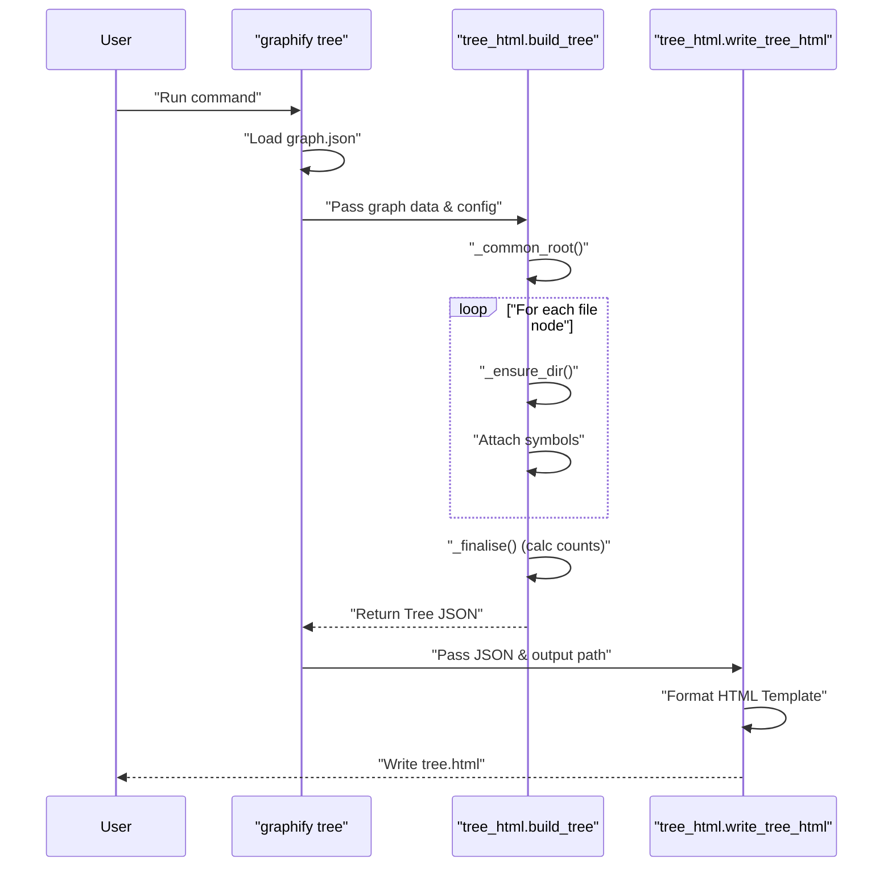

# Tree HTML Export

<details>
<summary>Relevant source files</summary>

The following files were used as context for generating this wiki page:

- [graphify/tree_html.py](graphify/tree_html.py)

</details>


The `graphify tree` command provides a hierarchical, module-centric visualization of the knowledge graph. Unlike the force-directed layout of the standard `graph.html`, the Tree HTML export uses **D3 v7** to render a collapsible tree that mirrors the project's filesystem structure and symbol hierarchy.

## Overview and Purpose

The Tree HTML export is designed to complement graph-based views by providing a structured, browseable "map" of the codebase [graphify/tree_html.py:1-4](). It allows users to navigate from high-level directories down to individual code symbols (classes and functions), offering a clear sense of project scale through descendant leaf counts.

### Key Visual Features
*   **Collapsible Nodes:** Click-to-toggle subtrees for focused exploration [graphify/tree_html.py:12-12]().
*   **Global Controls:** Buttons for Expand-all, Collapse-all, and Reset-view [graphify/tree_html.py:7-7]().
*   **Depth-Based Coloring:** Top-level directories receive distinct accent colors, while deeper levels use a level-specific palette [graphify/tree_html.py:10-11]().
*   **Intelligent Labeling:** Multi-line labels via `wrapText` that display the entity name alongside its total descendant count [graphify/tree_html.py:8-9]().
*   **Wide Directory Handling:** Automatic truncation of large directories using a synthetic `(+N more)` leaf [graphify/tree_html.py:28-30]().

**Sources:** [graphify/tree_html.py:1-33]()

---

## Data Flow and Implementation

The export process involves transforming the flat NetworkX-style graph JSON into a nested tree structure suitable for D3's hierarchy layout.

### Tree Data Structure
The exported data follows a recursive shape where each node contains its name, a pre-calculated leaf count, and its children [graphify/tree_html.py:14-20]().

| Field | Description |
| :--- | :--- |
| `name` | The label of the node (e.g., directory name, filename, or symbol name) [graphify/tree_html.py:17-17](). |
| `total_count` | The total number of leaf nodes (symbols) contained within this branch [graphify/tree_html.py:18-18](). |
| `children` | A list of child node objects [graphify/tree_html.py:19-19](). |

### Logic Space to Code Entity Space: Tree Construction

This diagram illustrates how the `build_tree` function transforms raw graph nodes into the hierarchical JSON structure.


**Sources:** [graphify/tree_html.py:49-169]()

---

## Technical Details

### Hierarchy Construction
1.  **Root Detection:** If no `--root` is provided, the system calculates the deepest common directory among all nodes with a `source_file` attribute using `_common_root` [graphify/tree_html.py:49-61, 86-88]().
2.  **Directory Indexing:** The `_ensure_dir` helper recursively builds the directory path objects, ensuring that interior nodes represent the folder structure [graphify/tree_html.py:102-113]().
3.  **Symbol Attachment:** For each file, its constituent symbols (functions, classes) are added as children. The redundant file-name node generated by some extractors is filtered out to maintain clarity [graphify/tree_html.py:125-135]().
4.  **Sorting:** Children are sorted such that sub-directories appear before files, and symbols are sorted alphabetically (with private symbols starting with `_` appearing last) [graphify/tree_html.py:137-140, 155-159]().

### Truncation and Performance
To ensure the tree remains usable in massive codebases, the `--max-children` flag (default 200) caps the number of nodes rendered under a single parent [graphify/tree_html.py:43-43, 72-72](). When this limit is reached, a synthetic leaf is generated via `_make_truncation_leaf` showing the count of hidden items [graphify/tree_html.py:64-65, 141-145]().

### HTML Generation
The `write_tree_html` function injects the generated JSON into a self-contained HTML template [graphify/tree_html.py:456-466](). This template includes:
*   **D3 v7 script:** Loaded via CDN [graphify/tree_html.py:238-238]().
*   **CSS Styles:** A clean, modern UI with hover effects and control styling [graphify/tree_html.py:181-231]().
*   **D3 Logic:** Handles the tree layout, diagonal link paths, and the `wrapText` function for multi-line SVG text [graphify/tree_html.py:240-440]().

**Sources:** [graphify/tree_html.py:43-169, 176-466]()

---

## CLI Usage

The tree export is invoked via the `tree` subcommand.

```bash
# Basic usage
graphify tree

# Customizing output and root
graphify tree --graph graphify-out/graph.json --output docs/tree.html --root src/

# Controlling tree density
graphify tree --max-children 50 --label "My Project Hierarchy"
```

### CLI Flags
| Flag | Description | Default |
| :--- | :--- | :--- |
| `--graph` | Path to the input `graph.json` | `graphify-out/graph.json` |
| `--output` | Destination for the HTML file | `graphify-out/tree.html` |
| `--root` | The filesystem path to treat as the tree root | Auto-detected |
| `--max-children` | Maximum number of children per node before truncation | `200` |
| `--label` | Title displayed at the top of the tree | Root folder name |

**Sources:** [graphify/tree_html.py:22-23, 471-497]()

---

## System Interaction Diagram

This diagram shows the flow from the command line to the final HTML file generation.



**Sources:** [graphify/tree_html.py:471-508, 68-169, 443-467]()
