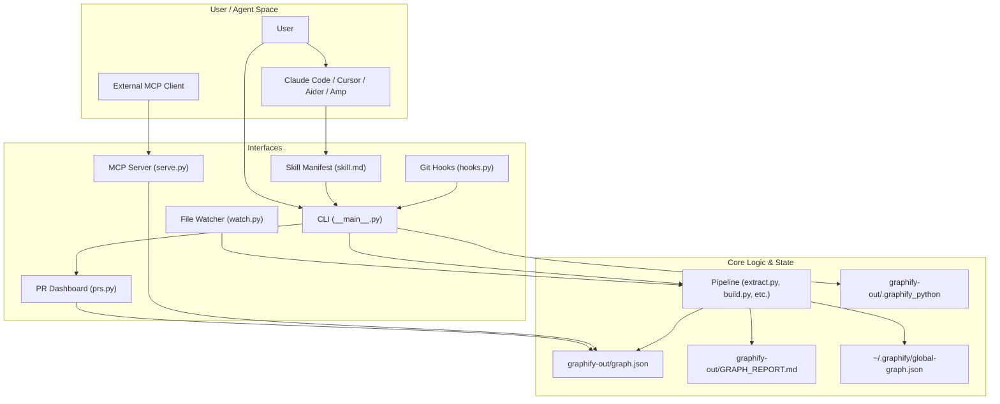
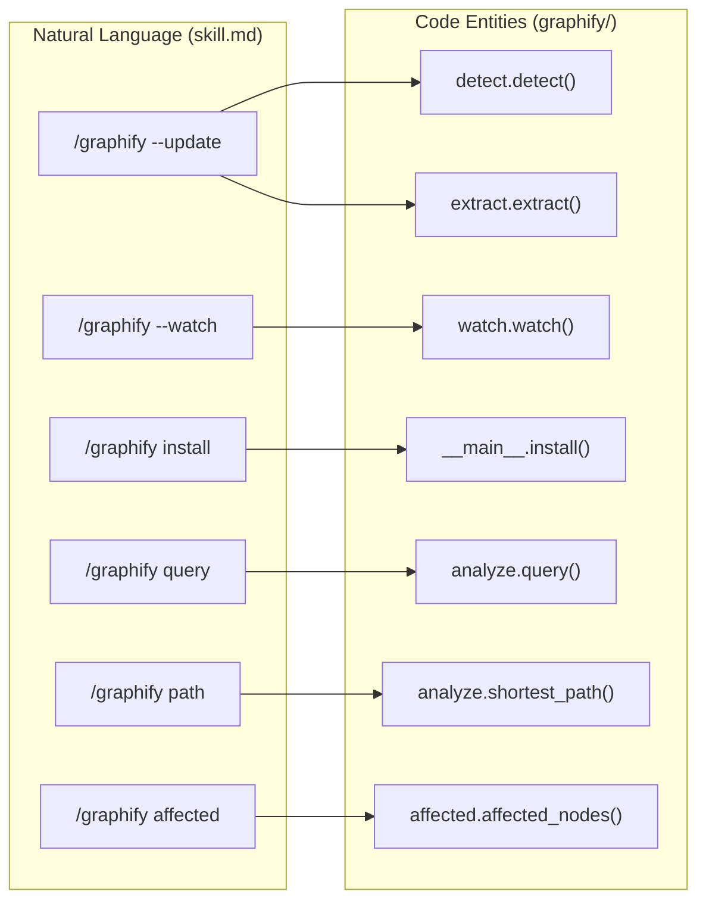

# Interfaces & Integration

Relevant source files

The following files were used as context for generating this wiki page:

- [graphify/__main__.py](graphify/__main__.py)
- [graphify/skill.md](graphify/skill.md)

This page provides a high-level overview of how users and external systems interact with `graphify`. The system is designed to be interface-agnostic, supporting direct human interaction via a Command Line Interface (CLI), automated agentic workflows through the Model Context Protocol (MCP), background synchronization via a file watcher, and deep integration with AI coding assistants via custom skills, Git hooks, and PR analysis tools.

## Interaction Overview

`graphify` bridges the gap between raw file system data and structured knowledge. The following diagram illustrates how the various interfaces interact with the core logic and the generated `graphify-out/` artifacts.

### System Interface Map

**Sources:** [graphify/skill.md:1-42](), [graphify/__main__.py:20-22](), [graphify/skill.md:44-57]()

---

## CLI Reference
The primary entry point is the `graphify` command, managed in `graphify/__main__.py`. It handles installation across 20+ platforms, including Claude, Cursor, Kiro, Amp, and specialized Windows environments [graphify/__main__.py:129-165]().

- **Installation**: `graphify install` registers the tool and updates platform-specific manifests. It copies the appropriate `skill.md` and writes a `.graphify_version` stamp to ensure compatibility [graphify/__main__.py:94-114]().
- **Execution**: Supports full pipeline runs, incremental updates (`--update`), and specialized modes like `--cluster-only` or `--mode deep` [graphify/skill.md:14-23]().
- **Subcommands**: Includes `add` for URL ingestion, `query` for BFS/DFS traversal, `path` for connectivity analysis, `tree` for hierarchical visualization, and `affected` for impact analysis [graphify/skill.md:34-42]().
- **Query Logging**: Optional logging of queries and responses to `~/.cache/graphify-queries.log` via environment variables like `GRAPHIFY_QUERY_LOG` [graphify/skill.md:104-114]().

For a full list of flags and subcommands, see [CLI Reference](#4.1).

**Sources:** [graphify/__main__.py:94-165](), [graphify/skill.md:13-42](), [graphify/__main__.py:26-47]()

---

## MCP Server (`serve.py`)
`graphify` includes a Model Context Protocol (MCP) server that allows LLMs to programmatically browse the graph using a standardized toolset. This is particularly useful for agents that need to explore relationships without reading the entire `GRAPH_REPORT.md`.

- **Core Tools**: `query_graph`, `get_node`, `get_neighbors`, `get_community`, `god_nodes`, `graph_stats`, `shortest_path`, `list_prs`, and `get_pr_impact`.
- **Search**: Uses `norm_label` for Unicode-safe, case-insensitive node lookups.
- **Constraints**: Enforces token budgets on tool outputs to prevent context window overflow.

For details on tool definitions and traversal logic, see [MCP Server (serve.py)](#4.2).

**Sources:** [graphify/skill.md:30]()

---

## File Watcher (`watch.py`)
The `watch.py` module provides background monitoring to keep the graph synchronized. It uses a "bifurcated" update logic to balance speed and cost.

- **Instant Rebuild**: Code changes trigger an AST-based rebuild (`_rebuild_code`) which is zero-cost as it avoids LLM API calls.
- **Deferred Update**: Document/Image changes (which require LLM credits) are flagged for update via a `needs_update` flag.
- **Locking**: Uses an advisory lock (`.rebuild.lock`) and a pending changes queue (`.pending_changes`) to manage concurrent updates.

For details on the `watch()` pipeline, see [File Watcher (watch.py)](#4.3).

**Sources:** [graphify/skill.md:31]()

---

## Claude Code Skill Integration
The `graphify` skill is a manifest that teaches agents how to invoke the pipeline. It defines the `/graphify` trigger and provides a multi-step execution plan [graphify/skill.md:1-5]().

- **Progressive Disclosure**: Modern versions use a lean core skill file with on-demand references in a `references/` sidecar for features like `github-and-merge` or `transcribe` [graphify/__main__.py:102-110]().
- **Persistence**: Relationships are stored in `graphify-out/graph.json`, allowing context to survive across sessions [graphify/skill.md:46-48]().
- **Audit Trail**: The skill emphasizes the `EXTRACTED`, `INFERRED`, and `AMBIGUOUS` edge types to provide an "honest" view of the codebase [graphify/skill.md:46-48]().
- **Fast Path**: Before re-extracting, the skill instructs the agent to check for an existing `graphify-out/graph.json` to skip steps and jump straight to `graphify query` for faster answers [graphify/skill.md:52-54]().

### Skill-to-Code Entity Mapping
This diagram maps high-level agent instructions to the underlying Python implementation and configuration.

For details on platform-specific manifests and the `skillgen` build system, see [Claude Code Skill Integration](#4.4).

**Sources:** [graphify/skill.md:1-10](), [graphify/skill.md:52-54](), [graphify/__main__.py:102-114]()

---

## Git Hooks Integration (`hooks.py`)
To ensure the graph never drifts from the source of truth, `graphify` provides automated Git hooks via the `graphify hook` command.

- **Post-Commit/Checkout**: Automatically triggers a structural update after a commit or branch switch to keep the graph current with the source code.
- **Python Detection**: Directly embeds `sys.executable` into hook scripts to fix silent no-ops in GUI git clients and CI runners [graphify/skill.md:104-114]().
- **Idempotency**: Uses a marker system to safely install and uninstall hooks without corrupting existing `.git/hooks`.
- **Environment Control**: Supports `GRAPHIFY_SKIP_HOOK=1` to bypass rebuilds during automated scripts.

For details on hook installation and the interpreter detection logic, see [Git Hooks Integration](#4.5).

**Sources:** [graphify/skill.md:42](), [graphify/skill.md:67-104]()

---

## PR Dashboard & Global Graph
Advanced integration features for multi-repo management and code review workflows.

- **PR Triage**: The `graphify prs` command uses the graph to triage PRs, detect community conflicts, and map PR impact back to graph nodes.
- **Global Graph**: The `graphify global` command manages a cross-repo graph stored at `~/.graphify/global-graph.json`, allowing for cross-project dependency analysis.
- **Cross-Repo Merging**: The `merge-graphs` logic allows combining multiple local or remote repo graphs into a single unified view [graphify/skill.md:60-62]().

For details on these features, see [PR Dashboard & Global Graph](#4.6).

**Sources:** [graphify/skill.md:60-62]()
