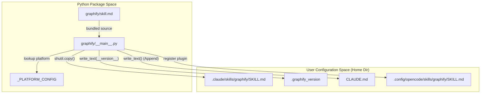
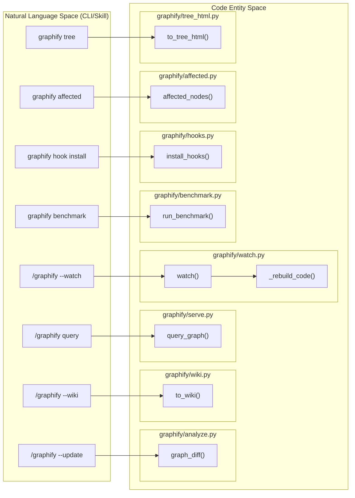

# CLI Reference

Relevant source files

The following files were used as context for generating this wiki page:

- [graphify/__main__.py](graphify/__main__.py)
- [graphify/querylog.py](graphify/querylog.py)
- [graphify/skill.md](graphify/skill.md)
- [tests/test_querylog.py](tests/test_querylog.py)

The `graphify` command-line interface (CLI) is the primary entry point for managing the knowledge graph lifecycle. It handles installation of agent skills, performance benchmarking, and execution of the core extraction pipeline. While many users interact with graphify via the `/graphify` command inside Claude Code or other AI assistants, the CLI provides the underlying execution engine and administrative utilities across multiple platforms including macOS, Linux, Windows, and specialized environments like Amp.

## Installation and Setup

### `graphify install [platform]`
This command registers graphify as a "skill" for AI coding assistants. It supports a wide range of platforms defined in the `_PLATFORM_CONFIG` dictionary [graphify/__main__.py:82-163]().

1.  **Skill Deployment**: It copies the platform-specific skill file (e.g., `skill.md`, `skill-windows.md`, `skill-codex.md`) from the package to the assistant's local configuration directory [graphify/__main__.py:1164-1180]().
2.  **Version Tracking**: It writes a `.graphify_version` file to the destination to track updates and prevent stale-version warnings [graphify/__main__.py:96-114]().
3.  **Manifest Registration**: For Claude Code, it appends a registration block to `~/.claude/CLAUDE.md` to enable the `/graphify` trigger [graphify/__main__.py:173-180](), [graphify/__main__.py:1181-1194](). 
4.  **Plugin Injection**: For OpenCode, it installs a specific plugin via `_install_opencode_plugin` [graphify/__main__.py:1222-1240]().
5.  **Install Banner**: As of version 0.8.33, the command displays an amber TTY-only brain graphic banner upon successful installation [graphify/__main__.py:1158-1162]().

**Supported Platforms (`_PLATFORM_CONFIG`):**
- `claude`, `windows` (Claude Code) [graphify/__main__.py:83-87](), [graphify/__main__.py:153-157]().
- `codex`, `opencode`, `aider`, `copilot`, `claw`, `droid`, `trae`, `trae-cn`, `hermes`, `kiro`, `antigravity`, `kimi`, `amp` [graphify/__main__.py:88-162]().
- Special routing exists for `gemini` and `cursor` via `gemini_install` and `cursor_install` [graphify/__main__.py:1260-1283]().

**Diagram: Installation Logic ("graphify install")**

Sources: [graphify/__main__.py:82-163](), [graphify/__main__.py:1164-1240]()

---

## Benchmarking

### `graphify benchmark [graph_path]`
Measures the efficiency of the knowledge graph by comparing the tokens required to answer questions using the graph versus a "naive" approach (reading the entire raw corpus).

-   **Data Source**: It loads the built graph from `graphify-out/graph.json` (default) [graphify/benchmark.py:64-78]().
-   **Token Estimation**: It uses a standard approximation of 4 characters per token (`_CHARS_PER_TOKEN`) [graphify/benchmark.py:9-13]().
-   **Metrics**: It calculates the `reduction_ratio` by running BFS traversals from nodes matching `_SAMPLE_QUESTIONS` (e.g., "how does authentication work") and comparing that subgraph's size to the total estimated corpus tokens [graphify/benchmark.py:64-111]().
-   **BFS Traversal**: The `_query_subgraph_tokens` function performs a breadth-first search (default depth=3) from the top 3 matching nodes to build a representative context window [graphify/benchmark.py:16-52]().

Sources: [graphify/benchmark.py:9-111](), [graphify/__main__.py:11-15]()

---

## Skill Commands (/graphify)

The `/graphify` command is the primary entry point triggered by AI assistants. It executes the pipeline defined in the skill manifest [graphify/skill.md:1-5]().

### Core Pipeline Flags

| Flag | Description | Implementation Detail |
| :--- | :--- | :--- |
| `--update` | Incremental update. Re-extracts only changed files based on SHA256 hashes. | Uses `graphify/cache.py` for semantic hits and `graphify/analyze.py:graph_diff` for comparison. |
| `--mode deep` | Enables aggressive inferred edge extraction. | Triggers deeper relationship heuristics in `graphify/llm.py`. |
| `--cluster-only` | Skips extraction and re-runs community detection on the existing graph. | Calls `graphify/cluster.py` to re-calculate Leiden communities. |
| `--watch` | Monitors the directory for changes. | Implemented in `graphify/watch.py` with a debounce mechanism. |
| `--no-viz` | Disables HTML/SVG generation. | Skips visualization exports in `graphify/export.py`. |
| `--wiki` | Generates a Wikipedia-style markdown vault. | Calls `graphify/wiki.py:to_wiki`. |
| `--graphml` | Exports the graph to GraphML format for external tools like Gephi. | Calls `graphify/export.py:to_graphml`. |

### Query & Analysis Commands

-   **`query <text>`**: Searches the graph for concepts related to the natural language query. Supports BFS (default) or `--dfs` for tracing specific paths [graphify/skill.md:37-38]().
-   **`path <node_a> <node_b>`**: Finds the shortest path between two entities [graphify/skill.md:40]().
-   **`explain <node>`**: Provides a detailed summary of a node and its context [graphify/skill.md:41]().
-   **`affected <label>`**: Performs a BFS reverse traversal to find nodes impacted by a change to the seed node.
    - **Implementation**: Uses `graphify/affected.py:affected_nodes` to traverse the graph backwards from a seed [graphify/affected.py:10-30]().
    - **Flags**: Supports `--depth` and `--relations` (e.g., `calls,imports`) to filter the impact scope.
-   **`tree`**: Generates a D3-based collapsible tree visualization of the graph's module hierarchy.
    - **Implementation**: `graphify/tree_html.py` generates a self-contained HTML file [graphify/tree_html.py:15-40]().
    - **Flags**: Supports `--max-children` (default 200, synthetic leaf for overflow) and `--root` flags [graphify/tree_html.py:120-140]().
-   **`remember <file>`**: Ingests a file into the `graphify-out/memory/` bypass for persistent semantic storage.
-   **`add <url>`**: Ingests a remote resource (arXiv, Tweet, Webpage) and merges it into the local graph [graphify/skill.md:34]().
-   **`save-result <name>`**: Persists the current graph state to a named checkpoint.
-   **`hook install`**: Installs git hooks (post-commit/post-checkout) to keep the graph synchronized via `graphify/hooks.py`.

---

## Query Logging

Graphify maintains an append-only JSONL log of queries for auditing and performance analysis [graphify/querylog.py:1-43]().

-   **Location**: Defaults to `~/.cache/graphify-queries.log` but can be overridden via `GRAPHIFY_QUERY_LOG` [graphify/querylog.py:15-21]().
-   **Environment Variables**:
    - `GRAPHIFY_QUERY_LOG_DISABLE`: If set to "1" or "true", disables logging [graphify/querylog.py:16-17]().
    - `GRAPHIFY_QUERY_LOG_RESPONSES`: If enabled, logs the full text of the query result [graphify/querylog.py:24-25]().
-   **Format**: Each line is a JSON object containing `ts` (timestamp), `kind` (query/path/explain), `question`, `corpus`, `nodes_returned`, and `duration_ms` [graphify/querylog.py:50-63]().

Sources: [graphify/querylog.py:1-71](), [tests/test_querylog.py:1-179]()

---

## System Architecture: Command Execution

**Diagram: CLI Command to Code Entity Mapping**

Sources: [graphify/__main__.py:1-60](), [graphify/benchmark.py:64-77](), [graphify/watch.py:1-20](), [graphify/affected.py:10-30](), [graphify/tree_html.py:15-40]()

---

## Security and Constraints

The CLI enforces strict safety boundaries to prevent resource exhaustion or path traversal.

-   **Size Caps**: `_enforce_graph_size_cap_or_exit` rejects `graph.json` files exceeding the byte cap before parsing [graphify/__main__.py:75-91]().
-   **Query Fail-Silence**: The `log_query` function is wrapped in a try-except block to ensure logging failures never crash the main CLI execution [graphify/querylog.py:43-70]().
-   **Platform Verification**: The `_check_skill_version` function warns users if the installed skill file is out of sync with the current package version [graphify/__main__.py:94-114]().

Sources: [graphify/__main__.py:75-91](), [graphify/querylog.py:43-70](), [graphify/__main__.py:94-114]()
