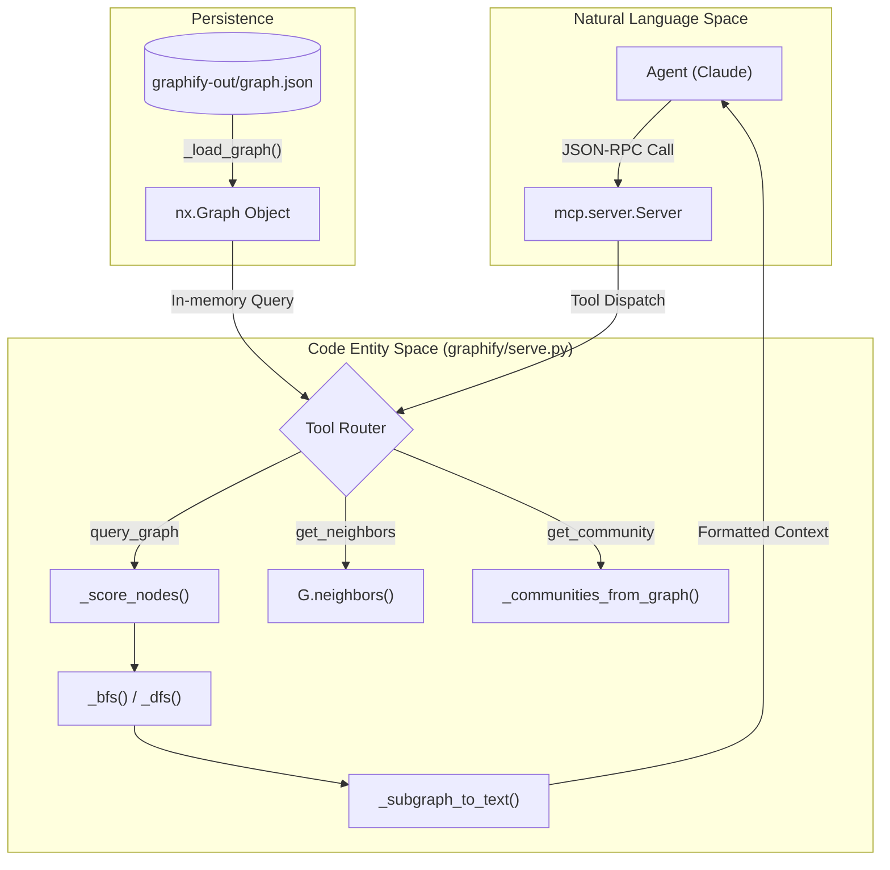
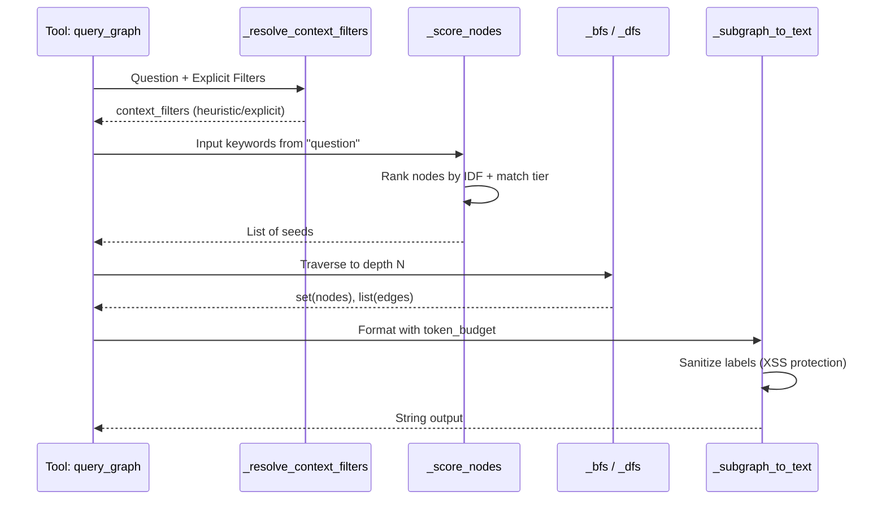

# MCP Server (serve.py)

<details>
<summary>Relevant source files</summary>

The following files were used as context for generating this wiki page:

- [graphify/benchmark.py](graphify/benchmark.py)
- [graphify/ingest.py](graphify/ingest.py)
- [graphify/serve.py](graphify/serve.py)
- [tests/test_benchmark.py](tests/test_benchmark.py)
- [tests/test_serve.py](tests/test_serve.py)

</details>


The `graphify/serve.py` module implements a **Model Context Protocol (MCP)** stdio server. This server exposes the processed knowledge graph to AI agents (like Claude) as a set of interactive tools. It allows agents to perform semantic searches, traverse relationships, and explore community structures without loading the entire graph into their context window.

### Architecture and Data Flow

The server operates by loading a `graph.json` file (generated by the assembly pipeline) into a `networkx.Graph` object [graphify/serve.py:19-35](). It then listens for JSON-RPC requests over standard input/output (stdio). A specialized `_filter_blank_stdin` helper is used to prevent Pydantic validation errors caused by blank lines sent by some MCP clients like Claude Desktop; it installs an OS-level pipe to relay stdin while dropping blank lines [graphify/serve.py:465-492]().

The server includes a hot-reload mechanism (`_maybe_reload`) that checks the `mtime` of the `graph.json` file. If the file has been updated (e.g., by a background `graphify --watch` process), the server automatically reloads the graph and clears the IDF term cache [graphify/serve.py:495-510]().

#### Data Flow Diagram
This diagram shows how a natural language request from an agent is transformed into graph operations via the `serve.py` toolset.

Title: MCP Tool Execution Flow

Sources: [graphify/serve.py:19-35](), [graphify/serve.py:44-51](), [graphify/serve.py:135-158](), [graphify/serve.py:527-534]()

### Core Components

#### 1. Search and Scoring (norm_label & Unicode)
When an agent uses `query_graph`, the server performs a multi-tier search using normalized labels. It supports Chinese segmentation via `jieba` [graphify/serve.py:69-77]() and strips diacritics for robust Unicode matching [graphify/serve.py:54-57]().
*   **IDF Weighting**: `_compute_idf` calculates Inverse Document Frequency for query terms. Common terms like "error" or "exception" that match hundreds of nodes get low weights, while rare identifiers like "FooBarService" get high weights [graphify/serve.py:110-132](). Cache is stored on the graph object itself to auto-invalidate on reload [graphify/serve.py:118]().
*   **Three-Tier Scoring**: `_score_nodes` applies weights based on match quality: `_EXACT_MATCH_BONUS` (1000.0), `_PREFIX_MATCH_BONUS` (100.0), or `_SUBSTRING_MATCH_BONUS` (1.0) [graphify/serve.py:104-107](). It also searches the `source_file` path with a `_SOURCE_MATCH_BONUS` (0.5) [graphify/serve.py:154-155]().
*   **Seed Selection**: `_pick_seeds` selects the top BFS/DFS starting points, using a `gap_ratio` (default 0.2) to prevent high-frequency noise terms from stealing slots from dominant identifier matches [graphify/serve.py:161-177]().

#### 2. Context Filtering
The server can restrict traversals based on the "context" of edges (e.g., only following `call` or `import` relationships).
*   **Heuristic Inference**: `_infer_context_filters` analyzes the user's question for keywords like "invoke", "parameter", or "return" to automatically apply filters [graphify/serve.py:205-214]().
*   **Graph Filtering**: `_filter_graph_by_context` creates a subgraph containing only edges matching the allowed contexts before traversal begins [graphify/serve.py:227-240]().

#### 3. Token Budget Enforcement
To prevent context window overflow, `_subgraph_to_text` converts the discovered nodes and edges into a text format while enforcing a `token_budget`.
*   **Heuristic**: It assumes approximately 4 characters per token (`token_budget * 4`) [graphify/serve.py:318]().
*   **Prioritization**: Seed nodes are rendered first, followed by other nodes sorted by their degree to ensure high-impact nodes are included [graphify/serve.py:320-322]().
*   **Truncation**: If the output exceeds the budget, it is hard-truncated and appended with a warning [graphify/serve.py:334-336]().

Sources: [graphify/serve.py:110-177](), [graphify/serve.py:205-240](), [graphify/serve.py:312-336]()

### Available Tools

The server exposes the following tools to the MCP client via the `@server.list_tools()` decorator [graphify/serve.py:527-534]():

| Tool Name | Purpose | Implementation Reference |
| :--- | :--- | :--- |
| `query_graph` | Search the graph using BFS/DFS with context filtering. | [graphify/serve.py:535-567]() |
| `get_node` | Retrieve full metadata and neighbors for a specific node. | [graphify/serve.py:569-586]() |
| `get_neighbors` | List direct neighbors and edge relations. | [graphify/serve.py:588-604]() |
| `get_community` | List all nodes belonging to a specific Leiden cluster. | [graphify/serve.py:606-618]() |
| `god_nodes` | Identify the most highly connected "hub" nodes. | [graphify/serve.py:620-631]() |
| `graph_stats` | Summary of node/edge counts and community distribution. | [graphify/serve.py:633-644]() |
| `shortest_path` | Find the logic path between two specific entities. | [graphify/serve.py:646-668]() |
| `list_prs` | List all PRs with their community impact scores. | [graphify/serve.py:670-681]() |
| `get_pr_impact` | Get detailed impact analysis for a specific PR. | [graphify/serve.py:683-698]() |

Sources: [graphify/serve.py:527-698]()

### Implementation Detail: Traversal Logic

The traversal functions bridge the gap between user intent and the underlying `networkx` graph structure. `_bfs` uses a layer-by-layer frontier [graphify/serve.py:243-258](), while `_dfs` uses a stack to trace deep logic paths up to a specified depth [graphify/serve.py:261-276]().

Title: Traversal and Serialization Logic

Sources: [graphify/serve.py:135-177](), [graphify/serve.py:217-225](), [graphify/serve.py:243-336]()

### Usage and Startup

The server is typically started via the CLI, but it can be invoked programmatically via the `serve()` function [graphify/serve.py:513-525]().

```python
from graphify.serve import serve

# Starts the stdio server looking for the default graph path
serve(graph_path="graphify-out/graph.json")
```

**Requirements**:
*   The `mcp` Python package must be installed (`pip install graphifyy[mcp]`) [graphify/serve.py:515-520]().
*   A valid `graph.json` must exist in the target directory [graphify/serve.py:21-25]().
*   The server performs a security check on the graph file size before loading [graphify/serve.py:26]().

Sources: [graphify/serve.py:513-525](), [graphify/serve.py:21-26]()
