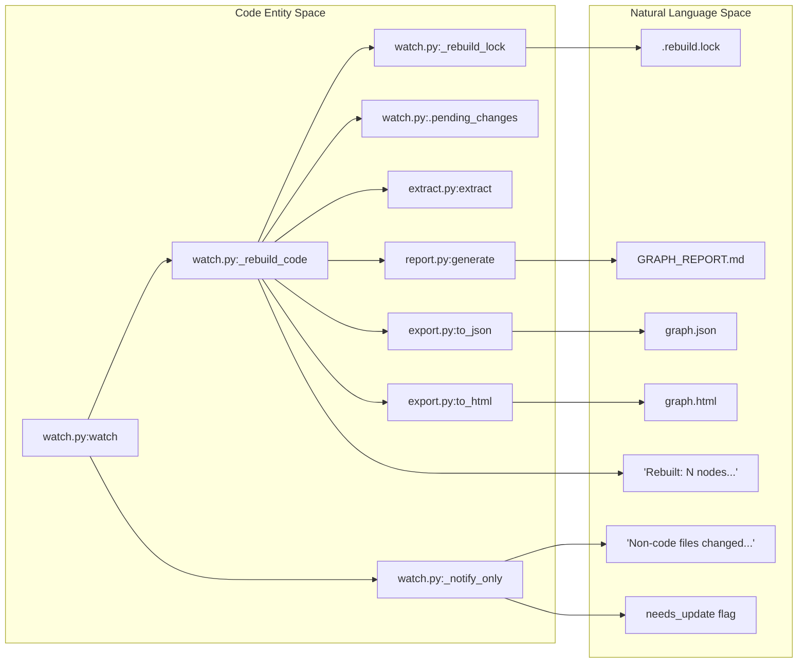

# File Watcher (watch.py)

<details>
<summary>Relevant source files</summary>

The following files were used as context for generating this wiki page:

- [graphify/cache.py](graphify/cache.py)
- [graphify/watch.py](graphify/watch.py)
- [tests/test_detect.py](tests/test_detect.py)
- [tests/test_watch.py](tests/test_watch.py)

</details>


The `watch.py` module provides a background monitoring service that automatically synchronizes the knowledge graph as the underlying corpus changes. It is designed to minimize LLM costs by using a bifurcated update logic: code changes trigger an immediate, deterministic AST rebuild, while semantic changes (docs, papers, images) notify the user that an LLM-based update is required [graphify/watch.py:1-10]().

## Overview of watch()

The `watch()` function is the entry point for the file monitoring service. It utilizes the `watchdog` library to observe filesystem events across the target directory and its subdirectories [graphify/watch.py:286-290]().

### Debounce Mechanism
To prevent the pipeline from triggering repeatedly during rapid file saves (e.g., a "Save All" command or an agent writing multiple files), `watch.py` implements a debounce timer (defaulting to 3.0 seconds) [graphify/watch.py:286-288]().

1.  **Event Capture**: The `Handler` class (inheriting from `FileSystemEventHandler`) captures any event that is not a directory and matches `_WATCHED_EXTENSIONS` [graphify/watch.py:301-310]().
2.  **Accumulation**: Changed paths are added to a `changed` set, and a `last_trigger` timestamp is updated using `time.monotonic()` [graphify/watch.py:313-315]().
3.  **Cooldown**: The main loop waits until `(time.monotonic() - last_trigger) >= debounce` before processing the accumulated batch of files [graphify/watch.py:335-337]().

### Monitored Extensions
The watcher filters for specific file types defined in `detect.py` to avoid noise from build artifacts or hidden directories [graphify/watch.py:112-115]().

| Category | Source Variable | Typical Extensions |
| :--- | :--- | :--- |
| **Code** | `CODE_EXTENSIONS` | `.py`, `.ts`, `.js`, `.go`, `.rs`, `.php`, `.dart`, etc. |
| **Docs** | `DOC_EXTENSIONS` | `.md`, `.txt`, `.rst`, `.pdf` |
| **Papers** | `PAPER_EXTENSIONS` | `.pdf` (handled with paper heuristics) |
| **Images** | `IMAGE_EXTENSIONS` | `.png`, `.jpg`, `.jpeg`, `.webp`, `.svg` |

Sources: `[graphify/watch.py:189-200]()`, `[graphify/watch.py:307-308]()`, `[tests/test_watch.py:34-55]()`

## Update Logic Flow

The watcher distinguishes between structural changes (code) and semantic changes (non-code) using the `_has_non_code()` helper [graphify/watch.py:282-283]().

### Code-Only Rebuild (`_rebuild_code`)
If the batch of changed files contains only code extensions, `watch.py` executes an "instant" rebuild pipeline. This pipeline is deterministic and does not incur LLM token costs because it relies on `tree-sitter` AST extraction [graphify/watch.py:339-340]().

**The `_rebuild_code` Pipeline:**
1.  **Locking**: Acquires a `_rebuild_lock` to prevent concurrent writes to `graphify-out/`. On POSIX systems, this uses `fcntl.flock` to write the current PID to `.rebuild.lock` [graphify/watch.py:91-105]().
2.  **Resource Limits**: Applies `os.nice(10)` and memory caps via `RLIMIT_DATA` (macOS) or `RLIMIT_AS` (Linux) [graphify/watch.py:151-177]().
3.  **Pending Changes**: Drains `.pending_changes` using `_drain_pending()` to merge files queued by concurrent hook processes that couldn't acquire the lock [graphify/watch.py:38-67](), [graphify/watch.py:353-354]().
4.  **Detect & Extract**: Calls `detect()` to find all files and `extract()` on code files [graphify/watch.py:356-363]().
5.  **State Preservation**: It loads the existing `graph.json`. It preserves "semantic" nodes (docs/images) and inferred/ambiguous edges while replacing the code-related nodes with the new AST data [graphify/watch.py:368-383]().
6.  **Build**: Invokes `build_from_json()` to create a NetworkX graph `G` [graphify/watch.py:395]().
7.  **Topology Check**: Compares the new graph topology with the old one using `_canonical_topology_for_compare()`. If the structure (nodes/edges) is identical, it skips the expensive Leiden clustering step [graphify/watch.py:170-205](), [graphify/watch.py:397-402]().
8.  **Cluster & Analyze**: If topology changed, it runs `cluster()` and `score_all()`, followed by `god_nodes()`, `surprising_connections()`, and `suggest_questions()` [graphify/watch.py:403-408]().
9.  **Export**: Updates `graphify-out/graph.json` and overwrites `GRAPH_REPORT.md`. It also attempts to update `graph.html` unless the graph exceeds `MAX_NODES_FOR_VIZ` [graphify/watch.py:413-432]().
10. **Cleanup**: Deletes the `needs_update` flag if it was previously set [graphify/watch.py:440-442]().

### Semantic Notification (`_notify_only`)
If any changed file is a document, paper, or image, the watcher cannot safely rebuild the graph without an LLM pass. In this case, it calls `_notify_only()` [graphify/watch.py:271-280]().

1.  **Flagging**: Creates a file at `graphify-out/needs_update` containing the string `"1"` [graphify/watch.py:220-222]().
2.  **Notification**: Prints a message to the console instructing the user to run `/graphify --update` in Claude Code to perform the semantic re-extraction [graphify/watch.py:223-226]().

Sources: `[graphify/watch.py:91-149]()`, `[graphify/watch.py:339-452]()`, `[graphify/watch.py:218-227]()`, `[graphify/watch.py:271-280]()`, `[tests/test_watch.py:13-30]()`

## System Integration Diagrams

### File Event to Action Mapping
This diagram shows how filesystem events are categorized and routed to either the AST pipeline or the notification system.

```mermaid
graph TD
    "FileSystem" -- "Event (File Modified)" --> "Handler.on_any_event"
    "Handler.on_any_event" -- "Filter _WATCHED_EXTENSIONS" --> "Pending Queue"
    "Pending Queue" -- "Debounce Timeout" --> "Batch Processor"
    "Batch Processor" -- "_has_non_code() == True" --> "_notify_only"
    "Batch Processor" -- "_has_non_code() == False" --> "_rebuild_code"
    
    subgraph "_rebuild_code Pipeline"
        "_rebuild_code" --> "extract.extract"
        "extract.extract" --> "build.build_from_json"
        "build.build_from_json" --> "cluster.cluster"
        "cluster.cluster" --> "report.generate"
    end

    "_notify_only" -- "Write Flag" --> "needs_update"
```
Sources: `[graphify/watch.py:339-452]()`, `[graphify/watch.py:301-337]()`, `[graphify/watch.py:218-227]()`

### Data Flow: Code Rebuild vs. Semantic Update
This diagram bridges the "Natural Language Space" (user notifications) to the "Code Entity Space" (specific functions and files).


Sources: `[graphify/watch.py:91-149]()`, `[graphify/watch.py:339-452]()`, `[graphify/watch.py:218-227]()`, `[graphify/watch.py:286-290]()`, `[graphify/watch.py:12-35]()`

## Implementation Details

### Dependency Handling
The `watchdog` library is an optional dependency. The `watch()` function performs a late import of `watchdog.observers` and `watchdog.events`. If the library is missing, it raises an `ImportError` with instructions to install it [graphify/watch.py:292-299](). On macOS, the watcher defaults to `PollingObserver` to ensure compatibility across different filesystem event limitations [graphify/watch.py:327-330]().

### Pending Changes Queue
The `.pending_changes` file acts as an atomic append-only queue for file paths that change while a rebuild is already in progress [graphify/watch.py:12-35](). 
- **Concurrent Writes**: Post-commit hooks that cannot acquire `_rebuild_lock` use `_queue_pending()` to ensure their changes aren't dropped [graphify/watch.py:19-22]().
- **Draining**: The lock-holder calls `_drain_pending()` before starting and after finishing a rebuild to catch any interleaved changes [graphify/watch.py:38-67](), [graphify/watch.py:353-354]().

### State Merging in _rebuild_code
One critical feature of `_rebuild_code` is that it preserves semantic context from previous LLM runs. It filters existing nodes to keep anything where `file_type != "code"`, and filters edges to keep those with `confidence` marked as `INFERRED` or `AMBIGUOUS` [graphify/watch.py:372-376](). This ensures that while code structure is updated instantly, the high-level semantic links between code and documentation are not lost.

### check_update Utility
The `check_update()` function is a utility that checks for the existence of the `needs_update` flag. It returns `True` regardless of the flag's presence but prints a notification if a semantic update is pending, which is useful for LLM-driven tools to check if their context is stale [graphify/watch.py:208-216]().

### Advisory Locking (GH-858)
The `_rebuild_lock` context manager provides a cross-process advisory lock. It uses `fcntl.flock` to prevent multiple rebuilds from corrupting the graph artifacts. The lock file contains the PID of the current holder, and it is automatically unlinked upon release to signal completion to downstream pollers [graphify/watch.py:91-149]().

Sources: `[graphify/watch.py:91-149]()`, `[graphify/watch.py:12-67]()`, `[graphify/watch.py:208-216]()`, `[graphify/watch.py:339-452]()`, `[graphify/watch.py:292-299]()`, `[tests/test_watch.py:59-102]()`, `[tests/test_watch.py:107-155]()`
