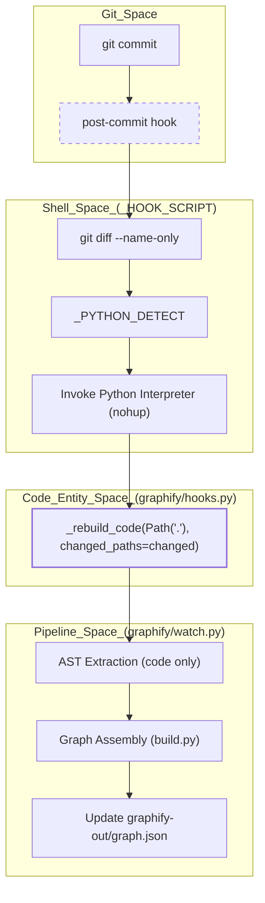
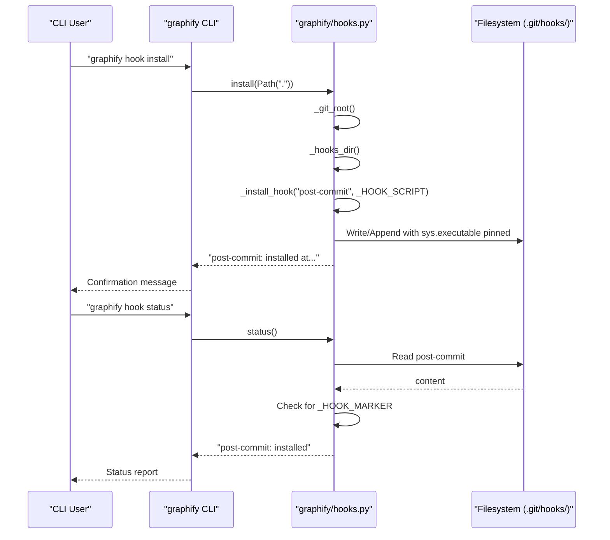

# Git Hooks Integration

Relevant source files

The following files were used as context for generating this wiki page:

- [graphify/export.py](graphify/export.py)
- [graphify/hooks.py](graphify/hooks.py)
- [tests/test_export.py](tests/test_export.py)
- [tests/test_hooks.py](tests/test_hooks.py)

The Git hooks integration in `graphify` ensures that the knowledge graph remains synchronized with the underlying source code as it evolves. By intercepting Git lifecycle events, `graphify` triggers selective, lightweight rebuilds of the graph without requiring manual intervention or expensive LLM re-processing for every change.

## Overview

The integration is managed via `graphify/hooks.py`, which provides utilities to install, uninstall, and verify the status of Git hooks within a repository [graphify/hooks.py:1-6](). These hooks target two specific Git events:
1.  **Post-Commit**: Rebuilds the graph after local changes are committed [graphify/hooks.py:77-80]().
2.  **Post-Checkout**: Rebuilds the graph when switching branches to ensure the visualization and analysis reflect the current HEAD [graphify/hooks.py:148-151]().

The system is designed to be **idempotent** and **non-destructive**, meaning it can safely append to existing hooks and clean up only its own injected code blocks using a marker system [graphify/hooks.py:8-11]().

## Hook Architecture

The integration relies on shell scripts injected into the Git hooks directory. These scripts perform environment detection and then invoke the `graphify` Python logic.

### Python Interpreter Detection (`_PYTHON_DETECT`)
A critical challenge for Git hooks is locating the correct Python interpreter, especially when `graphify` is installed via `uv tool`, `pipx`, a virtual environment, or a system-wide path. GUI git clients and CI runners often have a minimal `PATH` that omits `~/.local/bin`, leading to silent no-ops.

To solve this, `graphify` (as of version 0.8.31) uses a multi-stage detection strategy:

| Step | Logic | Source |
| :--- | :--- | :--- |
| **Pinned Interpreter** | The absolute path of `sys.executable` is embedded into the script at install time (`__PINNED_PYTHON__`). | [graphify/hooks.py:13-27](), [graphify/hooks.py:244-245]() |
| **State File Probe** | Reads `graphify-out/.graphify_python` (written by the CLI/Skill) as a secondary source. | [graphify/hooks.py:28-41]() |
| **Shebang Parsing** | Resolves `graphify` on `PATH` and parses its shebang. Handles Windows `.exe` by skipping extraction. | [graphify/hooks.py:42-63]() |
| **System Fallback** | Tries `python3` or `python` and emits a loud error to `stderr` if `import graphify` fails. | [graphify/hooks.py:64-74]() |

### Selective Rebuild Triggering
The hooks do not run the full `graphify` pipeline. Instead, they invoke `graphify.watch._rebuild_code()` to perform fast AST-based extraction in a detached background process [graphify/hooks.py:115-135]().

*   **Post-Commit Hook**: Identifies changed files using `git diff`. It includes a fix to prevent infinite dirty-tree loops: it skips execution if only `graphify-out/` artifacts changed [graphify/hooks.py:101-105](). It also skips execution during active rebases, merges, or cherry-picks [graphify/hooks.py:87-92]().
*   **Post-Checkout Hook**: Only triggers if the `graphify-out/` directory already exists and the checkout was a branch switch (flag `$3 == 1`) [graphify/hooks.py:163-170]().
*   **Background Execution**: Both hooks use `nohup` and `disown` to run the rebuild in the background, ensuring the Git command returns immediately [graphify/hooks.py:115-143](). Logs are appended to `~/.cache/graphify-rebuild.log` [graphify/hooks.py:112-114]().

**Sources:** [graphify/hooks.py:13-75](), [graphify/hooks.py:77-145](), [graphify/hooks.py:148-185]()

## Implementation Detail: Idempotent Marker System

To allow for safe installation and uninstallation, `graphify` uses a marker-based system to wrap its injected shell code.

**Markers in `graphify/hooks.py`:**
*   `_HOOK_MARKER`: `# graphify-hook-start` [graphify/hooks.py:8]()
*   `_HOOK_MARKER_END`: `# graphify-hook-end` [graphify/hooks.py:9]()
*   `_CHECKOUT_MARKER`: `# graphify-checkout-hook-start` [graphify/hooks.py:10]()
*   `_CHECKOUT_MARKER_END`: `# graphify-checkout-hook-end` [graphify/hooks.py:11]()

### Git Hooks Directory Resolution (`_hooks_dir`)
The `_hooks_dir` function respects the `core.hooksPath` Git configuration [graphify/hooks.py:204-210](). This ensures compatibility with tools like **Husky**, which redirect hooks to a custom directory. The function handles both absolute and relative paths returned by Git [graphify/hooks.py:211-217]().

### Configuration and Control
*   **`GRAPHIFY_SKIP_HOOK=1`**: An environment variable that allows users to bypass hook execution for specific commits [graphify/hooks.py:94]().
*   **Resource Limits**: The hooks call `_apply_resource_limits()` from `graphify.watch` to apply resource constraints to the background process [graphify/hooks.py:128-129]().
*   **Deterministic Clustering**: The hooks export `PYTHONHASHSEED=0` to ensure that Leiden/Louvain community assignments remain stable across background runs [graphify/hooks.py:85](), [graphify/hooks.py:156]().

**Sources:** [graphify/hooks.py:8-11](), [graphify/hooks.py:204-217](), [graphify/hooks.py:241-248]()

## Data Flow: Git Event to Graph Update

The following diagram illustrates how a Git commit triggers a graph update through the hook system.

**Git Hook Execution Flow**

**Sources:** [graphify/hooks.py:19-75](), [graphify/hooks.py:77-145](), [graphify/hooks.py:115-142]()

## Integration with CLI

Users interact with these hooks through the `graphify hook` command group.

| CLI Command | Python Function | Description |
| :--- | :--- | :--- |
| `graphify hook install` | `hooks.install()` | Registers `post-commit` and `post-checkout` hooks in the nearest git repo [graphify/hooks.py:302-313](). |
| `graphify hook uninstall` | `hooks.uninstall()` | Removes the `graphify` blocks from existing Git hooks [graphify/hooks.py:316-327](). |
| `graphify hook status` | `hooks.status()` | Checks if markers are present in the current repo's hooks [graphify/hooks.py:330-349](). |

## System Interaction Diagram

This diagram bridges the CLI commands to the underlying hook management functions and the filesystem.

**Hook Management Logic**

**Sources:** [graphify/hooks.py:204-217](), [graphify/hooks.py:231-255](), [graphify/hooks.py:302-349]()
