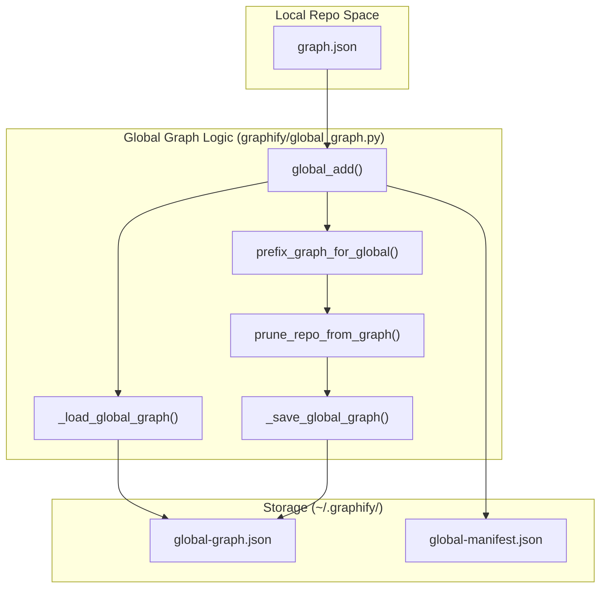
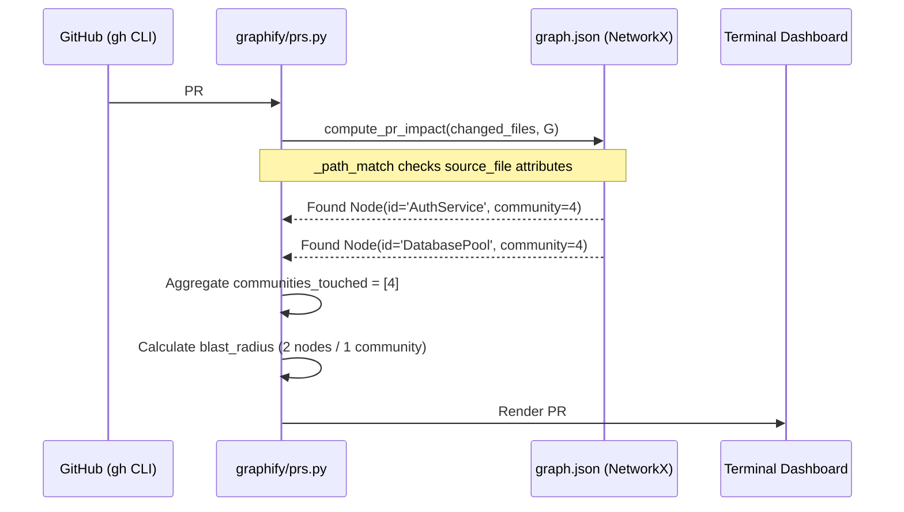

# PR Dashboard & Global Graph

Relevant source files

The following files were used as context for generating this wiki page:

- [graphify/callflow_html.py](graphify/callflow_html.py)
- [graphify/diagnostics.py](graphify/diagnostics.py)
- [graphify/global_graph.py](graphify/global_graph.py)
- [graphify/multigraph_compat.py](graphify/multigraph_compat.py)
- [graphify/prs.py](graphify/prs.py)
- [tests/test_callflow_html.py](tests/test_callflow_html.py)
- [tests/test_global_graph.py](tests/test_global_graph.py)
- [tests/test_prs.py](tests/test_prs.py)

The PR Dashboard and Global Graph modules provide high-level visibility across multiple pull requests and multiple repositories. `graphify/prs.py` implements a graph-aware dashboard for managing pull requests by mapping code changes to graph communities, while `graphify/global_graph.py` manages a cross-repo knowledge graph stored in the user's home directory.

## PR Dashboard (`graphify prs`)

The `graphify prs` command provides a terminal-based dashboard that integrates GitHub PR metadata with graph-based impact analysis. It allows developers to see not just which files changed, but which architectural communities are affected.

### Data Flow and Classification
The dashboard fetches data from the GitHub CLI (`gh`) and classifies PRs into actionable states.

1.  **Fetch**: `fetch_prs` calls `gh pr list` to retrieve JSON metadata including CI status, review decisions, and update timestamps [graphify/prs.py:189-201](). It uses `_detect_default_branch` to determine the target branch (e.g., `main` or `v8`) [graphify/prs.py:148-169]().
2.  **Classify**: Each PR is assigned a status (e.g., `READY`, `CI-FAIL`, `STALE`, `WRONG-BASE`) via `_classify` [graphify/prs.py:98-113](). CI status is distilled from the `statusCheckRollup` using `_parse_ci` [graphify/prs.py:175-186]().
3.  **Impact Analysis**: If a `graph.json` exists, `compute_pr_impact` maps the PR's changed files to specific graph nodes and communities [graphify/prs.py:348-378]().

### Implementation Details
*   **Conflict Detection**: Using `--conflicts`, the system identifies PRs that "touch" the same graph communities, signaling potential merge-order risks even if there are no direct git line-conflicts [graphify/prs.py:12-12]().
*   **Worktree Mapping**: The `--worktrees` flag maps local git worktrees to active branches and their corresponding PRs using `fetch_worktrees` [graphify/prs.py:284-311]().
*   **AI Triage**: The `--triage` flag uses an LLM (Opus) to rank the review queue based on title, author, and graph impact [graphify/prs.py:10-10]().
*   **Impact Summary**: The `PRInfo` dataclass tracks `communities_touched` and `nodes_affected` to calculate the "blast radius" of a change [graphify/prs.py:57-90]().

### PR Impact Mapping Logic
The system bridges the "Git Space" (file paths) to "Code Entity Space" (graph nodes) using path matching.

| Component | Logic | Source |
| :--- | :--- | :--- |
| **Path Matcher** | `_path_match` handles absolute vs relative paths and ensures matches occur at path boundaries to avoid partial filename collisions. | [graphify/prs.py:330-345]() |
| **Impact Calculator** | `compute_pr_impact` iterates through `G.nodes(data=True)`, matching `source_file` attributes to PR diffs. | [graphify/prs.py:348-378]() |
| **Community Labels** | `build_community_labels` aggregates community IDs into human-readable summaries for the dashboard. | [graphify/prs.py:381-396]() |

**Sources:** [graphify/prs.py:1-400](), [tests/test_prs.py:1-210]()

---

## Global Graph (`graphify global`)

The Global Graph subsystem allows users to aggregate multiple independent project graphs into a single, unified graph located at `~/.graphify/global-graph.json`. This enables cross-repo impact analysis and shared dependency tracking.

### Architecture and Storage
The global graph uses a manifest-based system to track which repositories have been indexed.

*   **Global Directory**: Located at `~/.graphify/` [graphify/global_graph.py:10-10]().
*   **Global Manifest**: `global-manifest.json` stores metadata, source paths, and SHA256 hashes of the source graphs to prevent redundant updates [graphify/global_graph.py:12-21]().
*   **ID Namespacing**: To prevent collisions between different repos (e.g., two repos both having a `utils.py`), `prefix_graph_for_global` prepends a `repo_tag` to every node ID (e.g., `repoA::node_id`) and stores the original ID in `local_id` [graphify/global_graph.py:96-96](), [tests/test_global_graph.py:40-56]().

### Global Graph Operations
The `graphify/global_graph.py` module provides the core logic for managing the cross-repo state.

**Sources:** [graphify/global_graph.py:29-155](), [tests/test_global_graph.py:40-90]()

### Key Functions
*   **`global_add(source_path, repo_tag)`**: Loads a local graph, namespaces its nodes, prunes any existing nodes for that tag in the global graph via `prune_repo_from_graph`, and merges the new data [graphify/global_graph.py:58-133]().
*   **`global_remove(repo_tag)`**: Uses `prune_repo_from_graph` to strip all nodes associated with a specific repository from the global storage and updates the manifest [graphify/global_graph.py:136-150]().
*   **`_file_hash(path)`**: Generates a truncated SHA256 hash to detect if a source graph has changed since the last global update [graphify/global_graph.py:52-55]().

### Entity Deduplication (Cross-Repo)
When merging graphs, `global_add` performs deduplication of external library nodes. If multiple repositories depend on the same external library (nodes without a `source_file` attribute), they are merged by their `label` to prevent the global graph from becoming cluttered with duplicate library nodes [graphify/global_graph.py:102-111]().

**Sources:** [graphify/global_graph.py:1-160](), [tests/test_global_graph.py:93-152]()

---

## Callflow HTML Export

The `graphify export callflow-html` command generates a self-contained, dark-themed architectural overview of the codebase. It leverages `graphify/callflow_html.py` to synthesize data from `graph.json`, `GRAPH_REPORT.md`, and community labels.

### Export Pipeline
The generation process follows a specific sequence to transform graph data into a structured HTML document:

1.  **Loading**: `load_graph` reads the `graph.json` file, enforcing a security size cap via `check_graph_file_size_cap` [graphify/callflow_html.py:173-188]().
2.  **Section Inference**: If no explicit sections are provided, `derive_sections_from_communities` groups nodes by their community ID and attempts to name the section based on file path keywords (e.g., "extract", "export", "test") [graphify/callflow_html.py:157-171]().
3.  **Diagram Generation**: The system generates Mermaid.js flowcharts. An architecture overview diagram shows aggregated edges between sections, while per-section diagrams show representative intra-section calls [graphify/callflow_html.py:9-10]().
4.  **Sanitization**: Labels and content are escaped to prevent XSS, ensuring that entities like `<script>` in the graph do not execute in the browser [tests/test_callflow_html.py:67-68]().

### Visualization Components
*   **Mermaid Viewport**: An enhanced container for Mermaid diagrams that supports zooming and panning [graphify/callflow_html.py:53-56]().
*   **Call Detail Tables**: Scaffolding for mapping functions, classes, and endpoints to their respective sections [graphify/callflow_html.py:62-72]().
*   **Tagging System**: Nodes are visually tagged as `tag-async`, `tag-class`, `tag-func`, etc., based on their metadata [graphify/callflow_html.py:66-72]().

**Sources:** [graphify/callflow_html.py:1-188](), [tests/test_callflow_html.py:1-188]()

---

## Technical Mapping: PR to Graph Entities

This diagram illustrates how a code change in a Pull Request is mapped through the system to identify affected architectural communities and nodes.

**Sources:** [graphify/prs.py:57-90](), [graphify/prs.py:348-378](), [tests/test_prs.py:153-180]()
