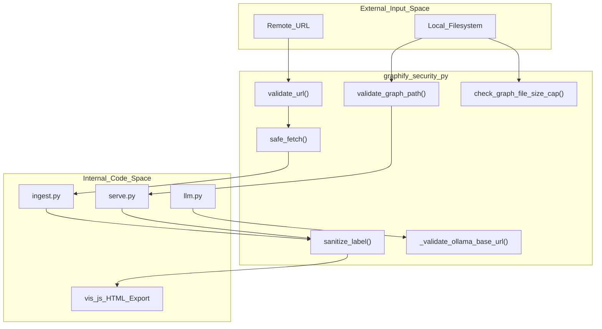
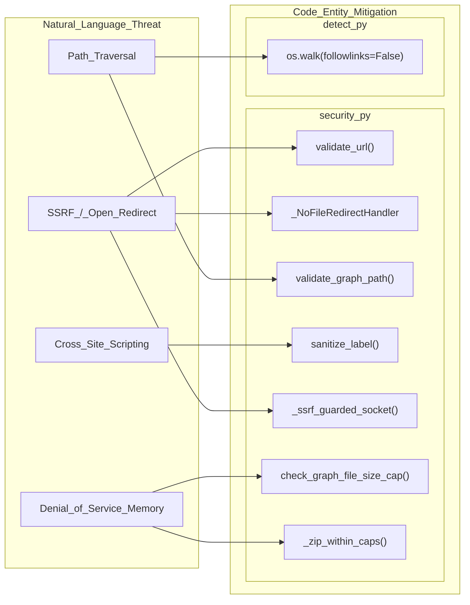

# Security Model

Relevant source files

The following files were used as context for generating this wiki page:

- [SECURITY.md](SECURITY.md)
- [graphify/security.py](graphify/security.py)
- [tests/test_cache.py](tests/test_cache.py)
- [tests/test_security.py](tests/test_security.py)

`graphify` is designed as a **local development tool** [SECURITY.md:25-25](). It primarily operates as a Claude Code skill or a local MCP stdio server, meaning it does not run a network listener and communicates only via standard input/output [SECURITY.md:44-44](). 

The security architecture focuses on three main areas: protecting the local filesystem from path traversal, preventing Server-Side Request Forgery (SSRF) during optional ingestion, and ensuring that graph visualizations and LLM contexts are safe from Cross-Site Scripting (XSS) or prompt injection.

## Threat Surface & Mitigations

The following table summarizes the primary attack vectors and the corresponding mitigations implemented in `graphify/security.py`.

| Vector | Mitigation | Code Entity |
| :--- | :--- | :--- |
| **SSRF via URL fetch** | Scheme allowlist (http/https), blocking private/cloud IPs, and redirect re-validation. | `validate_url` [graphify/security.py:42-86](), `_NoFileRedirectHandler` [graphify/security.py:120-129]() |
| **Resource Exhaustion** | Hard caps on download sizes (50MB binary / 10MB text) and JSON memory-bomb protection. | `_MAX_FETCH_BYTES` [graphify/security.py:18-18](), `_MAX_GRAPH_FILE_BYTES` [graphify/security.py:25-25]() |
| **Path Traversal** | Path resolution and enforcement of `graphify-out/` boundary. | `validate_graph_path` [graphify/security.py:244-273]() |
| **XSS / Prompt Injection** | Control character stripping, length capping, and metadata sanitization. | `sanitize_label` [graphify/security.py:276-292](), `sanitize_metadata` [graphify/security.py:302-315]() |
| **Symlink Attacks** | Explicitly disabling link following during file discovery. | `os.walk(..., followlinks=False)` [SECURITY.md:39-39]() |
| **Ollama SSRF** | Blocking link-local and cloud metadata addresses for Ollama backends. | `_validate_ollama_base_url` [graphify/security.py:328-348]() |
| **Local Provider Hijack** | Project-local `providers.json` no longer auto-loaded without opt-in. | `GRAPHIFY_ALLOW_LOCAL_PROVIDERS` [graphify/security.py:320-325]() |

### Security Architecture Overview
The following diagram illustrates how security guards are positioned between external inputs (URLs/Files) and the internal graph representation.

**Security Guard Placement**

**Sources:** [graphify/security.py:1-348](), [SECURITY.md:23-41]()

## URL Validation & Safe Fetch

When a user explicitly requests a URL ingestion (e.g., a tweet, an arXiv paper, or a YouTube video), `graphify` uses `safe_fetch` to retrieve the content. These apply multi-layered defenses:
1.  **Scheme Validation**: Only `http` and `https` are permitted [graphify/security.py:51-55]().
2.  **IP/Host Blocking**: Requests to private/reserved IP ranges (127.x, 10.x, etc.) and cloud metadata endpoints (e.g., `metadata.google.internal`) are blocked [graphify/security.py:59-80]().
3.  **DNS Rebinding Protection**: The `_ssrf_guarded_socket` context manager patches `socket.getaddrinfo` to validate every IP resolved during a fetch to prevent TOCTOU attacks [graphify/security.py:89-118]().
4.  **Redirect Protection**: `_NoFileRedirectHandler` ensures that a malicious server cannot redirect an `http` request to a local `file://` resource [graphify/security.py:120-129]().
5.  **Streaming Size Limits**: Data is read in chunks; if the total exceeds the hard cap (50MB for binary [graphify/security.py:18-18](), 10MB for text [graphify/security.py:19-19]()), the process is aborted [graphify/security.py:175-178]().
6.  **Ollama Guard**: Base URLs for Ollama are validated to prevent SSRF against link-local addresses (169.254.169.254) commonly used for cloud metadata [graphify/security.py:328-348]().

For details, see [URL Validation & Safe Fetch](#5.1).

## Path & Label Safety

`graphify` ensures that it only interacts with authorized files and that its outputs are safe for display in browsers or LLM contexts.

*   **Path Traversal**: `validate_graph_path` resolves provided paths and verifies they reside within the `graphify-out/` directory [graphify/security.py:244-273](). It also requires the base directory to exist before allowing any reads to prevent tricking the tool into reading files before a graph has been built [graphify/security.py:252-253]().
*   **Sanitization**: `sanitize_label` is applied to node labels and edge titles [graphify/security.py:276-292](). It strips control characters and caps length at 256 characters [graphify/security.py:282-285](). This prevents user-controlled source code names from breaking the text format returned to agents in `serve.py` or interactive `vis.js` visualizations [SECURITY.md:35-36]().
*   **Memory Protection**: Before parsing large JSON graphs, `check_graph_file_size_cap` verifies the file size against `_MAX_GRAPH_FILE_BYTES` (512 MiB) to prevent memory exhaustion [graphify/security.py:21-25](), [graphify/security.py:231-241]().
*   **Logic Guards**: The system includes zip-bomb protection for Office files and pre-screening of XML files to prevent DOCTYPE/ENTITY-based Denial of Service attacks [graphify/security.py:351-384]().

For details, see [Path Traversal & Label Sanitization](#5.2).

### Code Entity Association: Security Implementation
This diagram maps security concepts to the specific functions and files responsible for enforcing them.

**Security Logic Mapping**

**Sources:** [graphify/security.py:42-384](), [SECURITY.md:29-41]()

## Explicit Non-Goals

To maintain a minimal security footprint, `graphify` explicitly avoids several dangerous patterns:
*   **No Code Execution**: `graphify` uses `tree-sitter` to parse ASTs; it never uses `eval()`, `exec()`, or imports the source code it analyzes [SECURITY.md:45-45]().
*   **No Shell Invocations**: Subprocess calls avoid `shell=True` to prevent command injection [SECURITY.md:46-46]().
*   **No Network Listening**: The system does not open ports; communication is strictly local via stdio [SECURITY.md:44-44]().
*   **No Credential Storage**: The tool does not manage or store API keys or secrets [SECURITY.md:47-47]().

**Sources:** [SECURITY.md:42-48](), [graphify/security.py:1-384]()
