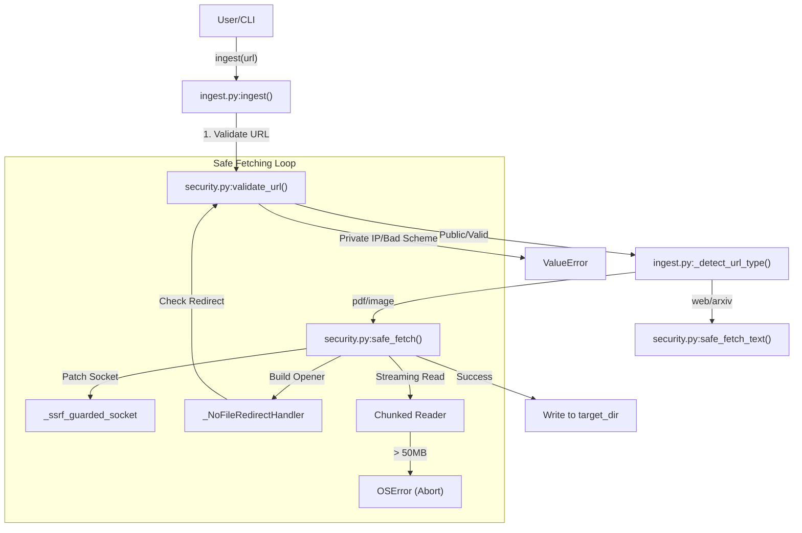
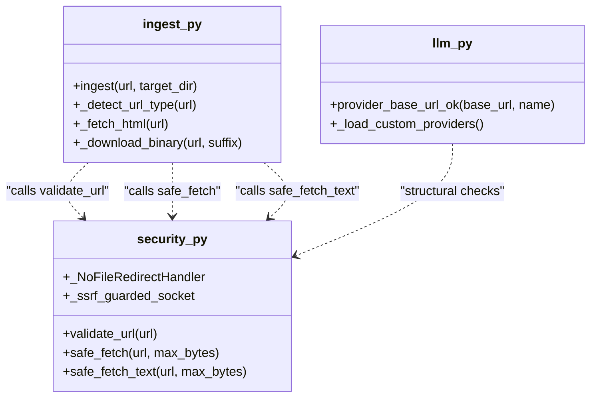

# URL Validation & Safe Fetch

Relevant source files

The following files were used as context for generating this wiki page:

- [graphify/benchmark.py](graphify/benchmark.py)
- [graphify/ingest.py](graphify/ingest.py)
- [graphify/llm.py](graphify/llm.py)
- [graphify/security.py](graphify/security.py)
- [graphify/serve.py](graphify/serve.py)
- [tests/test_benchmark.py](tests/test_benchmark.py)
- [tests/test_cache.py](tests/test_cache.py)
- [tests/test_claude_cli_backend.py](tests/test_claude_cli_backend.py)
- [tests/test_llm_backends.py](tests/test_llm_backends.py)
- [tests/test_provider_registry.py](tests/test_provider_registry.py)
- [tests/test_security.py](tests/test_security.py)
- [tests/test_serve.py](tests/test_serve.py)

This section details the security mechanisms implemented in `graphify` to handle external content and provider configurations safely. While `graphify` is primarily a local development tool, the `ingest` command and LLM backend integrations require robust protections against Server-Side Request Forgery (SSRF), resource exhaustion, and data exfiltration.

### URL Validation & SSRF Protection

All external requests are governed by `validate_url()`, which enforces a strict allowlist of protocols and destination checks [graphify/security.py:42-86]().

- **Protocol Allowlist:** Only `http` and `https` schemes are processed. `graphify` explicitly blocks `file://`, `ftp://`, `data:`, and other schemes to prevent local file access or protocol smuggling [graphify/security.py:17](), [graphify/security.py:51-55]().
- **Cloud Metadata Blocking:** To prevent SSRF in cloud environments, hostnames like `metadata.google.internal` and `metadata.google.com` are explicitly blocked [graphify/security.py:28](), [graphify/security.py:60-64]().
- **Private IP Guard:** `validate_url()` resolves hostnames using `socket.getaddrinfo` and checks the resulting IP addresses [graphify/security.py:68-71](). It blocks requests to private, reserved, loopback (127.0.0.1), link-local (169.254.x.x), or Shared Address Space (CGN) ranges [graphify/security.py:31](), [graphify/security.py:76-80]().
- **NAT64 Handling:** For IPv6 environments, `graphify` detects NAT64 Well-Known Prefixes and validates the embedded IPv4 address to ensure it isn't targeting a private range [graphify/security.py:35](), [graphify/security.py:73-75]().
- **DNS Rebinding Protection:** The `_ssrf_guarded_socket` context manager patches `socket.getaddrinfo` for the duration of a fetch [graphify/security.py:89-118](). This ensures that every IP resolved during the actual connection attempt is validated, closing the Time-of-Check to Time-of-Use (TOCTOU) window [graphify/security.py:99-111]().
- **Redirect Security:** To prevent "open-redirect" attacks where a valid URL redirects to a restricted local resource, `graphify` uses a custom `_NoFileRedirectHandler` [graphify/security.py:120-130](). This handler intercepts every redirect and re-validates the `newurl` using `validate_url()` before the client follows it [graphify/security.py:127-129]().

| Component | Responsibility |
| :--- | :--- |
| `_ALLOWED_SCHEMES` | Set containing `{"http", "https"}` [graphify/security.py:17](). |
| `_BLOCKED_HOSTS` | Cloud metadata endpoints like `metadata.google.com` [graphify/security.py:28](). |
| `validate_url()` | Raises `ValueError` for disallowed schemes or internal IP ranges [graphify/security.py:42-86](). |
| `_ssrf_guarded_socket` | Context manager that prevents DNS rebinding by patching socket resolution [graphify/security.py:89-118](). |
| `_NoFileRedirectHandler` | A `urllib.request.HTTPRedirectHandler` subclass that forces re-validation on redirects [graphify/security.py:120-130](). |

**Sources:** [graphify/security.py:17-130]()

---

### Safe Fetching Implementation

The `safe_fetch()` and `safe_fetch_text()` functions provide the core fetching logic with built-in resource limits.

#### Resource Constraints
- **Binary Cap:** Downloads (PDFs, images) are capped at 50 MB (`_MAX_FETCH_BYTES`) [graphify/security.py:18]().
- **Text Cap:** HTML and text content are capped at 10 MB (`_MAX_TEXT_BYTES`) [graphify/security.py:19]().
- **Streaming Read:** `safe_fetch()` reads the response in 64 KB chunks [graphify/security.py:170](). If the cumulative size exceeds the limit, it raises an `OSError` and aborts the connection immediately rather than loading the full payload into memory [graphify/security.py:175-179]().
- **Graph Load Cap:** A separate 512 MiB limit (`_MAX_GRAPH_FILE_BYTES`) is applied when loading existing `graph.json` files to prevent memory-bomb attacks during JSON parsing [graphify/security.py:25]().

#### Error Handling
`safe_fetch()` explicitly checks the HTTP status code. Any status outside the `200-299` range triggers a `urllib.error.HTTPError`, ensuring that error pages are not treated as valid content [graphify/security.py:164-165]().

#### URL Ingestion Flow
The following diagram illustrates how `ingest.py` utilizes these security guards when a user requests a URL.

**URL Ingestion Security Flow**

**Sources:** [graphify/ingest.py:10](), [graphify/ingest.py:181-204](), [graphify/security.py:140-181]()

---

### LLM Backend Security & Ollama Guard

The `llm.py` module handles interactions with AI providers and includes specific guards for custom and local endpoints.

- **Ollama SSRF Guard:** The `_validate_ollama_base_url` function (utilized during backend initialization) prevents Ollama configurations from targeting link-local or cloud metadata addresses (e.g., `169.254.169.254`) [graphify/llm.py:65-72]().
- **Custom Provider Safety:** When loading custom providers, `provider_base_url_ok()` performs a structural check. It rejects non-`http(s)` schemes and warns if plaintext `http` is used for non-loopback hosts to prevent corpus/key exfiltration [graphify/llm.py:128-162]().
- **Project-Local Providers (0.8.29 Fix):** To prevent malicious repositories from hijacking LLM requests, `graphify` no longer auto-loads project-local `.graphify/providers.json` files [graphify/llm.py:165-171](). Users must explicitly opt-in by setting the environment variable `GRAPHIFY_ALLOW_LOCAL_PROVIDERS=1` [graphify/llm.py:170]().

**Sources:** [graphify/llm.py:65-171]()

---

### Integration in `ingest.py`

The `ingest` module acts as the primary consumer of the security helpers. It classifies URLs into types and selects the appropriate fetcher [graphify/ingest.py:64-81]().

- **Binary Assets:** For `pdf` and `image` types, `_download_binary` calls `safe_fetch()` [graphify/ingest.py:173-178]().
- **HTML Content:** For webpages and arXiv abstracts, `_fetch_html` calls `safe_fetch_text()` [graphify/ingest.py:84-85](). The resulting string is decoded using `UTF-8` with the `replace` error handler [graphify/security.py:192]().
- **Specialized Fetching:** Tweet ingestion uses `safe_fetch_text()` to query the Twitter oEmbed API [graphify/ingest.py:109]().

**Entity Relationship: Ingestion to Security**

**Sources:** [graphify/ingest.py:10](), [graphify/security.py:42-192](), [graphify/llm.py:128-171]()

### Data Flow Table

| Action | Function | Security Guard | Limit / Logic |
| :--- | :--- | :--- | :--- |
| Initial URL Check | `ingest()` | `validate_url()` | Protocol & IP allowlist [graphify/security.py:42]() |
| DNS Rebinding Guard | `safe_fetch()` | `_ssrf_guarded_socket` | Per-connection IP validation [graphify/security.py:160]() |
| Following Redirects | `_build_opener()` | `_NoFileRedirectHandler` | Recursive validation [graphify/security.py:127]() |
| Fetching PDF/Image | `_download_binary()` | `safe_fetch()` | 50 MB Hard Cap [graphify/security.py:18]() |
| Fetching Webpage | `_fetch_html()` | `safe_fetch_text()` | 10 MB Hard Cap [graphify/security.py:19]() |
| Local Config Load | `_load_custom_providers()` | `GRAPHIFY_ALLOW_LOCAL_PROVIDERS` | Opt-in required for project-local files [graphify/llm.py:170]() |

**Sources:** [graphify/ingest.py:84-204](), [graphify/security.py:17-192](), [graphify/llm.py:165-171]()
