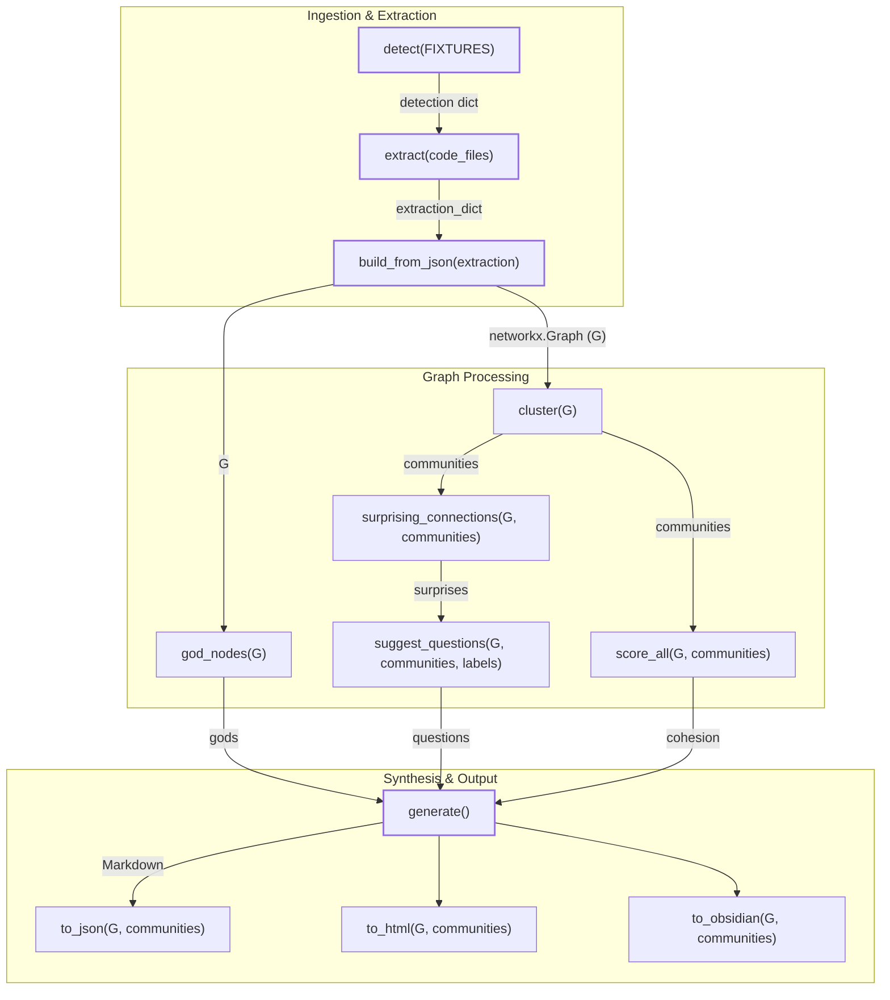
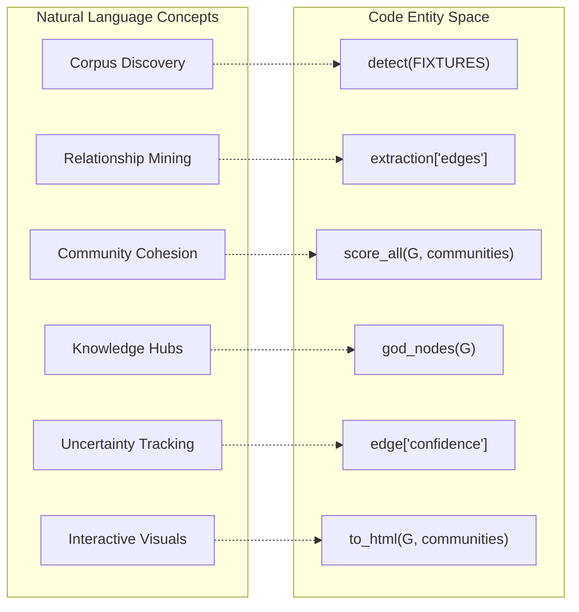

# End-to-End Pipeline Test

Relevant source files

The following files were used as context for generating this wiki page:

- [tests/test_incremental.py](tests/test_incremental.py)
- [tests/test_pipeline.py](tests/test_pipeline.py)

The end-to-end (E2E) pipeline test ensures that all nine major stages of the `graphify` system—from file detection to final export—function as a cohesive unit. This test suite, primarily housed in `tests/test_pipeline.py`, validates the data flow between modules and catches regressions that individual unit tests might miss.

### Purpose and Scope
The primary goal of the E2E test is to verify the integration of the linear pipeline without requiring external LLM calls. It utilizes local AST-based extraction and static fixtures to simulate a real-world execution environment. The pipeline follows a strict sequence:
1.  **Detection**: Identifying files in the corpus using `detect()`.
2.  **Extraction**: Parsing structure (AST) and metadata via `extract()`.
3.  **Build**: Constructing the `networkx.Graph` with `build_from_json()`.
4.  **Cluster**: Performing Leiden community detection with `cluster()`.
5.  **Analyze**: Identifying god nodes, surprising connections, and suggested questions.
6.  **Report**: Generating the `GRAPH_REPORT.md` summary using `generate()`.
7.  **Export**: Producing JSON, HTML, and Obsidian vault outputs.

Sources: [tests/test_pipeline.py:1-19](), [graphify/detect.py:12-12](), [graphify/extract.py:13-13](), [graphify/build.py:14-14](), [graphify/cluster.py:15-15](), [graphify/analyze.py:16-16](), [graphify/report.py:17-17](), [graphify/export.py:18-18]()

---

### The `run_pipeline()` Helper
The core of the E2E suite is the `run_pipeline()` function [tests/test_pipeline.py:23-104](). This helper executes the entire workflow on the `FIXTURES` directory [tests/test_pipeline.py:20-20]() and returns a dictionary containing the state of each stage for assertion by specific test cases.

#### Pipeline Execution Flow
The following diagram maps the logical stages of `run_pipeline()` to the specific functions and modules invoked.

**Pipeline Data Flow (Code Entity Space)**

Sources: [tests/test_pipeline.py:23-104](), [graphify/detect.py:12-12](), [graphify/extract.py:13-13](), [graphify/build.py:14-14](), [graphify/cluster.py:15-15](), [graphify/analyze.py:16-16](), [graphify/report.py:17-17](), [graphify/export.py:18-18]()

#### Key Implementation Details
*   **Detection Verification**: The test ensures `detect()` finds files within the `tests/fixtures` directory [tests/test_pipeline.py:26-30]().
*   **AST Extraction**: `extract()` is called on code files to generate nodes and edges without LLM intervention [tests/test_pipeline.py:34-36]().
*   **Clustering Metrics**: The pipeline validates that `score_all()` produces a cohesion score between 0.0 and 1.0 for every community [tests/test_pipeline.py:46-49]().
*   **Analysis Integrity**: `god_nodes()` must return objects containing both "id" and "degree" [tests/test_pipeline.py:52-54]().
*   **Export Artifacts**: The test verifies the physical existence of `graph.json`, `graph.html` (containing `vis-network` markers), and the `.obsidian` configuration directory [tests/test_pipeline.py:71-92]().

---

### Test Cases and Assertions

The suite includes specialized test cases to verify graph integrity, community assignment, and idempotency.

| Test Case | Objective | Logic |
| :--- | :--- | :--- |
| `test_pipeline_all_nodes_have_community` | Graph Integrity | Iterates through `G.nodes()` to ensure every node is present in the `communities` mapping [tests/test_pipeline.py:117-124](). |
| `test_pipeline_incremental_update` | Idempotency | Runs the pipeline twice on the same `tmp_path`. Asserts that node and edge counts remain identical [tests/test_pipeline.py:138-144](). |
| `test_pipeline_extraction_confidence_labels` | Schema Validation | Checks that every edge in the extraction output has a confidence label of `EXTRACTED`, `INFERRED`, or `AMBIGUOUS` [tests/test_pipeline.py:146-152](). |
| `test_pipeline_no_self_loops` | Graph Topology | Validates that no edge exists where source equals target (`u != v`) [tests/test_pipeline.py:154-159](). |
| `test_pipeline_report_mentions_top_god_node` | Reporting | Verifies that the label of the primary god node is mentioned in the generated Markdown report [tests/test_pipeline.py:126-130](). |

Sources: [tests/test_pipeline.py:107-159]()

---

### Incremental and Manifest Behavior
Specific integration tests in `tests/test_incremental.py` cover how the pipeline behaves when a `manifest.json` is present. These tests use `subprocess` to execute the `graphify` module via the current Python interpreter [tests/test_incremental.py:11-32]().

*   **Manifest Writing**: The pipeline must not write a `manifest.json` if the extraction fails (e.g., due to missing LLM keys) [tests/test_incremental.py:43-51]().
*   **Incremental Detection**: If both `manifest.json` and `graph.json` exist in `graphify-out/`, the system triggers an "incremental" mode message [tests/test_incremental.py:54-63]().
*   **Full Scan**: In the absence of a manifest, the system defaults to a full scan and does not report incremental mode [tests/test_incremental.py:66-74]().

Sources: [tests/test_incremental.py:11-75]()

---

### Data Mapping: Natural Language to Code Entities
This section bridges the high-level concepts discussed in documentation with the concrete variables and functions used in the E2E tests.

**Entity Mapping Diagram**

Sources: [tests/test_pipeline.py:20-56](), [tests/test_pipeline.py:146-152](), [graphify/cluster.py:15-15](), [graphify/analyze.py:16-16](), [graphify/export.py:18-18]()

### Fixture Structure
The tests rely on a small, predictable corpus located in `tests/fixtures/` [tests/test_pipeline.py:20-20](). This directory contains multi-language code and document files used to verify that the `detect` and `extract` stages handle heterogeneous file types correctly, specifically ensuring both "code" and "document" types are identified [tests/test_pipeline.py:132-136]().

Sources: [tests/test_pipeline.py:20-20](), [tests/test_pipeline.py:132-136]()
