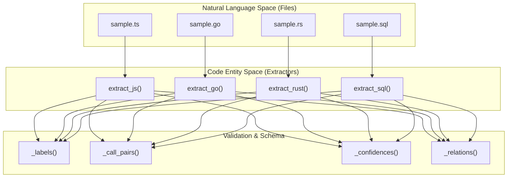
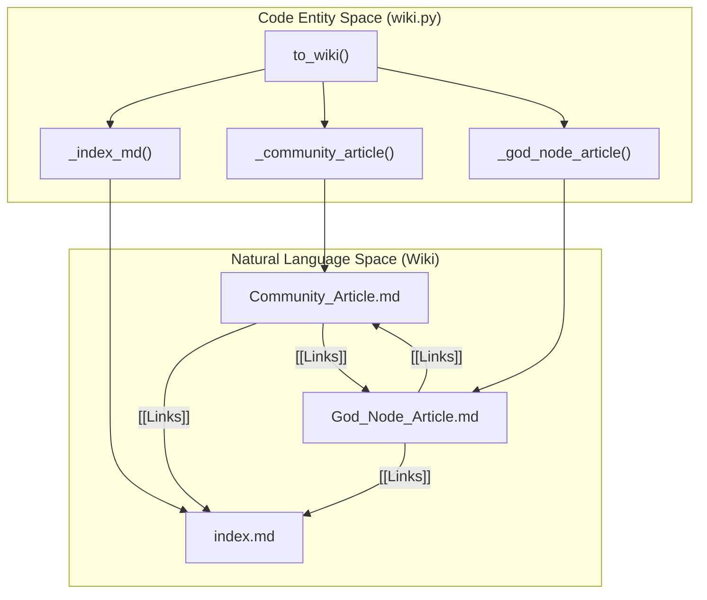

# Unit Tests & Fixtures

Relevant source files

The following files were used as context for generating this wiki page:

- [graphify/build.py](graphify/build.py)
- [graphify/querylog.py](graphify/querylog.py)
- [graphify/symbol_resolution.py](graphify/symbol_resolution.py)
- [tests/fixtures/dynamic_import.ts](tests/fixtures/dynamic_import.ts)
- [tests/fixtures/sample.cs](tests/fixtures/sample.cs)
- [tests/fixtures/sample.java](tests/fixtures/sample.java)
- [tests/fixtures/sample_alter_fk.sql](tests/fixtures/sample_alter_fk.sql)
- [tests/fixtures/sample_schema_qualified.sql](tests/fixtures/sample_schema_qualified.sql)
- [tests/test_antigravity_install.py](tests/test_antigravity_install.py)
- [tests/test_build.py](tests/test_build.py)
- [tests/test_cpp_preprocess.py](tests/test_cpp_preprocess.py)
- [tests/test_dart.py](tests/test_dart.py)
- [tests/test_extract.py](tests/test_extract.py)
- [tests/test_file_node_id_spec.py](tests/test_file_node_id_spec.py)
- [tests/test_import_extension_resolution.py](tests/test_import_extension_resolution.py)
- [tests/test_js_import_resolution.py](tests/test_js_import_resolution.py)
- [tests/test_labeling.py](tests/test_labeling.py)
- [tests/test_languages.py](tests/test_languages.py)
- [tests/test_multilang.py](tests/test_multilang.py)
- [tests/test_obsidian_filename_cap.py](tests/test_obsidian_filename_cap.py)
- [tests/test_office_limits.py](tests/test_office_limits.py)
- [tests/test_ollama.py](tests/test_ollama.py)
- [tests/test_python_import_resolution.py](tests/test_python_import_resolution.py)
- [tests/test_querylog.py](tests/test_querylog.py)
- [tests/test_skillgen.py](tests/test_skillgen.py)
- [tests/test_terraform.py](tests/test_terraform.py)
- [tests/test_ts_inheritance.py](tests/test_ts_inheritance.py)
- [tests/test_wheel_packaging.py](tests/test_wheel_packaging.py)
- [tools/skillgen/gen.py](tools/skillgen/gen.py)
- [tools/skillgen/platforms.toml](tools/skillgen/platforms.toml)

This page covers the unit testing suite and the static fixtures used to verify the `graphify` pipeline. The test suite is organized into per-module test files that mirror the core library structure, ensuring that each stage of the pipeline—from file detection to entity deduplication—is functionally correct in isolation.

## Test Suite Overview

The testing architecture follows a 1:1 mapping between core modules and test files. These tests utilize a set of multi-language fixtures to verify AST extraction, graph construction, and export formatting.

| Test File | Target Module | Primary Focus |
| :--- | :--- | :--- |
| `test_detect.py` | `graphify/detect.py` | File discovery, ignore patterns, and classification. |
| `test_extract.py` | `graphify/extract.py` | Python AST extraction, ID generation, and base logic. |
| `test_multilang.py` | `graphify/extract.py` | JS/TS, Go, Rust, and SQL extraction logic. |
| `test_languages.py` | `graphify/extract.py` | Java, C, C++, Ruby, C#, Kotlin, Scala, and PHP extraction. |
| `test_hooks.py` | `graphify/hooks.py` | Git hook installation, idempotency, and removal. |
| `test_cache.py` | `graphify/cache.py` | SHA256 hashing and YAML frontmatter stripping. |
| `test_build.py` | `graphify/build.py` | NetworkX graph assembly and legacy key canonicalization. |
| `test_analyze.py` | `graphify/analyze.py` | God nodes, surprising connections, and cross-language scoring. |
| `test_dedup.py` | `graphify/dedup.py` | Entity deduplication via MinHash/LSH and Jaro-Winkler. |
| `test_rationale.py`| `graphify/extract.py` | Docstring and comment rationale extraction logic. |
| `test_claude_md.py`| `graphify/__main__.py`| Claude Code skill registration and `CLAUDE.md` rules. |
| `test_terraform.py`| `graphify/extract.py`| Terraform/HCL block and reference extraction [tests/test_terraform.py:1-7](). |
| `test_ollama.py` | `graphify/llm.py` | Ollama backend security and SSRF guards [tests/test_ollama.py:1-6](). |
| `test_office_limits.py`| `graphify/detect.py` | Zip-bomb and resource-cap guards for Office/PDF files [tests/test_office_limits.py:1-6](). |

Sources: [tests/test_detect.py:1-2](), [tests/test_extract.py:1-2](), [tests/test_multilang.py:1-6](), [tests/test_languages.py:1-12](), [tests/test_dedup.py:1-4](), [tests/test_rationale.py:1-5](), [tests/test_claude_md.py:1-4](), [tests/test_terraform.py:1-7](), [tests/test_ollama.py:1-6](), [tests/test_office_limits.py:1-6]()

## Multi-Language Fixtures

Graphify uses a comprehensive set of "sample" files located in `tests/fixtures/` to validate language-specific extractors. These files contain representative code structures (classes, methods, imports, and calls) that the AST parsers must identify.

### Extraction Logic Verification
The system validates that language-specific extractors (e.g., `extract_js`, `extract_go`, `extract_rust`, `extract_sql`) correctly identify code entities and relations. The tests use helper functions like `_labels`, `_call_pairs`, and `_edge_labels` to query the extraction result dictionary [tests/test_multilang.py:13-44]().

### Data Flow: Fixture to Extraction Result
The following diagram shows how a fixture file is processed into the internal extraction schema.

**Code Entity Extraction Flow**

Sources: [tests/test_multilang.py:13-25](), [tests/test_extract.py:23-34](), [tests/test_languages.py:14-25]()

### Supported Language Test Cases
- **TypeScript (`sample.ts`)**: Verifies class `HttpClient`, methods `get`/`post`, and `EXTRACTED` call relationships [tests/test_multilang.py:49-75]().
- **Go (`sample.go`)**: Verifies `struct Server`, method `Start`, and constructor `NewServer` [tests/test_multilang.py:100-124](). It also checks for `embeds` relations in struct/interface embedding [tests/test_multilang.py:146-154]().
- **C/C++ (`sample.c`, `sample.cpp`)**: Verifies function detection, `#include` mapping to `imports` relations, and constructor capture [tests/test_languages.py:119-184](). It specifically checks for `parameter_type` and `return_type` edge contexts [tests/test_languages.py:151-162]().
- **Terraform (`main.tf`)**: Verifies that `variable`, `provider`, `data`, `resource`, `module`, and `locals` blocks become nodes [tests/test_terraform.py:60-76](). It also validates `depends_on` and `contains` relations [tests/test_terraform.py:88-98]().
- **Rationale Nodes**: `test_rationale.py` ensures that docstrings and `NOTE:` comments over 20 characters are extracted as `rationale` nodes linked via `rationale_for` edges [tests/test_rationale.py:15-70](). It also verifies suppression of noise docstrings like Alembic migrations or Protobuf generated headers [tests/test_rationale.py:93-175]().

## Entity Deduplication Pipeline

The `test_dedup.py` suite exercises the multi-stage deduplication logic defined in `graphify/dedup.py`.

### Pipeline Verification
- **Entropy Gate**: `_entropy` ensures that low-information labels like "AI" (entropy < 2.5) are skipped by the fuzzy merger to prevent false positives [tests/test_dedup.py:9-17]().
- **MinHash/LSH & Jaro-Winkler**: Validates that typos like "GraphExtractor" vs "Graph Extractor" are merged while unrelated services like "UserService" vs "OrderService" remain distinct [tests/test_dedup.py:49-62]().
- **Variant Protection**: Specifically tests that chip SKU variants (e.g., "ASR1603" vs "ASR1605") or model variants (e.g., "M1" vs "M1 Pro") are NOT merged, preventing false positives on technical specifications [tests/test_dedup.py:142-160](). This is handled by `_is_variant_pair` and `_short_label_blocked` [graphify/dedup.py:58-88]().
- **Community Boost**: Validates that nodes sharing the same community receive a score bonus, aiding the merge of ambiguous pairs [tests/test_dedup.py:90-101]().

Sources: [graphify/dedup.py:1-125](), [tests/test_dedup.py:1-180]()

## File Detection & Classification

The `test_detect.py` suite verifies the system's ability to discover files and apply heuristics.

- **Classification**: Validates that `.py` maps to `FileType.CODE` while `.pdf` maps to `FileType.PAPER` [tests/test_detect.py:6-16]().
- **Paper Signals**: A `.md` file with enough paper signals (e.g., "Abstract", "ArXiv", "Equation") is classified as `PAPER` rather than `DOCUMENT` via `_looks_like_paper` [tests/test_detect.py:63-71]().
- **Ignore Logic**: Verifies that `.graphifyignore` patterns are respected and that search stops at the `.git` boundary to maintain hermetic scans [tests/test_detect.py:89-103](), [tests/test_detect.py:183-184]().
- **Noise Filtering**: Ensures well-known framework caches like `/.next/` or `/.nuxt/` are automatically skipped [tests/test_detect.py:50-61]().

Sources: [tests/test_detect.py:1-184]()

## Security & Resource Guards

The test suite includes dedicated checks for security boundaries and resource exhaustion.

### Ollama SSRF Protection
`test_ollama.py` verifies that `_validate_ollama_base_url` blocks link-local (169.254.x.x) and cloud metadata addresses to prevent SSRF [tests/test_ollama.py:9-18](). It also ensures that hostnames resolving to these IPs are caught [tests/test_ollama.py:29-38]().

### Office & PDF Resource Caps
`test_office_limits.py` validates guards against "zip-bomb" attacks in `.docx` and `.xlsx` files [tests/test_office_limits.py:25-31]().
- **Ratio Checks**: Rejects files where the decompression ratio is suspiciously high [tests/test_office_limits.py:25-31]().
- **Streaming Ceilings**: Exercises the `_zip_within_caps` function which reads decompressed bytes and stops once a ceiling (e.g., 64 KiB in tests) is crossed [tests/test_office_limits.py:64-78]().
- **Raw Caps**: Ensures PDFs larger than `_OFFICE_MAX_RAW_BYTES` are skipped before parsing [tests/test_office_limits.py:81-90]().

Sources: [tests/test_ollama.py:9-38](), [tests/test_office_limits.py:1-90]()

## Wiki & Report Verification

The `test_wiki.py` and `test_claude_md.py` suites verify the human-readable and agent-crawlable outputs.

### Wiki Generation
- **to_wiki**: Validates that the wiki export produces an `index.md`, community articles, and god node articles [tests/test_wiki.py:26-50]().
- **Cross-Links**: Ensures that articles contain `[[WikiLinks]]` to other communities and god nodes [tests/test_wiki.py:52-73]().
- **Audit Trail**: Verifies that community articles include a confidence breakdown (EXTRACTED, INFERRED, AMBIGUOUS) [tests/test_wiki.py:83-89]().
- **Sanitization**: `_safe_filename` is tested to ensure labels with special characters (e.g., `/`, `:`) are safely mapped to filesystem-compatible filenames [graphify/wiki.py:11-24]().

### Claude Integration
- **claude_install**: Verifies the creation of `CLAUDE.md` with required rules (e.g., checking `GRAPH_REPORT.md` before coding) [tests/test_claude_md.py:11-26]().
- **PreToolUse Hook**: Validates that `claude_install` registers a Bash hook in `.claude/settings.json` to trigger graph updates before tool usage [tests/test_claude_md.py:104-113]().

**Wiki Navigation Structure**

Sources: [graphify/wiki.py:1-198](), [tests/test_wiki.py:1-175]()

## Infrastructure & Cache

- **SHA256 Cache**: `graphify/cache.py` is tested to ensure unchanged files are skipped. For `.md` files, it strips YAML frontmatter to avoid unnecessary re-extractions when only metadata changes [graphify/cache.py:16-23]().
- **ID Disambiguation**: `test_extract.py` ensures that duplicate symbol names in different files (e.g., `Program.cs` in two different directories) are assigned unique IDs based on their source path [tests/test_extract.py:59-98]().
- **Node ID Spec**: `test_file_node_id_spec.py` enforces the `skill.md` requirement that file-level node IDs use `{parent_dir}_{stem}` (e.g., `script_pipeline_step`) to ensure AST and semantic nodes merge correctly [tests/test_file_node_id_spec.py:27-43]().

Sources: [graphify/cache.py:1-191](), [tests/test_extract.py:59-120](), [tests/test_file_node_id_spec.py:1-121]()
