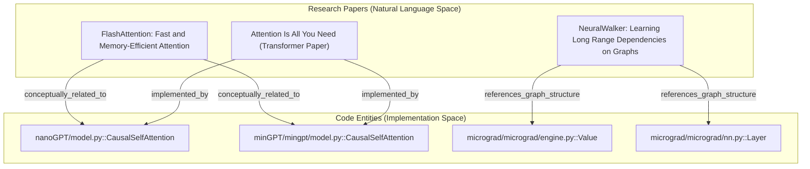
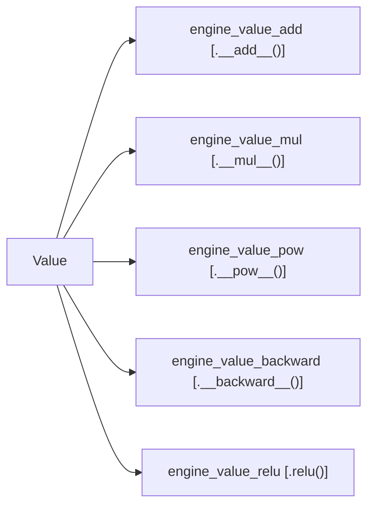

# Karpathy Repos Benchmark (71.5x token reduction)

<details>
<summary>Relevant source files</summary>

The following files were used as context for generating this wiki page:

- [ARCHITECTURE.md](ARCHITECTURE.md)
- [worked/example/README.md](worked/example/README.md)
- [worked/httpx/GRAPH_REPORT.md](worked/httpx/GRAPH_REPORT.md)
- [worked/httpx/README.md](worked/httpx/README.md)
- [worked/httpx/review.md](worked/httpx/review.md)
- [worked/karpathy-repos/GRAPH_REPORT.md](worked/karpathy-repos/GRAPH_REPORT.md)
- [worked/karpathy-repos/README.md](worked/karpathy-repos/README.md)
- [worked/karpathy-repos/graph.json](worked/karpathy-repos/graph.json)
- [worked/karpathy-repos/review.md](worked/karpathy-repos/review.md)
- [worked/mixed-corpus/README.md](worked/mixed-corpus/README.md)
- [worked/mixed-corpus/review.md](worked/mixed-corpus/review.md)

</details>


This page details the benchmark results for the `worked/karpathy-repos` corpus, which serves as the primary stress test for `graphify`'s ability to handle multi-repo codebases, dense research papers, and multi-modal assets.

## Overview

The Karpathy Repos benchmark evaluates `graphify` on a heterogeneous dataset comprising three distinct neural network libraries, five academic PDFs, and several technical diagrams. This corpus is designed to test cross-repo entity resolution and the efficacy of the BFS-based token reduction strategy on large-scale contexts.

### Corpus Composition (52 files)
*   **Code (29 files):** Cloned repositories of `nanoGPT`, `minGPT`, and `micrograd` [worked/karpathy-repos/README.md:7-13]().
*   **Papers (5 files):** arXiv PDFs including "Attention Is All You Need", "FlashAttention", "FlashAttention-2", "Neural Attention Residuals", and "NeuralWalker" [worked/karpathy-repos/README.md:15-21]().
*   **Images (4 files):** Training loss curves (`gpt2_124M_loss.png`), computation graphs (`gout.svg`), and decision boundaries (`moon_mlp.png`) [worked/karpathy-repos/README.md:23-28]().

**Sources:** [worked/karpathy-repos/README.md:5-28](), [worked/karpathy-repos/review.md:3-5]()

## Performance Results

The benchmark demonstrates a **71.5x reduction** in the tokens required for a typical LLM query compared to a naive full-context injection of the same corpus [worked/karpathy-repos/review.md:27]().

### Token Reduction Metrics
| Metric | Value |
| :--- | :--- |
| Naive Full-Context Tokens | ~123,488 |
| Average BFS Subgraph Query Cost | ~1,726 |
| **Reduction Ratio** | **71.5x** |

**Sources:** [worked/karpathy-repos/review.md:23-27]()

### Query-Specific Reduction
The reduction efficiency varies based on the breadth of the query's conceptual reach:
*   **"What connects micrograd to nanoGPT":** 126.7x reduction [worked/karpathy-repos/review.md:35]().
*   **"How does FlashAttention improve memory efficiency":** 100.8x reduction [worked/karpathy-repos/review.md:36]().
*   **"How does the attention mechanism work":** 43.5x reduction (larger subgraph due to many connecting papers/modules) [worked/karpathy-repos/review.md:39-41]().

**Sources:** [worked/karpathy-repos/review.md:31-41]()

## Graph Topology

The resulting graph consists of **285 nodes** (163 AST-based, 112 semantic) and **340 edges** [worked/karpathy-repos/review.md:49-50]().

### God Nodes (High Centrality)
These entities act as the primary hubs in the graph:
1.  `Value` (micrograd): 15 edges. The fundamental autograd primitive [worked/karpathy-repos/GRAPH_REPORT.md:13]().
2.  `Training Script` (nanoGPT): 11 edges. Orchestrates model and data [worked/karpathy-repos/GRAPH_REPORT.md:14]().
3.  `GPT` (nanoGPT): 9 edges. Central model class [worked/karpathy-repos/GRAPH_REPORT.md:15]().
4.  `Layer` (micrograd): 8 edges. Connects engine to NN API [worked/karpathy-repos/GRAPH_REPORT.md:16]().
5.  `FlashAttention Algorithm`: 7 edges [worked/karpathy-repos/GRAPH_REPORT.md:22]().

**Sources:** [worked/karpathy-repos/GRAPH_REPORT.md:12-22](), [worked/karpathy-repos/review.md:73-81]()

### Cross-Repo and Multi-Modal Mapping
The following diagram illustrates how `graphify` bridges the gap between natural language concepts in research papers and specific code implementations across different repositories.

**Conceptual to Implementation Bridge**

**Sources:** [worked/karpathy-repos/review.md:92-93](), [worked/karpathy-repos/GRAPH_REPORT.md:31-34]()

## Community Structure

The Leiden algorithm identifies functional boundaries that often align with repository structure but occasionally transcend them when shared patterns are detected [worked/karpathy-repos/review.md:91-107]().

| Community ID | Description | Key Nodes |
| :--- | :--- | :--- |
| **0** | nanoGPT Model Architecture | `Block`, `GPT`, `CausalSelfAttention` |
| **4** | micrograd NN Layer | `Layer`, `MLP`, `Module`, `Neuron` |
| **5** | FlashAttention Paper | `IO-awareness`, `HBM/SRAM`, `Tiling` |
| **7** | micrograd Autograd Engine | `Value`, `backward`, `__add__` |
| **10** | micrograd README | `Backpropagation`, `Computation Graph` |
| **11** | Attention Residuals Paper | `PreNorm Dilution`, `AttnRes`, `Kimi Team` |

**Sources:** [worked/karpathy-repos/GRAPH_REPORT.md:38-85](), [worked/karpathy-repos/review.md:55-68]()

### Implementation Detail: The Autograd Core
The following diagram shows the internal structure of the `micrograd` engine community, illustrating how `Value` (the God Node) relates to its methods via AST extraction [worked/karpathy-repos/graph.json:23-77]().

**micrograd Autograd Engine (Community 7)**

**Sources:** [worked/karpathy-repos/graph.json:23-77](), [worked/karpathy-repos/review.md:64]()

## Surprising Connections
The analysis engine identifies non-obvious relationships that span across the heterogeneous corpus:
*   **Structural Similarity:** `nanoGPT/model.py::Block` and `minGPT/mingpt/model.py::Block` are linked as `conceptually_related_to` because they share identical class names and structural patterns [worked/karpathy-repos/review.md:91]().
*   **Functional Bridging:** `micrograd/engine.py::Value.backward()` is linked to `minGPT/mingpt/trainer.py::Trainer.run()` as both represent the foundational forward/backward pattern at different scales [worked/karpathy-repos/review.md:104]().
*   **Inferred Dependencies:** `nanoGPT/train.py` and `minGPT/mingpt/trainer.py` land in the same community (Community 2) despite being in different repos, linked by shared vocabulary like `optimizer` and `gradient clipping` [worked/karpathy-repos/review.md:106]().
*   **Multi-Modal Bridge:** The `FlashAttention` paper cluster (Community 5) creates edges to `CausalSelfAttention` in both `nanoGPT` and `minGPT` [worked/karpathy-repos/review.md:105]().

**Sources:** [worked/karpathy-repos/GRAPH_REPORT.md:24-35](), [worked/karpathy-repos/review.md:102-107]()

## Replication Instructions
To reproduce these results, place the three cloned repositories and the downloaded PDFs/images into a single directory and run:

```bash
pip install graphifyy
graphify install
# Place files in ./raw
graphify ./raw
```
**Sources:** [worked/karpathy-repos/README.md:30-64]()
