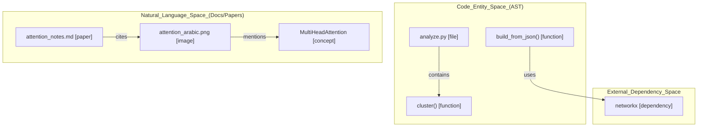
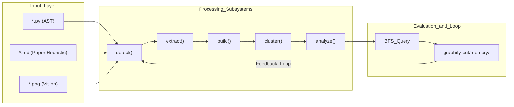

# Mixed Corpus Benchmark (multi-modal)

Relevant source files

The following files were used as context for generating this wiki page:

- [worked/example/README.md](worked/example/README.md)
- [worked/httpx/README.md](worked/httpx/README.md)
- [worked/karpathy-repos/README.md](worked/karpathy-repos/README.md)
- [worked/mixed-corpus/README.md](worked/mixed-corpus/README.md)

This page covers the `worked/mixed-corpus` benchmark, a multi-modal dataset consisting of Python source code, a markdown research paper with specific heuristics, and an optional image. This benchmark demonstrates `graphify`'s ability to classify disparate file types, extract cross-modal connections, and execute an evaluation framework that includes a feedback loop for query results.

### Overview of the Mixed Corpus
The benchmark is designed to be small but realistic, testing the pipeline's handling of diverse inputs in a single run.

| File Type | File Path | Description |
|:---|:---|:---|
| **Code** | `worked/mixed-corpus/raw/analyze.py` | Graph analysis module (god nodes, surprising connections). |
| **Code** | `worked/mixed-corpus/raw/build.py` | Graph assembly and NetworkX wrapper. |
| **Code** | `worked/mixed-corpus/raw/cluster.py` | Leiden community detection and scoring. |
| **Paper** | `worked/mixed-corpus/raw/attention_notes.md` | Transformer paper notes with arXiv:1706.03762 citation. |
| **Image** | `raw/attention_arabic.png` (Optional) | Arabic-language figure from the Attention paper. |

**Sources:** [worked/mixed-corpus/README.md:1-21](), [worked/mixed-corpus/README.md:36-43]()

---

### Multi-Modal Detection and Classification
The detection logic uses specific heuristics to differentiate between standard documents and research papers. In this corpus, `attention_notes.md` is classified as a `paper` rather than a `doc` because it triggers regex patterns for arXiv IDs (`1706.03762`), DOI strings, and abstract/citation structures.

**Heuristic Performance:**
- **Code:** Correctly identifies `.py` files via extension matching. [worked/mixed-corpus/README.md:36-36]()
- **Paper:** Successfully identifies the arXiv signal in markdown using `1706.03762` heuristics. [worked/mixed-corpus/README.md:39-39]()
- **Image:** Identifies PNG/JPG files for vision-based extraction (if provided). [worked/mixed-corpus/README.md:15-15]()

**Sources:** [worked/mixed-corpus/README.md:15-15](), [worked/mixed-corpus/README.md:36-40]()

---

### Community Structure and Cohesion
The Leiden algorithm partitions the graph into functional communities. In this benchmark, the three Python modules map cleanly to their architectural roles.

| Community ID | Label | Key Nodes |
|:---|:---|:---|
| 0 | Graph Analysis | `analyze.py`, `god_nodes()`, `surprising_connections()` |
| 1 | Clustering & Scoring | `cluster.py`, `cluster()`, `score_all()` |
| 2 | Graph Building | `build.py`, `build()`, `build_from_json()` |

The cohesion score represents the ratio of actual intra-community edges to maximum possible edges. `build.py` typically shows higher cohesion due to its self-contained nature, while `analyze.py` is lower because its functions are standalone analysis passes that do not call each other.

**Sources:** [worked/mixed-corpus/README.md:37-38]()

---

### Analysis: God Nodes and Surprising Connections
The `analyze.py` module identifies core abstractions and non-obvious relationships.

#### God Nodes
`god_nodes()` identifies the most connected real entities while excluding "File Hub" nodes (e.g., the `analyze.py` node itself). In this specific benchmark, the corpus size is small (~20 nodes), leading to a finding that the function requires more signal to populate on tiny datasets.

#### Surprising Connections
Connections are ranked by a surprise score which weights:
- **Confidence:** `AMBIGUOUS` > `INFERRED` > `EXTRACTED`.
- **Cross-Modal:** Edges between different file categories (e.g., `code` ↔ `paper`) add significant weight.
- **Structural Distance:** Edges that bridge separate Leiden communities.

In this cleanly layered corpus, zero surprising connections were found because the three modules are structurally independent and only connected via external dependencies like `networkx`.

**Sources:** [worked/mixed-corpus/README.md:9-11](), [worked/mixed-corpus/README.md:36-43]()

---

### Multi-Modal Data Flow: Code to Concepts
This diagram illustrates how the system bridges AST-extracted code entities with high-level concepts and multi-modal paper/image data.

**System Entity Mapping: Code to Natural Language**

**Sources:** [worked/mixed-corpus/README.md:9-15](), [worked/mixed-corpus/README.md:36-40]()

---

### Evaluation Framework
The benchmark includes an evaluation of the "Feedback Loop" and vision capabilities.

1. **Query Execution:** The system runs BFS traversals starting from specific nodes (e.g., `cluster()`).
2. **Memory Persistence:** Query results can be saved to disk as `.md` files in `graphify-out/memory/`.
3. **Feedback Loop:** The next `detect()` scan finds these memory files and extracts them as new nodes in the graph. This allows the graph to grow based on what the user asks.

**Vision Capabilities:**
The benchmark also tests Arabic OCR via vision models (if `attention_arabic.png` is provided). The system extracts concepts like "Multi-head attention" (الانتباه متعدد الرؤوس) directly from images.

| Arabic | English |
|:---|:---|
| الانتباه متعدد الرؤوس | Multi-head attention |
| الترميز الموضعي | Positional encoding |
| التطبيع الطبقي | Layer normalization |

**Sources:** [worked/mixed-corpus/README.md:15-15](), [worked/mixed-corpus/README.md:39-40]()

---

### Pipeline Data Flow
The following diagram traces the transformation of the mixed corpus from raw files to the final report and evaluation.

**Data Flow: Mixed Corpus Pipeline**

**Sources:** [worked/mixed-corpus/README.md:9-15](), [worked/mixed-corpus/README.md:31-32]()
